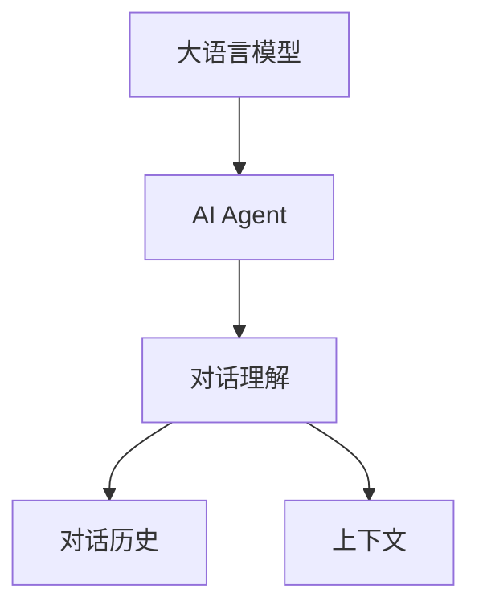
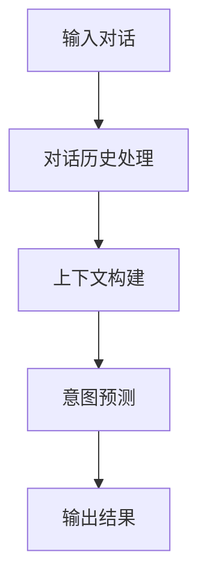
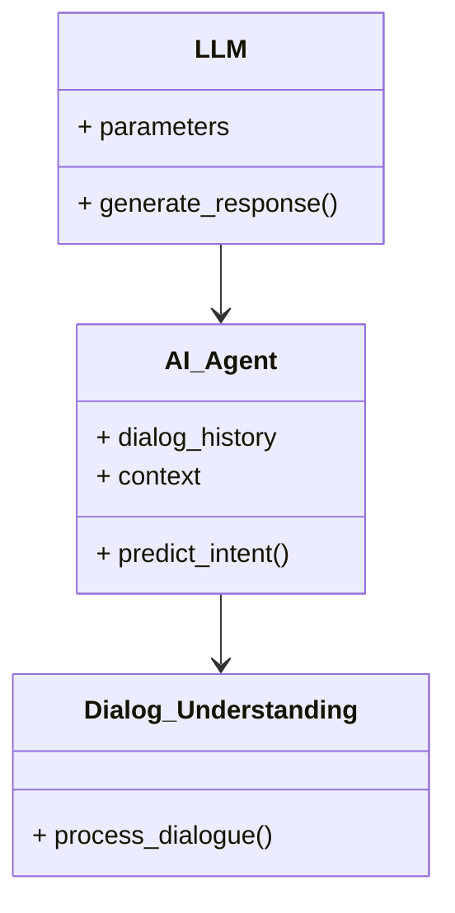
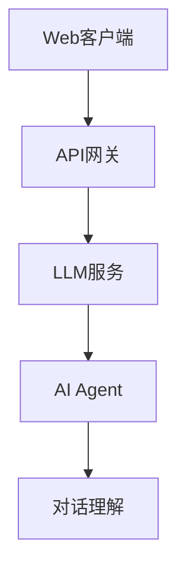
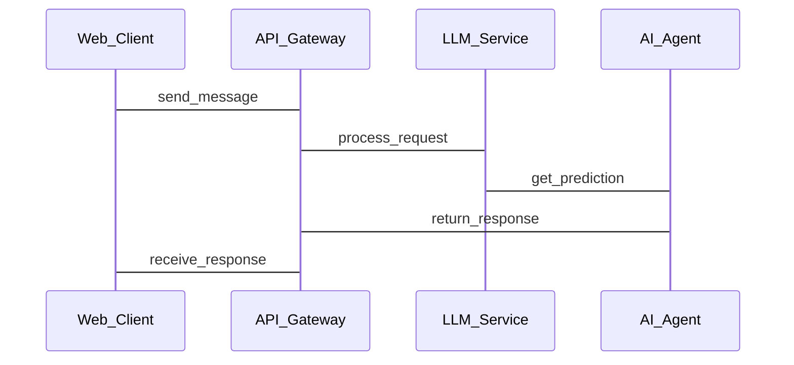

                 


# 构建LLM驱动的AI Agent多轮对话理解

> 关键词：LLM, AI Agent, 多轮对话理解, 自然语言处理, 人机交互

> 摘要：本文详细探讨了如何利用大语言模型（LLM）构建多轮对话理解的AI Agent。通过背景介绍、核心概念分析、算法原理讲解、系统架构设计和项目实战，系统地阐述了构建LLM驱动的AI Agent多轮对话理解的全过程。文章结合理论与实践，为读者提供了深入的技术见解和实用的实现方法。

---

## 第一部分: 背景介绍

### 第1章: 多轮对话理解的背景与问题背景

#### 1.1 问题背景
- **当前人机交互的发展趋势**：从单轮问答到多轮对话，人机交互正朝着更自然、更智能的方向发展。用户期望与AI Agent进行更复杂的交流，而不仅仅是简单的信息查询。
- **多轮对话理解的必要性**：在实际应用场景中，用户的问题往往是复杂且上下文相关的，单轮对话无法满足需求。例如，在医疗咨询、金融咨询等领域，多轮对话能够帮助AI Agent更好地理解用户需求，提供更精准的服务。
- **LLM在对话理解中的作用**：大语言模型通过强大的上下文理解和生成能力，能够有效处理多轮对话中的复杂关系，为AI Agent提供强大的对话理解能力。

#### 1.2 问题描述
- **多轮对话的核心挑战**：对话的连续性、上下文的理解、意图的识别以及对话状态的管理是多轮对话理解的核心挑战。例如，用户可能在多个轮次中逐步提供信息，AI Agent需要准确捕捉这些信息并结合上下文进行推理。
- **LLM驱动对话理解的优势**：LLM通过预训练的大规模数据，能够捕捉到对话中的隐含信息和上下文关系，从而更准确地理解用户意图。
- **对话理解的边界与外延**：对话理解不仅包括对用户当前输入的解析，还包括对对话历史的回顾和对未来对话的预测。例如，在客服场景中，AI Agent需要根据对话历史调整回答策略。

#### 1.3 核心概念与联系
- **LLM与AI Agent的关系**：LLM作为AI Agent的核心驱动力，负责理解和生成对话内容，而AI Agent则负责协调对话流程，管理对话状态。
- **多轮对话理解的核心要素**：包括对话历史、上下文、意图识别、实体识别、对话状态管理等。
- **实体关系图**：通过Mermaid图展示LLM、AI Agent、对话理解三者之间的关系。



---

## 第二部分: 核心概念与联系

### 第2章: LLM与AI Agent的核心原理

#### 2.1 LLM的原理
- **大语言模型的定义与特点**：LLM是一种基于深度学习的自然语言处理模型，能够理解和生成人类语言。其特点包括大规模参数、预训练和微调能力、上下文理解能力等。
- **LLM的训练过程**：包括预训练和微调两个阶段。预训练阶段使用大规模通用数据进行无监督学习，微调阶段使用特定领域数据进行有监督学习。
- **LLM的推理机制**：通过生成式模型，LLM能够根据输入上下文生成最可能的后续文本。

#### 2.2 AI Agent的原理
- **AI Agent的定义与类型**：AI Agent是一种智能体，能够感知环境并采取行动以实现目标。根据智能水平，AI Agent可以分为反应式和认知式两类。
- **AI Agent的核心功能**：包括感知环境、推理决策、执行动作和与用户交互。
- **AI Agent的决策机制**：基于对话理解和环境感知，AI Agent通过推理生成最优决策。

#### 2.3 LLM与AI Agent的关系
- **LLM作为AI Agent的核心驱动力**：LLM负责理解和生成对话内容，为AI Agent提供语言处理能力。
- **多轮对话中的LLM与AI Agent协同工作**：AI Agent利用LLM进行对话理解，同时管理对话流程和状态。

---

## 第三部分: 算法原理讲解

### 第3章: LLM驱动的对话理解算法

#### 3.1 对话理解的算法流程
- **对话历史的处理**：将多轮对话历史转化为模型可处理的输入形式，例如使用编码器将对话历史编码为向量。
- **上下文的构建**：构建上下文表示，捕捉对话中的关键信息和意图。
- **对话目标的预测**：基于上下文和对话历史，预测当前对话的目标或用户的意图。

#### 3.2 对话理解算法的实现
- **算法流程图**：通过Mermaid图展示对话理解的流程。



- **Python代码实现**：以下是一个简单的对话理解算法实现示例。

```python
def process_dialogue(dialogue_history):
    # 对话历史处理
    context = ""
    for message in dialogue_history:
        context += " " + message
    # 上下文构建
    context_vector = encode(context)
    # 意图预测
    intent = predict_intent(context_vector)
    return intent
```

- **数学模型和公式**：对话理解的意图预测可以基于概率模型，例如：

$$ P(y|x) = \frac{P(x|y)P(y)}{P(x)} $$

其中，$x$ 是对话历史，$y$ 是意图标签。

---

## 第四部分: 系统分析与架构设计

### 第4章: 系统架构设计

#### 4.1 问题场景介绍
- 在实际应用中，构建一个高效的LLM驱动AI Agent需要考虑系统的可扩展性、实时性和用户体验。

#### 4.2 项目介绍
- 本项目旨在构建一个基于LLM的多轮对话理解系统，应用于智能客服、智能助手等领域。

#### 4.3 系统功能设计
- **领域模型**：通过Mermaid类图展示系统的核心功能模块。



- **系统架构设计**：通过Mermaid架构图展示系统的整体架构。



- **系统接口设计**：定义系统的主要接口，例如：

```python
interface IAI_Agent {
    def process_message(message: str) -> str
}
```

- **系统交互设计**：通过Mermaid序列图展示系统的交互流程。



---

## 第五部分: 项目实战

### 第5章: 项目实战

#### 5.1 环境安装
- 安装必要的Python库，例如：

```bash
pip install transformers
pip install requests
pip install json
```

#### 5.2 核心代码实现
- 对话理解模块的实现：

```python
from transformers import AutoTokenizer, AutoModelForCausalLM
import requests

class Dialog_Understander:
    def __init__(self, model_name):
        self.model = AutoModelForCausalLM.from_pretrained(model_name)
        self.tokenizer = AutoTokenizer.from_pretrained(model_name)
    
    def process_dialogue(self, dialogue_history):
        context = " ".join(dialogue_history)
        inputs = self.tokenizer(context, return_tensors="np")
        outputs = self.model.generate(inputs.input_ids, max_length=100)
        response = self.tokenizer.decode(outputs[0], skip_special_tokens=True)
        return response
```

#### 5.3 代码应用解读
- 对话理解模块通过编码器-解码器结构生成对话回复，确保上下文的一致性和连贯性。

#### 5.4 案例分析
- 实际案例分析，例如在智能客服中的应用。

#### 5.5 项目小结
- 总结项目的实现过程和关键点。

---

## 第六部分: 最佳实践、小结、注意事项、拓展阅读

### 第6章: 最佳实践与小结

#### 6.1 最佳实践
- **数据预处理**：确保训练数据的多样性和代表性。
- **模型调优**：通过微调和优化模型参数提升对话理解的准确率。
- **用户反馈**：实时收集用户反馈，持续优化对话理解系统。

#### 6.2 小结
- 本文详细介绍了构建LLM驱动的AI Agent多轮对话理解的全过程，从理论到实践，为读者提供了全面的技术指导。

#### 6.3 注意事项
- 数据隐私和安全问题需要特别注意。
- 系统的实时性和响应速度需要优化。

#### 6.4 拓展阅读
- 建议读者进一步阅读关于大语言模型和对话理解的最新研究论文和技术报告。

---

通过以上步骤，我们系统地介绍了构建LLM驱动的AI Agent多轮对话理解的全过程，从背景介绍到项目实战，为读者提供了深入的技术见解和实用的实现方法。

