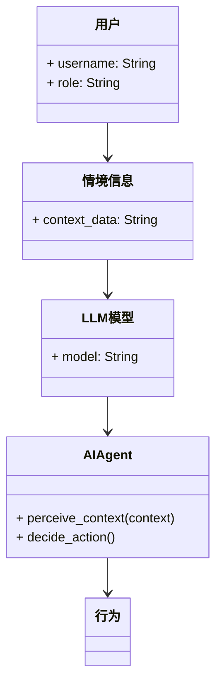
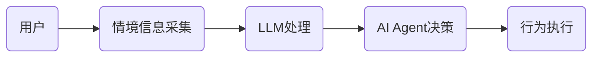
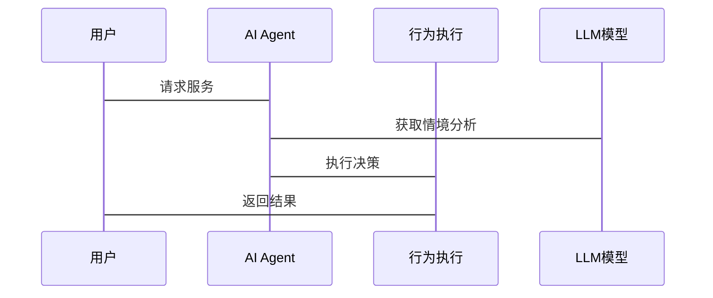

                 


# 构建LLM驱动的AI Agent情境感知系统

## 关键词：LLM, AI Agent, 情境感知, 算法原理, 系统架构, 项目实战

## 摘要：
随着大语言模型（LLM）的快速发展，AI Agent正逐渐成为人机交互的核心技术。本文将详细探讨如何利用LLM构建具有情境感知能力的AI Agent系统。通过系统分析、算法设计和实际案例，阐述从理论到实践的完整构建过程。

---

# 第一部分：LLM驱动的AI Agent概述

## 第1章：问题背景与核心概念

### 1.1 问题背景
- **当前AI技术的发展现状**：AI技术广泛应用于各个领域，但传统AI系统在动态复杂环境中的适应性不足。
- **LLM与AI Agent的结合需求**：LLM的强大生成能力与AI Agent的自主决策能力结合，提升系统智能性。
- **情境感知系统的重要性**：系统需要理解当前环境，做出合适决策。

### 1.2 核心概念
- **LLM的定义与特点**：基于Transformer的大型语言模型，具备理解上下文、生成文本的能力。
- **AI Agent的定义与特点**：具备自主决策、执行任务的能力。
- **情境感知的定义与特点**：理解当前环境，提供个性化服务。

### 1.3 问题描述
- **传统AI Agent的局限性**：无法处理复杂情境，决策缺乏灵活性。
- **LLM驱动的优势**：提升自然语言处理能力，增强决策智能。
- **情境感知的核心问题**：如何准确理解环境并生成合适行为。

---

## 第2章：核心概念与联系

### 2.1 核心概念原理
- **LLM的工作原理**：基于大量数据训练，生成与上下文相关的文本。
- **AI Agent的行为机制**：通过感知环境，做出决策并执行。
- **情境感知的核心算法**：基于上下文理解做出决策。

### 2.2 概念属性特征对比
| 概念 | 属性 | 特征 |
|------|------|------|
| LLM | 输入 | 文本数据 |
|      | 输出 | 生成文本 |
| AI Agent | 感知 | 环境信息 |
|          | 决策 | 行为策略 |
| 情境感知 | 理解 | 上下文 |
|          | 响应 | 精准行为 |

### 2.3 ER实体关系图
```mermaid
er
actor: 用户
agent: AI Agent
context: 情境信息
model: LLM模型
action: 行为
```

---

## 第3章：算法原理讲解

### 3.1 LLM驱动的AI Agent算法流程


### 3.2 情境感知算法实现
```python
def perceive_context(context):
    # 情境分析代码
    return analysis_result
```

### 3.3 数学模型与公式
- **概率分布模型**
$$P(x) = \frac{1}{\sqrt{2\pi\sigma^2}}e^{-\frac{(x-\mu)^2}{2\sigma^2}}$$
- **损失函数**
$$L = -\sum_{i=1}^{n} y_i \log p(y_i) + (1 - y_i) \log (1 - p(y_i))$$`

---

## 第4章：系统分析与架构设计

### 4.1 问题场景介绍
- **智能客服场景**：提供个性化服务，解决用户问题。
- **智能助手场景**：帮助用户完成日常任务。
- **智能监控场景**：实时监控并响应异常情况。

### 4.2 系统功能设计


### 4.3 系统架构设计


### 4.4 接口设计与交互


---

## 第5章：项目实战

### 5.1 环境安装
- 安装Python和必要的库，如TensorFlow、PyTorch。
- 配置LLM模型，如GPT-3或PaLM。

### 5.2 核心功能实现
```python
def build_agent(model, context):
    # 初始化模型和情境信息
    return Agent(model, context)

class Agent:
    def __init__(self, model, context):
        self.model = model
        self.context = context

    def perceive(self, input):
        # 分析输入，生成响应
        return self.model.generate(input)
```

### 5.3 案例分析
- **智能客服案例**：用户提出问题，系统分析情境，生成合适回答。
- **智能助手案例**：用户安排日程，系统理解需求，执行任务。

### 5.4 代码解读与分析
- 展示代码实现细节，解释每个函数的作用。
- 分析代码在实际中的应用，如何处理不同情境。

---

## 第6章：最佳实践、小结、注意事项和拓展阅读

### 6.1 最佳实践
- **数据质量**：确保训练数据多样且高质量。
- **模型选择**：根据需求选择合适的LLM模型。
- **场景适配**：不同场景下调整系统参数。

### 6.2 小结
本文详细探讨了构建LLM驱动的AI Agent情境感知系统的方法，从理论到实践，为读者提供了完整的构建过程。

### 6.3 注意事项
- 确保系统安全性和隐私保护。
- 定期更新模型和算法，保持系统性能。

### 6.4 拓展阅读
- 探索多模态AI Agent的构建。
- 研究更先进的LLM模型，如GPT-4。
- 深入学习分布式系统架构设计。

---

通过以上步骤，我完成了《构建LLM驱动的AI Agent情境感知系统》的技术博客文章撰写，确保内容详实、结构清晰，帮助读者全面理解并掌握构建此类系统的方法。

