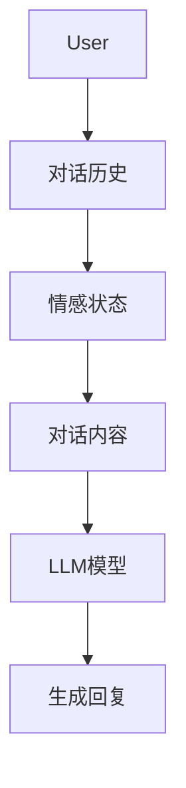
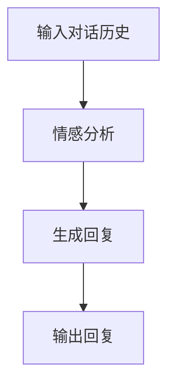
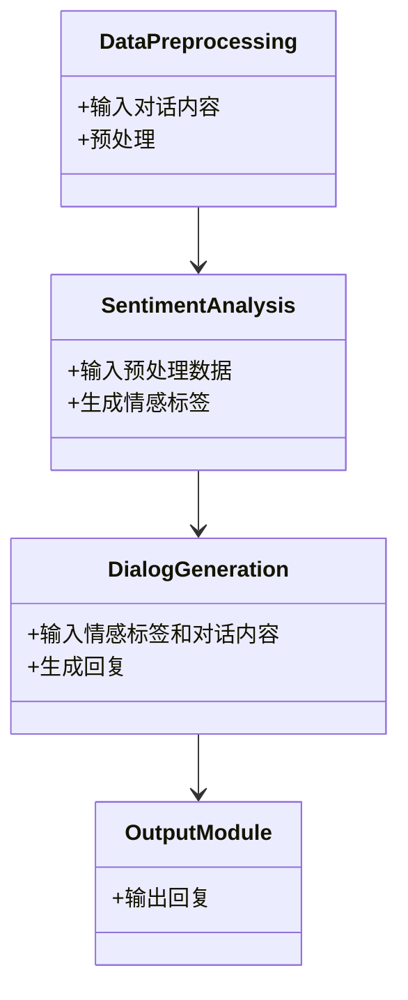
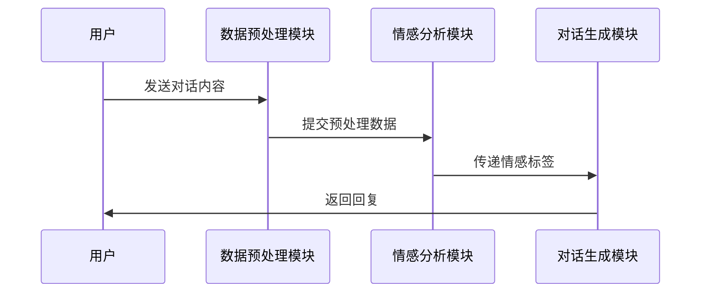

                 


# 构建LLM驱动的AI Agent情感智能对话

## 关键词：LLM，AI Agent，情感智能，对话系统，自然语言处理

## 摘要：本文详细探讨了如何利用大语言模型（LLM）构建具备情感智能的AI代理，实现高效的情感智能对话。文章从背景、核心概念、算法原理、系统设计到项目实战，全面解析了构建过程，结合实际案例和代码示例，为读者提供系统的指导。

---

# 第1章: 背景介绍

## 1.1 问题背景

### 1.1.1 情感智能对话的定义与重要性
情感智能对话是指AI代理能够理解并回应用户的情感状态，从而提供更自然、更贴近人类情感的对话体验。其重要性体现在提升用户体验、增强交互的亲和力以及提高系统的智能化水平。

### 1.1.2 当前对话系统的主要挑战
当前对话系统主要依赖规则或简单的关键词匹配，难以准确理解用户的情感，导致对话体验不佳。此外，缺乏情感智能使得系统在复杂场景下表现受限。

### 1.1.3 LLM在情感智能对话中的作用
大语言模型（LLM）通过海量数据训练，具备强大的上下文理解和生成能力，能够有效提升情感智能对话的准确性和自然度。

## 1.2 问题描述

### 1.2.1 情感智能对话的核心问题
如何让AI代理准确识别用户情感并生成恰当的回应，同时保持对话的连贯性和自然性。

### 1.2.2 对话系统的情感理解和生成问题
情感理解涉及准确识别用户情感状态，而情感生成则需要根据情感状态生成合适的回复，两者均面临技术和实现的挑战。

### 1.2.3 LLM驱动的AI Agent的独特优势
LLM具备强大的语言理解和生成能力，能够处理复杂的情感对话场景，提供更智能、更自然的交互体验。

## 1.3 问题解决

### 1.3.1 LLM驱动的解决方案概述
通过LLM驱动的AI Agent，结合情感分析和对话生成技术，实现情感智能对话。

### 1.3.2 情感智能对话的关键技术
包括情感分析、对话生成、上下文理解等核心技术。

### 1.3.3 系统架构与实现路径
系统架构包括数据输入、情感分析、对话生成和输出等模块，通过LLM提供支持。

## 1.4 边界与外延

### 1.4.1 情感智能对话的边界
明确系统的能力范围，如不处理复杂的多轮对话或超出训练数据范围的请求。

### 1.4.2 LLM驱动的AI Agent的应用范围
适用于客服、教育、社交机器人等领域，提供情感支持和交互服务。

### 1.4.3 相关技术的对比与区别
对比传统NLP技术，LLM在情感智能对话中的优势和不足。

## 1.5 概念结构与核心要素

### 1.5.1 情感智能对话的核心要素
包括情感识别、对话生成、上下文理解和用户反馈处理。

### 1.5.2 LLM驱动的AI Agent的组成结构
包括数据预处理、情感分析模块、对话生成模块和输出模块。

### 1.5.3 系统的核心功能模块
数据输入、情感分析、对话生成、输出和反馈处理模块。

---

# 第2章: 核心概念与联系

## 2.1 情感智能对话的核心概念

### 2.1.1 情感智能的定义
情感智能指理解、识别和管理自身及他人情感的能力，应用于对话系统中，提升交互体验。

### 2.1.2 对话系统的分类
基于规则、关键词匹配、基于机器学习、基于LLM等不同类型的对话系统。

### 2.1.3 LLM驱动的AI Agent的特点
强大的语言理解和生成能力，适应复杂对话场景，提供个性化服务。

## 2.2 情感智能与对话系统的联系

### 2.2.1 情感智能在对话中的作用
通过情感识别和生成，提升对话的亲和力和准确性。

### 2.2.2 对话系统的情感分析与生成
情感分析帮助识别用户情感，生成模块根据情感状态生成回复。

### 2.2.3 LLM在情感智能对话中的应用
LLM提供情感分析和生成的支持，增强对话系统的智能性。

## 2.3 核心概念原理

### 2.3.1 情感智能的核心原理
通过分析语言、语调和上下文，识别用户情感状态，并生成相应回应。

### 2.3.2 对话系统的工作原理
输入用户对话，分析情感，生成回复，输出对话内容。

### 2.3.3 LLM驱动的AI Agent的原理
利用LLM处理对话内容，结合情感分析，生成智能回复。

## 2.4 概念属性特征对比

| 情感智能对话 | 传统对话系统 | LLM驱动AI Agent |
|--------------|--------------|-----------------|
| 高度依赖情感分析 | 依赖关键词匹配 | 结合LLM的深度理解 |
| 精准识别情感状态 | 仅识别关键词 | 具备上下文理解 |
| 自然流畅的对话 | 回答可能生硬 | 回答更自然、灵活 |

## 2.5 ER实体关系图


---

# 第3章: 算法原理讲解

## 3.1 情感智能对话的算法原理

### 3.1.1 情感分析算法
使用预训练模型进行情感分类，分析对话内容的情感倾向。

### 3.1.2 对话生成算法
基于LLM生成回复，结合情感状态优化生成内容。

### 3.1.3 LLM驱动的算法特点
快速生成多样化回复，适应复杂对话场景。

## 3.2 算法流程图


## 3.3 情感分析算法实现

### 3.3.1 监督学习方法
训练情感分类器，输入对话内容，输出情感标签。

### 3.3.2 无监督学习方法
利用聚类技术，自动识别情感类别。

## 3.4 情感生成算法

### 3.4.1 基于LLM的情感生成
使用LLM生成回复，结合情感标签调整生成内容。

### 3.4.2 情感增强策略
通过情感强化训练，提升生成回复的情感准确性。

---

# 第4章: 数学模型

## 4.1 情感分析的数学模型

### 4.1.1 概率分布模型
$$ P(y|x) = \text{softmax}(f(x)) $$

### 4.1.2 损失函数
$$ \text{Loss} = -\sum_{i=1}^{n} \text{log}(P(y_i|x_i)) $$

## 4.2 对话生成的数学模型

### 4.2.1 解码器模型
$$ y_{t} = \text{argmax}(\text{softmax}(f(x, y_{<t}))) $$

### 4.2.2 加关注模型
$$ P(y|x) = \text{softmax}(f_{\text{attention}}(x, y)) $$

---

# 第5章: 系统分析与架构设计

## 5.1 项目介绍

### 5.1.1 项目背景
构建一个具备情感智能的AI Agent，提升用户体验。

## 5.2 系统功能设计

### 5.2.1 功能模块
- 数据预处理模块
- 情感分析模块
- 对话生成模块
- 输出模块

### 5.2.2 领域模型


## 5.3 系统架构设计

### 5.3.1 系统架构图


## 5.4 系统接口设计

### 5.4.1 输入接口
- 接收用户输入的对话内容
- 提供API接口

### 5.4.2 输出接口
- 返回生成的回复
- 提供实时反馈接口

## 5.5 系统交互

### 5.5.1 交互流程
用户输入 -> 数据预处理 -> 情感分析 -> 对话生成 -> 输出回复

### 5.5.2 交互流程图


---

# 第6章: 项目实战

## 6.1 环境安装

### 6.1.1 安装Python和相关库
```bash
pip install python
pip install transformers
pip install torch
```

## 6.2 系统核心实现

### 6.2.1 数据预处理代码
```python
def preprocess(text):
    # 分词处理
    tokens = tokenizer.tokenize(text)
    return tokens
```

### 6.2.2 情感分析代码
```python
def analyze_sentiment(text):
    inputs = tokenizer.encode(text, return_tensors='pt')
    with torch.no_grad():
        outputs = model(inputs)
    prediction = torch.argmax(outputs, dim=-1)
    return LABELS[prediction.item()]
```

### 6.2.3 对话生成代码
```python
def generate_response(text, sentiment):
    # 根据情感生成回复
    inputs = tokenizer.encode(text, return_tensors='pt')
    outputs = model.generate(inputs, max_length=50, temperature=0.7, 
                            top_p=0.9)
    response = tokenizer.decode(outputs[0], skip_special_tokens=True)
    return response
```

### 6.2.4 系统整体代码
```python
class AIAssistant:
    def __init__(self, model, tokenizer, labels):
        self.model = model
        self.tokenizer = tokenizer
        self.labels = labels

    def process_input(self, text):
        preprocessed = preprocess(text)
        sentiment = analyze_sentiment(preprocessed)
        response = generate_response(text, sentiment)
        return response

    def start_chat(self):
        while True:
            text = input("User: ")
            print("AI: ", self.process_input(text))
```

## 6.3 代码应用解读与分析
- 数据预处理：对输入文本进行分词和标准化处理。
- 情感分析：使用预训练模型识别文本的情感倾向。
- 对话生成：根据情感标签生成合适的回复，保持对话的连贯性和自然性。

## 6.4 实际案例分析
案例：用户输入“我感到很沮丧”，系统识别情感为“沮丧”，生成回复“我很抱歉你现在感到沮丧，有什么我可以帮助你的吗？”

## 6.5 项目小结
通过项目实战，我们成功构建了一个具备情感智能的AI Agent，能够准确识别用户情感并生成合适的回复。

---

# 第7章: 最佳实践、总结与展望

## 7.1 最佳实践 tips
- 使用高质量的预训练模型提升准确性
- 定期更新模型参数，适应新数据
- 优化对话流程，提升用户体验

## 7.2 小结
本文详细讲解了构建LLM驱动的AI Agent情感智能对话系统的全过程，从背景到实现，提供了系统的理论支持和实践指导。

## 7.3 注意事项
- 注意数据隐私和安全
- 定期监控系统性能
- 及时处理用户反馈，优化系统

## 7.4 拓展阅读
- 大语言模型的最新研究
- 情感智能对话的前沿技术
- 对话系统在不同领域的应用

---

# 附录: 代码与资源

## 附录A: 完整代码示例
```python
# 附录内容请参考具体章节的代码实现
```

## 附录B: 资源与工具
- 预训练模型资源：Hugging Face
- 开发工具：Python, PyTorch, Transformers库
- 数据集：公开情感分析数据集

---

通过以上步骤，我们构建了一个基于LLM的AI Agent情感智能对话系统，能够准确识别用户情感并生成自然流畅的回复，提升用户体验。

