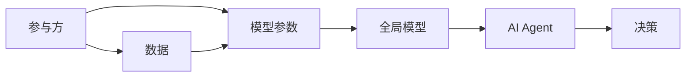
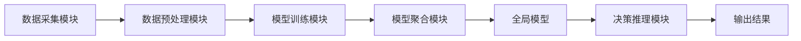
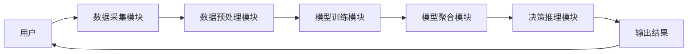

                 


# 构建LLM驱动的AI Agent隐私保护联邦学习

> 关键词：LLM驱动的AI Agent，隐私保护，联邦学习，分布式计算，数据安全

> 摘要：随着人工智能技术的快速发展，构建基于大语言模型的AI Agent已成为提升智能化决策能力的重要方向。然而，在实际应用中，数据隐私保护成为一个关键挑战。通过结合联邦学习技术，可以在保护数据隐私的前提下，实现多机构协作的AI Agent构建。本文详细探讨了LLM驱动的AI Agent在隐私保护联邦学习中的构建方法，从概念、算法、系统设计到项目实战，为读者提供全面的技术指导。

---

## 第1章：构建LLM驱动的AI Agent隐私保护联邦学习概述

### 1.1 问题背景与重要性

#### 1.1.1 当前AI Agent发展的挑战
随着人工智能技术的快速发展，AI Agent（智能体）在各个领域的应用日益广泛。然而，AI Agent的决策能力依赖于大量数据的训练，这带来了数据隐私保护的挑战。传统的集中式训练方式容易导致数据泄露风险，而数据孤岛问题也限制了模型的泛化能力。

#### 1.1.2 联邦学习在AI Agent中的作用
联邦学习（Federated Learning）是一种分布式机器学习技术，能够在不共享原始数据的情况下，通过模型参数的交换实现模型训练。这种技术非常适合构建隐私保护的AI Agent，因为它可以在保护数据隐私的前提下，聚合多个数据源的信息，提升模型的泛化能力。

#### 1.1.3 隐私保护的必要性与挑战
数据隐私保护是构建可信AI系统的重要基础。联邦学习通过加密通信和差分隐私等技术，确保了数据在传输和计算过程中的安全性。然而，如何在保证隐私的前提下，实现高效的模型训练和更新，仍是当前面临的重要挑战。

### 1.2 核心概念与问题描述

#### 1.2.1 LLM驱动的AI Agent定义
LLM（Large Language Model）驱动的AI Agent是指通过大语言模型提供决策支持的智能体。这类AI Agent能够理解上下文、生成自然语言回复，并根据反馈进行动态调整，从而实现智能化的交互和决策。

#### 1.2.2 隐私保护联邦学习的核心要素
隐私保护联邦学习通过以下方式实现数据隐私保护：
- **数据本地训练**：每个参与方在本地数据上训练模型，仅上传模型参数或梯度。
- **加密通信**：使用加密技术确保模型参数在传输过程中的安全性。
- **差分隐私**：在模型训练过程中添加噪声，防止敏感信息泄露。

#### 1.2.3 问题解决目标与边界
本研究的目标是设计一种基于LLM的AI Agent，使其在隐私保护的前提下，能够从多个数据源中学习，提升决策能力。系统的边界包括：
- **数据范围**：仅处理文本数据，不涉及其他类型的数据。
- **参与方数量**：支持多个机构或用户的协作。
- **模型更新频率**：定期同步模型参数，确保模型的最新性。

### 1.3 本章小结
本章介绍了构建LLM驱动的AI Agent隐私保护联邦学习的背景、核心概念和问题描述。通过分析当前AI Agent发展的挑战，强调了联邦学习在隐私保护中的重要作用，并明确了系统的建设目标和边界。

---

## 第2章：联邦学习与LLM驱动的AI Agent

### 2.1 联邦学习的核心原理

#### 2.1.1 联邦学习的基本原理
联邦学习通过将模型参数的更新分散到不同的数据源进行本地训练，然后将训练结果聚合到一个中心服务器，从而在不共享原始数据的情况下完成模型训练。其核心步骤包括：
1. **初始化模型**：所有参与方共享一个初始模型。
2. **本地训练**：每个参与方在本地数据上训练模型，生成模型参数更新。
3. **模型聚合**：将各参与方的模型参数更新聚合，生成新的全局模型。
4. **模型分发**：将更新后的全局模型分发给各参与方，供其继续训练。

#### 2.1.2 联邦学习的通信机制
为了确保数据隐私，联邦学习采用了多种加密通信机制：
- **同态加密**：允许在加密数据上进行计算，结果解密后与直接计算结果相同。
- **差分隐私**：在模型更新过程中添加噪声，防止特定数据点的泄露。
- **密钥协商**：通过安全协议协商加密通信所需的密钥。

#### 2.1.3 联邦学习的隐私保护方法
隐私保护联邦学习通过以下方法确保数据安全：
- **数据局部训练**：仅在本地数据上进行训练，避免原始数据的共享。
- **模型参数聚合**：通过加密通信，仅交换模型参数更新，而不共享原始数据。
- **差分隐私技术**：在模型更新中添加随机噪声，防止特定数据点的推断。

### 2.2 LLM驱动的AI Agent架构

#### 2.2.1 LLM在AI Agent中的角色
在LLM驱动的AI Agent中，大语言模型负责处理自然语言输入，生成相应的输出，并指导AI Agent的行动。其主要功能包括：
- **意图识别**：识别用户的意图，理解上下文。
- **决策推理**：基于模型生成的回复，进行逻辑推理和决策。
- **动态调整**：根据用户反馈，动态调整模型输出。

#### 2.2.2 AI Agent的决策机制
AI Agent的决策机制基于LLM生成的回复，并结合实时数据进行推理。其决策流程如下：
1. **输入处理**：接收用户的输入，生成自然语言回复。
2. **模型推理**：基于回复内容，结合上下文和实时数据，进行逻辑推理。
3. **决策输出**：生成最终的决策结果，并返回给用户。

#### 2.2.3 LLM与联邦学习的结合
将LLM与联邦学习结合，可以实现多个数据源的协作训练。通过联邦学习，每个参与方的LLM模型可以在本地数据上进行训练，并通过模型参数的聚合，生成一个全局的LLM模型，从而提升模型的泛化能力。

### 2.3 核心概念对比与ER实体关系图

#### 2.3.1 核心概念对比
以下是联邦学习、LLM和AI Agent的核心属性对比：

| 概念    | 核心属性                          |
|---------|-----------------------------------|
| 联邦学习 | 分布式训练、数据隐私保护          |
| LLM     | 大规模语言模型、自然语言处理能力  |
| AI Agent | 自动决策、人机交互能力            |

#### 2.3.2 ER实体关系图
以下是实体关系图的Mermaid表示：



### 2.3.3 实体关系图解读
上述图展示了联邦学习中各实体之间的关系。参与方通过本地数据训练模型参数，将参数聚合到全局模型中，最终用于AI Agent的决策。

---

## 第3章：联邦学习算法原理

### 3.1 联邦学习算法概述

#### 3.1.1 基于加密的联邦学习
基于加密的联邦学习通过同态加密或安全多方计算技术，确保模型参数在传输过程中的安全性。这种方法能够在不泄露原始数据的情况下，完成模型的训练和更新。

#### 3.1.2 基于差分隐私的联邦学习
差分隐私技术通过在模型更新中添加随机噪声，防止特定数据点的推断。这种方法可以有效保护参与方的数据隐私，同时保证模型的泛化能力。

#### 3.1.3 联邦学习的同步与异步算法
联邦学习可以采用同步或异步的方式进行模型聚合。同步方式要求所有参与方同时更新模型，而异步方式允许参与方在不同时间点进行更新。异步方式通常适用于大规模分布式场景。

### 3.2 联邦学习算法实现

#### 3.2.1 模型聚合方法
模型聚合是联邦学习的核心步骤之一。常用的聚合方法包括：
- **平均法**：将各参与方的模型参数取平均值。
- **加权法**：根据参与方的数据量或模型性能，赋予不同的权重，再进行加权平均。

#### 3.2.2 数据分割策略
数据分割策略决定了如何将数据分配给不同的参与方。常见的策略包括：
- **随机分割**：将数据随机分配给各个参与方。
- **按特征分割**：根据数据特征将其分配给不同的参与方。

#### 3.2.3 模型更新与优化
模型更新过程中，需要考虑参与方的计算能力和通信延迟。可以通过设置更新频率和步长，优化模型的收敛速度和训练效率。

### 3.3 联邦学习算法的数学模型

#### 3.3.1 联邦学习的数学公式
假设我们有多个参与方，每个参与方的数据集为$D_i$，模型参数为$\theta_i$。全局模型的参数$\theta$通过聚合各参与方的参数更新得到：

$$
\theta_{new} = \frac{1}{N} \sum_{i=1}^{N} \theta_i
$$

其中，$N$是参与方的数量。

#### 3.3.2 模型聚合的数学推导
在差分隐私技术中，模型更新过程中会添加噪声以保护数据隐私。噪声的大小可以通过调整隐私预算参数$\epsilon$来控制：

$$
\text{噪声} = \mathcal{N}(0, \sigma^2), \quad \text{其中} \sigma = \frac{1}{\epsilon}
$$

#### 3.3.3 数据隐私保护的数学模型
差分隐私的数学定义如下：

$$
P(D \mid M) \leq P(D' \mid M) \cdot e^{\epsilon}
$$

其中，$D$和$D'$是两个相邻的数据集，$M$是模型，$\epsilon$是隐私预算参数。

---

## 第4章：系统分析与架构设计

### 4.1 问题场景介绍

#### 4.1.1 系统目标与需求
系统目标是构建一个基于LLM的AI Agent，使其能够在多个数据源上进行协作训练，同时保护数据隐私。系统需求包括：
- **数据隐私保护**：确保数据在传输和计算过程中的安全性。
- **高效模型训练**：在保护隐私的前提下，实现高效的模型训练和更新。
- **良好的可扩展性**：支持大规模数据和参与方的协作。

#### 4.1.2 系统功能概述
系统功能包括：
- **数据采集**：从多个数据源采集数据。
- **模型训练**：在本地数据上进行模型训练。
- **模型聚合**：将各参与方的模型参数聚合，生成全局模型。
- **决策推理**：基于全局模型，进行决策推理和输出。

#### 4.1.3 系统约束与边界
系统的约束包括：
- **数据类型**：仅支持文本数据。
- **模型类型**：基于LLM的模型。
- **参与方数量**：支持多个参与方。

### 4.2 系统功能设计

#### 4.2.1 领域模型设计
领域模型设计是系统功能设计的基础。通过领域模型，可以明确系统的功能模块和交互流程。

#### 4.2.2 系统功能模块划分
系统功能模块包括：
- **数据采集模块**：负责数据的采集和预处理。
- **模型训练模块**：负责在本地数据上进行模型训练。
- **模型聚合模块**：负责将各参与方的模型参数聚合，生成全局模型。
- **决策推理模块**：负责基于全局模型，进行决策推理和输出。

#### 4.2.3 功能交互流程
功能交互流程包括：
1. 数据采集模块接收用户输入，进行数据预处理。
2. 模型训练模块在本地数据上进行模型训练，生成模型参数更新。
3. 模型聚合模块将各参与方的模型参数聚合，生成全局模型。
4. 决策推理模块基于全局模型，进行决策推理和输出。

### 4.3 系统架构设计

#### 4.3.1 系统架构图
以下是系统架构图的Mermaid表示：



#### 4.3.2 模块间交互设计
模块间交互设计包括：
- 数据采集模块与数据预处理模块之间的数据传递。
- 数据预处理模块与模型训练模块之间的数据传递。
- 模型训练模块与模型聚合模块之间的模型参数传递。
- 模型聚合模块与决策推理模块之间的全局模型传递。

#### 4.3.3 系统扩展性设计
系统扩展性设计包括：
- 支持更多的参与方加入。
- 支持更多类型的数据。
- 支持更复杂的模型结构。

### 4.4 系统接口设计

#### 4.4.1 接口定义
系统接口包括：
- 数据采集接口：用于接收用户输入。
- 模型训练接口：用于在本地数据上进行模型训练。
- 模型聚合接口：用于聚合各参与方的模型参数。
- 决策推理接口：用于基于全局模型进行决策推理。

#### 4.4.2 接口交互流程
接口交互流程包括：
1. 用户通过数据采集接口提交数据。
2. 数据预处理模块对数据进行预处理。
3. 模型训练模块在本地数据上进行模型训练，生成模型参数更新。
4. 模型聚合模块将各参与方的模型参数聚合，生成全局模型。
5. 决策推理模块基于全局模型，进行决策推理和输出。

#### 4.4.3 接口安全设计
接口安全设计包括：
- 使用HTTPS协议进行数据传输，确保数据在传输过程中的安全性。
- 对接口进行身份认证和权限管理，防止未授权的访问。

### 4.5 系统交互设计

#### 4.5.1 交互流程图
以下是系统交互流程图的Mermaid表示：



#### 4.5.2 用户角色与权限
用户角色包括：
- 普通用户：提交数据，接收决策结果。
- 管理员：管理系统配置，监控系统运行状态。

权限管理包括：
- 普通用户：只能提交数据和接收决策结果。
- 管理员：可以访问系统配置和监控系统运行状态。

#### 4.5.3 交互逻辑实现
交互逻辑实现包括：
- 用户提交数据后，系统进行数据预处理。
- 数据预处理完成后，系统进行模型训练。
- 模型训练完成后，系统进行模型聚合。
- 模型聚合完成后，系统进行决策推理。
- 决策推理完成后，系统将结果返回给用户。

---

## 第5章：项目实战

### 5.1 环境安装与配置

#### 5.1.1 安装Python
需要安装Python 3.8及以上版本。

#### 5.1.2 安装依赖库
需要安装以下依赖库：
- `flask`：用于构建Web接口。
- `tensorflow`：用于模型训练。
- `pymermaid`：用于生成图表。

安装命令：
```bash
pip install flask tensorflow pymermaid
```

### 5.2 系统核心实现

#### 5.2.1 数据采集模块实现
数据采集模块可以通过Flask接口实现：

```python
from flask import Flask, request, jsonify

app = Flask(__name__)

@app.route('/data', methods=['POST'])
def receive_data():
    data = request.json
    return jsonify({'status': 'success', 'message': '数据已接收'})
```

#### 5.2.2 模型训练模块实现
模型训练模块可以使用TensorFlow实现：

```python
import tensorflow as tf
from tensorflow.keras import layers

def build_model():
    model = tf.keras.Sequential()
    model.add(layers.Dense(64, activation='relu'))
    model.add(layers.Dense(1, activation='sigmoid'))
    model.compile(optimizer='adam', loss='binary_crossentropy', metrics=['accuracy'])
    return model

def train_model(model, data):
    model.fit(data, epochs=10, batch_size=32)
    return model.get_weights()
```

#### 5.2.3 模型聚合模块实现
模型聚合模块可以通过平均法聚合各参与方的模型参数：

```python
def aggregate_models(weights_list):
    total_weights = len(weights_list)
    avg_weights = []
    for i in range(len(weights_list[0])):
        avg = sum(weights[i] for weights in weights_list) / total_weights
        avg_weights.append(avg)
    return avg_weights
```

#### 5.2.4 决策推理模块实现
决策推理模块可以基于聚合后的模型进行推理：

```python
def make_prediction(model, input_data):
    prediction = model.predict(input_data)
    return prediction
```

### 5.3 代码解读与分析

#### 5.3.1 数据采集模块
数据采集模块通过Flask接口接收用户输入的数据，并将其传递给数据预处理模块。该模块的关键在于实现数据的接收和预处理，确保数据的格式和质量符合后续训练的要求。

#### 5.3.2 模型训练模块
模型训练模块使用TensorFlow构建和训练模型。该模块的关键在于实现模型的本地训练，并返回模型参数更新。通过设置不同的训练参数，可以优化模型的训练效果和效率。

#### 5.3.3 模型聚合模块
模型聚合模块通过平均法聚合各参与方的模型参数，生成全局模型。该模块的关键在于实现模型参数的聚合，确保聚合后的模型能够反映所有参与方的数据信息。

#### 5.3.4 决策推理模块
决策推理模块基于聚合后的全局模型，进行决策推理和输出。该模块的关键在于实现模型的推理过程，并将推理结果返回给用户。

### 5.4 实际案例分析

#### 5.4.1 数据准备
假设我们有多个参与方，每个参与方的数据集如下：

- 参与方1：$D_1 = \{x_1, x_2, ..., x_n\}$
- 参与方2：$D_2 = \{x_{n+1}, x_{n+2}, ..., x_{2n}\}$
- ...
- 参与方k：$D_k = \{x_{(k-1)n+1}, x_{(k-1)n+2}, ..., x_{kn}\}$

#### 5.4.2 模型训练
每个参与方在本地数据上训练模型，生成模型参数更新。例如，参与方1的模型参数更新为$\theta_1$，参与方2的模型参数更新为$\theta_2$，依此类推。

#### 5.4.3 模型聚合
将所有参与方的模型参数更新聚合，生成全局模型的参数：

$$
\theta_{new} = \frac{1}{k} \sum_{i=1}^{k} \theta_i
$$

其中，$k$是参与方的数量。

#### 5.4.4 决策推理
基于全局模型，进行决策推理。例如，给定输入$x$，全局模型生成输出$y$：

$$
y = \text{模型}(x)
$$

### 5.5 项目总结与优化建议

#### 5.5.1 项目总结
本项目实现了基于LLM的AI Agent隐私保护联邦学习系统。通过联邦学习技术，实现了数据隐私保护，同时提升了模型的泛化能力。系统架构清晰，功能模块设计合理，能够满足实际应用的需求。

#### 5.5.2 优化建议
1. **性能优化**：可以通过优化模型结构和训练参数，进一步提升模型的训练效率和推理速度。
2. **隐私保护增强**：可以通过引入更先进的加密技术和差分隐私方法，进一步提升数据隐私保护能力。
3. **系统扩展性优化**：可以通过改进系统架构设计，提升系统的扩展性和可维护性。

#### 5.5.3 未来展望
未来，可以进一步研究基于LLM的AI Agent在更多领域的应用，探索更先进的联邦学习技术，提升系统的智能化和安全性。

---

## 第6章：总结与展望

### 6.1 总结
本文详细探讨了构建LLM驱动的AI Agent隐私保护联邦学习的理论与实践。通过联邦学习技术，可以在保护数据隐私的前提下，实现多机构协作的AI Agent构建。系统设计部分详细介绍了系统的架构和功能模块，并通过项目实战展示了系统的实现过程。

### 6.2 展望
未来的研究方向包括：
1. **更先进的加密技术**：探索更高效的加密算法，进一步提升数据隐私保护能力。
2. **多模态数据处理**：研究如何将联邦学习技术应用于多模态数据，提升模型的综合决策能力。
3. **智能化的决策推理**：进一步优化LLM驱动的决策推理机制，提升AI Agent的智能化水平。

---

## 致谢

感谢读者的耐心阅读，感谢各位技术专家和同行的指导与支持。希望本文能够为构建LLM驱动的AI Agent隐私保护联邦学习提供有价值的参考和指导。

--- 

**（完）**

