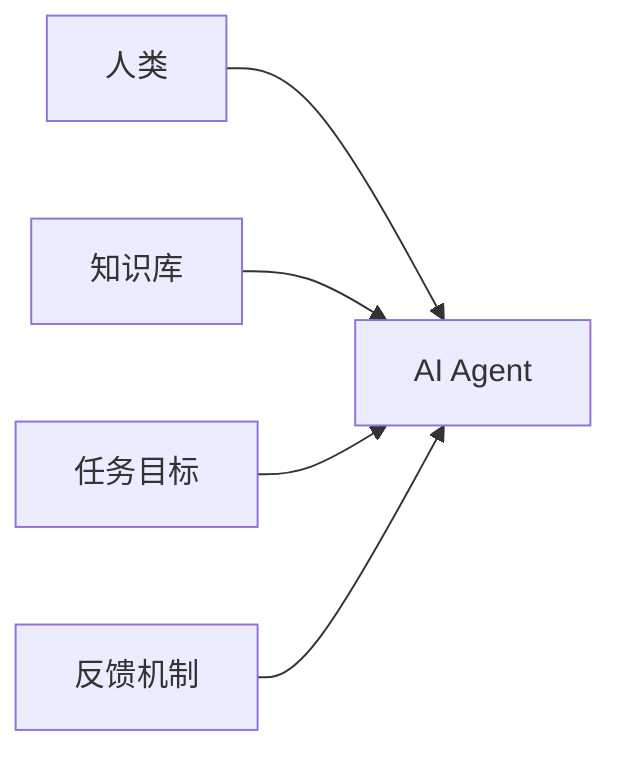
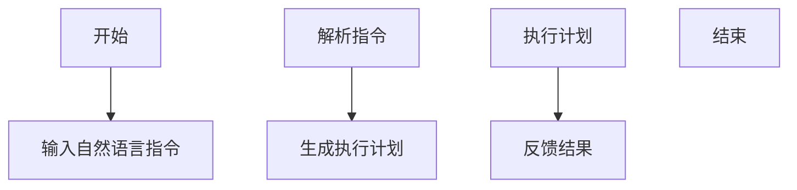
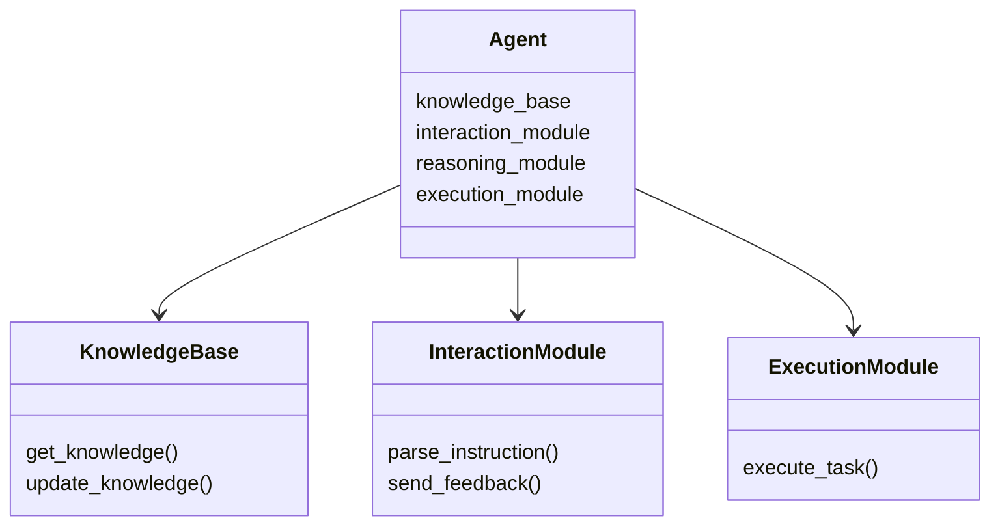
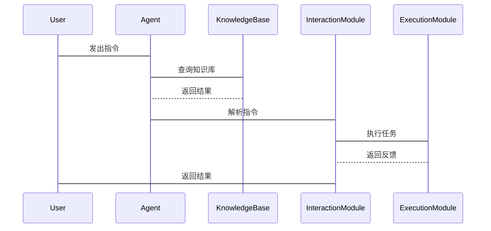

                 


# 构建具有人机协作学习能力的AI Agent

## 关键词：AI Agent, 人机协作学习, 人机交互, 知识表示, 强化学习, 自然语言处理, 系统架构

## 摘要：  
本文详细探讨了构建具有人机协作学习能力的AI Agent的技术细节，涵盖了从背景概述到系统架构的各个方面。通过分析人机协作学习的核心概念、算法原理和系统架构，结合实际项目实战和最佳实践，为读者提供了一套完整的构建方法论。本文适合AI开发者、研究人员以及对人机协作学习感兴趣的读者阅读。

---

## 目录大纲

### 第一章: 人机协作学习AI Agent的背景概述

#### 1.1 问题背景与问题描述
- 1.1.1 当前AI Agent的发展现状
  - 简述AI Agent的定义、分类及其在各领域的应用现状。
  - 提出传统AI Agent的局限性，引出人机协作学习的必要性。

- 1.1.2 人机协作学习的核心问题
  - 人机协作学习的定义：通过人机交互实现知识共建和任务协同。
  - 核心问题：如何实现高效的知识共享、动态学习和任务协作。

- 1.1.3 问题解决的必要性与意义
  - 提升AI Agent的适应性和智能性。
  - 实现人机协作在教育、医疗、工业等领域的广泛应用。

#### 1.2 人机协作学习的定义与特点
- 1.2.1 人机协作学习的定义
  - 人机协作学习是一种结合人类知识和AI技术的交互式学习模式。
  - 强调动态知识更新和任务协同。

- 1.2.2 人机协作学习的核心特点
  - 动态性：根据反馈实时调整学习策略。
  - 交互性：通过自然语言实现高效人机交互。
  - 协作性：结合人类经验和AI算法共同完成任务。

- 1.2.3 人机协作学习与传统AI的区别
  - 知识来源：传统AI依赖预设数据，人机协作学习结合实时反馈。
  - 适应性：传统AI固定，人机协作学习动态调整。

#### 1.3 人机协作学习AI Agent的系统组成
- 1.3.1 系统模块划分
  - 知识获取模块：收集和处理多源数据。
  - 知识表示模块：构建知识图谱。
  - 人机交互模块：实现自然语言处理和反馈机制。
  - 任务执行模块：根据指令执行具体任务。

- 1.3.2 各模块之间的关系
  - 知识获取模块为知识表示提供数据支持。
  - 人机交互模块负责指令解析和反馈处理。
  - 任务执行模块基于知识表示和指令解析结果进行操作。

- 1.3.3 系统边界与外延
  - 系统边界：明确各模块的功能范围和接口。
  - 外延：扩展到外部数据源和第三方服务。

#### 1.4 本章小结
- 总结本章内容，强调人机协作学习AI Agent的核心价值和构建目标。

---

### 第二章: 人机协作学习的核心概念与联系

#### 2.1 核心概念原理
- 2.1.1 人机协作学习的基本原理
  - 基于自然语言处理的指令解析。
  - 基于知识表示的推理与决策。
  - 基于强化学习的协作优化。

- 2.1.2 AI Agent的智能模型
  - 智能体的定义与分类。
  - 知识表示与推理模型。
  - 学习机制：监督学习、无监督学习、强化学习的结合。

- 2.1.3 知识表示与推理机制
  - 知识图谱的构建与表示。
  - 基于符号逻辑的推理方法。
  - 基于概率论的推理方法。

#### 2.2 核心概念属性特征对比
- 2.2.1 人机协作学习的属性特征
  - 表格形式对比分析：实时性、适应性、交互性等属性。

- 2.2.2 AI Agent的核心要素
  - 智能性、自主性、协作性、环境感知能力。

- 2.2.3 知识表示与推理的对比分析
  - 符号表示 vs. 向量表示。
  - 逻辑推理 vs. 概率推理。

#### 2.3 实体关系图


#### 2.4 本章小结
- 强调核心概念之间的联系，为后续算法设计奠定基础。

---

### 第三章: 人机协作学习AI Agent的算法原理

#### 3.1 算法原理概述
- 3.1.1 自然语言处理在人机协作中的应用
  - 基于Transformer的指令解析。
  - 基于BERT的意图识别。

- 3.1.2 基于强化学习的协作机制
  - 强化学习的基本原理。
  - 在人机协作中的应用：任务分配、策略优化。

- 3.1.3 知识表示与推理算法
  - 基于知识图谱的推理算法。
  - 基于向量空间模型的相似性计算。

#### 3.2 算法流程图


#### 3.3 算法实现代码
- 3.3.1 自然语言处理示例代码
  ```python
  def parse_instruction(instruction):
      # 使用预训练的NLP模型进行指令解析
      return parsed_plan
  ```

- 3.3.2 基于强化学习的协作算法
  ```python
  def reinforce_learning(reward):
      # 根据反馈调整策略
      pass
  ```

- 3.3.3 知识推理算法
  ```python
  def knowledge_reasoning(knowledge_base):
      # 基于知识图谱进行推理
      return result
  ```

#### 3.4 数学公式与模型
- 指令解析模型的数学表示：
  $$ P(y|x) = \text{softmax}(Wx + b) $$
  
- 基于强化学习的策略优化：
  $$ Q(s, a) = r + \gamma \max_a Q(s', a) $$

#### 3.5 本章小结
- 总结算法原理，为后续系统设计提供理论基础。

---

### 第四章: 人机协作学习AI Agent的系统架构设计

#### 4.1 系统架构概述
- 4.1.1 问题场景介绍
  - 典型应用场景：教育辅助、医疗咨询、工业自动化。

- 4.1.2 系统功能设计
  - 知识获取：数据采集与处理。
  - 知识表示：知识图谱构建。
  - 人机交互：自然语言处理与反馈。
  - 任务执行：基于知识的决策与执行。

#### 4.2 系统架构图


#### 4.3 接口与交互流程
- 4.3.1 系统接口设计
  - API接口定义：RESTful API。
  - 数据格式：JSON。

- 4.3.2 交互流程图


#### 4.4 本章小结
- 强调系统架构设计的重要性，确保各模块协同工作。

---

### 第五章: 人机协作学习AI Agent的项目实战

#### 5.1 环境安装与配置
- 安装必要的库：
  - Python：3.8+
  - NLP库：transformers、spacy
  - 图形化工具：mermaid、graphviz

#### 5.2 核心代码实现
- 5.2.1 知识获取模块
  ```python
  def fetch_data():
      # 数据采集与预处理
      return processed_data
  ```

- 5.2.2 人机交互模块
  ```python
  def interact_with_user():
      while True:
          instruction = input("请输入指令：")
          # 解析指令并执行
  ```

- 5.2.3 任务执行模块
  ```python
  def execute_task(task):
      # 执行具体任务
      pass
  ```

#### 5.3 案例分析与实现解读
- 案例：教育辅助AI Agent。
  - 功能：根据学生问题提供解答和学习建议。
  - 实现步骤：数据采集、知识图谱构建、指令解析、任务执行。

#### 5.4 项目小结
- 总结项目实现的关键点和经验教训。

---

### 第六章: 人机协作学习AI Agent的最佳实践

#### 6.1 实践经验总结
- 6.1.1 小结
  - 人机协作学习的优势：动态知识更新、高效任务协作。
  - 架构设计的关键点：模块化设计、高效接口交互。

- 6.1.2 注意事项
  - 数据质量的重要性：确保知识库的准确性和完整性。
  - 交互设计的优化：提升用户体验，降低误识别率。

- 6.1.3 拓展阅读
  - 推荐书籍：《人机协作学习：理论与实践》。
  - 推荐论文：《强化学习在人机协作中的应用》。

#### 6.2 未来展望
- 人机协作学习的发展趋势。
- AI Agent在更多领域的潜在应用。

---

### 第七章: 结论与致谢

#### 7.1 结论
- 人机协作学习AI Agent的核心价值与未来发展。

#### 7.2 致谢
- 感谢读者的支持与反馈。

---

### 参考文献
- 列出本文引用的主要文献和资源。

---

通过以上目录大纲，我们可以清晰地看到构建具有人机协作学习能力的AI Agent所需的关键步骤和内容。每一章都涵盖了从理论到实践的各个方面，确保读者能够系统地理解和掌握相关知识。接下来，我将根据这个大纲开始撰写完整的文章内容。

