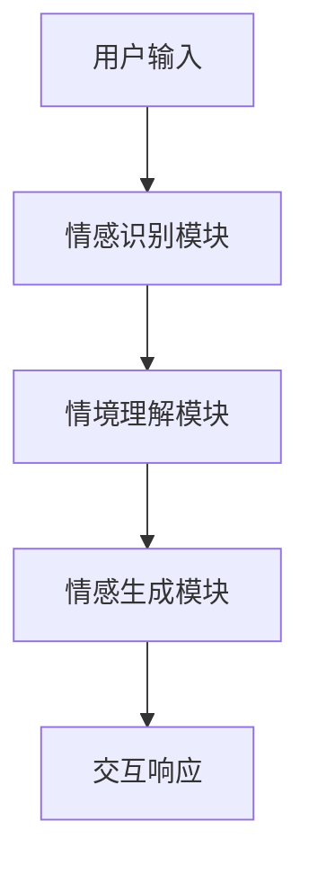
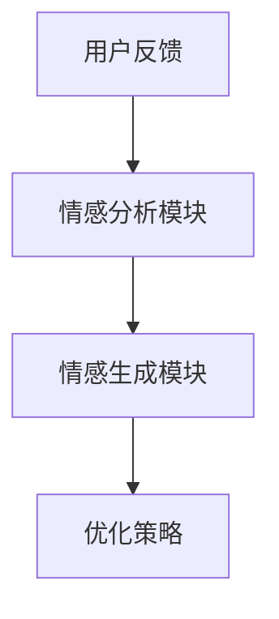
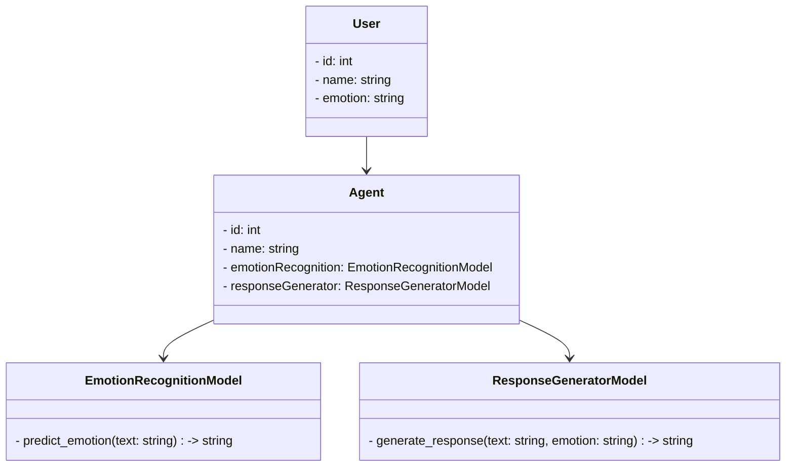
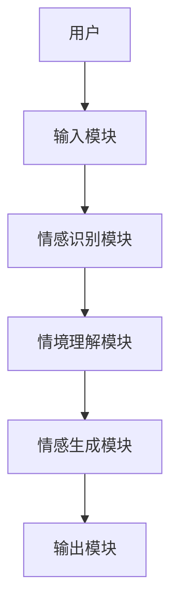
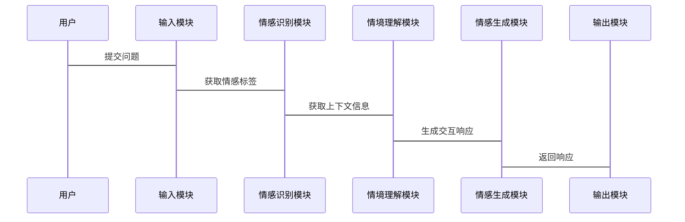

                 


# 构建具有同理心的AI Agent交互系统

## 关键词：AI Agent，同理心交互，情感计算，共情机制，人机交互，深度学习

## 摘要：  
在人工智能快速发展的今天，AI Agent（智能体）在各个领域的应用越来越广泛。然而，如何让AI Agent具备同理心，使其与人类用户进行更自然、更高效的交互，仍然是一个巨大的挑战。本文将从AI Agent的基本概念出发，深入探讨同理心交互的核心概念、算法原理、系统架构以及实际应用，为构建具有同理心的AI Agent交互系统提供全面的理论支持和实践指导。

---

# 第一部分: AI Agent与同理心交互的背景

## 第1章: AI Agent与同理心交互的背景

### 1.1 AI Agent的基本概念

#### 1.1.1 AI Agent的定义与分类  
AI Agent（人工智能代理）是指能够感知环境并采取行动以实现目标的智能系统。根据功能和应用场景的不同，AI Agent可以分为以下几类：  
- **简单反射型Agent**：基于规则直接响应输入，适用于简单的交互场景。  
- **基于模型的反射型Agent**：通过内部模型理解和预测用户需求，适用于复杂场景。  
- **目标驱动型Agent**：以明确的目标为导向，优化行动策略。  
- **实用驱动型Agent**：以效用最大化为目标，动态调整行为策略。  

#### 1.1.2 交互系统的核心要素  
一个高效的AI Agent交互系统应具备以下核心要素：  
1. **感知能力**：能够准确理解用户的输入（如文本、语音、图像等）。  
2. **推理能力**：能够基于用户输入进行逻辑推理，理解用户的真实需求。  
3. **决策能力**：根据推理结果生成最优的交互响应。  
4. **学习能力**：通过用户反馈不断优化自身的交互策略。  

#### 1.1.3 同理心在交互中的作用  
同理心（Empathy）是人类在交互中最关键的情感能力之一。在AI Agent交互中，同理心能够帮助系统更好地理解用户的情感状态，从而生成更贴切、更温暖的交互响应。例如，在客服系统中，一个具备同理心的AI Agent能够准确识别用户的情绪，并提供相应的安慰和支持。

### 1.2 同理心交互的背景与意义

#### 1.2.1 人机交互的发展历程  
从最初的基于规则的对话系统到现代的深度学习驱动的自然语言处理（NLP）系统，人机交互技术经历了以下几个阶段：  
1. **基于规则的交互**：通过预定义的规则匹配用户输入，生成简单的响应。  
2. **统计学习驱动的交互**：利用概率模型（如马尔可夫链）进行模式识别。  
3. **深度学习驱动的交互**：基于神经网络（如LSTM、Transformer）进行复杂的语义理解和生成。  

#### 1.2.2 同理心交互的必要性  
随着AI Agent在教育、医疗、客服等领域的广泛应用，用户对交互体验的要求越来越高。具备同理心的AI Agent能够显著提升用户体验，降低用户对技术的抵触感，同时提高系统的实用性和满意度。

#### 1.2.3 同理心交互的应用场景  
- **智能客服**：帮助用户解决复杂问题，提供情感支持。  
- **教育辅助**：根据学生情绪调整教学策略。  
- **健康管理**：通过情感识别提供个性化的健康建议。  

### 1.3 本章小结  
本章从AI Agent的基本概念出发，介绍了交互系统的核心要素，并重点阐述了同理心在AI Agent交互中的重要性及其应用场景。通过理解这些内容，读者可以更好地把握构建具有同理心的AI Agent交互系统的背景和意义。

---

# 第二部分: 同理心交互的核心概念与联系

## 第2章: 同理心交互的核心概念

### 2.1 同理心的定义与特征

#### 2.1.1 同理心的定义  
同理心是指个体能够理解和分享他人情感状态的能力。在AI Agent交互中，同理心表现为系统能够识别用户的情感，并生成相应的回应。

#### 2.1.2 同理心的核心特征  
- **情感识别能力**：准确识别用户的情感状态（如快乐、悲伤、愤怒等）。  
- **情感生成能力**：根据用户情感生成相应的回应。  
- **情感反馈能力**：通过用户反馈不断优化情感识别和生成能力。  

#### 2.1.3 同理心与情感计算的区别  
- **情感计算**：专注于从数据中提取情感信息，通常用于情感分析任务。  
- **共情机制**：基于情感计算的结果，生成具有情感共鸣的交互响应。  

**对比表：情感计算与共情机制的对比**  

| 对比维度       | 情感计算                     | 共情机制                     |
|----------------|-----------------------------|------------------------------|
| 核心目标       | 识别情感                    | 生成情感共鸣的响应           |
| 输入           | 文本、语音、图像             | 用户情感状态和需求           |
| 输出           | 情感标签（如正面、负面）     | 自然语言生成的回应           |

### 2.2 AI Agent交互中的共情机制

#### 2.2.1 共情机制的构成  
共情机制通常包括以下三个部分：  
1. **情感识别模块**：通过自然语言处理技术识别用户的情感状态。  
2. **情境理解模块**：结合上下文理解用户的真实需求。  
3. **情感生成模块**：根据用户情感和情境生成共情的交互响应。  

#### 2.2.2 共情与情感分析的关系  
情感分析是共情机制的基础。情感分析通过分析用户输入生成情感标签，而共情机制则基于这些标签生成更具体的交互响应。

#### 2.2.3 共情与自然语言处理的结合  
通过深度学习模型（如Transformer），共情机制能够生成更自然、更贴切的交互响应。例如，在用户表达悲伤时，系统可以生成类似“我很理解你的感受，如果你愿意，我可以帮你一起解决这个问题”的回应。

### 2.3 同理心交互的核心要素对比

#### 2.3.1 情感计算与共情机制对比表  
（见上文）

#### 2.3.2 共情生成与情感反馈的流程图  


---

# 第三部分: 同理心交互的算法原理

## 第3章: 同理心交互的算法原理

### 3.1 情感分析算法

#### 3.1.1 基于词袋模型的情感分析  
词袋模型通过统计文本中情感词的出现频率来判断情感倾向。例如，输入文本“这个产品太差了”，系统会识别出“差”这一情感词，并判断情感为负面。

#### 3.1.2 基于深度学习的情感分析  
深度学习模型（如LSTM和Transformer）能够更准确地捕捉文本的情感信息。例如，使用预训练的BERT模型进行情感分类。

#### 3.1.3 情感分析的数学模型  
情感分析的数学模型可以表示为：  
$$ P(y|x) = \text{softmax}(Wx + b) $$  
其中，$x$ 是输入文本的向量表示，$W$ 和 $b$ 是模型参数。

### 3.2 共情生成算法

#### 3.2.1 基于规则的共情生成  
基于规则的共情生成通常通过预定义的规则匹配用户情感，并生成相应的回应。例如，如果用户表达悲伤，系统可以生成安慰的话语。

#### 3.2.2 基于机器学习的共情生成  
基于机器学习的共情生成通过训练大规模的情感对话数据，生成更自然的交互响应。例如，使用GPT模型生成情感共鸣的回应。

#### 3.2.3 共情生成的数学模型  
共情生成的数学模型可以表示为：  
$$ P(y|x) = \text{softmax}(Wx + b) $$  
其中，$x$ 是输入文本的向量表示，$W$ 和 $b$ 是模型参数。

### 3.3 情感反馈优化算法

#### 3.3.1 情感反馈的采集与分析  
通过用户反馈（如满意度评分、情感标签）优化情感识别和生成模块。

#### 3.3.2 基于反馈的情感优化算法  
通过强化学习优化情感生成策略。例如，使用策略梯度法优化模型参数，以最大化用户满意度。

#### 3.3.3 情感反馈优化的流程图  


---

## 第4章: 同理心交互的数学模型与公式

### 4.1 情感分析的数学模型  
情感分析的数学模型可以表示为：  
$$ P(y|x) = \text{softmax}(Wx + b) $$  
其中，$x$ 是输入文本的向量表示，$W$ 和 $b$ 是模型参数。

### 4.2 共情生成的数学模型  
共情生成的数学模型可以表示为：  
$$ P(y|x) = \text{softmax}(Wx + b) $$  
其中，$x$ 是输入文本的向量表示，$W$ 和 $b$ 是模型参数。

---

# 第四部分: 系统分析与架构设计

## 第5章: 系统分析与架构设计

### 5.1 问题场景介绍  
本章将从实际应用场景出发，介绍如何构建一个具备同理心的AI Agent交互系统。

### 5.2 系统功能设计

#### 5.2.1 领域模型类图  


### 5.2.2 系统架构图  


### 5.2.3 系统交互序列图  


---

## 第6章: 项目实战

### 6.1 环境安装  
需要安装以下工具和库：  
- Python 3.8+  
- TensorFlow 2.0+  
- Keras  
- NLTK  

### 6.2 核心代码实现

#### 6.2.1 情感分析模块  
```python
import numpy as np
from tensorflow.keras.models import Model
from tensorflow.keras.layers import Input, Dense, LSTM, Dropout, Embedding

# 定义情感分析模型
def build_emotion_model(vocabulary_size, embedding_dim, lstm_units):
    inputs = Input(shape=(None, vocabulary_size))
    x = Embedding(vocabulary_size, embedding_dim)(inputs)
    x = LSTM(lstm_units, return_sequences=True)(x)
    x = Dropout(0.5)(x)
    x = LSTM(lstm_units, return_sequences=False)(x)
    x = Dense(2, activation='softmax')(x)
    model = Model(inputs=inputs, outputs=x)
    return model

# 编译模型
model = build_emotion_model(vocabulary_size=10000, embedding_dim=64, lstm_units=64)
model.compile(loss='sparse_categorical_crossentropy', optimizer='adam', metrics=['accuracy'])
```

#### 6.2.2 情感生成模块  
```python
import tensorflow as tf
from tensorflow.keras.layers import Input, Dense, LSTM, Dropout, Embedding, Bidirectional

# 定义情感生成模型
def build_response_model(vocabulary_size, embedding_dim, lstm_units):
    inputs = Input(shape=(None, vocabulary_size))
    x = Embedding(vocabulary_size, embedding_dim)(inputs)
    x = Bidirectional(LSTM(lstm_units, return_sequences=True))(x)
    x = Dropout(0.5)(x)
    x = LSTM(lstm_units, return_sequences=False)(x)
    x = Dense(vocabulary_size, activation='softmax')(x)
    model = Model(inputs=inputs, outputs=x)
    return model

# 编译模型
model = build_response_model(vocabulary_size=10000, embedding_dim=64, lstm_units=64)
model.compile(loss='sparse_categorical_crossentropy', optimizer='adam', metrics=['accuracy'])
```

### 6.3 案例分析  
以智能客服系统为例，介绍如何利用上述模型实现情感支持功能。

### 6.4 项目小结  
总结项目实现的关键点和经验教训。

---

# 第五部分: 最佳实践与总结

## 第7章: 最佳实践与总结

### 7.1 最佳实践  
- **数据质量**：确保训练数据的多样性和代表性。  
- **模型优化**：通过A/B测试优化情感生成策略。  
- **用户体验**：定期收集用户反馈，不断优化交互体验。  

### 7.2 小结  
本文从理论到实践，详细探讨了构建具有同理心的AI Agent交互系统的各个方面，包括核心概念、算法原理、系统架构和项目实战。

### 7.3 展望  
随着深度学习和自然语言处理技术的不断进步，具备同理心的AI Agent交互系统将在更多领域得到广泛应用，为人类带来更智能、更贴心的交互体验。

---

通过以上内容，读者可以系统地了解如何构建一个具备同理心的AI Agent交互系统，并能够将其应用于实际场景中。

