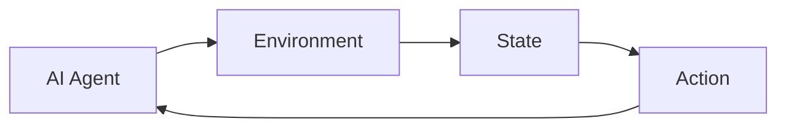
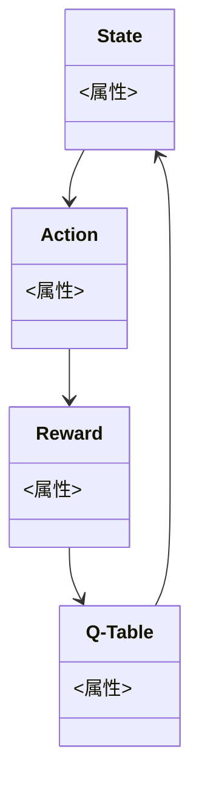
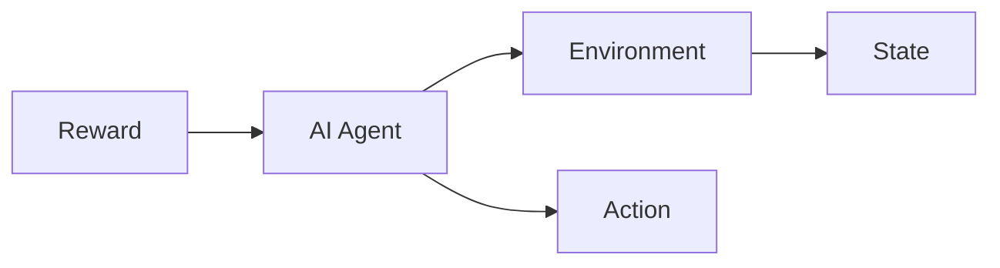
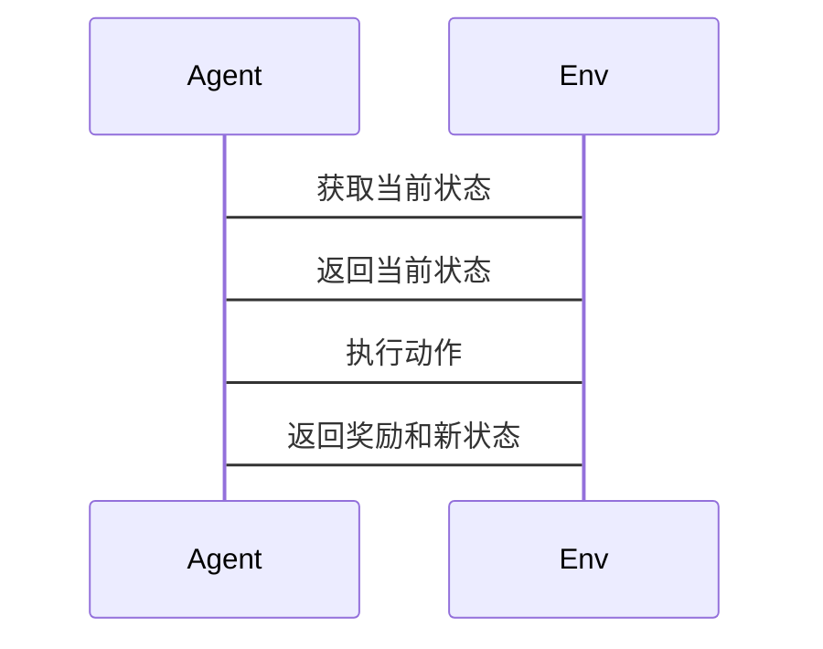

                 


# 构建具有好奇心的AI Agent：探索与学习

> 关键词：AI Agent，好奇心驱动，强化学习，探索学习，自主学习，机器学习

> 摘要：本文探讨如何构建一个具有好奇心的AI Agent，通过强化学习和探索学习，帮助AI系统提升自主学习和决策能力。从背景介绍到项目实战，系统性地分析和实现一个具备好奇心的AI Agent。

---

## 第一章：构建具有好奇心的AI Agent的背景与问题

### 1.1 问题背景

#### 1.1.1 当前AI Agent的发展现状
AI Agent（智能体）近年来发展迅速，广泛应用于自动驾驶、智能助手、机器人等领域。然而，大多数AI Agent仍依赖于预定义的目标和规则，缺乏自主性和适应性。

#### 1.1.2 好奇心在AI Agent中的重要性
好奇心是推动人类和动物探索世界的重要驱动力。赋予AI Agent好奇心，可以使其在未知环境中主动探索，提升自主学习和决策能力。

#### 1.1.3 问题背景的定义与范围
本研究旨在构建一个具有好奇心的AI Agent，使其能够在动态环境中主动探索，发现新知识，并优化决策策略。

### 1.2 问题描述

#### 1.2.1 好奇心驱动的AI Agent的核心问题
如何定义和量化好奇心？如何设计算法使AI Agent具备主动探索的能力？如何在实际场景中实现好奇心驱动的学习？

#### 1.2.2 问题的边界与外延
本研究聚焦于AI Agent在特定环境中的探索行为，暂不考虑多智能体协作和复杂社会交互。

#### 1.2.3 问题的复杂性与挑战
动态环境的不确定性、探索与利用的平衡、计算资源的限制等。

### 1.3 问题解决

#### 1.3.1 好奇心驱动的AI Agent的目标
通过强化学习，使AI Agent在环境中主动探索，发现新状态和动作，提升决策能力。

#### 1.3.2 解决方案的概述
结合强化学习算法和好奇心驱动的探索策略，设计一个动态的奖励机制，鼓励AI Agent主动探索未知区域。

#### 1.3.3 解决方案的可行性分析
基于现有的强化学习框架，通过改进奖励函数和策略选择，增强AI Agent的探索能力。

### 1.4 概念结构与核心要素

#### 1.4.1 好奇心驱动的AI Agent的构成要素
- 状态空间：环境中的状态定义。
- 动作空间：AI Agent可执行的动作。
- 奖励函数：用于评估动作的价值。
- 策略：决定AI Agent如何选择动作。

#### 1.4.2 各要素之间的关系
状态和动作构成环境与AI Agent的交互界面，奖励函数和策略共同驱动探索行为。

#### 1.4.3 核心概念的总结
好奇心驱动的AI Agent通过主动探索未知状态，优化决策策略，提升环境适应能力。

### 1.5 本章小结
本章介绍了构建具有好奇心的AI Agent的背景、问题、目标和核心要素，为后续章节的分析奠定了基础。

---

## 第二章：好奇心驱动的AI Agent的核心概念

### 2.1 好奇心的定义与属性

#### 2.1.1 好奇心的定义
好奇心是驱动个体探索未知事物的内在动机，具有不确定性、目标导向性和自主性等特点。

#### 2.1.2 好奇心的属性特征对比
| 特性 | 描述 |
|------|------|
| 不确定性 | 探索未知区域 |
| 目标导向性 | 针对特定目标展开探索 |
| 自主性 | 内在动机驱动 |

#### 2.1.3 好奇心的数学模型
好奇心可以表示为对环境不确定性的度量，常用信息增益或熵差来衡量。

$$ \text{信息增益} = H(S) - H(S|A) $$

其中，$H(S)$表示状态$S$的熵，$H(S|A)$表示在动作$A$执行后的状态$S$的条件熵。

### 2.2 AI Agent的定义与特点

#### 2.2.1 AI Agent的定义
AI Agent是指在环境中感知并自主行动以实现目标的智能实体。

#### 2.2.2 AI Agent的核心特点
- 感知能力：通过传感器获取环境信息。
- 决策能力：基于感知信息做出决策。
- 行动能力：执行决策动作影响环境。

### 2.3 好奇心驱动的AI Agent的实体关系



图1：AI Agent与环境的交互关系图。

### 2.4 好奇心驱动的AI Agent的流程图

```mermaid
graph TD
Start --> Initialize Curiosity
Initialize Curiosity --> Explore Environment
Explore Environment --> Receive Feedback
Receive Feedback --> Update Curiosity Model
Update Curiosity Model --> Repeat
```

图2：好奇心驱动的AI Agent流程图。

### 2.5 本章小结
本章详细阐述了好奇心驱动的AI Agent的核心概念及其实体关系，为后续算法设计提供了理论基础。

---

## 第三章：好奇心驱动的AI Agent算法原理

### 3.1 强化学习基础

#### 3.1.1 强化学习的基本概念
强化学习（Reinforcement Learning, RL）是一种通过试错方式学习策略的方法，目标是使智能体在环境中获得最大累积奖励。

#### 3.1.2 强化学习的核心要素
- 状态空间：环境中的状态。
- 动作空间：智能体可执行的动作。
- 奖励函数：对动作的评价。
- 策略：动作选择的概率分布。

#### 3.1.3 常见强化学习算法
- Q-learning：基于值函数的方法。
- DQN（Deep Q-Network）：基于深度神经网络的Q-learning实现。
- Policy Gradient：直接优化策略的梯度方法。

### 3.2 好奇心驱动的探索算法

#### 3.2.1 好奇心驱动的探索策略
- 基于不确定性：通过熵或信息增益度量状态的不确定性，选择不确定性高的状态进行探索。
- 基于奖励好奇心：设计一种奖励机制，鼓励智能体探索未知区域。

#### 3.2.2 好奇心驱动的算法实现
基于Q-learning的改进算法，加入好奇心驱动的探索机制。

$$ Q(s, a) = Q(s, a) + \alpha \left[ r + \gamma Q(s', a') - Q(s, a) \right] $$

其中，$\alpha$为学习率，$\gamma$为折扣因子，$r$为奖励。

### 3.3 算法流程图

```mermaid
graph TD
Start --> Initialize Q-Table
Initialize Q-Table --> Choose Action
Choose Action --> Execute Action
Execute Action --> Receive Reward and Next State
Receive Reward and Next State --> Update Q-Table
Update Q-Table --> Repeat
```

图3：基于Q-learning的好奇心驱动算法流程图。

### 3.4 本章小结
本章详细讲解了强化学习基础，并提出了基于好奇心驱动的探索算法，为后续系统设计提供了算法基础。

---

## 第四章：系统分析与架构设计

### 4.1 项目场景介绍

#### 4.1.1 项目背景
在一个模拟环境中，构建一个具有好奇心的AI Agent，使其能够自主探索并学习最优策略。

#### 4.1.2 项目目标
设计一个具备好奇心驱动的AI Agent，实现自主学习和优化决策。

### 4.2 系统功能设计

#### 4.2.1 领域模型设计



图4：领域模型类图。

#### 4.2.2 系统架构设计



图5：系统架构图。

### 4.3 系统接口设计

#### 4.3.1 接口定义
- 输入：当前状态。
- 输出：动作选择。
- 反馈：奖励和新状态。

#### 4.3.2 接口交互序列图



图6：接口交互序列图。

### 4.4 本章小结
本章详细设计了系统的功能、架构和接口，为后续的实现提供了清晰的指导。

---

## 第五章：项目实战

### 5.1 环境安装与配置

#### 5.1.1 环境要求
- Python 3.8+
- OpenAI Gym库
- matplotlib库

#### 5.1.2 安装依赖
```bash
pip install gym matplotlib
```

### 5.2 核心代码实现

#### 5.2.1 环境接口实现

```python
import gym
env = gym.make('CartPole-v0')
```

#### 5.2.2 好奇心驱动的算法实现

```python
import numpy as np
import gym
import random
from collections import defaultdict

class CuriosityDrivenAgent:
    def __init__(self, env, alpha=0.1, gamma=0.99):
        self.env = env
        self.Q = defaultdict(lambda: np.zeros(env.action_space.n))
        self.alpha = alpha
        self.gamma = gamma

    def choose_action(self, state, epsilon=0.1):
        if random.random() < epsilon:
            return random.randint(0, self.env.action_space.n-1)
        q_values = self.Q[state]
        return np.argmax(q_values)

    def update_Q(self, state, action, reward, next_state):
        current_q = self.Q[state][action]
        next_max_q = np.max(self.Q[next_state])
        target = reward + self.gamma * next_max_q
        self.Q[state][action] += self.alpha * (target - current_q)

    def play_episode(self):
        state = self.env.reset()
        total_reward = 0
        while True:
            action = self.choose_action(state)
            next_state, reward, done, _ = self.env.step(action)
            self.update_Q(state, action, reward, next_state)
            total_reward += reward
            state = next_state
            if done:
                break
        return total_reward
```

#### 5.2.3 好奇心驱动的探索机制

```python
def compute_uncertainty(state):
    # 计算状态的不确定性
    return np.std(agent.Q[state])

epsilon = 0.1
action = agent.choose_action(state, epsilon)
```

### 5.3 代码解读与分析

#### 5.3.1 状态空间和动作空间的处理
通过`defaultdict`存储每个状态的动作价值，使用`choose_action`方法选择动作，平衡探索与利用。

#### 5.3.2 奖励机制的设计
通过`update_Q`方法更新Q值，结合好奇心驱动的探索机制，优化奖励函数。

### 5.4 实际案例分析

#### 5.4.1 案例场景
在一个CartPole环境中，训练AI Agent控制杆子保持平衡。

#### 5.4.2 训练过程

```python
agent = CuriosityDrivenAgent(env)
rewards = []
for _ in range(100):
    rewards.append(agent.play_episode())
```

#### 5.4.3 结果分析
通过绘制奖励曲线，观察AI Agent的学习效果。

```python
import matplotlib.pyplot as plt

plt.plot(rewards)
plt.xlabel('Episode')
plt.ylabel('Total Reward')
plt.show()
```

### 5.5 本章小结
本章通过实际案例，详细讲解了环境配置、算法实现和训练过程，展示了好奇心驱动的AI Agent在实际场景中的应用。

---

## 第六章：最佳实践与总结

### 6.1 最佳实践

#### 6.1.1 算法调优
- 选择合适的强化学习算法。
- 调整学习率和折扣因子。

#### 6.1.2 环境设计
- 设计合理的奖励机制。
- 优化状态和动作空间。

#### 6.1.3 性能优化
- 使用经验回放。
- 并行计算加速。

### 6.2 小结
好奇心驱动的AI Agent通过主动探索和学习，显著提升了环境适应能力和决策能力。

### 6.3 注意事项
- 确保算法的收敛性。
- 避免过拟合和过探索。

### 6.4 拓展阅读
建议阅读相关论文和书籍，深入理解强化学习和好奇心驱动的机制。

---

## 附录

### 附录A：代码完整实现

```python
# 附录内容请参考正文中的代码部分
```

### 附录B：数学公式补充

$$ \text{好奇心驱动的Q值更新公式} = Q(s, a) + \alpha \left[ r + \gamma \max Q(s', a') - Q(s, a) \right] $$

---

## 参考文献

1. Mnih, V., et al. "Human-level control through deep reinforcement learning." *Nature*, 2015.
2. 蒋华雄. 《强化学习：原理与实现》. 人民邮电出版社, 2018.

---

通过以上内容，我们系统性地构建了一个具有好奇心的AI Agent，从理论到实践，详细讲解了其构建过程和实现方法。希望本文对读者有所帮助，激发更多的思考和实践。

