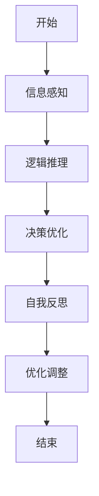
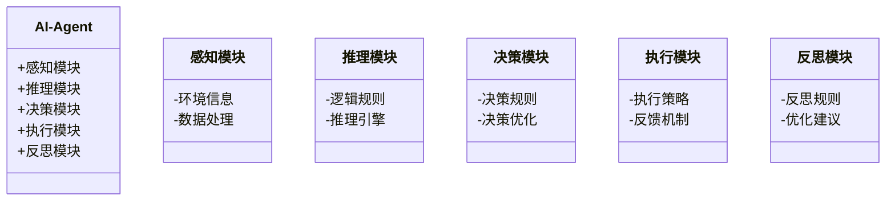
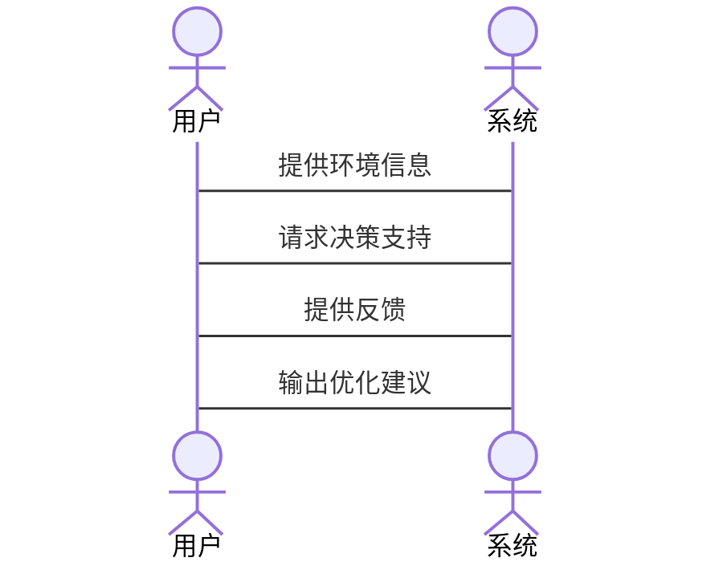

                 


# 第一部分: 构建具有批判性思维的AI Agent系统背景介绍

# 第1章: AI Agent与批判性思维概述

## 1.1 AI Agent的基本概念
### 1.1.1 AI Agent的定义
AI Agent（人工智能代理）是一种能够感知环境、自主决策并采取行动的智能实体。它能够通过传感器获取信息，利用推理能力分析信息，并根据目标选择最优行动方案。

### 1.1.2 AI Agent的核心特征
- **自主性**：能够在没有外部干预的情况下自主运行。
- **反应性**：能够实时感知环境变化并做出反应。
- **目标导向**：所有行动都以实现特定目标为导向。
- **学习能力**：能够通过经验改进自身的性能。

### 1.1.3 批判性思维的定义与特点
批判性思维是指能够独立地分析、评估和判断信息的能力，具有逻辑性、系统性和反思性。

### 1.1.4 AI Agent与批判性思维的结合意义
将批判性思维融入AI Agent，可以使其在决策过程中更加理性、客观，能够主动质疑和优化自己的决策过程。

## 1.2 问题背景与问题描述
### 1.2.1 当前AI Agent的局限性
- **决策盲目性**：缺乏对决策过程的反思和质疑。
- **片面性**：在面对复杂问题时，可能因为信息不全面而导致错误决策。
- **缺乏深度思考**：在处理需要深度思考和判断的问题时表现不足。

### 1.2.2 批判性思维在AI Agent中的必要性
- **提升决策质量**：通过批判性思维，AI Agent能够更全面地分析问题，避免片面决策。
- **增强适应能力**：在复杂多变的环境中，批判性思维帮助AI Agent更好地适应变化。
- **优化系统性能**：通过自我反思和优化，可以不断提升系统的整体性能。

### 1.2.3 问题解决的路径与目标
- **路径**：通过设计和实现具有批判性思维的AI Agent，使其在决策过程中具备自我反思和优化的能力。
- **目标**：构建一个能够独立思考、自我优化的智能系统，提升其在复杂环境中的适应能力和决策质量。

## 1.3 问题解决与边界外延
### 1.3.1 批判性思维在AI Agent中的应用场景
- **复杂决策支持**：在金融、医疗等领域，AI Agent需要处理大量复杂信息，通过批判性思维进行优化决策。
- **自主学习与优化**：AI Agent通过自我反思和批判性分析，不断优化自身的学习算法和决策模型。
- **人机协作**：在人机协作场景中，批判性思维帮助AI Agent更好地理解人类需求，提供更精准的服务。

### 1.3.2 系统边界与功能范围
- **系统边界**：AI Agent的决策过程、信息处理、自我反思和优化。
- **功能范围**：信息感知、逻辑推理、决策优化、自我反思。

### 1.3.3 相关领域的外延与关联
- **关联领域**：认知科学、逻辑推理、机器学习、人机交互。
- **外延领域**：情感计算、社会计算、伦理AI。

## 1.4 核心概念结构与组成要素
### 1.4.1 AI Agent的组成模块
- **感知模块**：负责信息的采集和处理。
- **推理模块**：负责逻辑推理和信息分析。
- **决策模块**：负责制定行动方案。
- **执行模块**：负责执行决策。

### 1.4.2 批判性思维的实现机制
- **逻辑推理**：基于逻辑规则进行分析和判断。
- **权衡与选择**：在多个选项中选择最优解。
- **反思与优化**：对决策过程进行反思，发现不足并优化。

### 1.4.3 系统整体架构与模块关系
通过模块化设计，AI Agent的各部分协同工作，实现信息处理、逻辑推理、决策优化和自我反思。

## 1.5 本章小结
本章从AI Agent的基本概念和批判性思维的定义入手，分析了两者结合的必要性，并详细描述了系统架构和组成要素，为后续章节的深入分析奠定了基础。

---

# 第二部分: 核心概念与联系

# 第2章: AI Agent的核心原理与批判性思维的实现机制

## 2.1 AI Agent的核心原理
### 2.1.1 知识表示与推理机制
- **知识表示**：使用逻辑符号、语义网络等方法表示知识。
- **推理机制**：基于逻辑推理规则进行推理，得出结论。

### 2.1.2 行为决策与执行策略
- **行为决策**：基于推理结果制定行动方案。
- **执行策略**：根据环境反馈调整行动策略。

### 2.1.3 学习与自适应能力
- **学习机制**：通过机器学习算法不断优化模型。
- **自适应能力**：根据环境变化调整系统参数和行为策略。

## 2.2 批判性思维的实现机制
### 2.2.1 逻辑推理与验证
- **逻辑推理**：基于逻辑规则进行分析和判断。
- **验证机制**：通过验证推理过程的正确性，确保结论的可靠性。

### 2.2.2 权衡与选择
- **权衡分析**：在多个选项中权衡利弊，选择最优解。
- **选择机制**：基于权衡结果制定最终决策。

### 2.2.3 反思与优化
- **反思机制**：对决策过程进行反思，发现不足。
- **优化策略**：根据反思结果优化系统参数和行为策略。

## 2.3 核心概念属性特征对比
### 2.3.1 AI Agent与传统AI的对比
| 特性          | AI Agent                     | 传统AI                      |
|---------------|------------------------------|------------------------------|
| 自主性        | 高                           | 低或无                      |
| 反应性        | 高                           | 低或无                      |
| 目标导向      | 是                           | 否                          |
| 学习能力      | 强                           | 弱或无                      |

### 2.3.2 批判性思维与传统思维的对比
| 特性          | 批判性思维                   | 传统思维                    |
|---------------|------------------------------|------------------------------|
| 独立性        | 强                           | 弱或无                      |
| 系统性        | 强                           | 弱                          |
| 反思性        | 强                           | 弱                          |

### 2.3.3 系统整体架构的对比
- **传统系统**：模块化设计，各部分相对独立，缺乏协同优化。
- **AI Agent系统**：模块协同工作，具备自我反思和优化能力，整体性能更优。

## 2.4 ER实体关系图
通过ER图展示AI Agent系统中各实体之间的关系，帮助理解系统架构。

```mermaid
er
  actor(AI Agent)
  actor(环境)
  actor(目标)
  relation(感知)
  relation(决策)
  relation(执行)
  relation(优化)
```

---

# 第三部分: 算法原理讲解

# 第3章: 批判性思维驱动的AI Agent算法实现

## 3.1 算法原理概述
### 3.1.1 算法核心思想
通过逻辑推理和自我反思，优化AI Agent的决策过程。

### 3.1.2 算法流程
1. **信息感知**：获取环境信息。
2. **逻辑推理**：基于逻辑规则进行分析。
3. **决策优化**：权衡不同选项，选择最优解。
4. **自我反思**：对决策过程进行反思，发现不足。
5. **优化调整**：根据反思结果调整系统参数。

## 3.2 算法流程图


## 3.3 核心算法实现
### 3.3.1 逻辑推理算法
```python
def logical_reasoning(facts, rules):
    # facts是已知事实，rules是推理规则
    # 返回推理结果
    result = []
    for rule in rules:
        if all(fact in facts for fact in rule['premises']):
            result.append(rule['conclusion'])
    return result
```

### 3.3.2 权衡与选择算法
```python
def decision_making(options, criteria):
    # options是可选方案，criteria是评估标准
    # 返回最佳选项
    scores = {}
    for option in options:
        score = 0
        for criterion in criteria:
            if option[criterion] > criteria[criterion]['threshold']:
                score += 1
        scores[option] = score
    return max(scores, key=lambda x: scores[x])
```

### 3.3.3 自我反思与优化算法
```python
def self_reflection(performance, target):
    # performance是当前表现，target是目标
    # 返回优化建议
    gaps = {metric: target[metric] - performance[metric] for metric in target}
    return gaps
```

## 3.4 数学模型与公式
### 3.4.1 逻辑推理模型
$$ \text{结论} = \bigvee_{i=1}^{n} (\text{前提}_i \land \text{规则}_i) $$

### 3.4.2 决策优化模型
$$ \text{最优解} = \argmax_{x \in X} \sum_{i=1}^{m} w_i x_i $$

## 3.5 算法实现与优化
通过实际案例分析，详细讲解算法的实现过程，并根据实际效果不断优化算法参数和逻辑。

---

# 第四部分: 系统分析与架构设计

# 第4章: 批判性思维AI Agent系统的系统分析与架构设计

## 4.1 问题场景介绍
### 4.1.1 问题背景
在复杂的现实环境中，AI Agent需要具备更强的适应能力和决策能力。

### 4.1.2 问题分析
传统AI系统在面对复杂问题时，往往缺乏灵活性和深度思考能力。

## 4.2 项目介绍
### 4.2.1 项目目标
构建一个具备批判性思维的AI Agent系统，提升其在复杂环境中的适应能力和决策质量。

### 4.2.2 项目范围
涵盖信息感知、逻辑推理、决策优化、自我反思等多个方面。

## 4.3 系统功能设计
### 4.3.1 领域模型


### 4.3.2 系统架构设计


## 4.4 系统接口设计
### 4.4.1 接口定义
- **输入接口**：接收环境信息和用户指令。
- **输出接口**：输出决策结果和优化建议。
- **反馈接口**：接收系统反馈，用于自我反思。

### 4.4.2 交互设计


---

# 第五部分: 项目实战

# 第5章: 批判性思维AI Agent系统的实现与案例分析

## 5.1 环境安装与配置
### 5.1.1 环境需求
- Python 3.8+
- 机器学习库（如TensorFlow、PyTorch）
- 图形化工具（如Mermaid、PlantUML）

### 5.1.2 安装步骤
```bash
pip install mermaid
pip install tensorflow
pip install pytorch
```

## 5.2 系统核心实现
### 5.2.1 核心代码实现
```python
class AIAgent:
    def __init__(self):
        self.modules = {
            '感知模块': 感知模块(),
            '推理模块': 推理模块(),
            '决策模块': 决策模块(),
            '执行模块': 执行模块(),
            '反思模块': 反思模块()
        }

    def run(self):
        while True:
            self.感知模块感知环境()
            self.推理模块推理()
            self.决策模块优化决策()
            self.执行模块执行决策()
            self.反思模块自我反思()

    def 反思与优化(self):
        反思结果 = self.反思模块反思()
        优化建议 = self.优化模块优化(反思结果)
        self.调整系统参数(优化建议)
```

### 5.2.2 代码应用解读与分析
通过具体代码实现，详细解读各模块的功能和交互过程。

## 5.3 案例分析
### 5.3.1 实际案例
- **案例背景**：在金融领域，AI Agent需要分析市场动态，做出投资决策。
- **案例分析**：通过批判性思维，AI Agent能够更全面地分析市场信息，避免盲目决策。

### 5.3.2 详细讲解剖析
通过具体案例，详细讲解系统的实现过程和优化策略。

## 5.4 项目小结
总结项目实现的关键点和经验教训，为后续优化提供参考。

---

# 第六部分: 最佳实践与总结

# 第6章: 批判性思维AI Agent系统的最佳实践

## 6.1 最佳实践
### 6.1.1 系统设计
- **模块化设计**：确保各模块独立且协同工作。
- **可扩展性**：预留扩展接口，方便后续功能增加。
- **可维护性**：设计清晰的代码结构，便于维护和优化。

### 6.1.2 开发实践
- **代码规范**：遵循行业标准，确保代码可读性和可维护性。
- **测试策略**：制定全面的测试计划，确保系统稳定性和可靠性。

## 6.2 小结
总结全书内容，强调批判性思维在AI Agent系统中的重要性，以及实现过程中需要注意的关键点。

## 6.3 注意事项
- **系统边界**：明确系统功能范围，避免功能过于复杂。
- **性能优化**：在实现过程中，注重系统性能的优化，确保运行效率。
- **安全性**：确保系统具备良好的安全防护机制，防止数据泄露和系统攻击。

## 6.4 拓展阅读
推荐相关领域的优秀书籍和论文，供读者深入学习和研究。

---

# 参考文献
（此处列出相关书籍、论文和其他参考资料）

---

# 索引
（此处列出文章中出现的专业术语和关键词）

---

通过以上目录结构，我们可以系统地构建一个具有批判性思维的AI Agent系统，从理论到实践，全面覆盖相关知识和技能，帮助读者深入理解和掌握这一领域的核心内容。

