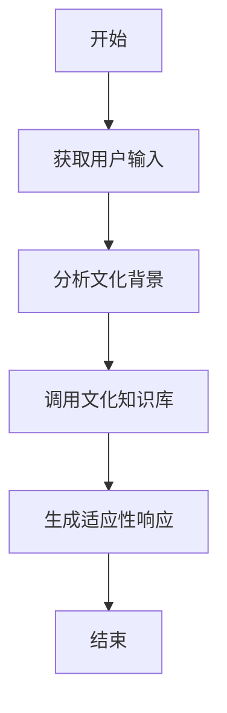
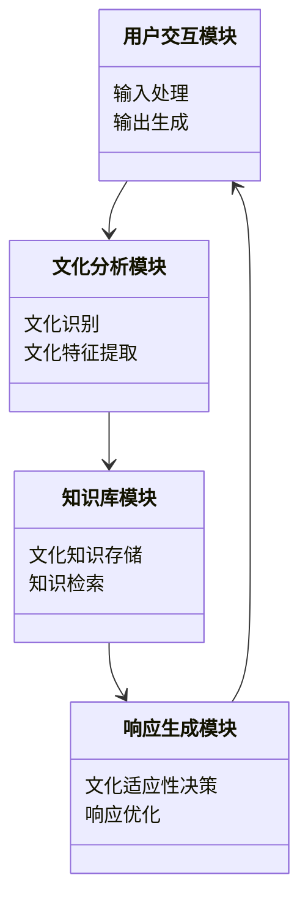

                 


# 构建具有文化适应性的AI Agent系统

> 关键词：文化适应性，AI Agent，跨文化，文化建模，机器学习，自然语言处理

> 摘要：本文详细探讨了构建具有文化适应性的AI Agent系统的各个方面，从理论基础到算法实现，再到系统架构设计和实际案例分析。文章首先介绍了文化适应性AI Agent的背景和核心概念，然后深入分析了文化建模与文化知识表示的方法，接着阐述了跨文化适应性算法的原理与实现，最后通过具体的项目实战展示了如何将理论应用于实践。本文旨在为AI开发者和研究人员提供一份全面的指南，帮助他们构建更加智能化和文化敏感的AI Agent系统。

---

## 第1章: 文化适应性AI Agent系统概述

### 1.1 问题背景与问题描述

#### 1.1.1 AI Agent系统的发展现状
AI Agent（人工智能代理）系统近年来发展迅速，广泛应用于智能助手、推荐系统、自动驾驶等领域。然而，大多数现有的AI Agent系统在设计时忽视了文化差异对用户行为和需求的影响。例如，一个AI助手在为不同文化背景的用户提供服务时，可能会因为对文化习惯的不了解而导致沟通失败或决策失误。

#### 1.1.2 文化差异对AI Agent的影响
文化差异主要体现在以下几个方面：
1. **语言与表达方式**：不同文化背景下的人们可能使用不同的表达方式和习惯用语。
2. **行为规范**：文化差异会影响用户的决策方式和行为习惯。
3. **价值观与优先级**：不同文化背景下的人们对问题的重视程度和处理方式可能存在显著差异。

#### 1.1.3 当前AI Agent系统在文化适应性方面的不足
1. **缺乏文化敏感性**：现有的AI Agent系统通常基于通用的数据集进行训练，无法有效处理文化特异性问题。
2. **文化知识表示不足**：大多数系统缺乏对文化知识的系统化建模和表示。
3. **跨文化适应性算法缺失**：现有的算法更多关注技术层面的优化，而忽视了文化适应性需求。

### 1.2 问题解决与边界定义

#### 1.2.1 文化适应性AI Agent的目标
1. 提供基于用户文化背景的个性化服务。
2. 自适应地调整系统行为以满足不同文化需求。
3. 实现跨文化场景下的高效交互。

#### 1.2.2 系统的边界与外延
1. **输入边界**：用户输入包括文本、语音、图像等形式。
2. **输出边界**：系统的输出包括文本响应、行为决策等。
3. **文化背景的外延**：系统需要支持多种文化背景，包括语言、习俗、价值观等。

#### 1.2.3 核心要素与组成结构
1. **文化知识库**：存储不同文化背景下的知识和数据。
2. **文化适应性算法**：用于根据文化背景调整系统行为。
3. **交互模块**：实现用户与AI Agent之间的实时交互。

---

## 第2章: 核心概念与理论基础

### 2.1 跨文化适应性理论

#### 2.1.1 跨文化适应性的定义
跨文化适应性是指系统能够理解和适应不同文化背景下的用户需求和行为的能力。

#### 2.1.2 跨文化适应性的关键特征
1. **文化感知性**：系统能够识别和理解用户的文化背景。
2. **文化敏感性**：系统能够根据文化背景调整其行为和响应。
3. **文化适应性**：系统能够动态优化其行为以适应不同文化需求。

#### 2.1.3 跨文化适应性与AI Agent的结合
跨文化适应性AI Agent的核心在于通过文化建模和文化适应性算法，实现对用户文化背景的识别和响应。

### 2.2 文化建模与文化知识表示

#### 2.2.1 文化建模的基本概念
文化建模是指通过建模技术，将文化知识转化为可计算的形式。

#### 2.2.2 文化知识的表示方法
1. **属性表示法**：将文化知识表示为属性和值的组合。
2. **规则表示法**：通过规则描述文化习惯和行为规范。
3. **案例表示法**：通过案例库的形式存储典型的文化场景。

#### 2.2.3 文化知识库的构建与管理
1. **数据收集**：通过问卷调查、文献分析等方式收集文化数据。
2. **数据清洗**：去除噪声数据，确保数据质量。
3. **数据存储**：将数据存储在知识库中，并提供高效的查询接口。

### 2.3 跨文化适应性算法与模型

#### 2.3.1 跨文化适应性的基本算法
1. **基于规则的适应性算法**：通过预定义的规则实现文化适应。
2. **基于机器学习的适应性算法**：通过机器学习模型学习文化适应性。

#### 2.3.2 跨文化适应性模型的构建
1. **特征提取**：从用户输入中提取文化相关特征。
2. **文化识别**：基于特征识别用户的文化背景。
3. **文化适应**：根据文化背景调整系统行为。

#### 2.3.3 算法与模型的对比分析
1. **基于规则的算法**：优点是简单易懂，缺点是灵活性差。
2. **基于机器学习的算法**：优点是灵活性高，缺点是需要大量数据支持。

---

## 第3章: 核心概念与联系

### 3.1 核心概念原理

#### 3.1.1 跨文化适应性原理
1. **文化感知**：通过分析用户输入识别文化背景。
2. **文化适应**：根据文化背景调整系统行为。
3. **文化优化**：通过反馈优化文化适应策略。

#### 3.1.2 文化知识表示原理
1. **知识建模**：将文化知识转化为可计算的形式。
2. **知识存储**：将文化知识存储在知识库中。
3. **知识应用**：将文化知识应用于系统决策。

#### 3.1.3 跨文化适应性算法原理
1. **特征提取**：从用户输入中提取文化相关特征。
2. **文化识别**：基于特征识别用户的文化背景。
3. **文化适应**：根据文化背景调整系统行为。

### 3.2 概念属性特征对比表格

| 概念       | 属性               | 特征               |
|------------|--------------------|--------------------|
| 文化适应性 | 基于用户文化背景   | 实时调整系统行为     |
| 文化建模   | 数据驱动的建模方式 | 高度依赖数据质量     |

### 3.3 ER实体关系图

```mermaid
er
actor: 用户
agent: AI Agent
culture_model: 文化知识库
interaction: 交互记录
goal: 用户目标
```

---

## 第4章: 跨文化适应性算法原理

### 4.1 算法概述

#### 4.1.1 算法的基本流程
1. **用户输入**：获取用户的输入数据。
2. **文化识别**：识别用户的文化背景。
3. **文化适应**：根据文化背景调整系统行为。
4. **输出响应**：生成适应性响应并返回用户。

#### 4.1.2 算法的核心思想
通过分析用户输入的文化特征，结合文化知识库中的知识，生成适应性响应。

#### 4.1.3 算法的优缺点
1. **优点**：灵活性高，能够适应不同文化背景。
2. **缺点**：需要大量文化数据支持，实现复杂。

### 4.2 算法实现步骤



### 4.3 算法实现代码示例

```python
def cultural_adaptation_agent(user_input, culture_model):
    # 分析用户输入的文化背景
    culture = detect_culture(user_input)
    # 调用文化知识库
    knowledge = get_knowledge(culture_model, culture)
    # 生成适应性响应
    response = generate_response(user_input, knowledge)
    return response
```

---

## 第5章: 数学模型与公式推导

### 5.1 文化相似度计算公式

$$
\text{相似度} = \sum_{i=1}^{n} w_i \cdot f_i
$$

其中，$w_i$ 表示第 $i$ 个特征的权重，$f_i$ 表示第 $i$ 个特征的值。

### 5.2 文化权重分配公式

$$
\text{权重} = \frac{\sum_{j=1}^{m} \alpha_{ij}}{\sum_{j=1}^{m} \beta_{ij}}
$$

其中，$\alpha_{ij}$ 表示第 $i$ 个特征在第 $j$ 个文化中的权重，$\beta_{ij}$ 表示第 $i$ 个特征在第 $j$ 个文化中的基数。

---

## 第6章: 系统分析与架构设计

### 6.1 系统架构设计



### 6.2 接口设计与交互流程

```mermaid
sequenceDiagram
    用户 -> 用户交互模块: 发送输入
    用户交互模块 -> 文化分析模块: 请求文化分析
    文化分析模块 -> 知识库模块: 请求文化知识
    知识库模块 -> 文化分析模块: 返回文化知识
    文化分析模块 -> 响应生成模块: 请求生成响应
    响应生成模块 -> 用户交互模块: 返回适应性响应
    用户 <- 用户交互模块: 收到响应
```

---

## 第7章: 项目实战与案例分析

### 7.1 项目介绍

#### 7.1.1 项目目标
构建一个可以根据用户文化背景调整聊天内容的AI Agent系统。

#### 7.1.2 项目环境
1. **开发工具**：Python、TensorFlow、Keras
2. **数据集**：多语言语料库

### 7.2 核心实现代码

```python
import tensorflow as tf
from tensorflow.keras import layers

# 定义文化适应性模型
class CulturalAdapter(tf.keras.Model):
    def __init__(self, vocab_size):
        super(CulturalAdapter, self).__init__()
        self.embedding = layers.Embedding(vocab_size, 100)
        self.dense = layers.Dense(1, activation='sigmoid')

    def call(self, inputs):
        x = self.embedding(inputs)
        x = self.dense(x)
        return x
```

### 7.3 代码应用解读

1. **模型训练**：使用多语言语料库训练文化适应性模型。
2. **文化识别**：通过模型预测用户的文化背景。
3. **响应生成**：根据文化背景生成适应性响应。

### 7.4 案例分析

#### 7.4.1 案例背景
用户来自不同文化背景，系统需要根据文化差异调整聊天内容。

#### 7.4.2 案例实现
1. **用户输入**：用户输入一条消息。
2. **文化识别**：系统识别用户的文化背景。
3. **文化适应**：系统根据文化背景生成适应性响应。
4. **输出结果**：系统返回适应性响应。

---

## 第8章: 最佳实践与小结

### 8.1 最佳实践 tips

1. **文化数据的收集与处理**：确保文化数据的多样性和准确性。
2. **模型的可解释性**：确保模型的决策过程可以被理解和验证。
3. **系统的实时性**：确保系统能够实时响应用户需求。

### 8.2 小结

通过本文的详细讲解，我们可以看到，构建具有文化适应性的AI Agent系统需要从理论到实践的全面考虑。从文化建模到算法实现，再到系统架构设计，每一步都需要精心设计和实现。

### 8.3 注意事项

1. **文化数据的敏感性**：在处理文化数据时，需要注意数据的敏感性和隐私性。
2. **模型的泛化能力**：需要在不同文化背景下验证模型的泛化能力。
3. **系统的可扩展性**：确保系统能够支持更多文化背景的扩展。

### 8.4 拓展阅读

1. **文化适应性算法的研究现状**：进一步了解文化适应性算法的最新研究进展。
2. **文化建模的技术细节**：深入学习文化建模的具体技术细节。
3. **跨文化适应性系统的实际应用**：研究跨文化适应性系统在实际应用中的表现。

---

通过以上步骤，我们可以系统地构建一个具有文化适应性的AI Agent系统。希望本文能够为相关领域的开发者和研究人员提供有价值的参考和指导。

