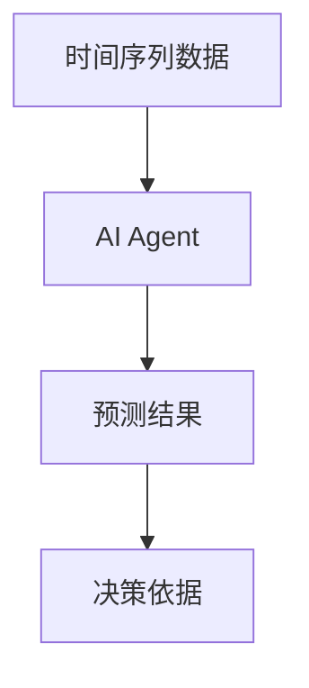
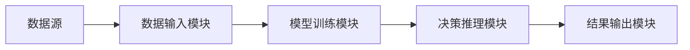
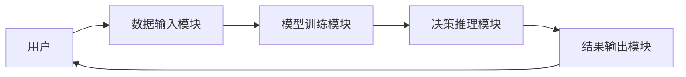

                 


# 构建具有时间序列分析能力的AI Agent

> 关键词：时间序列分析，AI Agent，深度学习，LSTM，ARIMA

> 摘要：本文将详细介绍如何构建一个具有时间序列分析能力的AI Agent。首先，我们将从时间序列分析的基本概念和AI Agent的定义入手，探讨两者结合的意义和应用场景。接着，我们将深入分析时间序列分析的核心算法及其在AI Agent中的具体应用，包括传统统计模型和深度学习模型的对比与选择。然后，我们将从系统架构的角度，设计一个完整的AI Agent系统，涵盖数据输入、模型训练、决策推理和结果输出等模块。最后，我们将通过一个具体的项目实战案例，展示如何将理论知识应用于实际场景中，包括环境搭建、代码实现和案例分析。

---

# 第一部分：时间序列分析与AI Agent概述

## 第1章：时间序列分析的基本概念

### 1.1 问题背景与问题描述
时间序列分析是一种通过历史数据预测未来趋势的分析方法。在AI Agent中，时间序列分析可以帮助Agent做出基于历史数据的决策，例如预测股票价格、天气变化或用户行为。然而，传统的时间序列分析方法在面对复杂场景时往往显得力不从心，尤其是在需要实时反馈和动态调整的环境中。

### 1.2 时间序列分析的核心要素
1. **数据特征**：时间序列数据具有周期性、趋势性和随机性。
2. **目标**：预测未来的数值或识别数据中的模式。
3. **挑战**：数据的噪声干扰、模型的泛化能力、实时性要求。

### 1.3 时间序列分析的边界与外延
- **边界**：仅关注时间序列数据，不考虑其他影响因素。
- **外延**：结合其他数据源（如文本、图像）进行综合分析。

## 第2章：AI Agent的基本概念与特点

### 2.1 AI Agent的定义与分类
1. **定义**：AI Agent是一种能够感知环境、自主决策并执行任务的智能体。
2. **分类**：基于智能水平分为反应式Agent、认知式Agent和混合式Agent。

### 2.2 时间序列分析在AI Agent中的作用
- **实时监控**：监控系统运行状态并预测潜在问题。
- **决策支持**：基于历史数据提供最优决策建议。
- **异常检测**：识别数据中的异常值并触发警报。

### 2.3 时间序列分析与AI Agent的结合场景
- **金融领域**：股票价格预测、风险管理。
- **工业领域**：设备状态监测、故障预测。
- **物联网领域**：环境数据预测、智能控制。

## 第3章：时间序列分析与AI Agent的核心概念联系

### 3.1 核心概念原理
- **时间序列分析**：通过数学模型提取数据中的有用信息。
- **AI Agent**：利用这些信息做出决策或触发行动。

### 3.2 核心概念对比分析

| 对比维度         | 时间序列分析           | AI Agent               |
|------------------|------------------------|-------------------------|
| 核心目标         | 预测未来值             | 做出决策或执行任务     |
| 输入数据         | 时间序列数据           | 多种数据源             |
| 输出结果         | 预测值或模式识别结果    | 行动或反馈信号         |
| 优势             | 高精度预测             | 强大的决策能力         |
| 局限性           | 对噪声敏感             | 对环境依赖性强          |

### 3.3 ER实体关系图架构



---

# 第二部分：时间序列分析的算法原理

## 第4章：时间序列分析的数学模型与算法

### 4.1 时间序列分析的数学模型

#### 4.1.1 线性回归模型
线性回归是一种简单的时间序列分析方法，适用于数据呈线性趋势的情况。

- **模型公式**：
  $$ y = a x + b + \epsilon $$
  其中，$a$ 是斜率，$b$ 是截距，$\epsilon$ 是误差项。

- **优点**：简单易实现。
- **缺点**：无法处理复杂的非线性关系。

#### 4.1.2 自回归模型(AR)
自回归模型假设当前值与过去值之间存在线性关系。

- **模型公式**：
  $$ AR(p): X_t = c + \sum_{i=1}^p \phi_i X_{t-i} + \epsilon_t $$

- **优点**：适合具有自相关性的数据。
- **缺点**：对参数敏感，容易过拟合。

#### 4.1.3 移动平均模型(MA)
移动平均模型假设当前值与过去误差之间存在线性关系。

- **模型公式**：
  $$ MA(q): X_t = \mu + \sum_{i=1}^q \theta_i \epsilon_{t-i} + \epsilon_t $$

- **优点**：适合处理白噪声数据。
- **缺点**：对参数敏感，容易欠拟合。

#### 4.1.4 自回归移动平均模型(ARIMA)
ARIMA模型结合了AR和MA的优势，适用于具有趋势性和季节性的数据。

- **模型公式**：
  $$ ARIMA(p, d, q): (1 - B)^d X_t = \phi_p(B) \frac{1}{\theta_q(B)} Z_t $$

### 4.2 基于深度学习的时间序列分析算法

#### 4.2.1 循环神经网络(RNN)
循环神经网络通过循环层处理序列数据，捕捉时间依赖关系。

- **网络结构**：
  ```mermaid
  graph LR
      I[输入] --> F[Forget gate]
      I --> C[Cell gate]
      I --> O[Output gate]
      F --> F_out
      C --> C_out
      O --> O_out
  ```

- **优点**：适合处理长序列数据。
- **缺点**：存在梯度消失或爆炸问题。

#### 4.2.2 长短期记忆网络(LSTM)
LSTM通过遗忘门和记忆单元增强RNN的能力，避免梯度消失问题。

- **网络结构**：
  ```mermaid
  graph LR
      I[输入] --> F[Forget gate]
      I --> C[Cell gate]
      I --> O[Output gate]
      F --> F_out
      C --> C_out
      O --> O_out
  ```

- **优点**：适合处理复杂的时间序列数据。
- **缺点**：需要调参，计算量较大。

#### 4.2.3 解决时间序列预测的Transformer模型
Transformer模型通过自注意力机制捕捉全局依赖关系，适用于长序列预测。

- **网络结构**：
  ```mermaid
  graph LR
      I[输入] --> A[自注意力层]
      A --> F[前馈网络层]
      F --> O[输出]
  ```

- **优点**：并行计算能力强，适合大规模数据。
- **缺点**：参数量大，计算资源消耗高。

---

# 第三部分：时间序列分析的系统架构设计

## 第5章：AI Agent的时间序列分析系统架构

### 5.1 问题场景介绍
我们设计一个AI Agent，用于实时监控工业设备的运行状态并预测其故障风险。

### 5.2 系统功能设计

#### 5.2.1 数据输入模块
- **功能**：接收时间序列数据和其他相关数据（如设备状态、环境参数）。
- **数据流**：传感器数据 -> 数据预处理 -> 数据存储。

#### 5.2.2 模型训练模块
- **功能**：基于历史数据训练时间序列分析模型。
- **算法选择**：根据数据特性选择合适的模型（如ARIMA或LSTM）。

#### 5.2.3 决策推理模块
- **功能**：基于模型预测结果做出决策。
- **决策逻辑**：如果预测结果为设备故障，则触发报警信号。

#### 5.2.4 结果输出模块
- **功能**：输出预测结果和决策建议。
- **输出形式**：实时显示在用户界面上或通过API返回。

### 5.3 系统架构设计



### 5.4 系统接口设计
- **输入接口**：传感器数据接口、用户输入接口。
- **输出接口**：预测结果接口、决策建议接口。

### 5.5 系统交互设计



---

# 第四部分：时间序列分析的项目实战

## 第6章：时间序列分析的项目实现

### 6.1 环境安装
- **工具安装**：Python、Pandas、NumPy、Scikit-learn、Keras、TensorFlow。
- **依赖管理**：使用虚拟环境管理依赖包。

### 6.2 系统核心实现

#### 6.2.1 数据预处理
- **数据清洗**：处理缺失值和异常值。
- **数据转换**：标准化或归一化处理。

#### 6.2.2 模型实现

##### 6.2.2.1 ARIMA模型实现
```python
from statsmodels.tsa.arima.model import ARIMA

# 训练模型
model = ARIMA(train_data, order=(5,1,0))
model_fit = model.fit()

# 预测结果
forecast, conf_int = model_fit.forecast(steps=10)
```

##### 6.2.2.2 LSTM模型实现
```python
from keras.models import Sequential
from keras.layers import LSTM, Dense

# 定义模型
model = Sequential()
model.add(LSTM(50, input_shape=(timesteps, features)))
model.add(Dense(1))
model.compile(loss='mean_squared_error', optimizer='adam')

# 训练模型
model.fit(x_train, y_train, epochs=50, batch_size=32)
```

#### 6.2.3 结果分析
- **预测结果可视化**：将预测值与实际值进行对比。
- **模型评估**：计算预测误差（如MAE、RMSE）。

### 6.3 案例分析

#### 6.3.1 数据来源与预处理
- **数据来源**：工业设备运行数据，包括温度、压力、振动等传感器数据。
- **预处理步骤**：去除缺失值，标准化数据。

#### 6.3.2 模型选择与训练
- **模型选择**：根据数据特性选择LSTM模型。
- **训练过程**：使用训练数据进行模型训练，调整超参数（如学习率、批量大小）。

#### 6.3.3 模型评估与优化
- **评估指标**：均方误差（MSE）、平均绝对误差（MAE）。
- **优化方法**：交叉验证、超参数调优。

#### 6.3.4 实际案例分析
- **案例背景**：某工业设备的历史运行数据。
- **预测结果**：预测未来24小时的设备运行状态。
- **决策建议**：根据预测结果制定维护计划。

### 6.4 项目小结
- **成功经验**：通过时间序列分析实现了设备状态的准确预测。
- **改进建议**：引入更多传感器数据，优化模型结构。

---

# 第五部分：总结与展望

## 第7章：总结与展望

### 7.1 核心成果
本文详细介绍了如何构建一个具有时间序列分析能力的AI Agent，涵盖了从理论到实践的全过程。

### 7.2 未来展望
- **算法优化**：探索更高效的深度学习模型（如Transformer）。
- **多模态数据融合**：结合文本、图像等多种数据源进行分析。
- **实时性提升**：优化系统架构，提高预测速度。

---

# 参考文献

1. Hyndman, R. J., & Athanasopoulos, G. (2018). *Forecasting: principles and practice*.
2. Goodfellow, I., Bengio, Y., & Courville, A. (2016). *Deep learning*.
3.

