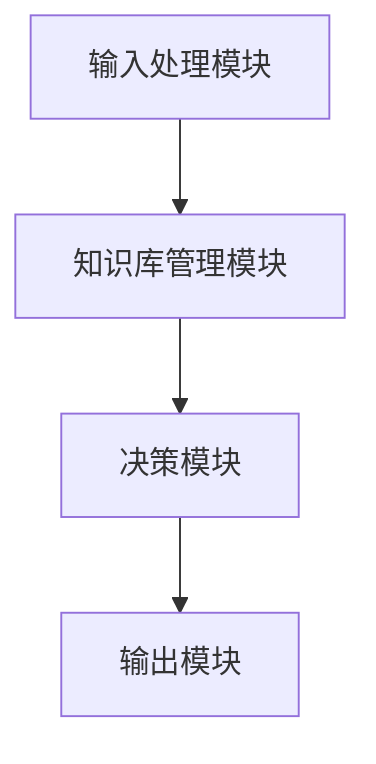
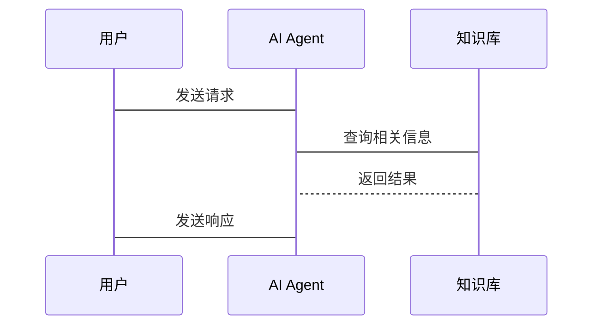

                 


# 构建具有终身学习能力的AI Agent

---

## 关键词：AI Agent，终身学习，机器学习，深度学习，知识图谱，自然语言处理，强化学习

---

## 摘要：  
本文详细探讨了如何构建具有终身学习能力的AI Agent。文章从AI Agent的基本概念出发，分析了终身学习的必要性，并介绍了相关的核心技术，包括机器学习、深度学习、知识图谱和自然语言处理。通过详细讲解元学习（Meta-Learning）和自适应策略网络，本文揭示了终身学习的算法实现机制。接着，文章从系统架构设计的角度，探讨了如何构建支持终身学习的AI Agent系统，并通过实际案例展示了项目的实现过程。最后，本文总结了构建终身学习AI Agent的关键点，并展望了未来的发展方向。

---

## 第一部分: 背景与概念基础

---

### 第1章: AI Agent与终身学习概述

#### 1.1 AI Agent的基本概念

**1.1.1 AI Agent的定义**  
AI Agent（人工智能代理）是指能够感知环境、自主决策并执行任务的智能系统。AI Agent可以是软件程序、机器人或其他智能设备，其核心目标是通过与环境交互，完成特定任务或提供服务。

**1.1.2 AI Agent的核心特征**  
AI Agent具有以下核心特征：  
1. **自主性**：能够在没有外部干预的情况下自主决策。  
2. **反应性**：能够实时感知环境并做出反应。  
3. **目标导向性**：基于目标驱动行为。  
4. **学习能力**：能够通过经验改进性能。  

**1.1.3 终身学习的定义**  
终身学习是指AI Agent在运行过程中，能够持续从新的数据和经验中学习，不断优化自身模型和策略，以适应动态变化的环境。

---

#### 1.2 终身学习的必要性

**1.2.1 AI Agent面临的动态环境挑战**  
现实世界是一个动态变化的环境，AI Agent需要处理不断变化的任务和数据，这要求AI Agent具备持续学习的能力。

**1.2.2 终身学习在AI Agent中的作用**  
终身学习使AI Agent能够适应新任务、新数据和新环境，保持其性能和竞争力。

**1.2.3 人类与AI Agent的协作模式**  
通过终身学习，AI Agent可以更好地与人类协作，共同完成复杂任务，提升人类工作效率和生活质量。

---

### 第2章: AI Agent的核心技术基础

#### 2.1 机器学习与深度学习  
机器学习是AI Agent的核心技术之一，通过监督学习、无监督学习和强化学习等方法，AI Agent能够从数据中学习模式和规律。深度学习，特别是神经网络技术，为AI Agent提供了强大的特征提取和模式识别能力。

#### 2.2 自然语言处理  
自然语言处理（NLP）技术使AI Agent能够理解和生成人类语言，从而实现与人类的自然交互。

#### 2.3 知识图谱与推理  
知识图谱为AI Agent提供了结构化的知识表示，使其能够进行推理和逻辑推理，从而做出更智能的决策。

#### 2.4 强化学习与决策  
强化学习使AI Agent能够在动态环境中通过试错和奖励机制优化决策策略，提升其在复杂任务中的表现。

---

## 第二部分: 核心概念与算法原理

---

### 第3章: 终身学习的核心机制

#### 3.1 元学习（Meta-Learning）

**3.1.1 Meta-Learning的定义与原理**  
元学习是一种学习方法，旨在使模型能够快速适应新的任务或数据。其核心思想是通过学习如何学习，从而提高模型的泛化能力。

**3.1.2 Meta-Learning的数学模型**  
元学习的数学模型通常涉及元损失函数和任务损失函数。元损失函数用于优化模型的元参数，任务损失函数用于优化模型在具体任务上的表现。

**3.1.3 Meta-Learning的实现框架**  
元学习的实现框架通常包括元训练阶段和任务训练阶段。在元训练阶段，模型学习如何调整参数以适应新任务；在任务训练阶段，模型利用元学习得到的能力快速适应新任务。

**3.1.4 Meta-Learning的数学公式**  
$$ L_{\text{meta}} = \sum_{i=1}^{N} L_i(\theta_{i+1}) $$
其中，$\theta_{i+1}$ 是根据 $\theta_i$ 调整后的参数。

**3.1.5 Meta-Learning的优缺点**  
优点：能够快速适应新任务，减少对大量数据的依赖。  
缺点：计算复杂度较高，需要设计合适的元学习框架。

---

#### 3.2 自适应策略网络

**3.2.1 自适应策略的定义**  
自适应策略是指AI Agent能够根据环境变化动态调整其决策策略。

**3.2.2 策略网络的更新机制**  
策略网络的更新机制包括基于梯度的更新和基于强化学习的更新。策略网络的更新目标是最大化累积奖励。

**3.2.3 自适应策略的数学表达**  
$$ \pi_{\theta}(a|s) = \text{softmax}(\theta s) $$
其中，$\theta$ 是策略网络的参数，$s$ 是当前状态，$a$ 是动作。

---

### 第4章: 知识表示与更新机制

#### 4.1 知识图谱的构建

**4.1.1 知识图谱的定义**  
知识图谱是一种结构化的知识表示形式，由实体和关系组成，能够表示复杂的语义信息。

**4.1.2 知识图谱的构建方法**  
知识图谱的构建方法包括手动构建、半自动构建和自动构建。自动构建方法通常利用自然语言处理技术从文本中提取实体和关系。

**4.1.3 知识图谱的更新算法**  
知识图谱的更新算法包括基于规则的更新和基于学习的更新。基于学习的更新方法利用机器学习技术预测新的实体和关系。

**4.1.4 知识图谱的数学表达**  
$$ (e_1, r, e_2) $$
其中，$e_1$ 和 $e_2$ 是实体，$r$ 是关系。

---

#### 4.2 知识表示的学习

**4.2.1 知识表示的向量空间模型**  
向量空间模型将实体和关系表示为向量，通过向量运算进行推理。

**4.2.2 知识表示的图结构模型**  
图结构模型将知识图谱表示为图，通过图神经网络进行推理。

**4.2.3 知识表示的更新策略**  
知识表示的更新策略包括增量式更新和批量更新。增量式更新适合动态环境，批量更新适合静态环境。

---

### 第5章: 终身学习的算法实现

#### 5.1 算法原理

**5.1.1 终身学习的数学模型**  
$$ L_{\text{total}} = \lambda L_{\text{meta}} + (1-\lambda)L_{\text{task}} $$
其中，$\lambda$ 是平衡参数，$L_{\text{meta}}$ 是元损失，$L_{\text{task}}$ 是任务损失。

**5.1.2 算法的收敛性分析**  
终身学习算法的收敛性分析通常涉及优化理论和泛化能力的分析。

**5.1.3 算法的复杂度分析**  
算法的复杂度分析包括时间复杂度和空间复杂度的分析。

---

#### 5.2 算法实现

**5.2.1 算法的伪代码实现**

```python
def meta_train():
    for meta_epoch in range(num_meta_epochs):
        for task in tasks:
            theta = optimize(theta, task_loss, learning_rate)
```

**5.2.2 算法的Python实现**

```python
import torch

class MetaLearner:
    def __init__(self, model):
        self.model = model
        self.optimizer = torch.optim.Adam(model.parameters())

    def meta_step(self, task_loss, learning_rate):
        loss = task_loss
        self.optimizer.zero_grad()
        loss.backward()
        self.optimizer.step(learning_rate)
```

---

## 第三部分: 系统分析与架构设计

---

### 第6章: 终身学习AI Agent的系统架构

#### 6.1 系统功能设计

**6.1.1 输入处理模块**  
输入处理模块负责接收用户输入并解析请求。

**6.1.2 知识库管理模块**  
知识库管理模块负责维护和更新知识图谱。

**6.1.3 决策模块**  
决策模块基于当前状态和知识库信息生成决策策略。

**6.1.4 输出模块**  
输出模块将决策结果输出给用户。

---

#### 6.2 系统架构图



---

#### 6.3 接口设计

**6.3.1 知识库接口**  
知识库接口定义了与知识库交互的API，包括查询和更新操作。

**6.3.2 决策接口**  
决策接口定义了与决策模块交互的API，包括请求处理和决策结果返回。

---

#### 6.4 交互流程图



---

### 第7章: 终身学习AI Agent的实现方案

#### 7.1 系统实现方案

**7.1.1 模块划分**  
系统划分为输入处理模块、知识库管理模块、决策模块和输出模块。

**7.1.2 模块实现细节**  
输入处理模块实现请求解析，知识库管理模块实现知识图谱的构建和更新，决策模块实现基于知识图谱的推理和决策。

---

#### 7.2 优化策略

**7.2.1 知识更新策略**  
知识更新策略包括定期更新和按需更新，以确保知识库的准确性和及时性。

**7.2.2 决策优化策略**  
决策优化策略包括基于强化学习的策略优化和基于元学习的任务适应优化。

---

### 第8章: 项目实战

#### 8.1 项目实现

**8.1.1 环境配置**  
项目需要Python 3.8及以上版本，安装PyTorch和Transformers库。

**8.1.2 核心代码实现**  
以下是终身学习AI Agent的核心代码实现：

```python
import torch
from transformers import AutoTokenizer, AutoModelForSeq2Seq

class LLMAgent:
    def __init__(self):
        self.tokenizer = AutoTokenizer.from_pretrained("facebook/palm")
        self.model = AutoModelForSeq2Seq.from_pretrained("facebook/palm")

    def generate_response(self, input_text):
        inputs = self.tokenizer(input_text, return_tensors="pt")
        outputs = self.model.generate(inputs.input_ids, max_length=50)
        return self.tokenizer.decode(outputs[0], skip_special_tokens=True)
```

---

## 第五部分: 总结与展望

---

### 5.1 总结

本文详细探讨了构建具有终身学习能力的AI Agent的关键技术，包括AI Agent的基本概念、终身学习的核心机制、知识表示与更新方法，以及系统的实现方案。通过实际案例展示了如何实现具有终身学习能力的AI Agent。

---

### 5.2 未来展望

未来，终身学习AI Agent的研究将朝着以下方向发展：  
1. 更高效的元学习算法。  
2. 更智能的知识表示方法。  
3. 更强大的多模态学习能力。  
4. 更广泛的应用场景。

---

### 5.3 最佳实践 Tips

1. 在构建终身学习AI Agent时，建议采用模块化设计，便于功能扩展和维护。  
2. 使用现有的开源框架（如Transformers）可以提高开发效率。  
3. 在实际应用中，注意数据安全和隐私保护问题。

---

### 5.4 小结

终身学习AI Agent的构建是一项复杂但充满潜力的技术挑战。通过不断的研究和实践，我们可以让AI Agent具备更强的自主学习和适应能力，为人类社会带来更多的价值。

---

通过本文的详细讲解，读者可以全面了解构建具有终身学习能力的AI Agent的核心技术和实现方法，并能够将其应用于实际项目中。

