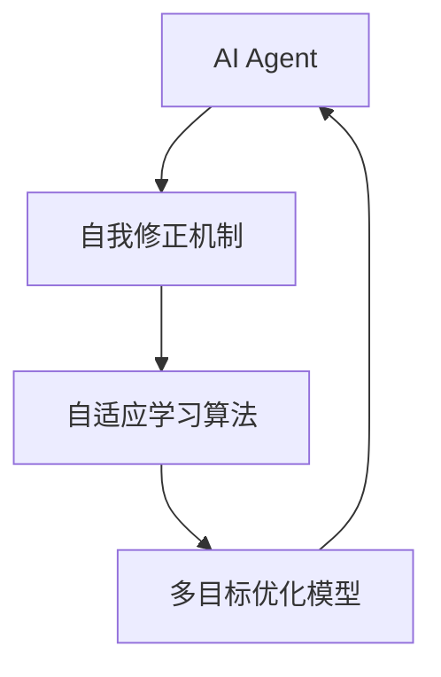
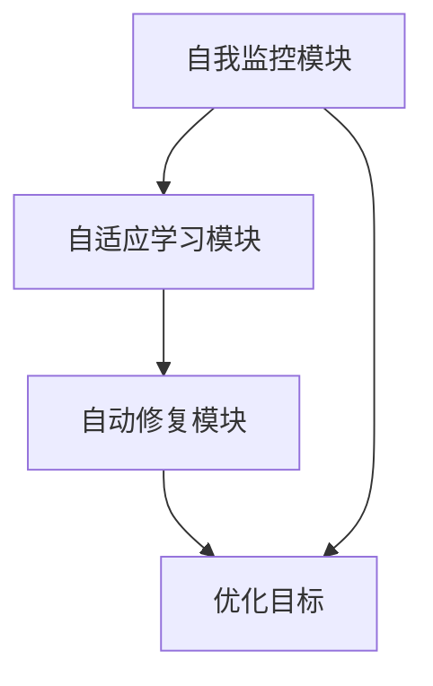
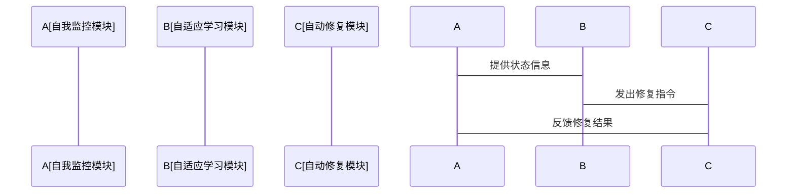

                 


# 《构建具有自我修正能力的AI Agent系统》

## 关键词：AI Agent, 自我修正, 强化学习, 自适应优化, 多目标优化

## 摘要：  
本文系统地探讨了如何构建一个具有自我修正能力的AI Agent系统。通过分析AI Agent的基本概念、自我修正机制的原理与实现、相关算法的数学模型与优化策略，结合实际项目案例，为读者提供一个从理论到实践的完整指南。本文旨在帮助开发者和研究人员理解如何设计和实现一个能够自我检测、自我修复和自我优化的智能系统。

---

## 目录大纲

### 第一部分: 自我修正AI Agent的背景与核心概念

#### 第1章: AI Agent的基本概念与问题背景

##### 1.1 什么是AI Agent
- 1.1.1 AI Agent的定义与核心特征
  - AI Agent的定义
  - 核心特征：自主性、反应性、目标导向、社会性
- 1.1.2 自我修正能力的必要性
  - 动态环境中的适应性需求
  - 系统错误的自动检测与修复
- 1.1.3 当前AI Agent的局限性
  - 对动态变化的适应不足
  - 系统修复能力的缺失

##### 1.2 自我修正AI Agent的背景与问题描述
- 1.2.1 问题背景：AI Agent的动态环境挑战
  - 环境的不确定性与动态变化
  - 系统错误的累积效应
- 1.2.2 问题描述：系统错误的检测与修复
  - 错误检测的准确性
  - 自动修复的可行性与可靠性
- 1.2.3 自我修正能力的实现目标
  - 实时监测与错误识别
  - 自动修复与优化策略

##### 1.3 自我修正AI Agent的边界与外延
- 1.3.1 自我修正的范围界定
  - 修正范围的限定
  - 边界条件的明确
- 1.3.2 相关概念的对比与区分
  - AI Agent与传统自动化的区别
  - 自我修正与自适应学习的联系
- 1.3.3 系统架构的核心要素
  - 自我监控模块
  - 自适应学习模块
  - 自动修复模块

##### 1.4 本章小结
- 核心概念总结
- 问题解决思路的初步框架

---

### 第二部分: 自我修正AI Agent的核心概念与联系

#### 第2章: 自我修正机制的原理与实现

##### 2.1 自我修正机制的核心原理
- 2.1.1 自我监控与反馈机制
  - 监控模块的功能与实现
  - 反馈机制的作用与优化
- 2.1.2 状态检测与错误识别
  - 状态检测的准确性
  - 错误识别的算法选择
- 2.1.3 自动修复与优化策略
  - 修复策略的多样性
  - 优化策略的有效性

##### 2.2 自适应学习算法的实现
- 2.2.1 基于强化学习的自适应优化
  - 强化学习的基本原理
  - Q-learning算法的实现
  - 算法优化的数学模型
- 2.2.2 基于元学习的快速调整
  - 元学习的定义与优势
  - 快速适应新任务的方法
  - 实验结果与分析
- 2.2.3 分层优化算法的设计
  - 分层优化的基本思想
  - 层次化设计的实现步骤
  - 算法的数学表达

##### 2.3 多目标优化模型的构建
- 2.3.1 多目标优化的核心思想
  - 多目标优化的定义
  - 权衡优化的目标函数
- 2.3.2 模型构建的关键步骤
  - 问题分析与目标设定
  - 模型设计与参数选择
  - 模型训练与评估
- 2.3.3 模型优化的数学表达
  - 多目标优化的数学公式
  - 优化算法的数学推导
  - 示例分析与结果解读

##### 2.4 核心概念关系图（Mermaid流程图）


##### 2.5 本章小结
- 核心概念总结
- 问题解决思路的深化与扩展

---

### 第三部分: 自我修正AI Agent的算法原理

#### 第3章: 强化学习与自适应优化算法

##### 3.1 强化学习的基本原理
- 3.1.1 强化学习的定义与特点
  - 定义与核心要素
  - 环境、动作、奖励的概念
- 3.1.2 Q-learning算法的数学模型
  - Q-learning的数学公式
  - 算法流程与步骤
- 3.1.3 算法实现的代码示例
  - Python代码实现
  - 代码解读与优化建议

##### 3.2 元学习的快速适应策略
- 3.2.1 元学习的定义与优势
  - 定义与基本原理
  - 元学习的优势与应用场景
- 3.2.2 快速适应新任务的方法
  - 任务分解与特征提取
  - 知识迁移与策略调整
- 3.2.3 实验结果与分析
  - 实验设计与数据收集
  - 结果分析与优化建议

##### 3.3 分层优化算法的设计
- 3.3.1 分层优化的基本思想
  - 分层优化的定义与目标
  - 层次化设计的实现思路
- 3.3.2 算法的数学推导
  - 数学公式与优化步骤
  - 示例分析与结果解读
- 3.3.3 代码实现与优化建议
  - Python代码实现
  - 优化建议与性能提升

---

### 第四部分: 自我修正AI Agent的系统架构

#### 第4章: 系统分析与架构设计

##### 4.1 系统问题场景介绍
- 4.1.1 AI Agent的应用场景
  - 典型应用领域与案例
  - 系统环境的动态变化
- 4.1.2 系统问题的描述与分析
  - 错误检测与修复的必要性
  - 系统优化的需求与挑战

##### 4.2 系统功能设计
- 4.2.1 自我监控模块
  - 功能设计与实现步骤
  - 模块之间的交互关系
- 4.2.2 自适应学习模块
  - 功能设计与实现步骤
  - 模块之间的交互关系
- 4.2.3 自动修复模块
  - 功能设计与实现步骤
  - 模块之间的交互关系

##### 4.3 系统架构设计（Mermaid架构图）


##### 4.4 系统接口设计与交互流程
- 4.4.1 系统接口设计
  - 接口定义与实现步骤
  - 接口交互的流程图
- 4.4.2 交互流程图（Mermaid序列图）


---

### 第五部分: 自我修正AI Agent的项目实战

#### 第5章: 项目实战与案例分析

##### 5.1 环境安装与配置
- 5.1.1 系统环境要求
  - 操作系统与依赖项
  - Python版本与库的安装
- 5.1.2 项目初始化与配置
  - 项目结构的搭建
  - 配置文件的编写
- 5.1.3 依赖管理
  - 依赖项的安装与版本控制
  - 虚拟环境的配置与使用

##### 5.2 系统核心实现
- 5.2.1 自我监控模块的实现
  - 代码实现与功能测试
  - 日志记录与状态反馈
- 5.2.2 自适应学习模块的实现
  - 强化学习算法的实现
  - 元学习算法的实现
  - 分层优化算法的实现
- 5.2.3 自动修复模块的实现
  - 修复策略的实现
  - 优化策略的实现
  - 测试与验证

##### 5.3 案例分析与详细解读
- 5.3.1 案例背景与需求分析
  - 案例背景介绍
  - 需求分析与目标设定
- 5.3.2 代码实现与测试
  - 代码实现的详细步骤
  - 测试方法与结果解读
- 5.3.3 系统优化与性能提升
  - 系统优化的思路与方法
  - 性能提升的具体指标
  - 优化结果的对比分析

##### 5.4 项目小结
- 项目总结与经验分享
- 问题解决思路的回顾与反思
- 未来改进的方向与建议

---

### 第六部分: 最佳实践与注意事项

#### 第6章: 最佳实践与注意事项

##### 6.1 最佳实践
- 6.1.1 系统设计中的注意事项
  - 设计原则与常见误区
  - 模块化设计的优势与实现
- 6.1.2 开发过程中的注意事项
  - 开发规范与代码风格
  - 测试与调试的技巧
- 6.1.3 系统部署与维护
  - 部署策略与维护计划
  - 系统监控与问题排查

##### 6.2 小结
- 项目经验的总结
- 问题解决思路的回顾
- 未来研究方向的展望

---

### 第七部分: 拓展阅读与参考资料

#### 第7章: 拓展阅读与参考资料

##### 7.1 相关书籍推荐
- 7.1.1 强化学习领域的经典书籍
  - 《强化学习：理论与算法》
  - 《深度强化学习：从零到实战》
- 7.1.2 自适应优化与多目标优化的推荐书籍
  - 《自适应优化算法》
  - 《多目标优化与应用》

##### 7.2 相关论文推荐
- 7.2.1 强化学习领域的经典论文
  - 策略梯度方法的相关论文
  - Q-learning的改进与创新
- 7.2.2 自我修正AI Agent的最新研究
  - 自适应学习与自我修复的最新进展
  - 多目标优化的最新研究方向

##### 7.3 在线资源与工具
- 7.3.1 开源项目与工具推荐
  - 强化学习框架（如OpenAI Gym）
  - 自适应优化工具（如TensorFlow）
- 7.3.2 技术博客与社区推荐
  - AI领域的技术博客
  - 开源社区与开发者论坛

---

### 附录: 数学公式与代码示例

#### 附录A: 强化学习算法的数学公式

##### A.1 Q-learning算法的数学公式
$$ Q(s, a) = Q(s, a) + \alpha \left( r + \gamma \max Q(s', a') - Q(s, a) \right) $$
其中：
- \( Q(s, a) \) 表示当前状态 \( s \) 下采取动作 \( a \) 的价值
- \( \alpha \) 表示学习率
- \( r \) 表示奖励
- \( \gamma \) 表示折扣因子
- \( Q(s', a') \) 表示下一个状态 \( s' \) 下采取动作 \( a' \) 的最大价值

##### A.2 分层优化算法的数学表达
$$ \min_{\theta} \frac{1}{N}\sum_{i=1}^N L_i(\theta) $$
其中：
- \( L_i(\theta) \) 表示第 \( i \) 个子任务的损失函数
- \( \theta \) 表示模型参数

---

#### 附录B: 代码实现示例

##### B.1 自我监控模块的实现代码
```python
def monitor_system(state):
    # 监控系统状态
    # 返回错误标志
    return error_flag
```

##### B.2 自适应学习模块的实现代码
```python
def adaptive_learning(error_info):
    # 自适应学习算法
    # 返回修复策略
    return repair_strategy
```

##### B.3 自动修复模块的实现代码
```python
def auto_repair(repair_strategy):
    # 自动修复算法
    # 返回修复结果
    return repair_result
```

---

### 结语

通过以上目录，我们可以看到，构建一个具有自我修正能力的AI Agent系统需要从理论到实践的全面考虑，包括系统设计、算法实现、项目实战以及最佳实践等多个方面。希望本文能够为读者提供一个清晰的思路和实用的指导，帮助他们更好地理解和实现自我修正的AI Agent系统。

