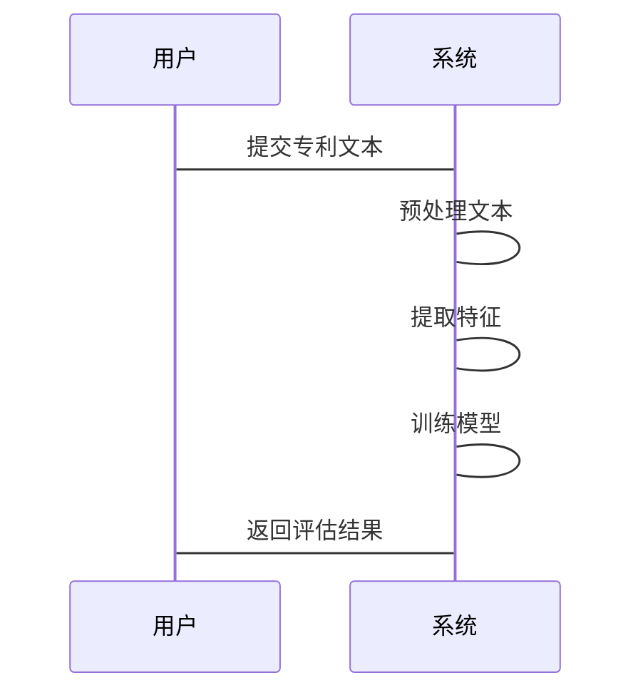

                 


# 构建基于NLP的金融专利价值动态评估系统

> 关键词：自然语言处理（NLP）、专利评估、文本挖掘、机器学习、金融分析

> 摘要：本文详细探讨了如何利用自然语言处理技术构建一个动态评估金融专利价值的系统。通过分析专利文本，提取关键特征，并结合机器学习算法，实现对专利价值的自动化评估。文章从问题背景、系统设计、算法实现、系统架构等多个方面进行深入探讨，并通过实际案例展示了系统的应用与效果。

---

## 第1章: 问题背景与目标

### 1.1 问题背景
在金融领域，专利的价值评估对于企业创新和投资决策至关重要。然而，传统的专利评估方法通常依赖于人工分析，效率低下且主观性强。随着自然语言处理（NLP）技术的快速发展，基于文本分析的专利价值评估系统成为可能。

#### 1.1.1 专利评估的重要性
专利是企业技术创新的核心成果，其价值直接影响企业的市场竞争力和投资回报。准确评估专利价值有助于企业在专利收购、许可和保护等方面做出明智决策。

#### 1.1.2 传统专利评估的局限性
传统的专利评估方法主要依赖专家的经验判断，存在以下问题：
- 人工评估耗时长，成本高。
- 评估结果受主观因素影响，缺乏客观性。
- 难以处理海量专利数据，缺乏系统性。

#### 1.1.3 NLP技术的应用潜力
NLP技术能够从专利文本中提取关键词、识别技术领域、分析技术关联性等，为专利价值评估提供了新的可能性。

### 1.2 问题描述
专利文本分析涉及多个复杂问题：
- **文本复杂性**：专利文本通常包含技术细节、法律术语和专业领域知识，难以直接提取有用信息。
- **动态评估需求**：专利价值会随着时间、市场需求和技术发展而变化，需要动态评估。
- **数据多样性**：专利数据量庞大，格式多样，如何高效处理是关键。

### 1.3 问题解决思路
构建一个基于NLP的金融专利价值动态评估系统，通过以下步骤实现：
1. **文本预处理**：清洗专利文本，提取关键词和实体。
2. **特征提取**：利用NLP技术提取专利的技术特征和法律特征。
3. **价值评估**：结合特征和市场数据，使用机器学习模型预测专利价值。
4. **动态更新**：定期更新模型和数据，保持评估的准确性。

### 1.4 核心概念与联系
以下是核心概念的对比表和实体关系图（ER图）：

#### 核心概念对比表
| 概念 | 描述 | 属性 | 示例 |
|------|------|------|------|
| 专利文本 | 专利申请文件中的文字内容 | 文本长度、关键词、技术领域 | “一种基于区块链的支付系统” |
| 特征提取 | 从文本中提取的有用信息 | TF-IDF值、词向量、技术领域分类 | 关键词“区块链”、向量表示、分类“金融科技” |
| 价值评估 | 对专利价值的量化评估 | 评分（1-10分）、潜在收益预测 | 评分8分，预测收益500万美元 |

#### 实体关系图（ER图）
```mermaid
erDiagram
    patent {
        id
        text
       申请日期
        申请人
    }
    feature {
        id
       名称
        类型
    }
    assessment {
        id
        专利ID
        评分
        时间戳
    }
    patent --|>> feature : 包含
    patent --|>> assessment : 关联
```

---

## 第2章: NLP技术基础

### 2.1 NLP核心原理
NLP技术为专利文本分析提供了强大的工具。

#### 2.1.1 词袋模型与词嵌入
词袋模型将文本表示为单词的集合，忽略了顺序信息。词嵌入（如Word2Vec）则通过上下文关系生成词向量。

#### 2.1.2 神经网络语言模型
如BERT模型，能够理解文本的语义和上下文信息，适合复杂文本分析任务。

#### 2.1.3 注意力机制与Transformer模型
注意力机制通过加权处理不同位置的词，提高模型对重要信息的关注。

### 2.2 常用NLP算法与工具
#### 2.2.1 TF-IDF与文本相似度计算
TF-IDF用于衡量词的重要性，常用于计算文本相似度。

#### 2.2.2 BERT模型及其变体
BERT模型在金融文本分析中表现出色，适合复杂的上下文理解任务。

#### 2.2.3 SpaCy与NLTK工具包
SpaCy和NLTK是常用的NLP工具包，提供文本分词、实体识别等功能。

### 2.3 NLP在金融领域的应用
#### 2.3.1 金融文本分类
如分类金融新闻为 bullish、bearish 等情绪类别。

#### 2.3.2 金融实体识别
识别公司名称、金融产品名称等实体。

#### 2.3.3 金融情感分析
分析文本中的情感倾向，帮助投资决策。

---

## 第3章: 专利文本分析与特征提取

### 3.1 专利文本结构
专利文本包括申请号、申请人信息、技术领域、摘要和权利要求等部分。

### 3.2 专利文本预处理
预处理步骤包括：
1. **分词**：将文本分割成单词或短语。
2. **去除停用词**：删除无意义的词，如“的”、“是”等。
3. **词干提取**：将单词还原为词干，便于统一处理。

### 3.3 专利特征提取
从文本中提取TF-IDF值、技术领域分类、专利相似度等特征。

#### 3.3.1 TF-IDF计算公式
$$ TF-IDF = \frac{TF}{\log(N)+1} $$
其中，TF是词的频率，N是文本总数。

#### 3.3.2 专利相似度计算
使用余弦相似度计算专利之间的相似性：
$$ \text{相似度} = \frac{\sum w_i \cdot w_j}{\sqrt{\sum w_i^2} \cdot \sqrt{\sum w_j^2}} $$

---

## 第4章: 专利价值评估模型

### 4.1 专利价值评估指标
包括技术先进性、市场潜力和法律风险等指标。

### 4.2 基于NLP的评估模型
结合文本特征和市场数据，使用机器学习模型预测专利价值。

#### 4.2.1 文本相似度与技术关联性分析
分析专利之间的技术关联性，预测其市场潜力。

#### 4.2.2 专利引用网络分析
通过专利引用网络，评估专利的技术影响力和被引用次数。

#### 4.2.3 专利生命周期预测
基于历史数据，预测专利的有效期和市场价值变化。

### 4.3 深度学习模型应用
使用BERT模型进行专利分类和价值预测。

---

## 第5章: 系统架构与实现

### 5.1 系统功能模块设计
系统包括文本预处理模块、特征提取模块和价值评估模块。

#### 5.1.1 文本预处理模块
功能：
- 文本清洗
- 分词
- 去除停用词

#### 5.1.2 特征提取模块
功能：
- TF-IDF计算
- 词嵌入生成
- 技术领域分类

#### 5.1.3 价值评估模块
功能：
- 机器学习模型训练
- 专利价值预测
- 结果展示

### 5.2 系统架构设计
采用微服务架构，各模块独立开发和部署。

#### 5.2.1 微服务架构图
```mermaid
serviceDiagram
    service1 [文本预处理]
    service2 [特征提取]
    service3 [价值评估]
    service1 -> service2 : 提供特征
    service2 -> service3 : 提供特征
```

### 5.3 系统接口设计
提供API接口，方便其他系统调用。

#### 5.3.1 API接口定义
- GET /patent/assess?text=...
- 返回格式：JSON

### 5.4 系统交互流程
用户输入专利文本，系统返回评估结果。

#### 5.4.1 交互流程图


---

## 第6章: 项目实战

### 6.1 环境安装
安装Python、TensorFlow、Keras、BERT等库。

### 6.2 核心实现代码
以下是一个简单的TF-IDF实现示例：

```python
from sklearn.feature_extraction.text import TfidfVectorizer

texts = ["专利文本1", "专利文本2", ...]
vectorizer = TfidfVectorizer()
tfidf_matrix = vectorizer.fit_transform(texts)
```

### 6.3 实际案例分析
分析某金融专利的文本，提取特征并预测其价值。

---

## 第7章: 总结与展望

### 7.1 总结
本文详细介绍了基于NLP的金融专利价值动态评估系统的构建过程，从文本预处理到特征提取，再到价值评估，逐一展开。

### 7.2 展望
未来可以进一步优化模型，结合多模态数据（如图像和视频）进行更精准的评估。

### 7.3 注意事项
- 数据隐私问题需谨慎处理。
- 模型需要定期更新，以适应市场变化。

### 7.4 拓展阅读
推荐阅读相关领域的书籍和论文，如《自然语言处理入门》和《机器学习实战》。

---

通过本文的详细讲解，读者可以掌握构建基于NLP的金融专利价值动态评估系统的核心方法和实现步骤，为实际应用提供有力支持。

