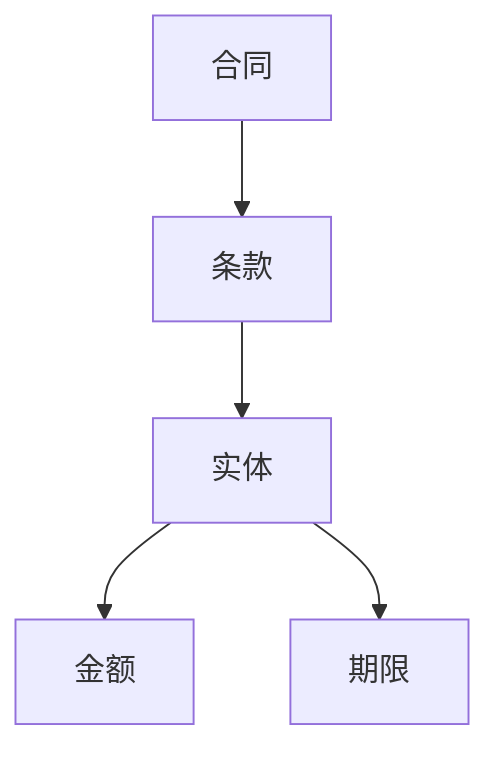
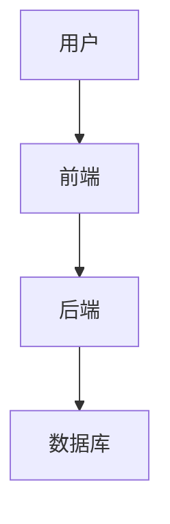
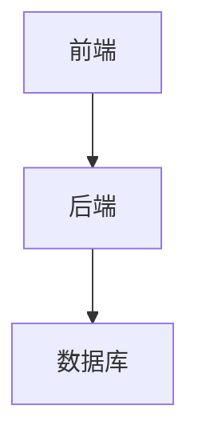
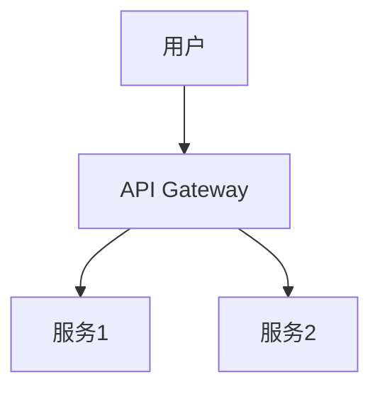
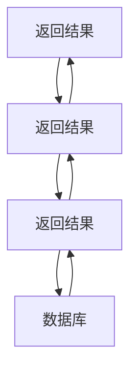

                 


# 构建基于NLP的金融合同条款自动化比对系统

> 关键词：NLP、金融合同、条款比对、文本相似度、序列标注

> 摘要：本文详细介绍了如何利用自然语言处理技术构建一个高效的金融合同条款自动化比对系统。通过分析问题背景、核心概念、算法原理、系统架构设计及项目实战，展示了从理论到实践的完整流程。文章结合实际案例，深入探讨了系统实现的关键技术，为读者提供了宝贵的经验和见解。

---

## 第1章: 问题背景与系统介绍

### 1.1 问题背景

#### 1.1.1 金融合同条款比对的必要性
金融合同是金融机构日常运营中的重要文档，涉及金额、责任、期限等关键条款。由于合同内容复杂且数量庞大，手动比对效率低下且容易出错。自动化比对系统能够显著提高效率，减少人为错误。

#### 1.1.2 传统合同比对方式的局限性
传统合同比对依赖人工逐项对比，耗时且成本高。此外，合同条款可能存在表述模糊或格式不一致的情况，进一步增加了比对的难度。

#### 1.1.3 自动化比对技术的引入
引入自然语言处理（NLP）技术，通过自动化手段提取和比对合同条款，能够显著提高效率和准确性。

### 1.2 系统目标与功能

#### 1.2.1 系统目标
- 准确识别合同中的关键条款。
- 自动比对不同合同版本的条款差异。
- 生成差异报告，辅助用户快速定位问题。

#### 1.2.2 核心功能模块
- 数据预处理：清洗和标准化合同文本。
- 特征提取：识别关键实体和术语。
- 模型训练：基于NLP算法进行相似度计算和分类。
- 结果展示：生成差异报告和可视化界面。

#### 1.2.3 系统边界与外延
- 系统仅处理合同文本内容，不涉及合同的法律解释。
- 支持多种合同格式，如PDF、Word文档。

### 1.3 核心概念与系统架构

#### 1.3.1 NLP技术在合同比对中的应用
- 文本分词：将合同文本分割成词语或短语。
- 实体识别：识别合同中的关键实体，如金额、期限等。
- 文本相似度计算：通过NLP算法计算合同条款的相似度。

#### 1.3.2 系统架构的初步设想
- 分层架构：前端展示结果，后端处理逻辑，数据层存储。
- 微服务架构：各功能模块独立开发和部署。

---

## 第2章: 核心概念与系统联系

### 2.1 NLP与合同比对的原理

#### 2.1.1 NLP的基本概念与技术栈
- 分词：将文本分割成词语，常用工具如jieba。
- 实体识别：识别文本中的实体，如人名、地名、金额。
- 词向量：将词语转换为向量表示，如Word2Vec、GloVe。

#### 2.1.2 合同条款比对的核心原理
- 通过NLP技术提取合同中的关键条款。
- 使用文本相似度算法计算条款之间的差异。

#### 2.1.3 NLP技术在合同比对中的具体应用
- 通过分词和实体识别提取合同中的关键信息。
- 使用文本相似度计算判断条款是否一致。

### 2.2 实体关系与系统架构

#### 2.2.1 实体关系图（ER图）


#### 2.2.2 系统架构图


#### 2.2.3 关键实体之间的关系
- 合同与条款：一对多关系。
- 条款与实体：一对多关系。

---

## 第3章: 算法原理与实现

### 3.1 合同条款比对的算法选择

#### 3.1.1 基于NLP的文本相似度计算
- 使用余弦相似度计算句子相似度。
- 公式：$$\text{similarity} = \frac{\vec{A} \cdot \vec{B}}{|\vec{A}| |\vec{B}|}$$

#### 3.1.2 基于序列标注的合同条款识别
- 使用条件随机场（CRF）进行序列标注。
- 公式：$$P(y|x) = \frac{1}{Z} \exp(\sum_{i=1}^n \theta y_i x_i)$$

#### 3.1.3 算法优缺点分析
- 优点：准确识别关键实体，计算速度快。
- 缺点：需要大量标注数据，模型调优复杂。

### 3.2 算法实现步骤

#### 3.2.1 数据预处理
- 去除停用词。
- 分词和实体识别。

#### 3.2.2 特征提取
- 提取词向量。
- 生成特征向量。

#### 3.2.3 模型训练与优化
- 使用训练数据训练模型。
- 调整模型参数，优化性能。

### 3.3 算法实现代码

#### 3.3.1 数据加载与预处理
```python
import jieba

text = "年利率为百分之五"
words = jieba.lcut(text)
```

#### 3.3.2 特征提取
```python
from gensim.models import Word2Vec

model = Word2Vec([['年', '利率', '为', '百分之', '五']], vector_size=100, window=2, min_count=1, workers=4)
```

#### 3.3.3 模型训练
```python
from sklearn.metrics.pairwise import cosine_similarity

vec1 = model.wv['年利率']
vec2 = model.wv['年利率为']
similarity = cosine_similarity([vec1], [vec2])
```

---

## 第4章: 系统分析与架构设计

### 4.1 系统功能模块设计

#### 4.1.1 数据采集模块
- 从数据库或文件中读取合同文本。
- 支持多种格式，如PDF、Word。

#### 4.1.2 数据处理模块
- 分词和实体识别。
- 特征提取和数据清洗。

#### 4.1.3 模型训练模块
- 训练NLP模型。
- 生成相似度报告。

#### 4.1.4 结果展示模块
- 可视化差异报告。
- 提供交互式界面。

### 4.2 系统架构设计

#### 4.2.1 分层架构设计


#### 4.2.2 微服务架构设计


#### 4.2.3 组件之间的交互关系
- 用户请求由API Gateway分发到相应服务。
- 各服务独立处理请求，后端整合结果返回给前端。

### 4.3 接口设计与交互流程

#### 4.3.1 系统接口设计
- RESTful API：提供数据处理和模型调用接口。

#### 4.3.2 交互流程图


---

## 第5章: 项目实战与代码实现

### 5.1 环境搭建与数据准备

#### 5.1.1 开发环境安装
```bash
pip install jieba gensim scikit-learn
```

#### 5.1.2 数据集获取与预处理
- 下载金融合同样本数据。
- 使用分词和实体识别工具处理数据。

### 5.2 核心代码实现

#### 5.2.1 数据预处理
```python
import jieba

def preprocess(text):
    words = jieba.lcut(text)
    return words
```

#### 5.2.2 特征提取
```python
from gensim.models import Word2Vec

def extract_features(words):
    model = Word2Vec([words], vector_size=100, window=2, min_count=1, workers=4)
    return model.wv[words[0]]
```

#### 5.2.3 模型训练
```python
from sklearn.metrics.pairwise import cosine_similarity

def train_model(texts):
    model = Word2Vec(texts, vector_size=100, window=2, min_count=1, workers=4)
    return model

model = train_model([['年利率', '为', '百分之五']])
```

#### 5.2.4 结果展示
```python
text1 = "年利率为百分之五"
text2 = "年利率为百分之十"
vec1 = model.wv[text1.split()[0]]
vec2 = model.wv[text2.split()[0]]
similarity = cosine_similarity([vec1], [vec2])
print(similarity)
```

### 5.3 项目实战案例分析

#### 5.3.1 案例分析
- 输入合同文本：两份不同版本的金融合同。
- 系统输出差异报告：识别出利率条款不同。

#### 5.3.2 系统优化
- 支持更多合同类型。
- 提高模型准确率。

### 5.4 项目小结

#### 5.4.1 经验总结
- 数据预处理是关键。
- 模型调优需要多次实验。

#### 5.4.2 注意事项
- 注意数据隐私和安全。
- 确保系统可扩展性。

---

## 第6章: 最佳实践与总结

### 6.1 最佳实践

#### 6.1.1 小结
- 本文详细介绍了基于NLP的金融合同条款自动化比对系统的构建过程。

#### 6.1.2 注意事项
- 数据预处理要仔细。
- 模型调优要耐心。

#### 6.1.3 拓展阅读
- 深入学习NLP相关技术。
- 研究其他合同管理系统的实现。

### 6.2 系统优化与扩展

#### 6.2.1 系统优化
- 提高模型准确率。
- 支持更多语言和合同类型。

#### 6.2.2 技术扩展
- 引入深度学习模型，如BERT。
- 使用分布式系统提高处理速度。

### 6.3 总结
通过本文的介绍，读者可以掌握构建基于NLP的金融合同条款自动化比对系统的完整流程。从理论到实践，从算法到系统设计，每一步都至关重要。希望本文能够为读者提供有价值的参考和启发。

---

**本文完**

