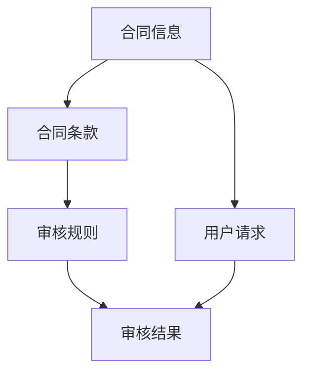
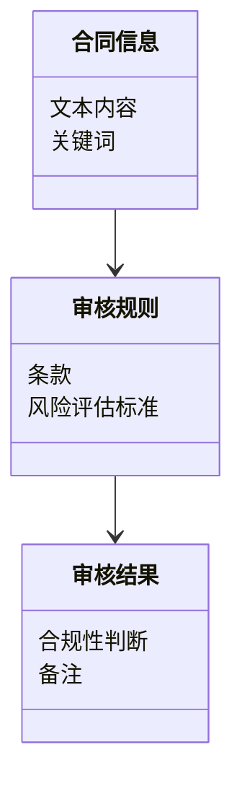
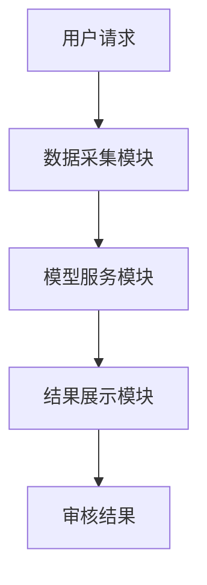

                 


# 构建基于NLP的金融合同自动化审核系统

## 关键词：
- 金融合同审核
- 自然语言处理（NLP）
- 人工智能
- 系统架构
- 项目实战

## 摘要：
本文详细探讨了如何利用自然语言处理技术构建金融合同自动化审核系统。文章从背景介绍出发，分析了传统合同审核的痛点及NLP技术的应用潜力，详细阐述了系统的核心概念、算法原理、系统架构设计，并通过项目实战展示了系统的实现过程。最后，总结了项目的成果及未来的发展方向。

---

# 第一部分: 金融合同自动化审核系统的背景与需求

## 第1章: 问题背景与需求分析

### 1.1 问题背景

#### 1.1.1 传统金融合同审核的痛点
传统金融合同审核过程耗时长、成本高且容易出错，尤其是在处理大量合同文本时，人工审核的效率和准确性难以满足需求。

#### 1.1.2 NLP技术在金融领域的应用潜力
自然语言处理（NLP）技术在文本分析、信息提取等方面具有显著优势，能够有效提高合同审核的效率和准确性。

#### 1.1.3 自动化审核系统的必要性
随着金融业务的复杂化和数字化，构建基于NLP的自动化审核系统成为提升效率和合规性的必然选择。

### 1.2 问题描述

#### 1.2.1 金融合同审核的关键环节
合同审核包括合同条款识别、风险评估、合规性检查等多个环节。

#### 1.2.2 合同审核中的常见问题
合同文本复杂、格式多样、涉及法律术语多，容易导致人工审核的疏漏。

#### 1.2.3 自动化审核的目标与范围
目标是通过NLP技术实现合同文本的自动分析和合规性判断，范围涵盖合同条款识别、风险评估和结果输出。

### 1.3 问题解决与边界

#### 1.3.1 自动化审核的核心问题解决
利用NLP技术提取合同文本中的关键信息，自动判断合同的合规性。

#### 1.3.2 系统的边界与外延
系统仅处理合同文本，不涉及外部数据，审核结果需结合法律专家意见进行最终确认。

#### 1.3.3 核心要素与组成结构
系统的核心要素包括合同文本、审核规则、审核结果，组成结构包括数据采集、模型服务和结果展示。

## 第2章: 核心概念与联系

### 2.1 核心概念原理

#### 2.1.1 NLP技术的基本原理
NLP技术包括文本分词、词性标注、句法分析和语义理解等基础步骤。

#### 2.1.2 金融合同审核的关键要素
合同审核涉及合同条款识别、风险评估和合规性检查。

#### 2.1.3 自动化审核系统的整体架构
系统由数据采集模块、模型服务模块和结果展示模块组成，各模块协同工作以实现自动化审核。

### 2.2 核心概念属性对比

| 特性         | 传统审核方式       | 自动化审核系统     |
|--------------|--------------------|-------------------|
| 效率         | 低                 | 高                 |
| 准确性       | 易出错             | 高                 |
| 成本         | 高                 | 低                 |
| 适用场景     | 单一               | 多样化             |

### 2.3 ER实体关系图



---

# 第二部分: 基于NLP的金融合同审核算法原理

## 第3章: 算法原理与流程

### 3.1 算法流程

#### 3.1.1 数据预处理
文本清洗、分词、去除停用词。

#### 3.1.2 模型训练
选择合适的NLP模型（如BERT）进行训练，调整超参数以提高准确率。

#### 3.1.3 结果输出
生成审核结果并提供解释，输出最终的合规性判断。

### 3.2 算法实现

#### 3.2.1 文本分词
使用jieba库对合同文本进行分词，提取关键词和短语。

#### 3.2.2 意图识别
利用深度学习模型识别合同中的关键意图，如条款识别和风险评估。

#### 3.2.3 关键词提取
使用TF-IDF方法提取合同文本中的重要关键词，辅助审核过程。

### 3.3 算法优化

#### 3.3.1 模型调优
通过交叉验证调整模型参数，优化分类器的性能。

#### 3.3.2 数据增强
增加多样化的训练数据，提高模型的泛化能力。

#### 3.3.3 性能优化
优化代码结构，减少计算时间，提高系统的运行效率。

### 3.4 数学模型与公式

#### 3.4.1 损失函数
交叉熵损失函数：
$$L = -\sum_{i=1}^{n} [y_i \log p_i + (1 - y_i) \log (1 - p_i)]$$

#### 3.4.2 优化器
Adam优化器：
$$\theta = \theta - \eta \frac{\partial L}{\partial \theta}$$

#### 3.4.3 评估指标
准确率：
$$Accuracy = \frac{TP + TN}{TP + TN + FP + FN}$$

---

# 第四部分: 系统分析与架构设计

## 第4章: 系统分析与架构设计

### 4.1 系统功能设计

#### 4.1.1 领域模型
使用Mermaid绘制领域模型类图，展示合同信息管理、审核规则管理、审核结果管理的关系。



### 4.2 系统架构设计

#### 4.2.1 系统架构图
使用Mermaid绘制系统架构图，展示模块划分和交互流程。



### 4.3 系统接口设计

#### 4.3.1 API接口定义
RESTful API接口，提供合同文本提交、审核结果查询等服务。

#### 4.3.2 接口交互流程
用户提交合同文本，系统处理后返回审核结果。

---

# 第五部分: 项目实战

## 第5章: 项目实战

### 5.1 环境安装

#### 5.1.1 安装Python
```bash
python --version
```

#### 5.1.2 安装相关库
```bash
pip install tensorflow keras jieba
```

### 5.2 核心代码实现

#### 5.2.1 数据预处理代码
```python
import jieba

text = "根据合同条款，双方需在30天内完成交付。"
words = jieba.lcut(text)
print(words)
```

#### 5.2.2 模型训练代码
```python
from tensorflow.keras import models
from tensorflow.keras import layers

model = models.Sequential()
model.add(layers.Dense(64, activation='relu', input_shape=(100,)))
model.add(layers.Dense(1, activation='sigmoid'))
model.compile(optimizer='adam', loss='binary_crossentropy', metrics=['accuracy'])
model.fit(X_train, y_train, epochs=10, batch_size=32)
```

#### 5.2.3 结果输出代码
```python
import numpy as np

predictions = model.predict(X_test)
print("预测结果:", predictions)
```

### 5.3 实际案例分析
分析一个具体的金融合同，展示系统如何提取关键词、识别条款并输出审核结果。

### 5.4 小结
总结项目实现过程中的关键点，强调NLP技术在金融合同审核中的应用价值。

---

# 第六部分: 总结与扩展

## 第6章: 总结与扩展

### 6.1 总结
回顾全文，强调NLP技术在金融合同审核中的应用价值。

### 6.2 扩展阅读
推荐相关书籍、论文和工具，供读者深入学习。

### 6.3 注意事项
提醒读者在实际应用中注意数据隐私、模型泛化能力等问题。

---

通过以上目录和内容的详细展开，构建了一个完整的基于NLP的金融合同自动化审核系统的框架，涵盖了从背景介绍到项目实战的各个方面，确保文章内容丰富、逻辑清晰。

