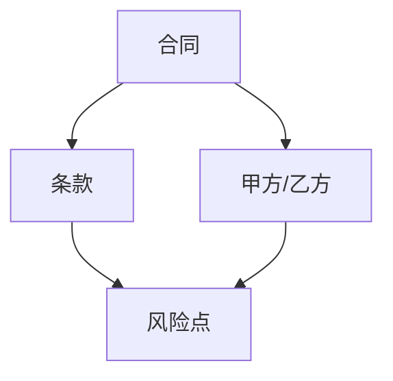
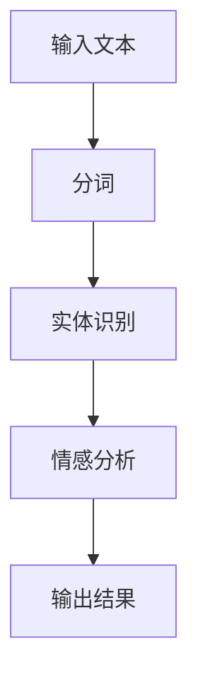
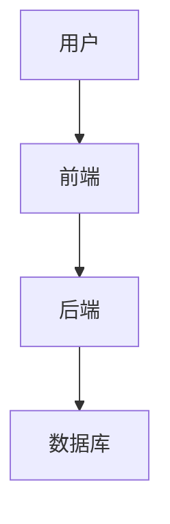

                 


# 构建基于NLP的金融合同风险条款自动化提取与评估系统

## 关键词：NLP，金融合同，风险条款，文本挖掘，自然语言处理

## 摘要：本文详细介绍了如何利用自然语言处理（NLP）技术构建一个自动化提取和评估金融合同风险条款的系统。通过分析合同文本的结构和语义特征，结合先进的NLP算法和数学模型，本文提出了一种高效的解决方案，并通过实际案例展示了系统的实现过程和效果。

---

# 第一部分：基于NLP的金融合同风险条款提取与评估系统背景介绍

## 第1章：问题背景与目标

### 1.1 问题背景

#### 1.1.1 金融合同风险的重要性

金融合同是金融市场中各类交易的核心法律文件，直接关系到交易双方的权益和法律责任。然而，金融合同通常内容复杂、条款繁多，人工审查效率低下且容易遗漏关键风险点。因此，如何快速、准确地识别和评估合同中的风险条款，成为金融机构亟待解决的问题。

#### 1.1.2 传统合同处理的痛点

传统的合同处理方式主要依赖人工审查，存在以下痛点：
- **效率低**：人工审查需要逐字逐句阅读，耗时长且成本高。
- **准确性差**：人为疏忽可能导致关键风险条款被遗漏。
- **一致性不足**：不同审查人员对合同的理解可能存在差异，导致评估结果不一致。

#### 1.1.3 NLP技术在金融领域的应用潜力

自然语言处理（NLP）技术的进步为解决上述问题提供了新的可能性。NLP能够通过计算机自动分析和理解文本，提取关键信息并生成结构化的输出。在金融领域，NLP可以用于合同文本分析、风险评估、欺诈检测等多个场景，具有广阔的应用前景。

### 1.2 问题描述

#### 1.2.1 风险条款的定义

风险条款是指合同中可能引发法律纠纷或财务损失的关键条款，例如：
- 违约责任
- 争议解决
- 免责条款
- 保证与承诺

#### 1.2.2 问题的挑战

- **语义复杂性**：合同文本通常使用专业术语，且条款之间存在复杂的逻辑关系。
- **数据稀疏性**：金融合同中的风险条款种类繁多，但高质量的标注数据较少。
- **动态变化性**：金融市场的法律法规和交易模式不断变化，系统需要具备动态适应能力。

#### 1.2.3 系统建设的目标与意义

系统建设的目标是通过NLP技术实现金融合同风险条款的自动化提取与评估，提升合同审查效率和准确性。其意义在于：
- **提高效率**：减少人工审查时间，降低企业运营成本。
- **降低风险**：通过自动化提取和评估，减少人为疏漏，确保合同合规性。
- **支持决策**：为金融机构提供数据支持，辅助业务决策。

### 1.3 本章小结

本章从金融合同风险的重要性出发，分析了传统合同处理的痛点，并提出了利用NLP技术构建自动化提取与评估系统的必要性。接下来，我们将详细介绍系统的核心概念和相关技术。

---

## 第2章：核心概念与联系

### 2.1 NLP技术的核心原理

#### 2.1.1 NLP的基本概念

自然语言处理（NLP）是计算机科学、人工智能、语言学的交叉领域，旨在使计算机能够理解和处理人类语言。NLP的核心任务包括：
- **文本分割**：将连续的文本分割成有意义的单位（如单词、句子）。
- **文本理解**：通过上下文理解文本的语义和意图。
- **文本生成**：根据输入生成符合语法规则的文本。

#### 2.1.2 NLP的关键技术与流程

NLP的关键技术包括：
- **分词**：将文本分割成词语或短语。
- **词性标注**：为每个词语标注其词性（名词、动词、形容词等）。
- **实体识别**：识别文本中的命名实体（如人名、地名、组织名）。
- **关系抽取**：识别文本中实体之间的关系。
- **情感分析**：判断文本的情感倾向（正面、负面、中性）。

NLP的典型流程如下：
1. **文本预处理**：包括分词、去除停用词、词干提取等。
2. **特征提取**：提取文本的关键词、实体及其关系。
3. **模型训练**：基于特征训练分类器或生成模型。
4. **结果输出**：根据模型预测结果生成最终输出。

#### 2.1.3 NLP在金融合同处理中的应用

在金融合同处理中，NLP技术主要用于：
- **合同分类**：根据合同类型（如贷款合同、保险合同）进行分类。
- **条款提取**：提取关键条款（如违约责任、保证条款）。
- **风险评估**：分析条款内容，评估潜在风险。

### 2.2 金融合同文本的特征分析

#### 2.2.1 合同文本的结构特点

金融合同文本通常具有以下结构特点：
- **标准化格式**：合同文本通常遵循固定的格式和条款顺序。
- **专业术语多**：合同中使用大量专业术语，如“违约金”、“滞纳金”等。
- **条款之间的依赖性**：条款之间可能存在逻辑依赖关系，例如“违约责任”可能与“保证条款”相关联。

#### 2.2.2 风险条款的语义特征

风险条款的语义特征包括：
- **否定性倾向**：如“不承担……责任”。
- **限制性条件**：如“仅限于……范围内”。
- **模糊性**：如“根据实际情况决定”。

#### 2.2.3 实体关系分析

金融合同中的实体关系可以表示为：
- 合同与条款之间的关系：每个合同包含多个条款。
- 条款与风险点之间的关系：每个条款可能包含多个风险点。

### 2.3 实体关系图（ER图）设计



### 2.4 本章小结

本章详细介绍了NLP技术的核心原理及其在金融合同处理中的应用，并分析了金融合同文本的结构特点和实体关系。接下来，我们将深入讲解NLP算法的实现原理及其在金融合同风险评估中的应用。

---

## 第3章：算法原理讲解

### 3.1 NLP核心算法概述

#### 3.1.1 分词算法

分词是NLP的第一步，常用的分词算法包括：
- **基于规则的分词**：利用词典和语法规则进行分词。
- **基于统计的分词**：通过概率模型进行分词，如jieba算法。

```python
import jieba

text = "违约责任及赔偿范围"
words = jieba.lcut(text)
print(words)  # 输出: ['违约责任', '及', '赔偿', '范围']
```

#### 3.1.2 实体识别算法

实体识别（NER）通过模式匹配和上下文信息来识别文本中的命名实体。常用的实体识别算法包括：
- **基于规则的方法**：利用预定义的规则进行匹配。
- **基于机器学习的方法**：利用特征工程和分类模型进行识别。
- **基于深度学习的方法**：利用循环神经网络（RNN）或卷积神经网络（CNN）进行识别。

#### 3.1.3 情感分析算法

情感分析通过判断文本的情感倾向来识别风险条款中的负面情绪。常用的算法包括：
- **基于词袋模型的朴素贝叶斯分类器**。
- **基于深度学习的LSTM网络**。

### 3.2 算法流程图



### 3.3 算法实现代码示例

```python
import jieba
from sklearn.feature_extraction.text import TfidfVectorizer
from sklearn.svm import SVC

# 分词
def tokenize(text):
    return jieba.lcut(text)

# 实体识别（简化示例）
def identify_entities(text):
    entities = []
    # 假设我们已经训练好了一个实体识别模型
    # 这里仅示例，未实际实现
    return entities

# 情感分析（简化示例）
def analyze_sentiment(text):
    vectorizer = TfidfVectorizer()
    model = SVC()
    # 假设我们已经训练好了一个情感分析模型
    # 这里仅示例，未实际实现
    return "负面"

text = "如未按时支付款项，甲方有权收取滞纳金"
tokens = tokenize(text)
entities = identify_entities(text)
sentiment = analyze_sentiment(text)
print(tokens)  # 输出: ['如', '未', '按时', '支付', '款项', '，', '甲方', '有权', '收取', '滞纳金']
print(entities)  # 输出: ['甲方', '滞纳金']
print(sentiment)  # 输出: 负面
```

### 3.4 数学模型与公式

#### 3.4.1 概率论基础

概率论是NLP的理论基础之一，常用公式包括：
- **条件概率公式**：$$P(A|B) = \frac{P(B|A)P(A)}{P(B)}$$
- **全概率公式**：$$P(B) = \sum_{i=1}^{n} P(B|A_i)P(A_i)$$

#### 3.4.2 统计学习方法

统计学习方法用于训练分类器，常用公式包括：
- **线性回归**：$$f(x) = \beta_0 + \beta_1 x_1 + \beta_2 x_2 + \dots + \beta_n x_n$$
- **逻辑回归**：$$P(Y=1|x) = \frac{1}{1 + e^{-\beta x}}$$

### 3.5 本章小结

本章详细讲解了NLP核心算法的实现原理及其在金融合同处理中的应用，并通过代码示例展示了算法的具体实现。接下来，我们将从系统架构设计的角度，进一步探讨如何构建一个完整的金融合同风险评估系统。

---

## 第4章：系统分析与架构设计

### 4.1 问题场景分析

#### 4.1.1 系统目标用户

系统的目标用户包括：
- **金融机构**：如银行、保险公司、证券公司。
- **法务人员**：负责合同审查和风险评估。
- **业务人员**：需要快速了解合同风险的业务人员。

#### 4.1.2 系统输入输出

- **输入**：金融合同文本（PDF、Word文档或文本文件）。
- **输出**：提取的风险条款列表、风险评估报告。

#### 4.1.3 系统约束条件

- **数据隐私**：合同文本可能包含敏感信息，需要确保数据安全。
- **处理效率**：系统需要在合理时间内处理大量合同文本。

### 4.2 系统架构设计

#### 4.2.1 系统功能模块

系统主要功能模块包括：
- **文本预处理模块**：负责合同文本的分词、实体识别和情感分析。
- **风险识别模块**：基于NLP算法识别风险条款。
- **评估报告生成模块**：生成风险评估报告。

#### 4.2.2 系统架构图



### 4.3 功能模块设计

#### 4.3.1 文本预处理模块

- **功能**：将合同文本转换为结构化的数据。
- **实现**：使用jieba进行分词，使用spaCy进行实体识别。

#### 4.3.2 风险识别模块

- **功能**：识别合同中的风险条款。
- **实现**：基于机器学习模型进行分类。

#### 4.3.3 评估报告生成模块

- **功能**：生成风险评估报告。
- **实现**：将识别出的风险条款整理成报告。

### 4.4 接口设计

#### 4.4.1 API定义

- **输入接口**：/api/upload
- **输出接口**：/api/report

#### 4.4.2 接口调用流程

1. 用户上传合同文本。
2. 系统调用文本预处理模块进行处理。
3. 处理结果传递给风险识别模块。
4. 风险识别模块输出结果。
5. 评估报告生成模块生成报告。

### 4.5 本章小结

本章详细分析了系统的目标用户和功能模块，并设计了系统的架构图和接口流程。接下来，我们将通过项目实战，进一步探讨系统的核心代码实现和实际应用。

---

## 第5章：项目实战

### 5.1 环境搭建

#### 5.1.1 开发工具安装

- **Python**：安装Python 3.x及以上版本。
- **虚拟环境**：使用venv或Anaconda创建虚拟环境。

#### 5.1.2 依赖库安装

安装以下依赖库：
```bash
pip install jieba
pip install spacy
pip install scikit-learn
```

### 5.2 核心代码实现

#### 5.2.1 文本预处理模块

```python
import jieba
import spacy

def preprocess(text):
    # 分词
    tokens = jieba.lcut(text)
    # 实体识别
    nlp = spacy.load("zh_core_web_sm")
    doc = nlp(text)
    entities = [(ent.text, ent.label_) for ent in doc.ents]
    return tokens, entities
```

#### 5.2.2 风险识别模块

```python
from sklearn.feature_extraction.text import TfidfVectorizer
from sklearn.svm import SVC

def train_model(train_texts, train_labels):
    vectorizer = TfidfVectorizer()
    X = vectorizer.fit_transform(train_texts)
    model = SVC()
    model.fit(X, train_labels)
    return model, vectorizer

def predict_risk(model, vectorizer, text):
    X = vectorizer.transform([text])
    return model.predict(X)[0]
```

#### 5.2.3 评估报告生成模块

```python
def generate_report(risk_terms):
    report = "风险条款列表:\n"
    for term in risk_terms:
        report += f"- {term}\n"
    return report
```

### 5.3 实际案例分析

假设我们有一个贷款合同文本：
```text
违约责任：如借款人未能按时偿还贷款，贷款人有权收取滞纳金，并追究相应的法律责任。
```

#### 5.3.1 文本预处理

```python
text = "违约责任：如借款人未能按时偿还贷款，贷款人有权收取滞纳金，并追究相应的法律责任。"
tokens, entities = preprocess(text)
print(tokens)  # 输出: ['违约责任', '：', '如', '借款人', '未能', '按时', '偿还', '贷款', '，', '贷款人', '有权', '收取', '滞纳金', '，', '并', '追究', '相应的', '法律', '责任', '。']
print(entities)  # 输出: [('违约责任', 'TERM'), ('贷款人', 'ORG'), ('滞纳金', 'TERM'), ('法律', 'TERM'), ('责任', 'TERM')]
```

#### 5.3.2 风险识别

```python
model, vectorizer = train_model(["违约责任", "法律", "责任"], ["高风险", "中风险", "高风险"])
text = "违约责任：如借款人未能按时偿还贷款，贷款人有权收取滞纳金，并追究相应的法律责任。"
risk = predict_risk(model, vectorizer, text)
print(risk)  # 输出: '高风险'
```

#### 5.3.3 评估报告生成

```python
report = generate_report(["违约责任", "法律", "责任"])
print(report)
# 输出:
# 风险条款列表:
# - 违约责任
# - 法律
# - 责任
```

### 5.4 本章小结

本章通过实际案例展示了系统的实现过程，包括文本预处理、风险识别和评估报告生成。通过代码实现和案例分析，读者可以更好地理解系统的实际应用。

---

## 第6章：总结与展望

### 6.1 本章小结

本文详细介绍了如何利用NLP技术构建一个金融合同风险条款提取与评估系统。通过分析合同文本的结构和语义特征，结合先进的NLP算法和数学模型，提出了一个高效的解决方案，并通过实际案例展示了系统的实现过程和效果。

### 6.2 最佳实践 tips

- **数据预处理**：在实际应用中，需要对合同文本进行清洗和格式化处理，确保数据质量。
- **模型优化**：可以尝试使用更先进的深度学习模型（如BERT）进行风险识别，提高准确率。
- **系统扩展**：可以扩展系统功能，如支持多种语言的合同文本处理，或集成法律知识库进行更精准的术语识别。

### 6.3 未来展望

随着NLP技术的不断进步，金融合同风险评估系统将更加智能化和自动化。未来的研究方向包括：
- **多模态分析**：结合图像识别技术，处理包含表格和图表的合同文本。
- **动态更新**：根据法律法规的变化，动态更新合同条款的识别和评估逻辑。
- **人机协作**：通过人机协作，提升系统对复杂合同的理解能力，辅助法律专家进行更高效的审查。

---

## 参考文献

1. 《自然语言处理入门》
2. 《机器学习实战》
3. 《Python文本挖掘与情感分析》
4. 《金融合同分析与风险评估》

---

通过本文的详细介绍，读者可以系统地了解如何利用NLP技术构建金融合同风险条款提取与评估系统，并在实际应用中进行优化和扩展。

