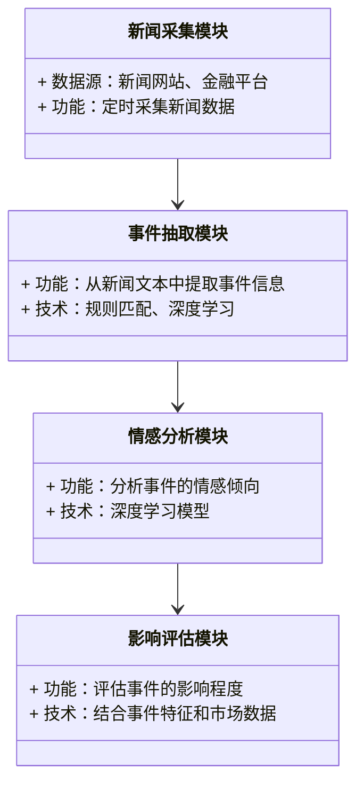
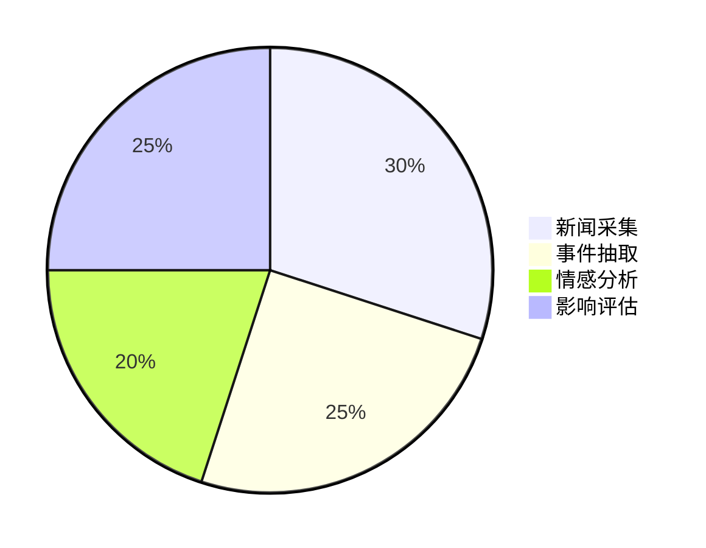
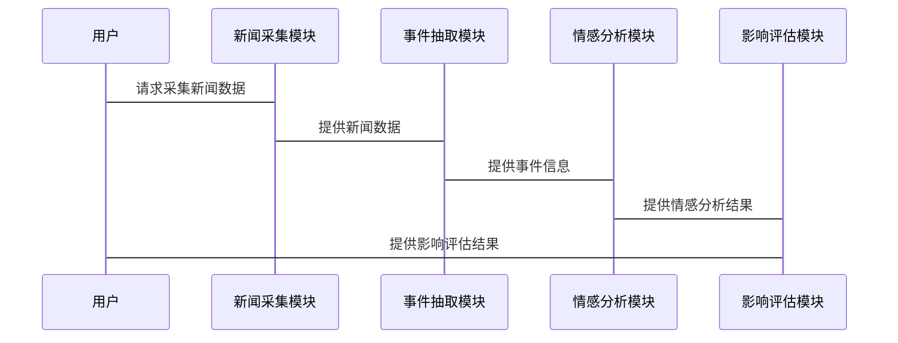

                 


# 构建基于NLP的金融新闻事件影响评估系统

## 关键词：自然语言处理、金融新闻、事件影响评估、深度学习、文本挖掘

## 摘要：本文详细探讨了如何利用自然语言处理技术构建一个能够评估金融新闻事件影响的系统。文章从问题背景出发，介绍了系统的目标与功能，分析了NLP在金融领域的应用，详细讲解了事件抽取、情感分析等核心算法，以及基于深度学习的模型构建方法。通过系统架构设计、项目实战和案例分析，展示了如何将理论应用于实际。本文旨在为金融领域的研究人员和工程师提供一个全面的技术参考。

---

# 第一部分: 背景与概述

## 第1章: 问题背景与系统目标

### 1.1 问题背景

#### 1.1.1 金融新闻事件的定义与特点
金融新闻事件是指在金融市场上发生的具有重要影响的事件，例如公司并购、财务报表发布、政策变化等。这些事件通常会对市场情绪、股价波动和经济走向产生显著影响。金融新闻事件具有以下特点：
- **时效性**：事件的发生通常具有突发性，需要及时处理和分析。
- **复杂性**：事件可能涉及多方面的信息，例如公司内部信息、市场环境、政策法规等。
- **影响力**：事件的影响范围可能涉及多个市场和相关方。

#### 1.1.2 事件影响评估的必要性
准确评估金融新闻事件的影响对于投资者、金融机构和监管机构具有重要意义。例如：
- 投资者可以根据事件影响做出投资决策。
- 金融机构可以利用事件影响评估优化风险管理。
- 监管机构可以及时发现和应对可能的市场波动。

#### 1.1.3 当前评估方法的局限性
传统的事件影响评估方法主要依赖人工分析，存在以下问题：
- **效率低下**：人工分析耗时长，难以应对大量金融新闻。
- **主观性**：分析结果受主观因素影响较大。
- **不一致性**：不同分析师可能对同一事件的影响评估结果不同。

### 1.2 系统目标与功能

#### 1.2.1 系统的核心目标
本系统的核心目标是利用自然语言处理技术，自动分析金融新闻事件，评估其对市场的影响。

#### 1.2.2 系统的主要功能模块
- **新闻采集**：从多个来源获取金融新闻数据。
- **事件抽取**：从新闻文本中提取关键事件。
- **情感分析**：分析事件的情感倾向。
- **影响评估**：根据事件信息和市场数据，评估事件的影响程度。

#### 1.2.3 系统的预期价值
- 提高事件分析的效率和准确性。
- 为投资者和金融机构提供及时、可靠的决策支持。

### 1.3 本章小结

---

## 第2章: 技术基础与相关研究

### 2.1 自然语言处理（NLP）基础

#### 2.1.1 NLP的基本概念与技术
自然语言处理是计算机科学与人工智能的交叉领域，旨在让计算机能够理解、处理和生成人类语言。常用技术包括：
- **分词**：将文本分割成有意义的词语。
- **实体识别**：识别文本中的实体（如人名、地名、组织名）。
- **情感分析**：分析文本的情感倾向。

#### 2.1.2 金融领域的NLP应用
在金融领域，NLP技术可以用于：
- 从新闻中提取公司并购信息。
- 分析公司财报的情感倾向。
- 监测市场情绪变化。

#### 2.1.3 事件抽取与情感分析的技术要点
- **事件抽取**：基于关键词匹配和模式识别，从新闻文本中提取事件信息。
- **情感分析**：利用词袋模型、词嵌入和深度学习模型（如LSTM、BERT）进行情感分类。

### 2.2 金融新闻的特点与数据来源

#### 2.2.1 金融新闻的主要类型
- 公司新闻：公司并购、财务报表发布等。
- 市场新闻：市场指数波动、行业动态等。
- 政策新闻：政府政策变化、法规调整等。

#### 2.2.2 数据来源与预处理方法
- 数据来源：新闻网站、金融信息平台、社交媒体等。
- 数据预处理：去除噪声、分词、实体识别等。

#### 2.2.3 数据标注与质量控制
- 数据标注：人工标注事件类型、情感倾向等。
- 质量控制：确保数据的完整性和准确性。

### 2.3 相关研究综述

#### 2.3.1 国内外研究现状
- 国内研究：近年来，中国在NLP领域的研究取得了显著进展，尤其是在金融领域的应用。
- 国外研究：国际研究在深度学习和情感分析方面具有较高的水平。

#### 2.3.2 现有系统的优缺点分析
- 优点：部分系统能够实现事件抽取和情感分析。
- 缺点：现有系统在复杂事件分析和影响评估方面仍有不足。

#### 2.3.3 本系统的创新点
- 结合深度学习和传统NLP技术，提高事件分析的准确性。
- 引入市场数据，实现事件影响的量化评估。

### 2.4 本章小结

---

# 第二部分: 系统核心算法与模型

## 第3章: 事件影响评估的NLP算法

### 3.1 事件抽取算法

#### 3.1.1 基于规则的事件抽取
- 使用预定义的关键词和模式，从文本中提取事件。
- 例如：检测“收购”、“并购”等关键词，提取相关事件信息。

#### 3.1.2 基于模式匹配的事件抽取
- 利用正则表达式匹配特定模式，提取事件信息。
- 例如：匹配“公司A收购公司B”的模式。

#### 3.1.3 基于深度学习的事件抽取
- 使用LSTM或BERT等模型，自动学习事件模式。
- 优势：能够处理复杂的事件结构和语义信息。

### 3.2 情感分析算法

#### 3.2.1 基于词袋模型的情感分析
- 将文本表示为词袋，利用机器学习模型（如SVM、随机森林）进行分类。

#### 3.2.2 基于词嵌入的情感分析
- 使用词嵌入技术（如Word2Vec）生成词向量，再利用深度学习模型进行分类。

#### 3.2.3 基于深度学习的情感分析
- 使用LSTM、GRU等模型，捕捉文本的上下文信息，提高情感分析的准确性。

### 3.3 事件影响评估的算法选择

#### 3.3.1 算法选择的依据
- 数据量：数据量较大时，选择深度学习模型。
- 数据特征：文本数据复杂时，选择深度学习模型。

#### 3.3.2 算法的优缺点分析
- 传统机器学习模型：训练快，但对复杂数据的处理能力有限。
- 深度学习模型：处理能力强，但需要大量数据和计算资源。

#### 3.3.3 算法的实现步骤
1. 数据预处理：分词、去停用词。
2. 特征提取：生成词袋或词嵌入。
3. 模型训练：使用机器学习或深度学习模型进行训练。
4. 模型评估：计算准确率、召回率等指标。

### 3.4 本章小结

---

## 第4章: 基于深度学习的模型构建

### 4.1 模型结构设计

#### 4.1.1 模型的整体架构
- 输入层：接收文本数据。
- 编码层：使用LSTM或BERT编码文本。
- 全连接层：进行分类或回归预测。
- 输出层：输出事件影响评估结果。

#### 4.1.2 各模块的具体实现
- 编码层：使用LSTM捕捉文本序列信息。
- 全连接层：使用Dropout防止过拟合。
- 输出层：使用Softmax函数进行分类。

#### 4.1.3 模型的训练与优化
- 优化器：使用Adam优化器。
- 损失函数：使用交叉熵损失函数。
- 训练策略：分批次训练，使用早停法防止过拟合。

### 4.2 模型训练与调优

#### 4.2.1 数据预处理与特征提取
- 使用分词工具对文本进行分词。
- 使用词嵌入技术生成词向量。

#### 4.2.2 模型训练的策略
- 分批次训练，每批数据大小为64。
- 设置学习率，调整优化器参数。

#### 4.2.3 模型调优的方法
- 调整Dropout率，防止过拟合。
- 调整LSTM层数，优化模型性能。

### 4.3 模型评估与优化

#### 4.3.1 评估指标的选择
- 准确率（Accuracy）：分类正确的样本比例。
- 召回率（Recall）：真实事件被正确分类的比例。
- F1分数（F1-Score）：准确率和召回率的调和平均数。

#### 4.3.2 模型的性能优化
- 使用交叉验证，优化模型参数。
- 调整模型结构，提高分类性能。

#### 4.3.3 模型的可解释性分析
- 使用可视化工具，分析模型的决策过程。
- 输出特征重要性，理解模型的判断依据。

### 4.4 本章小结

---

# 第三部分: 系统架构与设计

## 第5章: 系统架构设计

### 5.1 系统模块划分

#### 5.1.1 新闻采集模块
- 功能：从新闻网站、金融平台等来源获取金融新闻数据。
- 实现：使用爬虫技术，定时采集新闻数据。

#### 5.1.2 事件抽取模块
- 功能：从新闻文本中提取关键事件信息。
- 实现：结合规则匹配和深度学习模型，实现事件抽取。

#### 5.1.3 情感分析模块
- 功能：分析事件的情感倾向。
- 实现：使用深度学习模型，对事件进行情感分类。

#### 5.1.4 影响评估模块
- 功能：根据事件信息和市场数据，评估事件的影响程度。
- 实现：结合事件特征和市场数据，进行量化评估。

### 5.2 系统功能设计

#### 5.2.1 领域模型


#### 5.2.2 系统架构图


#### 5.2.3 系统接口设计
- 新闻采集模块接口：
  - 采集新闻数据。
  - 提供新闻数据查询功能。
- 事件抽取模块接口：
  - 提供事件抽取功能。
  - 提供事件信息查询功能。
- 情感分析模块接口：
  - 提供情感分析功能。
  - 提供情感分析结果查询功能。
- 影响评估模块接口：
  - 提供影响评估功能。
  - 提供影响评估结果查询功能。

#### 5.2.4 系统交互流程


### 5.3 本章小结

---

## 第6章: 项目实战

### 6.1 环境安装与配置

#### 6.1.1 安装Python环境
- 使用Anaconda安装Python 3.8及以上版本。
- 安装必要的库：numpy、pandas、scikit-learn、keras、tensorflow、pytorch。

#### 6.1.2 安装NLP工具
- 安装分词工具：jieba。
- 安装词嵌入工具：word2vec。

#### 6.1.3 安装深度学习框架
- 安装TensorFlow或PyTorch框架。

### 6.2 系统核心实现

#### 6.2.1 新闻采集模块实现
```python
import requests
from bs4 import BeautifulSoup

def fetch_news(url):
    response = requests.get(url)
    soup = BeautifulSoup(response.text, 'html.parser')
    news_list = soup.find_all('div', class_='news-item')
    return [item.find('h2').text for item in news_list]
```

#### 6.2.2 事件抽取模块实现
```python
import spacy

nlp = spacy.load("en_core_web_sm")

def extract_entities(text):
    doc = nlp(text)
    entities = [ent.text for ent in doc.ents]
    return entities
```

#### 6.2.3 情感分析模块实现
```python
from tensorflow.keras.models import Sequential
from tensorflow.keras.layers import Dense, LSTM

model = Sequential()
model.add(LSTM(64, input_shape=(None, 100)))
model.add(Dense(1, activation='sigmoid'))
model.compile(loss='binary_crossentropy', optimizer='adam', metrics=['accuracy'])
model.fit(X_train, y_train, epochs=10, batch_size=64)
```

#### 6.2.4 影响评估模块实现
```python
import numpy as np

def evaluate_impact(impact_score):
    if impact_score > 0.8:
        return "High Impact"
    elif impact_score > 0.5:
        return "Medium Impact"
    else:
        return "Low Impact"
```

### 6.3 实际案例分析

#### 6.3.1 案例背景
- 公司A宣布并购公司B，市场反应剧烈。

#### 6.3.2 数据处理
- 采集相关新闻数据。
- 提取事件信息：公司A并购公司B。
- 分析情感倾向：正面。

#### 6.3.3 模型预测
- 输入事件信息到影响评估模块。
- 模型输出：High Impact。

### 6.4 项目小结

---

## 第7章: 总结与展望

### 7.1 总结
本文详细介绍了构建基于NLP的金融新闻事件影响评估系统的全过程。从问题背景到系统设计，再到具体实现，系统地展示了如何利用NLP技术解决实际问题。

### 7.2 未来展望
- **技术优化**：进一步优化模型结构，提高事件分析的准确性。
- **功能扩展**：增加更多类型的金融新闻事件分析。
- **应用推广**：将系统应用于更多金融场景，提升市场影响力。

### 7.3 注意事项
- 数据质量和标注是系统性能的关键，需谨慎处理。
- 模型调优和特征工程是提高系统性能的重要环节，需重点关注。

### 7.4 拓展阅读
- 阅读相关领域的最新论文，了解前沿技术。
- 参加NLP相关的技术交流活动，提升技术水平。

### 7.5 本章小结

---

## 结语
通过本文的详细介绍，读者可以全面了解如何构建一个基于NLP的金融新闻事件影响评估系统。从理论到实践，系统地掌握了相关技术，为后续的研究和应用奠定了基础。

---

