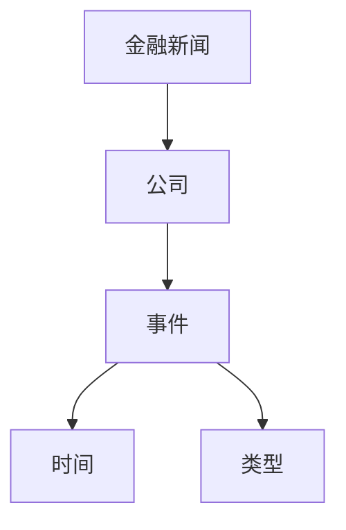
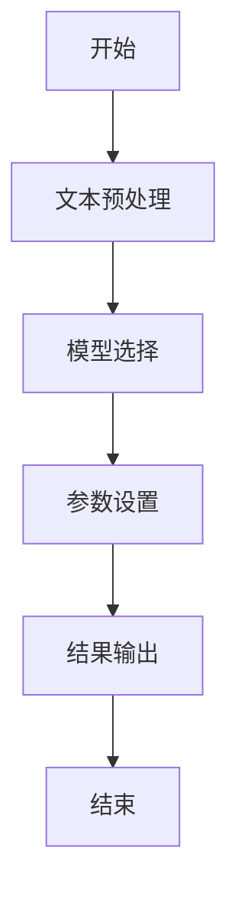
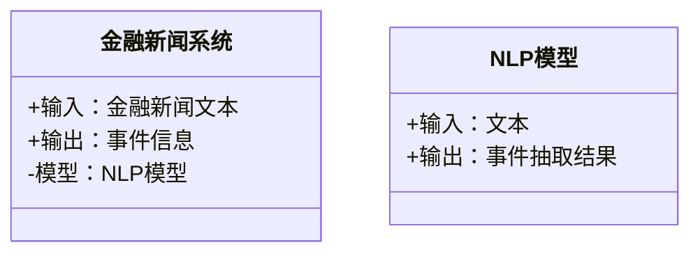
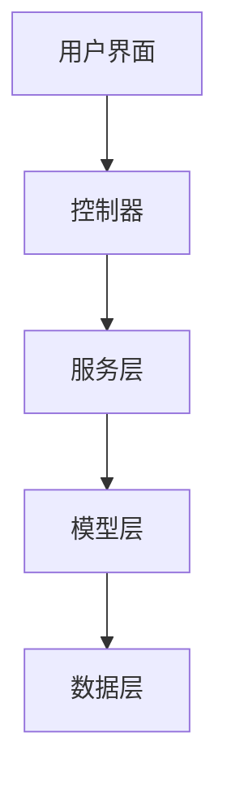
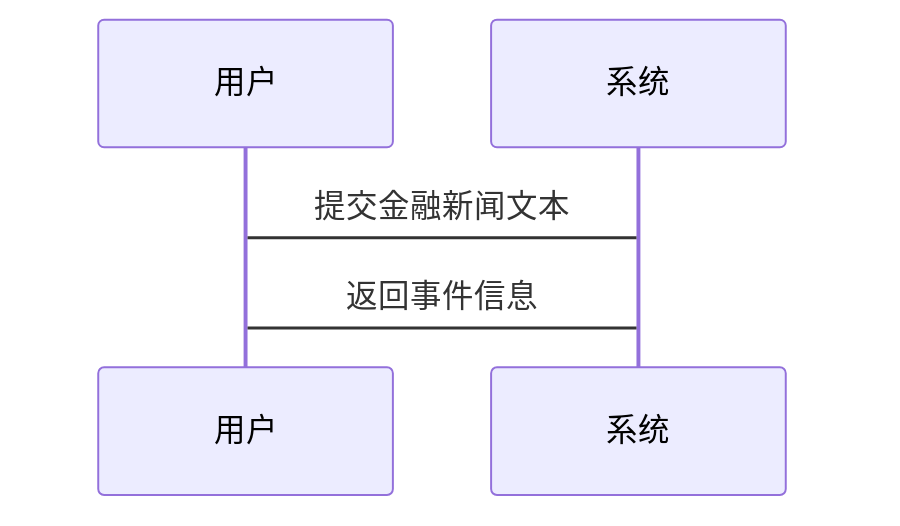

                 


# 构建基于NLP的金融新闻事件抽取系统

## 关键词：自然语言处理，金融新闻，事件抽取，深度学习，NLP算法

## 摘要：  
本文详细介绍了如何利用自然语言处理技术构建一个高效的金融新闻事件抽取系统。通过分析问题背景、核心概念与联系、算法原理、系统架构设计、项目实战以及最佳实践，本文为读者提供了一套完整的解决方案，帮助他们在金融领域中高效地提取关键事件。

---

# 第一章：背景介绍

## 1.1 问题背景与描述

### 1.1.1 金融新闻事件抽取的重要性  
在金融领域，新闻是重要的信息来源，通常包含大量关于市场动态、公司公告、经济趋势等信息。通过自动化的事件抽取，可以快速提取关键信息，帮助投资者、分析师等做出决策。  

### 1.1.2 当前金融信息处理的挑战  
- 金融新闻文本复杂，涉及多种实体（公司、人名、地点等）和事件类型（并购、裁员、业绩发布等）。  
- 传统基于规则的系统难以应对复杂的语义关系。  
- 数据量大，需要高效的处理方法。  

### 1.1.3 NLP技术在金融领域的应用潜力  
- 利用NLP技术可以自动提取事件信息，提高信息处理效率。  
- 通过深度学习模型，可以捕捉复杂的语义关系，提升事件抽取的准确性。  

## 1.2 核心概念与联系  

### 1.2.1 核心概念原理  
- **自然语言处理（NLP）**：利用计算机处理人类语言，包括文本解析、信息提取等任务。  
- **金融新闻事件**：指在金融新闻中发生的特定事件，如并购、裁员、业绩发布等。  
- **事件抽取**：从文本中提取出事件的参与者、时间、地点等信息。  

### 1.2.2 概念属性特征对比  
| 概念 | 特征 | 描述 |  
|------|------|------|  
| 事件类型 | 离散性 | 如并购、裁员等。 |  
| 参与者 | 实体性 | 如公司、人名等。 |  
| 时间 | 顺序性 | 如日期、时间等。 |  

### 1.2.3 ER实体关系图  


---

# 第二章：算法原理与实现

## 2.1 算法原理

### 2.1.1 基于规则的事件抽取  
- 通过预定义的关键词和句式规则，提取事件信息。  
- 优点：简单易实现；缺点：难以处理复杂的语义关系。  

### 2.1.2 基于深度学习的事件抽取  
- 使用预训练语言模型（如BERT）进行事件抽取。  
- 优点：能够捕捉复杂的语义关系；缺点：需要大量标注数据。  

### 2.1.3 混合模型  
- 结合规则和深度学习模型，利用两者的优势。  

## 2.2 算法流程图  



## 2.3 核心代码实现

### 2.3.1 环境安装  
```bash
pip install transformers
pip install numpy
pip install pandas
```

### 2.3.2 核心代码  

```python
from transformers import BertTokenizer, BertModel
import torch

tokenizer = BertTokenizer.from_pretrained('bert-base-uncased')
model = BertModel.from_pretrained('bert-base-uncased')
```

---

# 第三章：系统分析与架构设计

## 3.1 问题场景介绍  

### 3.1.1 问题场景描述  
- 金融新闻数据量大，需要高效的处理系统。  
- 系统需要支持多种事件类型和实体识别。  

## 3.2 系统功能设计  

### 3.2.1 领域模型  



### 3.2.2 系统架构设计  



### 3.2.3 接口设计  

- **输入接口**：接收金融新闻文本。  
- **输出接口**：返回事件信息，包括参与者、时间、类型等。  

### 3.2.4 交互流程  



---

# 第四章：项目实战

## 4.1 环境安装  

```bash
pip install transformers
pip install numpy
pip install pandas
```

## 4.2 核心代码实现  

```python
from transformers import BertTokenizer, BertModel
import torch

tokenizer = BertTokenizer.from_pretrained('bert-base-uncased')
model = BertModel.from_pretrained('bert-base-uncased')
```

## 4.3 实际案例分析  

### 4.3.1 案例描述  
假设输入新闻文本：“苹果公司宣布收购一家科技公司，交易金额为10亿美元。”  

### 4.3.2 代码实现  

```python
inputs = tokenizer("苹果公司宣布收购一家科技公司，交易金额为10亿美元。", return_tensors="pt")
with torch.no_grad():
    outputs = model(**inputs)
```

### 4.3.3 结果分析  
- 参与者：苹果公司、一家科技公司  
- 时间：未明确给出  
- 类型：收购  

---

# 第五章：最佳实践与小结

## 5.1 最佳实践  

### 5.1.1 数据预处理技巧  
- 对文本进行分词、去除停用词等处理。  

### 5.1.2 模型优化建议  
- 使用预训练模型，如BERT。  
- 根据具体任务调整模型参数。  

## 5.2 小结  
本文详细介绍了如何利用NLP技术构建金融新闻事件抽取系统，从背景介绍到系统实现，再到实际案例分析，为读者提供了一套完整的解决方案。  

## 5.3 注意事项  
- 数据标注需要准确，避免影响模型性能。  
- 系统需要定期更新模型，以适应金融领域的变化。  

## 5.4 拓展阅读  
- 《深度学习中的自然语言处理》  
- 《金融文本挖掘与分析》  

---

通过以上内容，我们可以看到，构建一个高效的金融新闻事件抽取系统需要结合NLP技术、深度学习模型以及合理的系统架构设计。希望本文能够为读者提供有价值的参考和启发。

