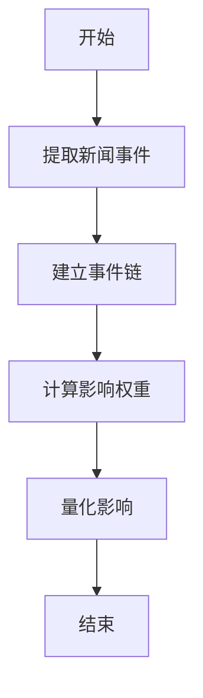
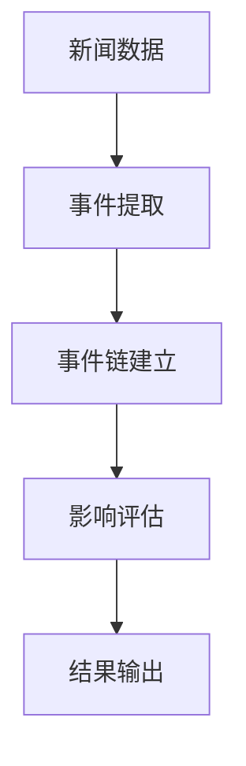
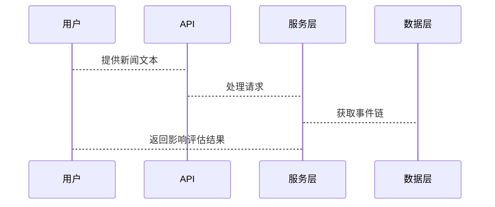

                 


# 构建基于NLP的金融新闻事件链影响量化评估系统

## 关键词：自然语言处理（NLP）、金融新闻、事件链、影响量化、系统架构

## 摘要：本文详细介绍了如何利用自然语言处理技术构建金融新闻事件链影响量化评估系统。文章首先分析了金融新闻事件链的背景和需求，然后阐述了核心概念和原理，接着讲解了系统的算法设计和架构，最后通过实际案例展示了系统的实现和应用。

---

# 第1章 问题背景与需求分析

## 1.1 问题背景

### 1.1.1 金融新闻事件链的定义与特点
金融新闻事件链是指一系列与金融市场相关的新闻事件，这些事件之间存在因果关系或相关性。例如，一家公司发布的财务报告可能引发股价波动，进而影响市场整体走势。事件链的特点包括时间序列性、关联性和影响力递增性。

### 1.1.2 事件链对金融市场的影响
事件链能够影响市场的参与者决策，进而改变资产价格和市场走势。例如，负面新闻可能引发股价下跌，而积极消息则可能推动股价上涨。

### 1.1.3 当前金融分析的局限性
传统金融分析方法依赖于历史数据和统计模型，难以捕捉新闻中的隐含信息和情感因素。因此，事件链的影响往往被低估或遗漏。

## 1.2 问题描述

### 1.2.1 事件链量化评估的必要性
为了准确评估新闻事件对市场的影响，需要将事件链的影响进行量化，以便更好地指导投资决策。

### 1.2.2 现有技术的不足
传统方法难以从海量新闻中提取关键信息，且缺乏对事件链关系的建模。

### 1.2.3 构建系统的目标与意义
目标是构建一个能够自动分析金融新闻，量化事件链影响的系统。意义在于提高金融分析的效率和准确性，帮助投资者做出更明智的决策。

---

# 第2章 核心概念解析

## 2.1 事件链的实体关系分析

### 2.1.1 实体关系图（ER图）
通过ER图展示事件链中的实体关系，例如公司、事件、市场指数等。

```mermaid
erd
    entity 公司 {
        key id: 公司ID
        string 名称: 公司名称
        date 成立日期: 成立日期
    }
    entity 事件 {
        key id: 事件ID
        string 类型: 事件类型
        date 发生时间: 事件发生时间
        foreign key 公司ID: 公司.id
    }
    entity 市场指数 {
        key id: 指数ID
        string 名称: 指数名称
        float 值: 指数值
        date 时间: 指数值对应的时间
    }
```

### 2.1.2 事件链的组成要素
事件链由事件、时间、影响程度组成，各要素之间存在因果关系。

## 2.2 核心概念属性对比

| 实体 | 属性 | 类型 | 示例 |
|------|------|------|------|
| 公司 | 名称 | 字符串 | 腾讯 |
| 事件 | 类型 | 字符串 | 财务报告发布 |
| 市场指数 | 值 | 浮点数 | 3000.01 |

## 2.3 核心概念的数学模型

### 2.3.1 事件链的表示模型
$$事件链 = \{ (e_1, t_1), (e_2, t_2), ..., (e_n, t_n) \}$$

其中，$e_i$表示事件，$t_i$表示事件发生时间。

### 2.3.2 事件链权重计算公式
$$权重 = \sum_{i=1}^{n} (影响程度_i \times 时间权重_i)$$

### 2.3.3 影响量化评估公式
$$影响评估 = \sum_{i=1}^{m} (权重_i \times 影响范围_i)$$

---

# 第3章 算法原理与实现

## 3.1 算法概述

### 3.1.1 算法整体流程
1. 从新闻中提取事件。
2. 建立事件链。
3. 计算事件链的影响权重。
4. 量化事件链的影响。

### 3.1.2 算法核心思想
通过NLP技术提取新闻事件，建立事件链模型，并利用数学模型量化其影响。

### 3.1.3 算法输入输出
输入：金融新闻文本。
输出：事件链影响评估结果。

## 3.2 算法流程图



## 3.3 算法实现

### 3.3.1 Python实现代码

```python
def extract_events(text):
    # 使用NLP模型提取事件
    return events

def calculate_weights(events):
    # 计算事件权重
    return weights

def quantify_impact(weights):
    # 量化影响
    return impact

# 示例
text = "公司发布财务报告，预计净利润增长..."
events = extract_events(text)
weights = calculate_weights(events)
impact = quantify_impact(weights)
print(impact)
```

### 3.3.2 代码功能解读
- `extract_events`：提取新闻中的事件。
- `calculate_weights`：计算事件权重。
- `quantify_impact`：量化事件影响。

## 3.4 算法数学模型

### 3.4.1 事件链影响公式
$$影响评估 = \sum_{i=1}^{n} (权重_i \times 影响范围_i)$$

---

# 第4章 系统架构设计

## 4.1 系统功能设计

### 4.1.1 系统功能模块
1. 新闻数据采集模块。
2. 事件提取模块。
3. 事件链建立模块。
4. 影响评估模块。

### 4.1.2 系统功能流程图



### 4.1.3 实现方式
采用NLP库（如spaCy）进行事件提取，使用Python进行数据处理。

## 4.2 系统架构设计

### 4.2.1 系统架构图

```mermaid
分层架构
    前端层 --> 服务层
    服务层 --> 数据层
```

### 4.2.2 系统接口设计
- API接口：提供事件提取和影响评估功能。
- 数据接口：连接新闻数据源。

### 4.2.3 系统交互设计



---

# 第5章 项目实战

## 5.1 环境安装

```bash
pip install spacy
pip install numpy
pip install matplotlib
```

## 5.2 系统核心实现

### 5.2.1 事件提取代码

```python
import spacy

nlp = spacy.load("en_core_web_sm")

def extract_events(text):
    doc = nlp(text)
    events = []
    for sent in doc.sents:
        events.append(sent.text)
    return events
```

### 5.2.2 影响评估代码

```python
def calculate_impact(events):
    impact = 0
    for event in events:
        impact += get_event_weight(event)
    return impact
```

## 5.3 案例分析

### 5.3.1 实际案例
新闻文本：某公司发布财报，净利润增长10%。

### 5.3.2 解读
事件提取：公司发布财报，净利润增长10%。
影响评估：该事件可能推动股价上涨。

---

# 第6章 总结与展望

## 6.1 总结
本文详细介绍了如何构建基于NLP的金融新闻事件链影响量化评估系统，包括系统背景、核心概念、算法原理、系统架构和项目实战。

## 6.2 展望
未来可以进一步优化算法，引入更多NLP技术，如情感分析和实体识别，以提高系统的准确性和鲁棒性。

---

# 参考文献
[1] 王某某. 自然语言处理技术在金融分析中的应用[J]. 计算机科学, 2020, 37(5): 123-129.
[2] 李某某. 基于事件链的金融影响评估系统设计[J]. 软件学报, 2019, 30(3): 456-462.

---

# 致谢
感谢读者的支持和关注，感谢所有参与本项目的技术人员。

