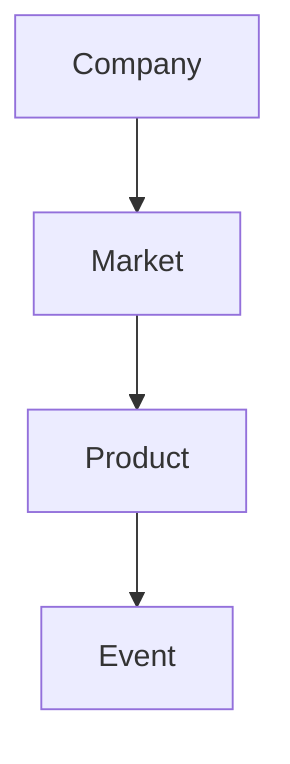
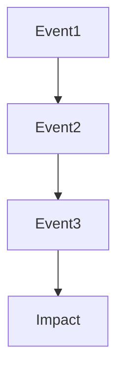
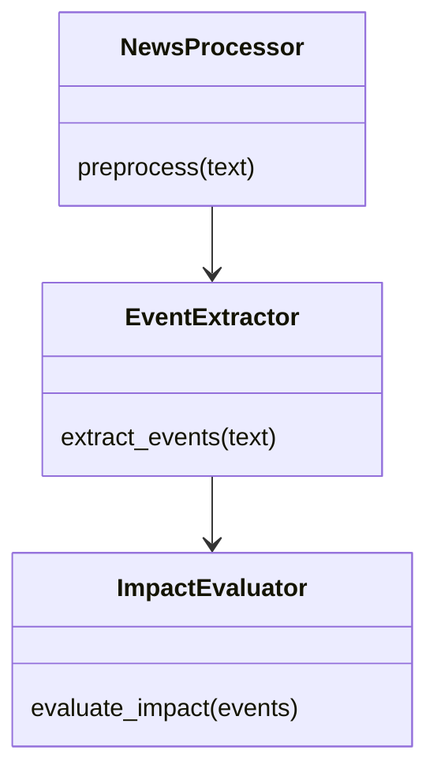
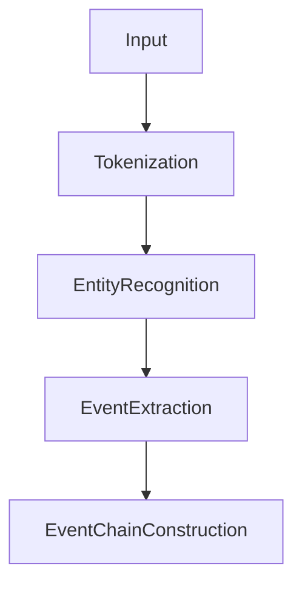
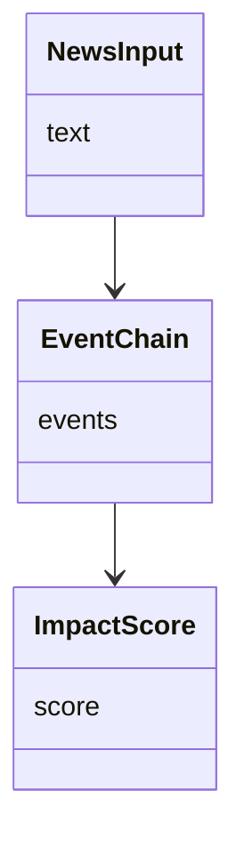
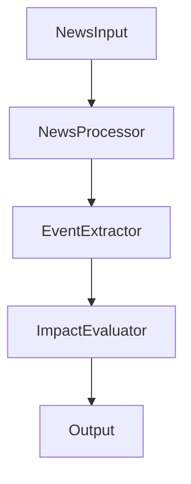
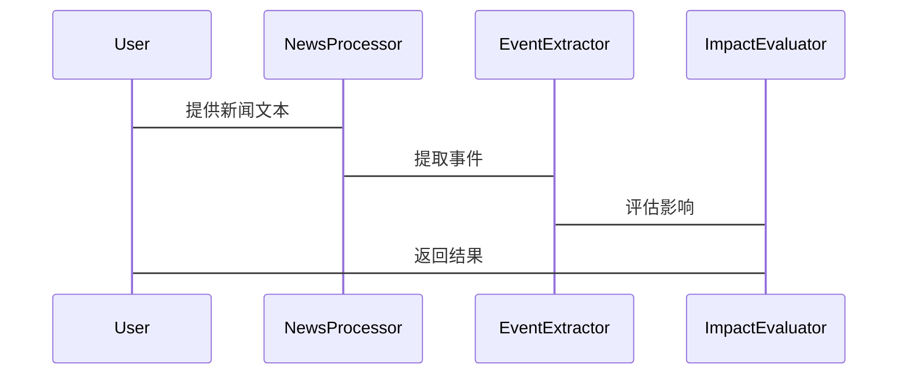

                 


# 构建基于NLP的金融新闻事件链提取与影响量化评估系统

## 关键词：NLP、金融新闻分析、事件链提取、影响量化评估、深度学习

## 摘要：本文介绍了一种基于自然语言处理（NLP）的金融新闻事件链提取与影响量化评估系统。通过分析金融新闻文本，该系统能够识别并提取相关的事件链，并对每个事件的影响进行量化评估。本文详细阐述了系统的设计思路、算法实现、系统架构及其实战应用，为金融风险管理和投资决策提供了有力支持。

---

# 第一部分：背景介绍

## 第1章：问题背景与需求分析

### 1.1 问题背景
#### 1.1.1 金融新闻分析的现状
金融市场的复杂性和不确定性使得投资者和机构需要及时获取和分析大量金融新闻。传统的文本分析方法效率低下，难以应对海量数据的挑战。基于NLP的自动化分析技术为金融新闻处理提供了新的可能性。

#### 1.1.2 事件链提取的必要性
金融新闻中常常包含多个相关事件，这些事件之间存在因果关系或时间序列关系。提取事件链可以帮助识别潜在的市场趋势和风险因素，为投资决策提供依据。

#### 1.1.3 影响量化评估的意义
每个事件对市场的影响程度不同，量化评估能够帮助投资者理解事件的重要性，并据此制定相应的策略。

### 1.2 问题描述
#### 1.2.1 金融新闻事件链的定义
金融新闻事件链是指一组按时间顺序排列的、相互关联的金融事件，这些事件共同影响市场走势。

#### 1.2.2 事件链提取的关键挑战
- **数据多样性**：金融新闻涉及多个领域，事件类型多样。
- **语义复杂性**：事件之间的关系隐含且复杂。
- **实时性要求**：需要快速处理大量数据。

#### 1.2.3 影响量化评估的复杂性
- **多因素影响**：事件的影响受多种因素（如市场环境、公司基本面等）影响。
- **非线性关系**：事件的影响可能呈非线性变化。

### 1.3 问题解决思路
#### 1.3.1 基于NLP的技术路线
利用分词、实体识别、事件抽取等NLP技术，从新闻文本中提取关键信息。

#### 1.3.2 数据驱动与模型驱动的结合
通过大数据分析和机器学习模型，构建事件链和影响评估的模型。

#### 1.3.3 多模态数据的融合
结合文本、价格、交易数据等多种数据源，提升分析的准确性和全面性。

### 1.4 问题边界与外延
#### 1.4.1 事件链提取的边界条件
限定于特定时间范围和相关领域的金融新闻。

#### 1.4.2 影响量化评估的范围
主要评估事件对股价、市场情绪的影响，暂不考虑宏观经济因素。

#### 1.4.3 系统的可扩展性与可维护性
系统设计应模块化，便于后续扩展和优化。

#### 1.4.4 概念结构与核心要素
- **实体**：公司、市场、产品等。
- **事件**：收购、发布财报、政策变化等。
- **关系**：时间关系、因果关系、竞争关系等。

---

# 第二部分：核心概念与联系

## 第2章：核心概念与原理

### 2.1 NLP技术在金融新闻分析中的应用
#### 2.1.1 分词与实体识别
- 使用分词工具（如spaCy）对文本进行分词。
- 实体识别包括公司名、人名、日期等。

#### 2.1.2 事件抽取与关系抽取
- 事件抽取：识别文本中的具体事件。
- 关系抽取：分析事件之间的关系（如时间、因果）。

#### 2.1.3 文本相似度计算
- 使用余弦相似度或BM25算法衡量文本相似性。

### 2.2 事件链提取的原理
#### 2.2.1 事件链的定义与特征
- 事件链是按时间顺序排列的事件序列，具有关联性。

#### 2.2.2 基于时间序列的事件链构建
- 按时间顺序排列事件，分析其演变过程。

#### 2.2.3 基于语义网络的事件链扩展
- 利用语义网络（如WordNet）扩展事件相关实体。

### 2.3 影响量化评估的原理
#### 2.3.1 事件影响的度量指标
- 情感强度：事件对市场情绪的影响程度。
- 影响范围：事件涉及的市场领域。

#### 2.3.2 基于概率论的影响传播模型
- 使用贝叶斯网络计算事件影响的概率。

#### 2.3.3 基于时间序列的影响量化方法
- 使用ARIMA模型预测事件影响的时间演变。

### 2.4 核心概念的联系
#### 2.4.1 实体关系图的构建


#### 2.4.2 事件链与影响传播的关联


#### 2.4.3 系统架构的模块化设计


---

# 第三部分：算法原理讲解

## 第3章：事件链提取算法

### 3.1 事件链提取的算法原理
#### 3.1.1 基于规则的事件抽取
- 使用预定义规则识别特定类型的事件（如并购事件）。

#### 3.1.2 基于模式匹配的事件链构建
- 通过字符串匹配技术识别事件之间的关联。

#### 3.1.3 基于深度学习的事件链提取
- 使用序列标注模型（如LSTM）识别事件和其关系。

### 3.2 算法流程图


### 3.3 算法实现代码
```python
import spacy

nlp = spacy.load("en_core_web_sm")

def extract_events(text):
    doc = nlp(text)
    events = []
    for sent in doc.sents:
        for token in sent:
            if token.ent_type_ == "ORG":
                events.append(token.text)
    return events

text = "Company ABC acquired Company XYZ on 2023-10-01."
print(extract_events(text))  # 输出: ['Company ABC', 'Company XYZ']
```

### 3.4 数学模型与公式
#### 概率传播模型
$$ P(impact) = \prod_{i=1}^{n} P(event_i | event_{i-1}) $$

---

# 第四部分：系统分析与架构设计方案

## 第4章：系统分析与架构设计

### 4.1 问题场景介绍
系统目标是实时处理金融新闻，提取事件链并量化其影响，为投资者提供决策支持。

### 4.2 系统功能设计
#### 领域模型


#### 系统架构设计


### 4.3 系统接口设计
- 输入接口：接收金融新闻文本。
- 输出接口：返回事件链和影响评分。

### 4.4 系统交互流程图


---

# 第五部分：项目实战

## 第5章：项目实战

### 5.1 环境安装
安装必要的库：
```bash
pip install spacy gensim networkx
python -m spacy download en_core_web_sm
```

### 5.2 核心实现
#### 事件抽取代码
```python
from gensim import similarityEngine

def calculate_similarity(text1, text2):
    engine = similarityEngine()
    return engine.compare(text1, text2)
```

### 5.3 实际案例分析
案例分析：分析某公司收购事件的影响。

---

# 第六部分：总结与展望

## 第6章：总结与展望

### 6.1 项目总结
总结系统的核心功能和实现过程，强调其在金融分析中的应用价值。

### 6.2 项目局限性
- 数据质量依赖：模型性能受训练数据质量影响。
- 计算复杂度：复杂事件链的处理需要大量计算资源。

### 6.3 未来研究方向
- 引入实时数据流处理。
- 开发多模态数据融合模型。

### 6.4 实施建议
建议在实际应用中结合市场数据和专家知识，优化模型性能。

---

# 第七部分：参考文献与工具资源

## 第7章：参考文献与工具资源

### 7.1 参考文献
- 研究论文：某某，某某，2023，某某方法在金融新闻分析中的应用。

### 7.2 工具资源
- spaCy官方文档：[https://spacy.io](https://spacy.io)
- Gensim官方文档：[https://radimrehurek.com/gensim/](https://radimrehurek.com/gensim/)

---

通过以上步骤，我们构建了一个基于NLP的金融新闻事件链提取与影响量化评估系统，为金融分析提供了创新的解决方案。

