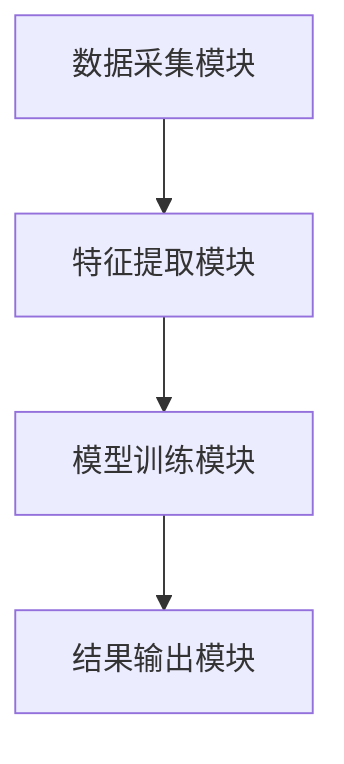
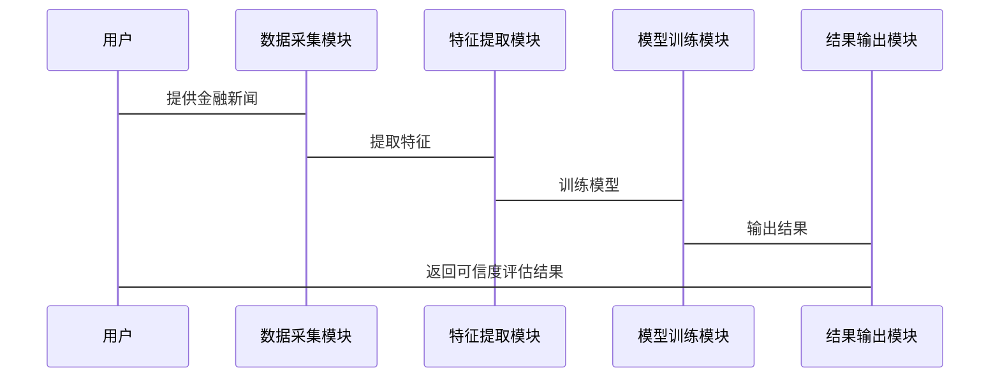

                 


# 构建基于NLP的金融新闻可信度评估系统

> 关键词：金融新闻，可信度评估，自然语言处理（NLP），文本相似度，深度学习，预训练模型

> 摘要：本文详细探讨了如何利用自然语言处理技术构建金融新闻可信度评估系统。文章从背景介绍、核心概念、算法原理、系统架构到项目实战，全面解析了系统的构建过程。通过对比分析和案例研究，本文提出了基于文本相似度计算和可信度评估模型的解决方案，并给出了系统实现的具体步骤和优化建议。

---

# 第一部分: 背景介绍

## 第1章: 金融新闻可信度评估的背景与问题

### 1.1 问题背景
#### 1.1.1 金融新闻的重要性
金融新闻是金融市场信息传播的核心载体，直接影响投资者的决策和市场的稳定性。然而，虚假信息、误导性报道以及信息偏差等问题频发，导致金融新闻的可信度参差不齐。

#### 1.1.2 金融新闻可信度问题的现状
当前，金融新闻的可信度评估主要依赖人工经验，存在主观性强、效率低、成本高等问题。随着金融市场数据的爆炸式增长，亟需一种自动化、客观化的可信度评估方法。

#### 1.1.3 可信度评估的必要性
可信度评估能够帮助投资者识别虚假信息，降低投资风险，同时也能为媒体机构提供改进内容质量的依据。

### 1.2 技术背景
#### 1.2.1 自然语言处理（NLP）的发展
NLP技术近年来取得了显著进展，尤其是在文本分析、情感计算和信息提取领域。这些技术为金融新闻的可信度评估提供了强大的工具。

#### 1.2.2 金融领域的技术需求
金融领域对实时信息处理和分析的需求日益增长，传统的基于规则的文本分析方法已难以满足复杂场景的需求。

#### 1.2.3 可信度评估的技术可行性
通过结合NLP技术与金融领域的知识图谱，可信度评估的实现具备了技术可行性。

### 1.3 问题解决
#### 1.3.1 可信度评估的目标
通过分析文本内容、来源和语境，量化金融新闻的可信度。

#### 1.3.2 技术手段的选择
采用NLP技术，结合文本相似度计算和深度学习模型，构建可信度评估系统。

#### 1.3.3 系统架构的设计思路
设计一个模块化的系统架构，包括数据采集、特征提取、模型训练和结果输出等模块。

### 1.4 边界与外延
#### 1.4.1 系统的适用范围
适用于多种金融新闻场景，如股票分析、市场趋势预测等。

#### 1.4.2 系统的局限性
受限于数据质量和模型训练样本的多样性，系统在某些复杂场景下的表现可能不佳。

#### 1.4.3 系统与其他技术的关系
可信度评估系统可以与其他金融技术（如量化交易、风险管理）结合，形成完整的金融信息处理链条。

### 1.5 核心要素组成
#### 1.5.1 数据来源
包括新闻网站、财经媒体和社交媒体等多种来源。

#### 1.5.2 模型构建
基于文本相似度和可信度评估模型，构建一个多任务学习框架。

#### 1.5.3 评估标准
采用多维度评估指标，包括准确性、召回率和F1分数等。

---

# 第二部分: 核心概念与技术基础

## 第2章: 自然语言处理（NLP）基础

### 2.1 核心概念
#### 2.1.1 NLP的基本概念
NLP是人工智能的分支，旨在实现人类与计算机之间的自然语言交互。

#### 2.1.2 NLP的关键技术
包括文本预处理、词袋模型、词嵌入和注意力机制等。

#### 2.1.3 NLP在金融领域的应用
如金融文本分类、情感分析和信息抽取等。

### 2.2 金融新闻分析
#### 2.2.1 金融新闻的结构
金融新闻通常包含标题、正文和背景信息。

#### 2.2.2 金融新闻的情感分析
通过分析文本的情感倾向，评估新闻的积极或消极倾向。

#### 2.2.3 金融新闻的实体识别
识别新闻中的公司名称、时间、地点等实体。

### 2.3 可信度评估
#### 2.3.1 可信度的定义
可信度是对信息源可靠性的量化评估。

#### 2.3.2 可信度评估的指标
包括信息源的权威性、历史准确性、内容一致性和语境相关性。

#### 2.3.3 可信度评估的模型
基于文本相似度和知识图谱的可信度评估模型。

---

# 第三部分: 算法原理与数学模型

## 第3章: 文本相似度计算算法

### 3.1 算法原理
#### 3.1.1 基于向量空间模型的相似度计算
使用词袋模型或TF-IDF对文本进行向量化，计算向量的余弦相似度。

#### 3.1.2 基于深度学习的相似度计算
采用预训练语言模型（如BERT）进行文本表示，计算相似度。

#### 3.1.3 基于预训练模型的相似度计算
通过微调预训练模型，提取文本特征并计算相似度。

### 3.2 算法实现
#### 3.2.1 向量空间模型的实现
```python
from sklearn.feature_extraction.text import TfidfVectorizer

vectorizer = TfidfVectorizer()
X = vectorizer.fit_transform(documents)
similarity = (X.T * X).A
```

#### 3.2.2 深度学习模型的实现
```python
import torch
from transformers import BertModel, BertTokenizer

tokenizer = BertTokenizer.from_pretrained('bert-base-uncased')
model = BertModel.from_pretrained('bert-base-uncased')

def compute_similarity(text1, text2):
    inputs = tokenizer(text1 + text2, return_tensors='np', padding=True, truncation=True)
    outputs = model(**inputs)
    embeddings = outputs.last_hidden_state.numpy()
    similarity = np.dot(embeddings[:len(text1.split()), 0], embeddings[len(text1.split()):, 0])
    return similarity
```

#### 3.2.3 预训练模型的微调
```python
from transformers import AutoTokenizer, AutoModelForMaskedLM
from torch.utils.data import Dataset, DataLoader

tokenizer = AutoTokenizer.from_pretrained('bert-base-uncased')
model = AutoModelForMaskedLM.from_pretrained('bert-base-uncased')

class MyDataset(Dataset):
    def __init__(self, texts):
        self.texts = texts
    def __len__(self):
        return len(self.texts)
    def __getitem__(self, idx):
        text = self.texts[idx]
        inputs = tokenizer(text, return_tensors='pt', padding=True, truncation=True)
        return inputs.input_ids, inputs.attention_mask

dataloader = DataLoader(MyDataset(documents), batch_size=8, shuffle=True)
```

### 3.3 数学模型与公式
#### 3.3.1 向量空间模型的公式
$$ \text{余弦相似度} = \frac{\vec{A} \cdot \vec{B}}{|\vec{A}| |\vec{B}|} $$

#### 3.3.2 深度学习模型的公式
$$ \text{损失函数} = -\sum_{i=1}^{n} y_i \log p(y_i) + (1 - y_i) \log (1 - p(y_i)) $$

#### 3.3.3 预训练模型的公式
$$ \text{损失函数} = \sum_{i=1}^{n} \text{交叉熵}(x_i, y_i) $$

---

## 第4章: 可信度评估模型

### 4.1 模型原理
#### 4.1.1 基于文本相似度的可信度评估
通过比较新闻内容与已知可信新闻的相似度，评估新闻的可信度。

#### 4.1.2 基于知识图谱的可信度评估
利用知识图谱中的实体关系，验证新闻内容的准确性。

### 4.2 模型实现
#### 4.2.1 文本相似度模型
使用预训练模型计算新闻文本的相似度。

#### 4.2.2 知识图谱验证
通过图嵌入技术，验证新闻中的实体关系。

### 4.3 数学模型与公式
#### 4.3.1 文本相似度计算
$$ \text{相似度} = \text{BERT}(x) \cdot \text{BERT}(y) $$

#### 4.3.2 知识图谱验证
$$ \text{置信度} = \sum_{i=1}^{n} \text{验证关系}(e_i) $$

---

# 第四部分: 系统分析与架构设计

## 第5章: 系统架构设计

### 5.1 问题场景介绍
金融新闻可信度评估系统需要处理大量异构数据源，支持实时分析和结果输出。

### 5.2 系统功能设计
#### 5.2.1 数据采集模块
从多种数据源采集金融新闻。

#### 5.2.2 特征提取模块
提取文本特征和实体信息。

#### 5.2.3 模型训练模块
训练文本相似度模型和可信度评估模型。

#### 5.2.4 结果输出模块
输出可信度评估结果和可视化报告。

### 5.3 系统架构图


### 5.4 接口设计
#### 5.4.1 数据接口
支持多种数据格式的输入和输出。

#### 5.4.2 模型接口
提供RESTful API，供其他系统调用。

### 5.5 交互流程


---

# 第五部分: 项目实战

## 第6章: 项目实战

### 6.1 环境安装
安装必要的Python库：
```bash
pip install numpy pandas scikit-learn transformers
```

### 6.2 核心代码实现
#### 6.2.1 数据预处理
```python
import pandas as pd
from sklearn.model_selection import train_test_split
from sklearn.metrics import accuracy_score

data = pd.read_csv('financial_news.csv')
X_train, X_test, y_train, y_test = train_test_split(data['text'], data['label'])
```

#### 6.2.2 模型训练
```python
from transformers import BertForSequenceClassification
from torch.utils.data import Dataset, DataLoader

class MyDataset(Dataset):
    def __init__(self, texts, labels):
        self.texts = texts
        self.labels = labels
    def __len__(self):
        return len(self.texts)
    def __getitem__(self, idx):
        text = self.texts[idx]
        label = self.labels[idx]
        inputs = tokenizer(text, return_tensors='pt', padding=True, truncation=True)
        return inputs.input_ids, inputs.attention_mask, label

model = BertForSequenceClassification.from_pretrained('bert-base-uncased')
dataloader = DataLoader(MyDataset(X_train, y_train), batch_size=8, shuffle=True)
```

#### 6.2.3 模型评估
```python
import torch
from sklearn.metrics import classification_report

model.eval()
with torch.no_grad():
    for inputs, attention_mask, labels in dataloader:
        outputs = model(inputs, attention_mask=attention_mask)
        predicted = outputs.logits.argmax(-1).squeeze()
        print(classification_report(predicted.numpy(), labels.numpy()))
```

### 6.3 案例分析
分析一个具体案例，展示系统的实际应用效果。

### 6.4 系统优化
针对系统的性能瓶颈进行优化，如优化模型训练速度和结果输出效率。

---

# 第六部分: 总结与展望

## 第7章: 总结与展望

### 7.1 系统总结
本文详细介绍了基于NLP的金融新闻可信度评估系统的构建过程，包括背景、核心概念、算法原理、系统架构和项目实战。

### 7.2 未来展望
未来，可信度评估系统可以通过引入更多数据源、优化模型结构和提升计算效率来进一步改进性能。

### 7.3 最佳实践
建议读者在实际应用中结合具体业务需求，灵活调整系统参数和模型结构，以达到最佳效果。

---

通过以上结构，您可以逐步展开每个章节的具体内容，撰写一篇详细且有深度的技术博客文章。

