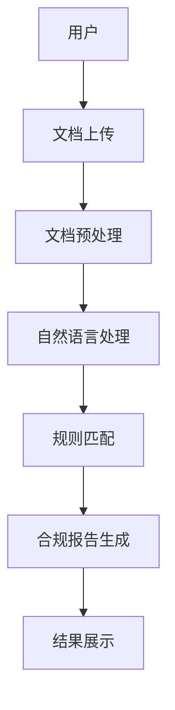
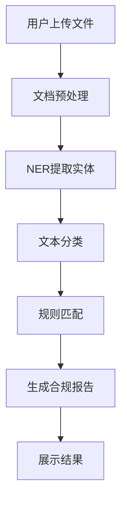
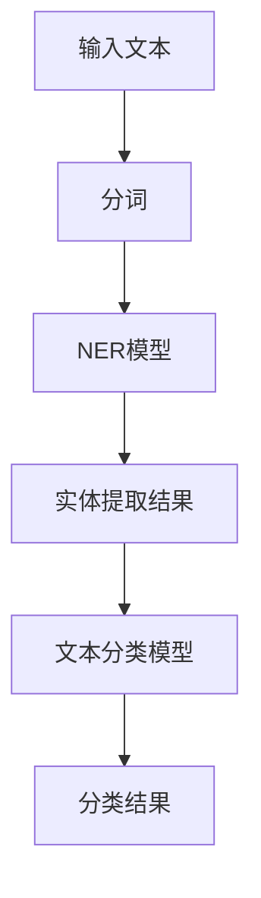

                 


# 构建基于NLP的金融监管文件遵从性检查系统

> **关键词**: 金融监管, 自然语言处理, NLP, 文本分析, 遵从性检查, 合规性管理

> **摘要**:  
> 本文详细探讨了如何利用自然语言处理（NLP）技术构建金融监管文件的遵从性检查系统。文章从问题背景出发，分析了传统文件检查方法的局限性，并介绍了NLP技术在金融监管中的应用潜力。随后，详细讲解了系统的架构设计、核心算法实现以及实际项目中的代码实现。通过NER和文本分类等算法，结合系统设计与项目实战，展示了如何高效、准确地实现金融监管文件的合规性检查。本文还总结了系统的优势与不足，并提出了改进建议。

---

## 第1章: 问题背景与核心概念

### 1.1 问题背景

#### 1.1.1 金融监管的现状与挑战

金融监管是保障金融市场健康运行的重要手段，涉及对金融机构的业务、财务报告、合规性等多方面的监督。然而，随着金融市场的复杂化和监管要求的不断提高，传统的文件检查方式面临诸多挑战：

- **人工检查效率低**: 需要大量人工审核，耗时且成本高。
- **信息提取不准确**: 文件内容复杂，人工提取关键信息容易出错。
- **监管规则复杂**: 监管规则繁多且不断更新，人工难以及时适应。

#### 1.1.2 传统文件检查方式的局限性

传统文件检查方式主要依赖人工审查或简单的关键字匹配工具，存在以下问题：

- **效率低下**: 需要逐一检查文件，耗时长。
- **准确性不足**: 关键字匹配难以处理上下文关系，容易漏检或误检。
- **灵活性差**: 难以应对监管规则的动态变化。

#### 1.1.3 NLP技术在金融监管中的应用潜力

自然语言处理技术可以通过对文本的深度理解和自动化分析，显著提升文件检查的效率和准确性。NLP在金融监管中的应用潜力主要体现在以下几个方面：

- **自动提取关键信息**: 利用NER（命名实体识别）技术提取文件中的公司名称、金额、日期等关键信息。
- **智能合规性检查**: 通过文本分类技术判断文件是否符合监管要求。
- **动态规则适应**: NLP技术能够灵活适应监管规则的更新变化。

### 1.2 核心概念

#### 1.2.1 NLP技术简介

自然语言处理（NLP）是一门研究人类语言的计算机科学，旨在让计算机能够理解、处理和生成人类语言。NLP的核心技术包括：

- **词嵌入**: 将词语映射为低维向量，如Word2Vec、GLOVE。
- **命名实体识别（NER）**: 识别文本中的命名实体，如人名、地名、组织名等。
- **文本分类**: 根据文本内容进行分类，如垃圾邮件分类、情感分析。

#### 1.2.2 金融监管文件的特征分析

金融监管文件通常具有以下特征：

- **结构化与非结构化混合**: 文件中既有表格数据，也有大量自由文本。
- **领域专业性高**: 文件内容涉及金融术语和行业规则。
- **合规性要求严格**: 文件必须符合特定的格式和内容要求。

#### 1.2.3 系统功能模块划分

基于NLP的金融监管文件检查系统可以划分为以下几个功能模块：

1. **文档上传与预处理**: 提供文件上传接口，并对文件进行格式转换和分词处理。
2. **自然语言处理模块**: 包括NER、文本分类等功能，用于提取关键信息和判断合规性。
3. **规则匹配与合规检查**: 根据预设的监管规则对文件内容进行检查，并生成合规报告。
4. **结果分析与报告生成**: 提供可视化报告，便于用户查看检查结果。

---

## 第2章: 系统架构设计

### 2.1 系统架构图

以下是一个基于NLP的金融监管文件检查系统的架构图：



### 2.2 系统功能模块划分

1. **文档上传与预处理**: 提供文件上传功能，并对文件进行格式转换和分词处理。
2. **自然语言处理模块**: 包括NER、文本分类等功能，用于提取关键信息和判断合规性。
3. **规则匹配与合规检查**: 根据预设的监管规则对文件内容进行检查，并生成合规报告。
4. **结果分析与报告生成**: 提供可视化报告，便于用户查看检查结果。

### 2.3 系统流程图

以下是一个基于NLP的金融监管文件检查系统的流程图：



---

## 第3章: NLP算法实现与优化

### 3.1 NER模型实现

#### 3.1.1 基于CRF的NER模型

条件随机场（CRF）是一种用于序列标注的模型，常用于NER任务。以下是CRF的数学模型：

$$ P(y|x) = \frac{\exp(\sum_{i=1}^n f(y_i, y_{i-1}, x)})}{\sum_{y'} \exp(\sum_{i=1}^n f(y'_i, y'_{i-1}, x)})} $$

其中，$f$ 是特征函数，$x$ 是输入文本，$y$ 是标签序列。

#### 3.1.2 预训练模型的微调

使用预训练模型（如BERT）进行NER任务时，通常需要进行微调：

```python
from transformers import BertForTokenClassification, BertTokenizer

model = BertForTokenClassification.from_pretrained('bert-base-uncased', num_labels=tag_map)
tokenizer = BertTokenizer.from_pretrained('bert-base-uncased')

# 定义微调函数
def fine_tune_model():
    model.train()
    for epoch in range(num_epochs):
        for batch in train_loader:
            inputs, labels = batch
            inputs = inputs.to(device)
            labels = labels.to(device)
            outputs = model(inputs, labels)
            loss = outputs[0]
            optimizer.zero_grad()
            loss.backward()
            optimizer.step()
```

### 3.2 文本分类实现

#### 3.2.1 基于深度学习的文本分类

使用深度学习模型（如LSTM）进行文本分类：

```python
import torch.nn as nn
import torch.nn.functional as F

class TextClassifier(nn.Module):
    def __init__(self, input_size, hidden_size, output_size):
        super(TextClassifier, self).__init__()
        self.embedding = nn.Embedding(input_size, hidden_size)
        self.lstm = nn.LSTM(hidden_size, hidden_size, batch_first=True)
        self.fc = nn.Linear(hidden_size, output_size)
    
    def forward(self, x):
        x = self.embedding(x)
        x, _ = self.lstm(x)
        x = x[:, -1, :]
        x = self.fc(x)
        return F.log_softmax(x, dim=1)
```

### 3.3 算法流程图

以下是NER和文本分类算法的流程图：



---

## 第4章: 项目实战

### 4.1 环境安装

需要安装以下库：

```bash
pip install transformers numpy torch pandas scikit-learn
```

### 4.2 系统核心实现源代码

以下是系统的核心代码：

```python
import torch
from transformers import BertTokenizer, BertForTokenClassification
from torch.utils.data import Dataset, DataLoader

class FinancialDocDataset(Dataset):
    def __init__(self, texts, labels):
        self.texts = texts
        self.labels = labels
    
    def __len__(self):
        return len(self.texts)
    
    def __getitem__(self, idx):
        text = self.texts[idx]
        label = self.labels[idx]
        return text, label

def main():
    # 加载预训练模型和分词器
    model = BertForTokenClassification.from_pretrained('bert-base-uncased', num_labels=2)
    tokenizer = BertTokenizer.from_pretrained('bert-base-uncased')
    
    # 数据集和数据加载器
    dataset = FinancialDocDataset(["This is a test document.", "Another document."], [0, 1])
    train_loader = DataLoader(dataset, batch_size=2, shuffle=True)
    
    # 定义优化器和损失函数
    optimizer = torch.optim.Adam(model.parameters(), lr=1e-5)
    criterion = nn.CrossEntropyLoss()
    
    # 微调模型
    model.train()
    for epoch in range(3):
        for batch in train_loader:
            texts, labels = batch
            inputs = tokenizer(texts, padding=True, return_tensors='pt')
            inputs = inputs['input_ids'].to(device)
            labels = labels.to(device)
            
            outputs = model(inputs, labels)
            loss = outputs[0]
            optimizer.zero_grad()
            loss.backward()
            optimizer.step()
    
    # 保存模型
    torch.save(model.state_dict(), 'model.pth')

if __name__ == "__main__":
    main()
```

### 4.3 实际案例分析

以检查一份金融报告为例，系统能够自动提取公司名称、金额等关键信息，并判断报告是否符合监管要求。

---

## 第5章: 总结与展望

### 5.1 总结

本文详细介绍了如何利用NLP技术构建金融监管文件的遵从性检查系统。通过NER和文本分类等算法，结合系统设计与项目实战，展示了如何高效、准确地实现文件的合规性检查。

### 5.2 项目小结

- **优点**:
  - 提高文件检查效率。
  - 提高检查准确性。
  - 灵活适应监管规则的变化。

- **不足**:
  - 需要大量标注数据。
  - 对于非常规文本的处理能力有限。

### 5.3 注意事项

- 确保模型的可解释性。
- 定期更新模型以适应监管规则的变化。
- 注意数据隐私和安全。

### 5.4 拓展阅读

建议进一步研究以下内容：

- 基于深度学习的NLP模型（如BERT、GPT）在金融监管中的应用。
- 多模态数据（如图像、文本）的融合分析。
- 高效NLP算法在大规模金融数据中的应用。

---

通过本文的系统介绍，读者可以全面了解如何利用NLP技术构建金融监管文件的遵从性检查系统，并将其应用于实际场景中。

