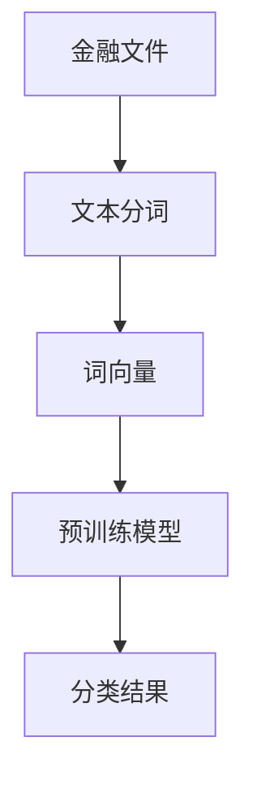
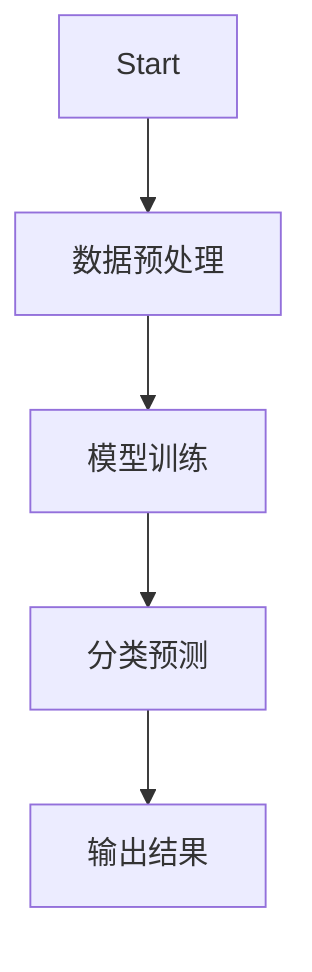

                 


# 构建基于NLP的金融监管文件遵从性自动检查系统

## 关键词：
- 金融监管
- 自然语言处理（NLP）
- 文件遵从性
- 自动化检查
- 系统架构

## 摘要：
本文详细探讨了如何利用自然语言处理技术构建一个高效的金融监管文件遵从性自动检查系统。通过分析金融监管文件的特点和需求，结合NLP的核心原理，提出了一种基于预训练语言模型（如BERT）的解决方案。本文详细阐述了系统的架构设计、算法实现、项目实战及最佳实践，为读者提供了一个全面的技术指南。

---

# 第一部分: 背景介绍

## 第1章: 问题背景与需求分析

### 1.1 问题背景
金融监管是确保金融市场健康运行的重要手段，涉及合规性、风险控制和信息披露等多个方面。然而，传统的人工审查方式效率低、成本高且容易出错。随着金融文件的日益复杂化和数量的激增，传统的监管方式已难以满足需求。

### 1.2 问题描述
金融监管文件通常包括招股说明书、财务报表、法律协议等，这些文件内容繁杂，格式多样。人工检查不仅耗时，还容易遗漏关键信息。因此，如何快速、准确地检查文件的遵从性成为亟待解决的问题。

### 1.3 问题解决思路
利用NLP技术可以实现金融文件的自动化检查。通过文本分类、实体识别和信息抽取等技术，系统能够自动识别文件中的关键信息，判断其是否符合相关法规。

### 1.4 系统边界与外延
- 系统功能边界：仅关注文件内容的分析，不涉及外部数据源。
- 系统关联：与金融监管机构的数据库和业务系统对接。
- 可扩展性：支持多种文件格式和不同监管规则。

### 1.5 核心概念结构与组成
- **输入**：金融监管文件。
- **处理过程**：文本预处理、模型训练、分类预测。
- **输出**：是否符合监管要求的判断结果。

---

# 第2章: 核心概念与联系

## 2.1 NLP技术的核心原理
NLP通过词向量表示、语言模型训练和文本分类等技术，将文本数据转化为可计算的形式，从而实现对文本的理解和分析。

## 2.2 金融监管文件的特征分析
金融文件通常包含专业术语和复杂结构，如财务数据、法律条款等。这些特征使得文件分析需要高度的准确性和专业性。

## 2.3 系统核心概念的联系
- **NLP模型**与**金融规则**的结合：模型负责文本分析，规则用于判断合规性。
- **系统模块**之间的关系：数据预处理、模型训练、结果输出。

## 2.4 核心概念属性对比
| 属性 | NLP模型 | 金融文件 |
|------|---------|----------|
| 输入 | 文本数据 | 结构化数据 |
| 输出 | 分类结果 | 合规判断 |

## 2.5 ER实体关系图


---

# 第3章: NLP算法原理与实现

## 3.1 算法原理
基于BERT的文本分类模型，通过预训练和微调，实现对金融文件的分类。

## 3.2 算法实现流程


## 3.3 核心代码实现
```python
import torch
from transformers import BertForSequenceClassification, BertTokenizer

# 定义模型
class BertClassifier(BertForSequenceClassification):
    def __init__(self, config):
        super().__init__(config)
        self.dropout = torch.nn.Dropout(config.hidden_dropout_prob)
    
    def forward(self, input_ids, attention_mask, token_type_ids):
        outputs = super().forward(input_ids, attention_mask, token_type_ids)
        pooled_output = outputs[0][:, 0, :]
        pooled_output = self.dropout(pooled_output)
        return pooled_output, outputs[1]

# 模型训练
model = BertClassifier(bert_config)
tokenizer = BertTokenizer.from_pretrained('bert-base-uncased')
optimizer = torch.optim.AdamW(model.parameters(), lr=2e-5)
criterion = nn.CrossEntropyLoss()
```

## 3.4 数学模型
模型的目标是最小化分类误差，优化目标为：
$$ \text{loss} = \text{CELoss}( logits, labels) $$

---

# 第4章: 系统分析与架构设计

## 4.1 问题场景介绍
系统需要处理多种金融文件，检查其是否符合监管要求。

## 4.2 系统功能设计
- 数据预处理模块：负责文本清洗和分词。
- 模型训练模块：基于BERT进行微调。
- 分类预测模块：输出合规性判断结果。

## 4.3 系统架构设计


## 4.4 接口与交互设计
- API接口：接收文件内容，返回合规结果。
- 交互流程：用户提交文件，系统处理后返回结果。

---

# 第5章: 项目实战

## 5.1 环境安装
安装Python和相关库：
```bash
pip install transformers torch
```

## 5.2 核心代码实现
```python
def preprocess(text):
    # 文本清洗
    return text.lower().split()

def train_model(train_dataset):
    # 模型训练
    model.train()
    for batch in train_dataset:
        optimizer.zero_grad()
        outputs, logits = model(batch['input_ids'], batch['attention_mask'], batch['token_type_ids'])
        loss = criterion(logits, batch['labels'])
        loss.backward()
        optimizer.step()
```

## 5.3 实际案例分析
通过具体案例展示系统的运行流程和结果。

## 5.4 系统小结
总结系统实现的关键点和优化方向。

---

# 第6章: 总结与展望

## 6.1 总结
本文详细介绍了如何利用NLP技术构建金融监管文件的自动检查系统，包括系统架构、算法实现和项目实战。

## 6.2 展望
未来可以进一步优化模型，增加更多监管规则，提升系统的泛化能力。

## 6.3 注意事项
- 数据隐私保护
- 模型的可解释性

## 6.4 拓展阅读
推荐相关领域的书籍和论文，供读者深入学习。

---

# 结语
构建基于NLP的金融监管文件遵从性自动检查系统是一项具有重要意义的技术创新。通过本文的详细讲解，读者可以掌握系统的构建方法，并在实际应用中不断优化和改进。

