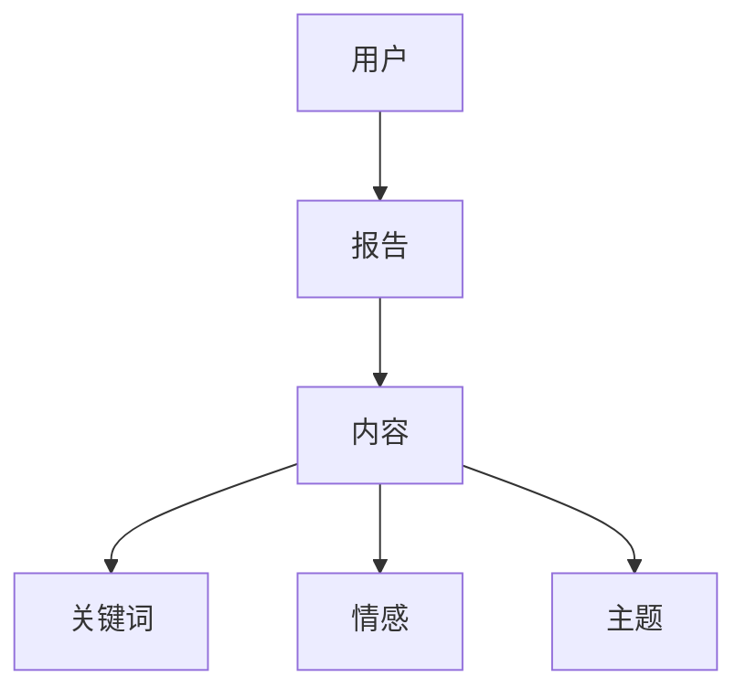
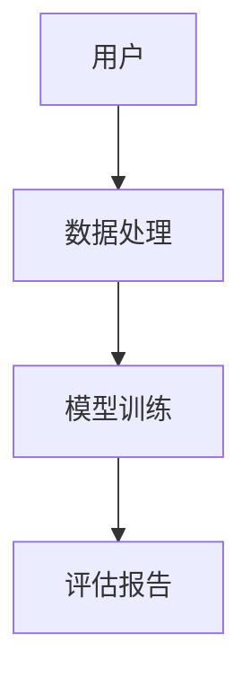

                 


# 《构建基于NLP的金融研究报告影响力评估系统》

---

## 关键词：自然语言处理（NLP）、金融报告、影响力评估、文本挖掘、机器学习

---

## 摘要：

本文详细探讨了如何利用自然语言处理技术构建一个基于NLP的金融研究报告影响力评估系统。通过分析金融报告的文本特征和影响力评估的关键问题，提出了一种结合NLP技术与影响力评估指标的系统设计方案。文章从系统背景、核心概念、技术实现到项目实战，全面阐述了构建该系统的思路与方法，并通过实际案例展示了系统的应用价值。

---

# 第一章: 问题背景与问题描述

## 1.1 问题背景

### 1.1.1 金融研究报告的重要性

金融研究报告是金融领域的重要决策依据，其质量和影响力直接影响投资者的决策和市场的稳定性。传统的影响力评估方法通常依赖人工经验，存在主观性强、效率低下的问题。

### 1.1.2 问题描述

现有评估方法难以量化报告的影响力，且缺乏系统性。报告的影响力受到内容深度、读者关注度、市场反应等多个因素的影响，需要一种更科学、客观的评估方法。

### 1.1.3 问题解决方法

利用NLP技术，从文本中提取关键信息，结合量化指标，构建一个自动化的影响力评估系统。

## 1.2 问题解决方法

### 1.2.1 基于NLP的解决方案

通过文本挖掘技术，提取报告中的关键词、主题和情感倾向，结合语义理解，评估报告的影响力。

### 1.2.2 系统设计思路

构建一个模块化的系统，包括数据采集、文本处理、模型训练和结果展示等环节。

### 1.2.3 技术路线与实现框架

从数据预处理到模型训练，再到结果展示，形成一个完整的技术路线。

## 1.3 本章小结

本章介绍了金融研究报告影响力评估的背景、问题和解决方法，为后续的技术实现奠定了基础。

---

# 第二章: 核心概念与联系

## 2.1 核心概念原理

### 2.1.1 NLP的基本概念

NLP通过计算机处理自然语言文本，实现文本理解、生成和分析。

### 2.1.2 金融研究报告的文本特征

包括关键词、主题、情感倾向等，这些特征决定了报告的影响力。

### 2.1.3 影响力评估的指标体系

包括报告的阅读量、引用次数、市场反应等多维度指标。

## 2.2 核心概念属性对比

### 2.2.1 文本特征与影响力的关系

关键词的出现频率与报告的影响力呈正相关。

### 2.2.2 不同报告类型的影响权重

不同类型报告的影响权重不同，如行业分析报告权重较高。

### 2.2.3 数据特征与模型性能的对比

数据质量对模型性能有直接影响。

## 2.3 ER实体关系图



## 2.4 本章小结

通过ER图展示了系统中的实体关系，为后续的系统设计提供了数据模型。

---

# 第三章: NLP技术基础

## 3.1 NLP核心算法

### 3.1.1 分词算法

分词是文本处理的第一步，常用算法有jieba和 nltk。

### 3.1.2 词向量表示

词向量如Word2Vec和 GloVe，将词语转化为向量表示。

### 3.1.3 语义理解模型

如BERT和LSTM，用于深度语义理解。

## 3.2 常用NLP模型

### 3.2.1 BERT模型

预训练语言模型，用于文本表示和理解。

### 3.2.2 LSTM网络

用于序列数据的处理，捕捉上下文信息。

### 3.2.3 TF-IDF方法

用于关键词提取，计算关键词的重要性。

## 3.3 文本预处理与特征提取

### 3.3.1 数据清洗

去除噪声，保留有效信息。

### 3.3.2 分词与词干提取

将文本分词并提取词干，便于后续处理。

### 3.3.3 特征向量化

将文本特征转化为数值向量，用于模型训练。

## 3.4 本章小结

介绍了NLP技术基础，为后续模型构建提供了技术支持。

---

# 第四章: 影响力评估模型

## 4.1 模型设计目标

### 4.1.1 确定评估指标

包括报告的阅读量、引用次数等。

### 4.1.2 设计评估标准

根据指标设计评估标准，量化报告的影响力。

### 4.1.3 模型的可解释性

确保模型结果易于理解。

## 4.2 模型构建流程

### 4.2.1 数据收集与标注

收集金融报告数据，并标注影响力指标。

### 4.2.2 模型训练与优化

使用NLP模型进行训练，并通过交叉验证优化模型。

### 4.2.3 模型评估与调优

通过准确率、召回率等指标评估模型性能，并进行调优。

## 4.3 模型实现

### 4.3.1 模型结构设计

使用BERT模型进行文本表示，结合影响力指标进行预测。

### 4.3.2 模型训练代码

```python
from transformers import BertTokenizer, BertModel
tokenizer = BertTokenizer.from_pretrained('bert-base-uncased')
model = BertModel.from_pretrained('bert-base-uncased')
```

### 4.3.3 模型评估结果

展示模型的准确率、召回率等评估结果。

## 4.4 本章小结

详细介绍了影响力评估模型的设计与实现，为系统构建奠定了基础。

---

# 第五章: 系统架构设计

## 5.1 系统功能设计

### 5.1.1 数据处理模块

负责数据的采集、清洗和预处理。

### 5.1.2 模型训练模块

负责模型的训练、优化和保存。

### 5.1.3 评估报告生成模块

生成影响力评估报告，展示评估结果。

## 5.2 系统架构图



## 5.3 系统接口设计

### 5.3.1 数据接口

定义数据格式和接口规范。

### 5.3.2 模型接口

定义模型输入输出接口。

### 5.3.3 报告生成接口

定义报告生成的接口规范。

## 5.4 系统交互流程

### 5.4.1 用户输入报告文本

### 5.4.2 系统处理文本

### 5.4.3 系统生成评估报告

## 5.5 本章小结

通过系统架构设计，明确了系统的功能模块和交互流程。

---

# 第六章: 项目实战

## 6.1 环境搭建

### 6.1.1 安装依赖

安装Python、TensorFlow、Keras等工具。

### 6.1.2 数据准备

收集并整理金融报告数据。

## 6.2 系统核心实现

### 6.2.1 文本预处理代码

```python
import pandas as pd
from nltk.corpus import stopwords

def preprocess(text):
    tokens = text.split()
    filtered = [word for word in tokens if not word in stopwords.words('english')]
    return ' '.join(filtered)
```

### 6.2.2 模型训练代码

```python
from sklearn.feature_extraction.text import TfidfVectorizer
from sklearn.svm import SVC

vectorizer = TfidfVectorizer()
X = vectorizer.fit_transform(texts)
y = labels
model = SVC()
model.fit(X, y)
```

### 6.2.3 评估报告生成

展示模型评估结果，并生成报告。

## 6.3 案例分析

### 6.3.1 数据分析

分析报告的关键词分布。

### 6.3.2 模型评估

展示模型在测试集上的表现。

### 6.3.3 报告生成

生成影响力评估报告，展示结果。

## 6.4 本章小结

通过实际案例展示了系统的实现过程和应用效果。

---

# 第七章: 系统实现与优化

## 7.1 系统实现

### 7.1.1 使用NLP库进行文本处理

如使用spaCy进行分词和实体识别。

### 7.1.2 模型优化

通过超参数调优提升模型性能。

### 7.1.3 系统部署

将系统部署到服务器，提供API接口。

## 7.2 系统优化

### 7.2.1 性能优化

优化文本处理和模型推理速度。

### 7.2.2 可扩展性优化

设计模块化架构，便于功能扩展。

## 7.3 本章小结

详细介绍了系统的实现过程和优化方法，确保系统的高效运行。

---

# 第八章: 总结与展望

## 8.1 系统总结

### 8.1.1 系统优点

自动化、高效、客观。

### 8.1.2 经验总结

模块化设计和NLP技术的应用是成功的关键。

## 8.2 未来展望

### 8.2.1 模型优化方向

引入深度学习模型如Transformer。

### 8.2.2 功能扩展方向

增加实时监控和预测功能。

### 8.2.3 技术趋势

NLP技术在金融领域的应用将更加广泛和深入。

## 8.3 本章小结

总结了系统的建设成果，并展望了未来的发展方向。

---

# 参考文献

（此处列出相关文献和资料）

---

通过以上结构，本文系统地介绍了基于NLP的金融研究报告影响力评估系统的构建过程，从理论到实践，为相关领域的研究和应用提供了参考。

