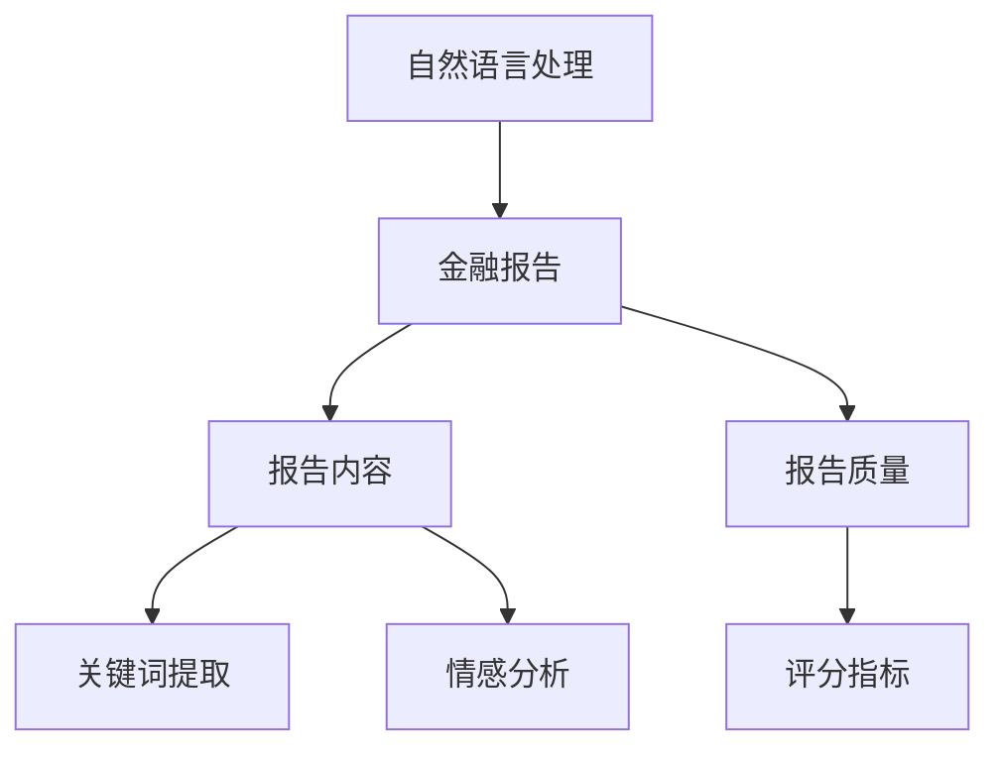
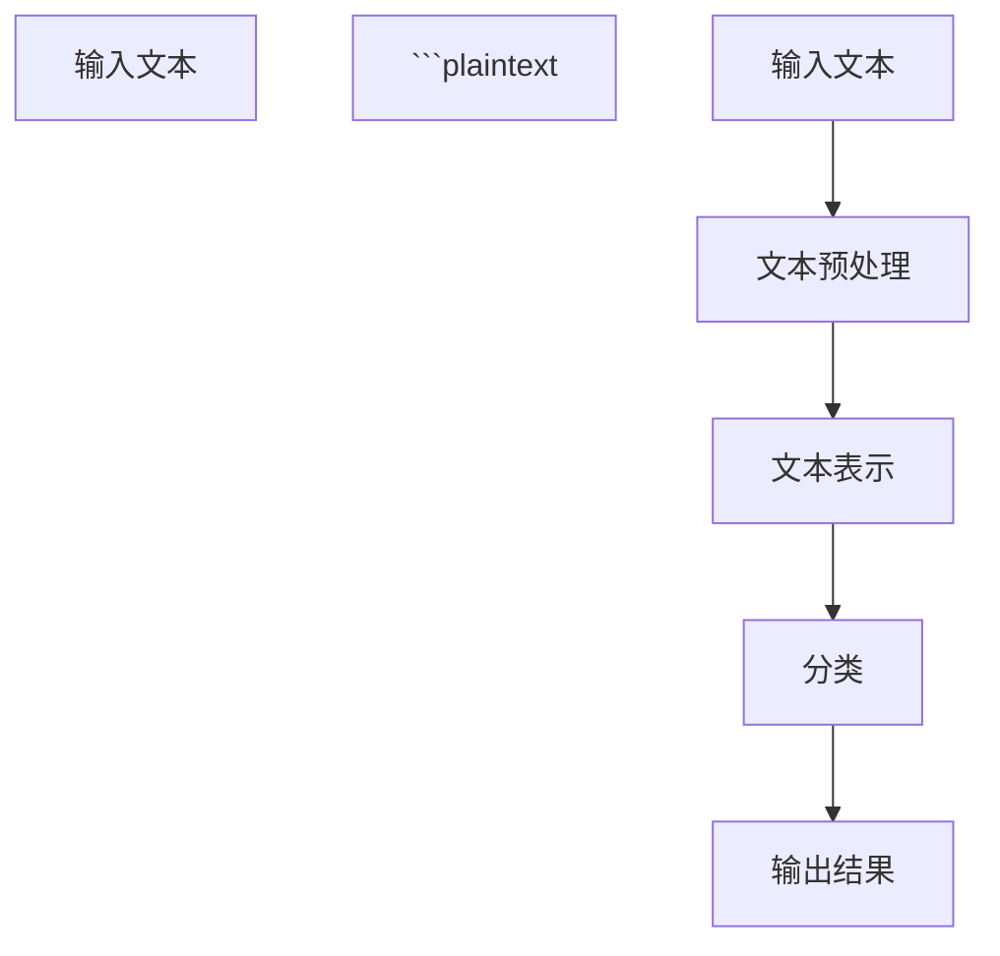
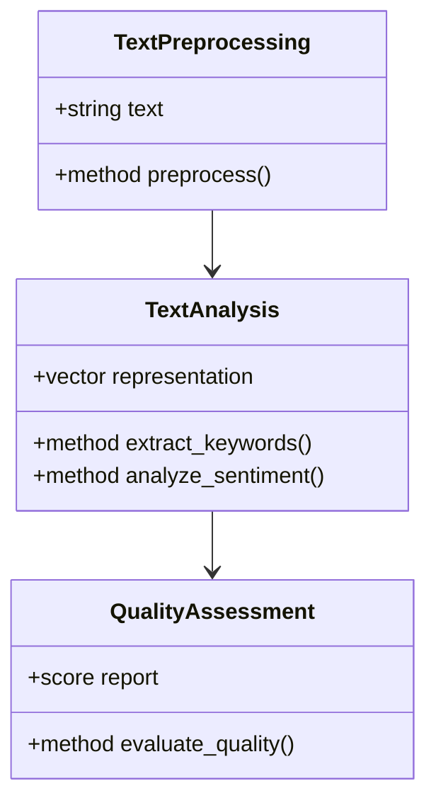
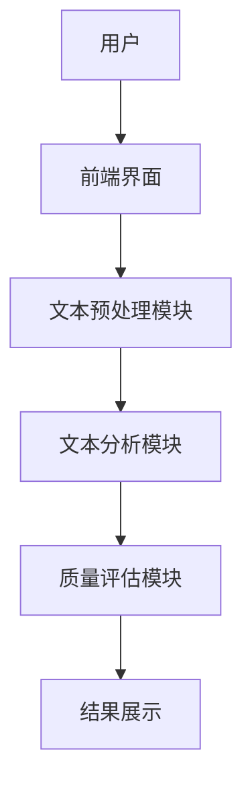
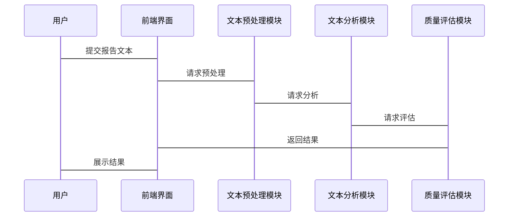

                 


# 构建基于NLP的金融研究报告质量评估系统

> 关键词：自然语言处理（NLP）、金融报告、质量评估、文本分析、机器学习

> 摘要：本文详细探讨了如何利用自然语言处理技术构建一个高效的金融研究报告质量评估系统。文章从问题背景、核心概念、算法原理、系统架构到项目实战，逐步分析了系统的构建过程，并提供了具体的实现方案和案例分析。

---

## 第1章: 背景介绍与核心概念

### 1.1 问题背景

#### 1.1.1 金融研究报告的重要性
金融研究报告是投资者、分析师和金融机构做出决策的重要依据。高质量的报告能够提供准确的市场分析、合理的投资建议和前瞻性的洞察。然而，报告的质量往往依赖于分析师的经验和能力，人工评估效率低下且难以标准化。

#### 1.1.2 现有报告评估方法的局限性
传统的报告评估方法通常依赖人工阅读和评分，这种方法不仅耗时耗力，而且主观性强，难以量化和客观评价。此外，报告内容的复杂性和多样性使得人工评估容易出错。

#### 1.1.3 NLP技术在金融领域的应用潜力
自然语言处理技术（NLP）能够从文本中提取关键信息，分析情感倾向，并生成结构化的数据。将NLP应用于金融报告评估，可以提高评估效率和准确性，同时降低人工成本。

### 1.2 问题描述

#### 1.2.1 金融报告质量评估的核心要素
金融报告的质量可以从多个维度进行评估，包括内容的准确性、逻辑性、结构的合理性以及语言的流畅性。这些维度需要通过文本分析技术进行量化评估。

#### 1.2.2 报告内容的多维度评估需求
金融报告通常包含市场分析、财务数据、投资建议等内容。不同部分的评估标准不同，例如市场分析需要准确的数据支持，而投资建议则需要逻辑清晰、语言专业。

#### 1.2.3 当前评估系统的痛点分析
现有评估系统主要依赖人工判断，存在效率低、主观性强、难以标准化等问题。此外，报告内容的多样性和复杂性使得传统评估方法难以满足现代金融市场的高要求。

### 1.3 问题解决思路

#### 1.3.1 基于NLP的文本分析方法
利用NLP技术，从报告文本中提取关键词、主题和情感倾向，为质量评估提供数据支持。

#### 1.3.2 结构化报告评估指标的设计
根据报告内容的特点，设计结构化的评估指标，如关键词匹配度、逻辑连贯性、数据准确性等。

#### 1.3.3 系统化解决方案的构建
构建一个基于NLP的自动化评估系统，实现从文本分析到质量评分的全流程自动化。

### 1.4 系统边界与外延

#### 1.4.1 系统的功能边界
系统的主要功能包括文本分析、质量评估和结果展示。不包括报告生成和投资决策建议。

#### 1.4.2 系统的适用范围与限制
系统适用于金融报告的初步评估，但不适用于需要深度人工判断的领域，如投资策略的制定。

#### 1.4.3 系统与外部系统的交互
系统可以与数据库、金融信息平台等外部系统交互，获取必要的数据支持。

### 1.5 核心概念与组成

#### 1.5.1 NLP技术的核心要素
- 文本预处理：分词、去除停用词、文本清洗等。
- 文本表示：词袋模型、词嵌入（如Word2Vec）。
- 文本分析：情感分析、关键词提取、主题建模。

#### 1.5.2 金融报告质量评估的指标体系
- 内容准确性：关键词匹配度、数据引用的准确性。
- 结构合理性：段落逻辑、标题与内容的匹配度。
- 语言流畅性：语法正确性、表达清晰度。

#### 1.5.3 系统架构的关键组成部分
- 用户界面：展示报告评估结果。
- 数据处理模块：文本清洗、分词。
- 分析模块：关键词提取、情感分析。
- 评估模块：基于指标的评分系统。

---

## 第2章: NLP技术原理

### 2.1 NLP核心原理

#### 2.1.1 自然语言处理的基本流程
1. 文本预处理：去除停用词、分词。
2. 文本表示：将文本转换为向量形式。
3. 文本分析：进行情感分析、主题建模等。

#### 2.1.2 文本表示方法
- 词袋模型：将文本表示为单词的频率向量。
- 词嵌入：使用预训练的词向量（如Word2Vec）。

#### 2.1.3 文本理解与生成模型
- 理解模型：如BERT，用于文本摘要和问答系统。
- 生成模型：如GPT，用于文本生成。

### 2.2 金融文本分析的关键技术

#### 2.2.1 金融实体识别
- 技术：使用命名实体识别（NER）模型识别公司名称、金融术语。
- 示例：识别“苹果”、“股票”等关键词。

#### 2.2.2 金融事件抽取
- 技术：从文本中抽取事件（如并购、上市）及其时间、地点、人物。
- 示例：从新闻中提取“某公司于2023年10月收购另一家公司”。

#### 2.2.3 情感分析与市场情绪预测
- 技术：使用情感分析模型判断文本的情感倾向。
- 示例：判断市场对某公司的看法是正面、负面还是中性。

### 2.3 概念属性对比表

| 概念 | 属性 | 描述 |
|------|------|------|
| NLP模型 | 输入 | 文本数据 |
|        | 输出 | 向量表示或标签 |
| 金融报告 | 维度 | 内容、结构、语言质量 |
|        | 指标 | 准确性、完整性、逻辑性 |

### 2.4 ER实体关系图



---

## 第3章: 算法原理与实现

### 3.1 算法原理

#### 3.1.1 文本表示方法
- 词袋模型：将文本表示为单词的频率向量。
- 词嵌入：使用预训练的词向量（如Word2Vec）。

#### 3.1.2 分类算法
- 朴素贝叶斯：常用于文本分类。
- 支持向量机（SVM）：适用于高维数据分类。

#### 3.1.3 模型训练与优化
- 超参数调优：使用交叉验证选择最优参数。
- 模型评估：使用准确率、召回率、F1值等指标。

### 3.2 算法流程图



### 3.3 算法实现

#### 3.3.1 代码实现

```python
from sklearn.feature_extraction.text import TfidfVectorizer
from sklearn.svm import SVC
from sklearn.metrics import accuracy_score

# 文本预处理
def preprocess(text):
    return text.lower().split()

# 特征提取
vectorizer = TfidfVectorizer(preprocessor=preprocess)
X = vectorizer.fit_transform(corpus)

# 模型训练
model = SVC()
model.fit(X, labels)

# 预测与评估
predicted = model.predict(vectorizer.transform(test_corpus))
print("Accuracy:", accuracy_score(test_labels, predicted))
```

#### 3.3.2 数学公式

文本表示中的TF-IDF计算公式：
$$
TF-IDF(t, d) = TF(t, d) \times IDF(t)
$$

支持向量机的优化目标：
$$
\text{minimize} \quad \frac{1}{2} \sum_{i=1}^n \xi_i^2 + C \sum_{i=1}^n \xi_i
$$
$$
\text{subject to} \quad y_i \left( \sum_{j=1}^n w_j x_{i,j} + b \right) \geq 1 - \xi_i
$$

---

## 第4章: 系统分析与架构设计

### 4.1 项目介绍

#### 4.1.1 项目背景
随着金融市场的快速发展，对高质量金融报告的需求日益增加。传统的评估方法难以满足现代金融市场的高要求。

### 4.2 系统功能设计

#### 4.2.1 功能模块
- 文本预处理模块：负责文本清洗和分词。
- 文本分析模块：进行关键词提取和情感分析。
- 质量评估模块：基于指标体系生成评分报告。

#### 4.2.2 领域模型类图



### 4.3 系统架构设计

#### 4.3.1 系统架构图



#### 4.3.2 系统接口设计
- 输入接口：接受金融报告文本。
- 输出接口：返回质量评估结果。

#### 4.3.3 系统交互流程图



---

## 第5章: 项目实战

### 5.1 环境安装

#### 5.1.1 安装Python环境
使用Anaconda或虚拟环境安装Python 3.8及以上版本。

#### 5.1.2 安装依赖库
安装NLP相关的库，如`nltk`、`scikit-learn`、`tensorflow`。

### 5.2 核心实现

#### 5.2.1 文本预处理
```python
import nltk
nltk.download('punkt')

def preprocess(text):
    return nltk.word_tokenize(text.lower())
```

#### 5.2.2 文本分析
```python
from sklearn.feature_extraction.text import TfidfVectorizer
from sklearn.svm import SVC

vectorizer = TfidfVectorizer()
model = SVC()
model.fit(vectorizer.fit_transform(train_texts), train_labels)
```

#### 5.2.3 质量评估
```python
def evaluate_quality(texts, labels):
    X = vectorizer.transform(texts)
    predicted = model.predict(X)
    return accuracy_score(labels, predicted)
```

### 5.3 实际案例分析

#### 5.3.1 案例介绍
分析一篇金融报告，评估其内容的准确性和逻辑性。

#### 5.3.2 分析过程
1. 预处理报告文本。
2. 提取关键词并进行情感分析。
3. 生成质量评估报告。

### 5.4 代码解读

#### 5.4.1 预处理代码
```python
from nltk.tokenize import word_tokenize

def preprocess(text):
    return word_tokenize(text.lower())
```

#### 5.4.2 情感分析代码
```python
from sklearn.feature_extraction.text import TfidfVectorizer
from sklearn.svm import SVC

vectorizer = TfidfVectorizer()
model = SVC()
model.fit(vectorizer.fit_transform(train_texts), train_labels)
```

#### 5.4.3 评估结果代码
```python
from sklearn.metrics import accuracy_score

def evaluate_quality(texts, labels):
    X = vectorizer.transform(texts)
    predicted = model.predict(X)
    return accuracy_score(labels, predicted)
```

### 5.5 项目小结

#### 5.5.1 项目成果
构建了一个基于NLP的金融报告质量评估系统，实现了从文本分析到质量评分的全流程自动化。

#### 5.5.2 经验总结
- 数据预处理是关键，尤其是金融文本的清洗和分词。
- 模型调优可以显著提高评估准确率。
- 系统设计需要考虑扩展性和可维护性。

---

## 第6章: 最佳实践与小结

### 6.1 最佳实践

#### 6.1.1 数据预处理
- 清洗文本，去除无用信息。
- 分词时考虑金融领域的专业术语。

#### 6.1.2 模型调优
- 使用交叉验证选择最优参数。
- 尝试不同的模型（如LSTM、BERT）以提高性能。

#### 6.1.3 系统优化
- 优化文本分析模块的效率。
- 提供友好的用户界面和交互体验。

### 6.2 小结

通过本文的详细讲解，我们构建了一个基于NLP的金融研究报告质量评估系统。该系统能够从文本中提取关键信息，分析情感倾向，并生成质量评估报告。未来，随着NLP技术的不断发展，金融报告评估系统将更加智能化和自动化。

---

## 第7章: 展望与拓展阅读

### 7.1 未来发展方向

#### 7.1.1 更先进的NLP模型
- 使用预训练大模型（如BERT、GPT）提高评估准确率。

#### 7.1.2 多模态分析
- 结合图像、语音等多模态数据，实现更全面的报告评估。

#### 7.1.3 自动化报告生成
- 利用NLP生成高质量的金融报告。

### 7.2 拓展阅读

#### 7.2.1 推荐书籍
- 《自然语言处理实战：基于Python的机器学习与深度学习》
- 《金融数据分析与建模》

#### 7.2.2 推荐博客与资源
- TensorFlow中文社区
- Keras官方文档

---

通过以上步骤，我们构建了一个基于NLP的金融研究报告质量评估系统，详细讲解了系统的构建过程和实现方法。希望本文能为读者提供有价值的参考，帮助他们更好地理解和应用NLP技术。

