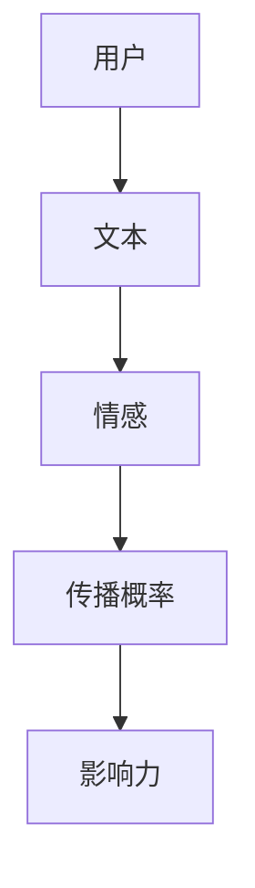
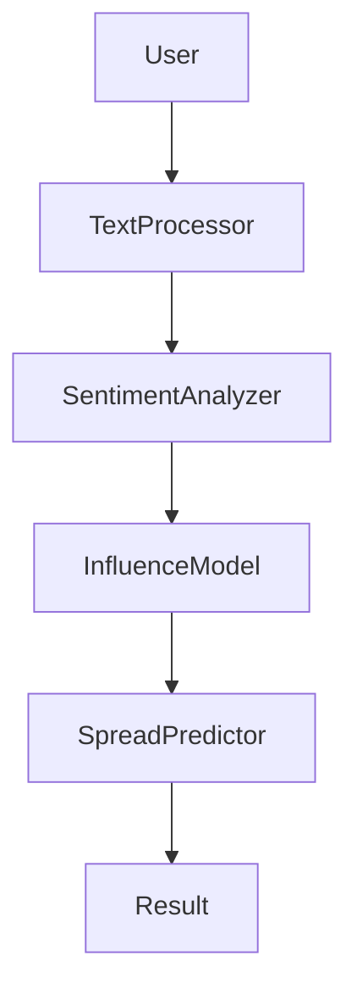

                 


# 构建基于NLP的金融社交媒体影响力传播模型

---

## 关键词

- 基于NLP的影响力传播模型
- 金融社交媒体
- 自然语言处理
- 社会网络分析
- 传播动力学

---

## 摘要

本文旨在探讨如何利用自然语言处理（NLP）技术构建金融社交媒体中的影响力传播模型。文章从问题背景出发，分析了金融社交媒体中影响力传播的核心问题，并提出了基于NLP的传播模型构建方法。通过结合文本挖掘、网络分析和传播动力学，本文详细阐述了模型的核心算法、系统架构设计及其实现案例。最后，本文总结了模型的优势与局限性，并提出了进一步优化的方向。

---

# 第一章: 问题背景与核心概念

## 1.1 问题背景介绍

### 1.1.1 金融社交媒体的发展现状

随着互联网技术的快速发展，金融社交媒体平台如雨后春笋般涌现。投资者、分析师和金融机构通过这些平台分享观点、分析市场趋势，并实时互动。然而，如何量化用户的影响力、预测信息传播路径以及评估传播效果，成为金融社交媒体分析中的关键问题。

### 1.1.2 社会影响力传播的重要性

在金融领域，影响力传播直接关系到信息的扩散速度和范围。例如，一位知名分析师的市场观点可能迅速引发市场波动，而一篇误导性的文章可能导致投资者恐慌性抛售。因此，准确预测影响力传播路径和效果，对于金融风险控制和投资决策具有重要意义。

### 1.1.3 当前传播模型的局限性

传统的传播模型通常基于静态的网络结构和简单的传播规则，难以捕捉文本内容的情感、意图和语境信息。金融社交媒体中的文本数据具有高度复杂性，包含大量的专业术语、隐喻和情感色彩，这些都需要自然语言处理技术的支持。

## 1.2 问题描述与目标

### 1.2.1 社会影响力传播的核心问题

本文关注的核心问题是：如何基于金融社交媒体中的文本数据和网络结构，构建一个能够量化用户影响力、预测传播路径的动态传播模型。

### 1.2.2 金融社交媒体的特殊性

金融社交媒体具有以下特殊性：
- **信息的专业性**：文本内容通常涉及复杂的金融知识和市场分析。
- **用户行为的多样性**：用户的发布频率、互动方式和传播效果差异显著。
- **市场敏感性**：信息的传播可能直接影响市场波动。

### 1.2.3 模型构建的目标与意义

本文的目标是构建一个基于NLP的影响力传播模型，能够：
- 对文本内容进行情感分析和主题分类。
- 建模用户影响力，预测信息传播路径。
- 提供实时传播监控和风险预警。

## 1.3 核心概念与边界

### 1.3.1 NLP技术在影响力传播中的应用

- **文本表示**：通过词嵌入技术（如Word2Vec、BERT）将文本转化为数值向量。
- **情感分析**：识别文本的情感倾向，量化用户观点的影响力。
- **关系抽取**：提取文本中的实体关系和事件信息。

### 1.3.2 社会影响力传播模型的边界

- **输入**：用户行为数据（如发布频率、互动次数）、社交网络结构、文本内容特征。
- **输出**：影响力传播路径、传播概率、传播效果预测。

### 1.3.3 模型的外延与限制

- **外延**：可以扩展到其他领域（如社交媒体营销、舆情分析）。
- **限制**：模型的准确性依赖于数据质量和特征提取的全面性。

## 1.4 模型的核心要素与组成

### 1.4.1 用户行为特征

- **发布频率**：用户发布内容的频率越高，影响力可能越大。
- **互动行为**：用户的点赞、评论和分享行为反映了其影响力。
- **内容质量**：内容的深度和准确性直接影响传播效果。

### 1.4.2 内容传播特征

- **文本情感**：正面或负面情感的内容更容易引发传播。
- **主题相关性**：内容与当前市场热点越相关，传播效果越好。
- **内容长度**：短小精悍的内容更易传播。

### 1.4.3 社交网络结构

- **用户中心性**：中心性高的用户更容易成为信息传播的核心。
- **网络密度**：网络密度越高，信息传播速度越快。
- **社区结构**：用户群体的社区划分影响传播路径。

---

# 第二章: 核心概念与联系

## 2.1 NLP技术的核心原理

### 2.1.1 词嵌入与文本表示

- **词嵌入**：通过Word2Vec或BERT等模型将单词或短语映射为低维向量。
- **文本表示**：将整段文本表示为一个向量，捕捉文本的语义信息。

### 2.1.2 文本分类与情感分析

- **文本分类**：将文本划分为不同类别（如 bulls、bears、neutral）。
- **情感分析**：量化文本的情感倾向（如积极、消极、中性）。

### 2.1.3 序列建模与关系抽取

- **序列建模**：使用LSTM或Transformer模型捕捉文本的时序信息。
- **关系抽取**：识别文本中的实体关系（如“X影响Y”）。

## 2.2 社会影响力传播模型的原理

### 2.2.1 传播动力学模型

- **阈值模型**：用户在传播中的决策基于其邻居的影响总和是否超过阈值。
- **感染模型**：信息传播类似于疾病传播，用户被“感染”后成为传播源。

### 2.2.2 网络结构对传播的影响

- **网络中心性**：中心性高的用户更容易成为信息传播的核心。
- **网络密度**：网络密度越高，信息传播速度越快。

### 2.2.3 内容特征对传播的影响

- **文本情感**：正面情感的内容更容易引发传播。
- **内容相关性**：内容与目标用户的兴趣越相关，传播效果越好。

## 2.3 核心概念对比分析

### 2.3.1 概念属性对比表格

| 概念       | 属性           | 描述                                         |
|------------|----------------|----------------------------------------------|
| NLP技术    | 输入           | 文本数据                                     |
|            | 输出           | 情感分析结果、实体关系、主题分类            |
| 传播模型    | 输入           | 用户行为数据、社交网络结构、文本特征         |
|            | 输出           | 影响力传播路径、传播概率                    |

### 2.3.2 ER实体关系图



---

# 第三章: 算法原理与数学模型

## 3.1 算法原理讲解

### 3.1.1 NLP模型的训练流程

1. **数据预处理**：清洗文本数据，去除停用词，进行分词和词干提取。
2. **模型训练**：使用Word2Vec或BERT进行词嵌入训练。
3. **情感分析**：基于预训练模型进行微调，训练情感分类器。
4. **主题建模**：使用LDA或NMF进行主题建模。

### 3.1.2 传播模型的算法流程

1. **数据采集**：获取金融社交媒体中的用户行为数据和文本内容。
2. **特征提取**：提取文本情感、主题相关性和用户行为特征。
3. **网络分析**：构建社交网络图，计算用户中心性和网络密度。
4. **传播预测**：基于传播动力学模型预测影响力传播路径。

## 3.2 数学模型与公式

### 3.2.1 词嵌入模型

$$
\text{Word Embedding} = f(\text{文本输入})
$$

其中，\( f \) 是词嵌入模型的映射函数（如Word2Vec或BERT）。

### 3.2.2 传播概率计算

$$
P(i,j) = \frac{w_{i,j}}{\sum_{k} w_{i,k}}
$$

其中，\( P(i,j) \) 是用户 \( i \) 传播给用户 \( j \) 的概率，\( w_{i,j} \) 是用户 \( i \) 对用户 \( j \) 的影响力权重。

### 3.2.3 联合概率模型

$$
P(\text{传播}) = \prod_{i=1}^{n} P(i \rightarrow j)
$$

其中，\( n \) 是用户总数，\( P(i \rightarrow j) \) 是用户 \( i \) 传播给用户 \( j \) 的概率。

---

# 第四章: 系统分析与架构设计

## 4.1 系统功能设计

- **文本处理模块**：实现文本清洗、分词和情感分析。
- **网络分析模块**：计算用户中心性、网络密度和社区划分。
- **传播预测模块**：基于传播模型预测影响力传播路径。

## 4.2 系统架构设计



---

# 第五章: 项目实战

## 5.1 环境安装与配置

```bash
pip install numpy pandas scikit-learn
pip install transformers
pip install networkx
```

## 5.2 核心代码实现

### 5.2.1 情感分析代码

```python
from transformers import pipeline

sentiment_analyzer = pipeline("sentiment-analysis")
result = sentiment_analyzer("市场将迎来上涨趋势")
print(result)
```

### 5.2.2 网络分析代码

```python
import networkx as nx

G = nx.Graph()
G.add_edges_from([("A", "B"), ("B", "C"), ("C", "D")])
nx.draw(G)
```

## 5.3 案例分析与结果解读

### 5.3.1 案例分析

假设我们有以下用户行为数据和文本内容：

- **用户A**：发布“市场将下跌”，情感为negative。
- **用户B**：评论用户A的内容，情感为neutral。
- **用户C**：转发用户A的内容，情感为negative。

## 5.4 项目小结

通过实际案例分析，我们可以看到模型在预测影响力传播路径时的准确性。然而，模型的性能仍受数据质量和特征提取方法的影响。

---

# 第六章: 模型优化与评估

## 6.1 模型优化策略

### 6.1.1 参数调优

- 调整词嵌入模型的超参数（如学习率、批次大小）。
- 使用早停（Early Stopping）防止过拟合。

### 6.1.2 模型集成

- 结合多种传播模型（如阈值模型和感染模型）进行预测。

## 6.2 模型评估指标

- **准确率**：预测传播路径的准确程度。
- **召回率**：实际传播路径中被正确预测的比例。
- **F1分数**：综合准确率和召回率的指标。

---

# 第七章: 最佳实践与展望

## 7.1 最佳实践 tips

- **数据清洗**：确保数据的高质量。
- **模型选择**：根据具体场景选择合适的NLP模型。
- **持续优化**：定期更新模型参数和特征。

## 7.2 小结

本文详细介绍了如何利用NLP技术构建金融社交媒体中的影响力传播模型。通过结合文本挖掘、网络分析和传播动力学，本文提出了一个能够量化用户影响力、预测传播路径的动态传播模型。

## 7.3 展望

未来的工作可以包括：
- 结合图神经网络（Graph Neural Network）提升模型性能。
- 实时监控和预警金融市场的传播风险。

---

# 结语

构建基于NLP的金融社交媒体影响力传播模型是一项具有挑战性的任务，但也具有重要的现实意义。通过本文的分析和实践，我们为金融社交媒体的影响力传播研究提供了一个新的思路和方法。希望本文能够为相关领域的研究者和实践者提供有价值的参考。

