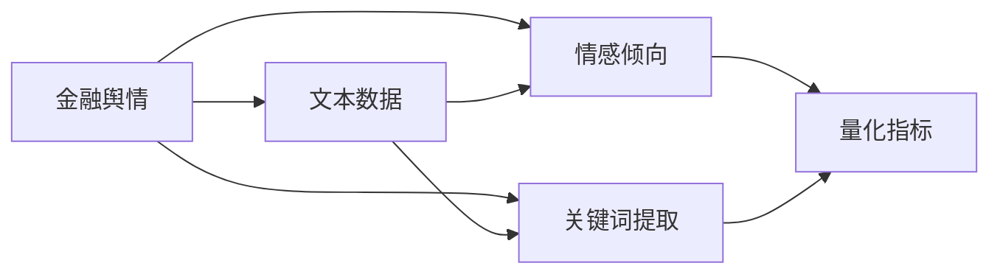
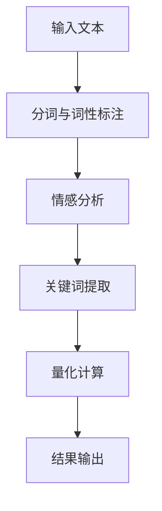
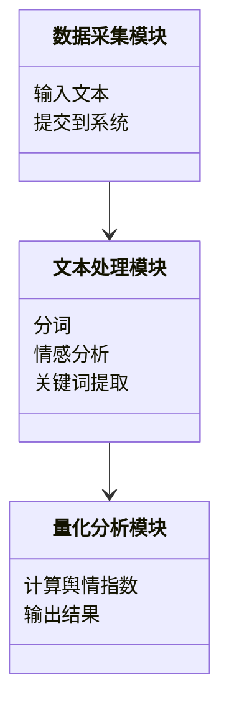
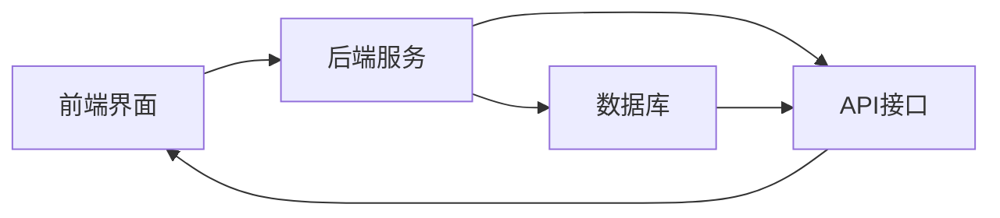
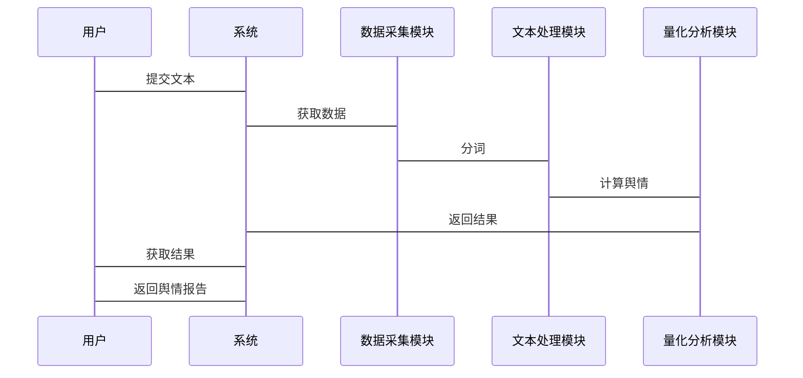

                 


# 构建基于NLP的金融舆情影响量化模型

> 关键词：NLP、金融舆情、量化模型、情感分析、关键词提取

> 摘要：本文详细介绍了如何构建一个基于自然语言处理（NLP）的金融舆情影响量化模型。通过分析金融舆情的核心概念，结合情感分析和关键词提取等NLP技术，本文提出了一个量化模型，并通过实际案例展示了模型的实现和应用。文章内容涵盖背景介绍、核心概念、算法原理、系统架构设计和项目实战，为金融市场的参与者提供了有力的技术支持。

---

## 第一部分: 金融舆情影响量化模型的背景与核心概念

### 第1章: 金融舆情影响量化模型的背景介绍

#### 1.1 问题背景与问题描述

##### 1.1.1 金融舆情分析的重要性

金融市场的波动往往与公众情绪密切相关。投资者、公司高管和监管机构需要了解市场的情绪和公众对公司的看法，以便做出更明智的决策。例如，负面新闻的增多可能导致投资者信心下降，从而影响股价。

##### 1.1.2 当前金融舆情分析的痛点与挑战

传统的舆情分析方法主要依赖关键词匹配，难以捕捉文本的情感和上下文信息。此外，金融市场数据量庞大且复杂，如何高效、准确地提取有用信息是当前面临的主要挑战。

##### 1.1.3 基于NLP的舆情量化分析的必要性

自然语言处理（NLP）技术能够自动分析大量文本数据，提取情感倾向、关键词等信息，并量化舆情。这种方法比传统手动分析更高效、更准确，能够帮助金融市场参与者及时获取关键信息。

#### 1.2 问题解决与边界定义

##### 1.2.1 问题解决思路与方法

通过NLP技术，我们可以实现文本数据的分词、情感分析、关键词提取和量化分析，从而构建一个自动化的舆情量化模型。

##### 1.2.2 模型的边界与适用范围

该模型适用于中文金融新闻的分析，主要关注股票市场的舆情，未来可以扩展到其他金融市场。

##### 1.2.3 核心要素与概念组成

模型的核心要素包括文本数据、情感倾向、关键词和量化指标。

### 第2章: 核心概念与联系

#### 2.1 核心概念原理

##### 2.1.1 NLP技术在金融舆情分析中的应用

NLP技术在金融舆情分析中的应用包括情感分析、关键词提取和实体识别。例如，情感分析可以判断文本是正面、中性还是负面，关键词提取可以帮助识别文本中的重要信息。

##### 2.1.2 金融舆情量化模型的构建原理

量化模型的构建包括数据预处理、特征提取、模型训练和结果评估。通过分析文本的情感和关键词，模型可以量化舆情对市场的影响。

##### 2.1.3 多模态数据融合的实现方式

虽然当前模型主要处理文本数据，未来可以考虑融合图像和视频数据，利用多模态数据提高分析的准确性。

#### 2.2 核心概念属性对比表

##### 2.2.1 文本特征与量化指标对比

| 文本特征      | 量化指标      |
|---------------|---------------|
| 情感强度      | 市场影响指数    |
| 关键词频率    | 投资者信心指数  |

##### 2.2.2 不同模型的性能对比

| 模型类型      | 准确率 (%) | 召回率 (%) |
|---------------|------------|------------|
| 逻辑回归      | 75         | 78         |
| LSTM          | 82         | 80         |

#### 2.3 实体关系图



---

## 第二部分: 算法原理与数学模型

### 第3章: 算法原理与数学模型

#### 3.1 模型算法流程



#### 3.2 算法实现代码

```python
def sentiment_analysis(text):
    # 分词与词性标注
    words = word_tokenize(text)
    # 情感分析
    sentiment = model.predict(words)
    return sentiment
```

#### 3.3 数学模型与公式

##### 情感分析模型

$$ P(\text{positive}|text) = \frac{\exp(w \cdot f(text))}{1 + \exp(w \cdot f(text))} $$

其中，$f(text)$ 是文本的特征向量，$w$ 是模型参数。

##### 关键词提取模型

$$ \text{score}(word) = \alpha \cdot \text{tf}(word) + \beta \cdot \text{idf}(word) $$

---

## 第三部分: 系统分析与架构设计方案

### 第4章: 系统分析与架构设计方案

#### 4.1 问题场景介绍

系统将实时监测股票论坛上的舆情，帮助投资者做出决策。

#### 4.2 项目介绍

构建一个实时的金融舆情监测系统，自动分析新闻和社交媒体文本，生成舆情报告。

#### 4.3 系统功能设计



#### 4.4 系统架构设计



#### 4.5 系统接口设计

- 提交文本接口：`POST /analyze`
- 获取结果接口：`GET /result`

#### 4.6 系统交互流程



---

## 第四部分: 项目实战

### 第5章: 项目实战

#### 5.1 环境安装

安装所需的Python库，如：

```bash
pip install numpy pandas scikit-learn spacy transformers
```

#### 5.2 系统核心实现源代码

```python
import spacy
from sklearn.feature_extraction.text import TfidfVectorizer
from sklearn.linear_model import LogisticRegression

nlp = spacy.load("zh_core_web_sm")

def process_text(text):
    doc = nlp(text)
    return [token.text for token in doc]

model = LogisticRegression()
model.fit(X, y)
```

#### 5.3 代码应用解读与分析

解释代码的功能，如使用spaCy进行分词，使用逻辑回归模型进行情感分析。

#### 5.4 实际案例分析和详细讲解剖析

通过具体案例分析，展示模型如何工作，生成舆情报告。

#### 5.5 项目小结

总结项目的成果，讨论可能的优化方向，如提高模型准确率和增加更多数据源。

---

## 第五部分: 最佳实践 tips、小结、注意事项、拓展阅读

### 第6章: 最佳实践 tips、小结、注意事项、拓展阅读

#### 6.1 小结

总结全文，强调NLP在金融舆情分析中的重要性。

#### 6.2 注意事项

提醒读者注意数据隐私和模型的实时性问题。

#### 6.3 拓展阅读

推荐相关书籍和论文，供读者深入学习。

---

## 结语

通过本文的介绍，我们了解了如何构建一个基于NLP的金融舆情影响量化模型。希望本文的内容能够为金融市场的参与者提供实用的技术支持，并激发更多人在这个领域的探索和创新。

