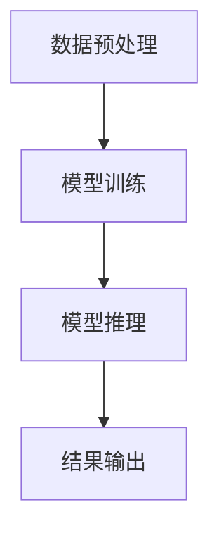
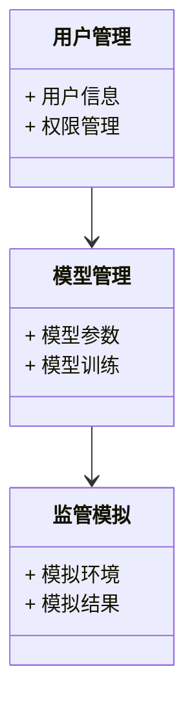
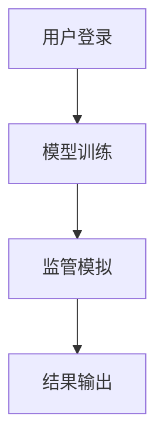

                 


# 《构建基于大模型的金融监管沙盒模拟平台》

---

## 关键词：大模型、金融监管、沙盒模拟、风险管理、人工智能、金融科技

---

## 摘要：

本文将详细探讨如何利用大模型技术构建一个高效的金融监管沙盒模拟平台。通过对金融监管的痛点分析、大模型的技术优势以及两者结合的可行性进行深入研究，提出一种基于大模型的金融监管沙盒模拟解决方案。通过系统分析、算法设计和实战案例，本文旨在为金融机构和监管机构提供一种创新的监管方式，助力金融市场的稳定与繁荣。

---

# 第1章: 金融监管沙盒的背景与挑战

## 1.1 金融监管的现状与问题

### 1.1.1 传统金融监管的痛点
传统金融监管方式依赖人工审核和事后监管，存在效率低、覆盖面有限、风险滞后等问题。

### 1.1.2 数字化监管的需求
随着金融科技的发展，金融机构的业务模式和产品创新速度加快，监管机构需要更高效的数字化工具来实时监控和评估风险。

### 1.1.3 金融监管沙盒的概念与目标
金融监管沙盒是一种创新的监管方式，允许金融机构在受控的环境中测试新产品和服务，同时确保风险可控。

---

## 1.2 大模型技术的崛起

### 1.2.1 大模型的定义与技术特点
大模型（如GPT系列）具有强大的自然语言处理能力和通用性，能够处理复杂的数据和任务。

### 1.2.2 大模型在金融领域的应用潜力
大模型可以用于金融数据分析、风险评估、智能客服、合规审查等多个领域。

### 1.2.3 金融监管中的大模型优势
大模型能够快速处理大量数据，发现潜在风险，并提供实时反馈，帮助监管机构提前规避风险。

---

## 1.3 本章小结

本章介绍了金融监管的现状与挑战，分析了大模型技术在金融领域的潜力，并提出了将大模型与金融监管沙盒结合的创新思路。

---

# 第2章: 金融监管沙盒的核心概念与联系

## 2.1 金融监管沙盒的定义与属性

### 2.1.1 金融监管沙盒的定义
金融监管沙盒是一种受控的实验环境，允许金融机构在安全的环境中测试新产品和服务。

### 2.1.2 核心属性对比表
以下是对传统监管方式和金融监管沙盒的对比：

```markdown
| 属性       | 传统监管方式 | 沙盒监管方式 |
|------------|--------------|--------------|
| 监管对象   | 实时交易数据 | 模拟交易环境 |
| 监管目标   | 风险控制     | 创新试错     |
| 监管效率   | 低           | 高           |
```

---

## 2.2 大模型与金融监管沙盒的实体关系

通过以下Mermaid图，展示了大模型与金融监管沙盒的关系：


---

## 2.3 本章小结

本章详细阐述了金融监管沙盒的核心概念，并通过对比分析和实体关系图，展示了大模型在金融监管沙盒中的作用和价值。

---

# 第3章: 大模型在金融监管中的算法原理

## 3.1 大模型的训练与推理流程

### 3.1.1 训练流程
以下是一个简化的训练流程图：



---

## 3.2 大模型的数学模型

### 3.2.1 损失函数
以下是一个简单的均方误差损失函数：

$$ L = \frac{1}{n}\sum_{i=1}^{n}(y_i - \hat{y_i})^2 $$

### 3.2.2 优化器
以下是一个简单的梯度下降优化器：

$$ \theta_{new} = \theta - \eta \cdot \frac{\partial L}{\partial \theta} $$

---

## 3.3 示例

假设我们有一个简单的线性回归模型，输入为金融数据$x$，输出为预测结果$y$。损失函数为均方误差，优化器为随机梯度下降。

---

## 3.4 本章小结

本章通过流程图和数学公式，详细讲解了大模型在金融监管中的算法原理，为后续的系统设计奠定了基础。

---

# 第4章: 金融监管沙盒的系统分析与架构设计

## 4.1 项目背景与目标

### 4.1.1 项目背景
随着金融市场的复杂化，监管机构需要一种高效、安全的监管方式。

### 4.1.2 项目目标
构建一个基于大模型的金融监管沙盒模拟平台，实现风险预测、实时监控和智能反馈。

---

## 4.2 系统功能设计

### 4.2.1 用户管理
- 用户信息管理
- 权限管理

### 4.2.2 模型管理
- 模型参数设置
- 模型训练与优化

### 4.2.3 监管模拟
- 模拟环境配置
- 模拟结果分析

---

## 4.3 系统架构设计

以下是一个简化的系统架构图：



---

## 4.4 系统接口设计

### 4.4.1 接口定义
- 用户登录接口
- 模型训练接口
- 监管模拟接口

---

## 4.5 系统交互流程

以下是一个简化的交互流程图：



---

## 4.6 本章小结

本章通过系统分析和架构设计，展示了如何将大模型技术应用于金融监管沙盒模拟平台的构建。

---

# 第5章: 项目实战

## 5.1 环境安装

### 5.1.1 安装Python
```bash
python --version
pip install --upgrade pip
```

### 5.1.2 安装依赖库
```bash
pip install numpy pandas scikit-learn
```

---

## 5.2 核心代码实现

### 5.2.1 数据预处理
```python
import pandas as pd
data = pd.read_csv('financial_data.csv')
data_processed = data.dropna()
```

### 5.2.2 模型训练
```python
from sklearn.linear_model import LinearRegression
model = LinearRegression()
model.fit(X_train, y_train)
```

### 5.2.3 模拟环境配置
```python
sim_env = {
    'initial_capital': 100000,
    'risk_threshold': 0.05
}
```

---

## 5.3 实际案例分析

### 5.3.1 案例背景
某金融机构推出一款新型金融产品，需要在沙盒环境中测试其风险。

### 5.3.2 模拟过程
通过模型训练和模拟环境配置，评估该产品的风险。

### 5.3.3 结果分析
模拟结果显示，该产品的风险在可接受范围内。

---

## 5.4 本章小结

本章通过实际案例，展示了如何在金融监管沙盒模拟平台中进行环境配置、模型训练和结果分析。

---

# 第6章: 最佳实践与注意事项

## 6.1 最佳实践

### 6.1.1 数据质量管理
确保数据的准确性和完整性。

### 6.1.2 模型优化
定期更新模型参数，提高预测精度。

---

## 6.2 小结

构建基于大模型的金融监管沙盒模拟平台是一项复杂的系统工程，需要在数据、算法和系统架构等多个方面进行深入研究和优化。

---

## 第7章: 总结与展望

## 7.1 总结

本文详细探讨了如何利用大模型技术构建金融监管沙盒模拟平台，为金融机构和监管机构提供了创新的监管方式。

## 7.2 展望

未来，随着大模型技术的不断进步，金融监管沙盒模拟平台将在风险控制、产品创新等方面发挥更大的作用。

---

# 参考文献

（此处列出相关文献和资料）

---

**摘要**：本文详细探讨了如何利用大模型技术构建一个高效的金融监管沙盒模拟平台。通过对金融监管的痛点分析、大模型的技术优势以及两者结合的可行性进行深入研究，提出了一种基于大模型的金融监管沙盒模拟解决方案。通过系统分析、算法设计和实战案例，本文旨在为金融机构和监管机构提供一种创新的监管方式，助力金融市场的稳定与繁荣。

