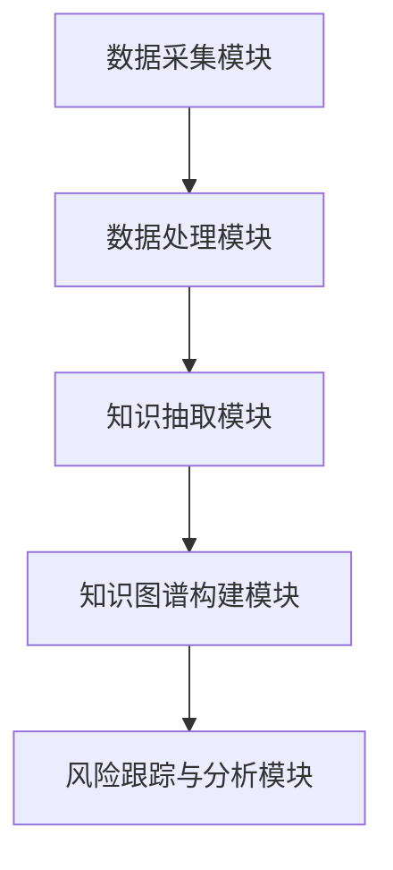
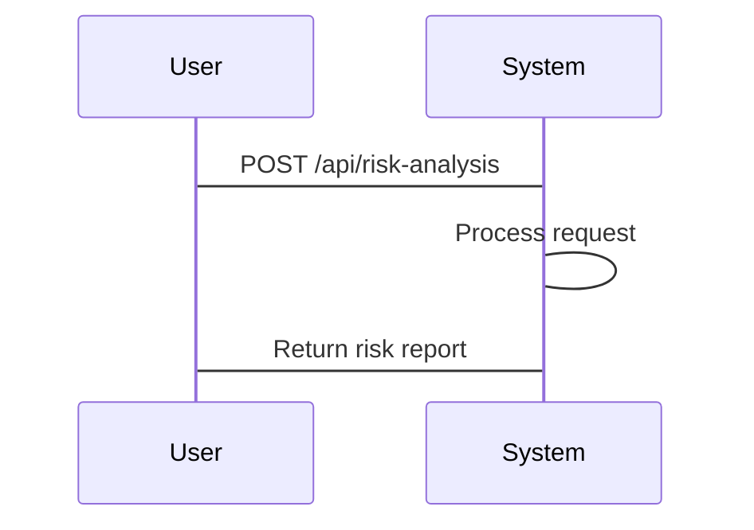

                 


# 构建基于知识图谱的金融产品全生命周期风险跟踪系统

> 关键词：知识图谱、金融产品、风险跟踪、全生命周期、系统设计、算法原理

> 摘要：本文详细探讨了如何基于知识图谱构建金融产品全生命周期风险跟踪系统。通过分析金融产品管理的核心挑战，提出了一种结合知识图谱技术的解决方案，涵盖了从数据采集、知识抽取到风险分析的完整流程。文章详细介绍了系统的总体架构、关键算法原理、项目实现步骤以及实际应用案例，为金融行业的风险管理提供了新的思路。

---

# 第一部分：背景与目标

## 第1章：问题背景与目标

### 1.1 问题背景

#### 1.1.1 金融产品全生命周期管理的挑战
金融产品的全生命周期包括研发、发行、运营和终止四个阶段。在每个阶段中，风险的识别与跟踪至关重要。传统方法依赖于孤立的数据库和简单的统计分析，难以捕捉跨部门、跨产品的复杂风险关系。例如，一款创新型金融产品可能涉及多个市场的联动风险，传统的 siloed 数据库无法有效关联这些信息。

#### 1.1.2 风险跟踪的现状与痛点
当前的金融风险跟踪系统主要依赖于传统的数据分析工具，如 Excel 和 SQL 数据库。这些工具难以处理复杂的关系型数据，也无法进行实时的知识关联。例如，在发现某一产品的信用风险上升时，无法快速关联到其他可能受影响的产品或市场。

#### 1.1.3 知识图谱在金融领域的潜力
知识图谱是一种以图结构形式表示知识的技术，能够有效地捕捉实体之间的复杂关系。在金融领域，知识图谱可以用于构建金融产品、市场、客户、风险之间的关联网络，从而实现更智能的风险跟踪和预警。

### 1.2 问题描述

#### 1.2.1 金融产品全生命周期的关键环节
金融产品的全生命周期包括：
1. 研发阶段：产品设计、风险评估。
2. 发行阶段：产品上线、市场推广。
3. 运营阶段：实时监控、风险预警。
4. 终止阶段：产品退市、风险处置。

#### 1.2.2 风险跟踪的核心问题
- 如何实时捕捉金融产品的风险变化？
- 如何关联不同产品之间的潜在风险？
- 如何快速响应风险事件并制定应对策略？

#### 1.2.3 知识图谱如何解决这些问题
知识图谱通过构建金融产品、市场、客户等实体之间的关系网络，可以实现：
- 实时跟踪产品的风险特征。
- 快速关联相关产品和市场风险。
- 提供基于知识的智能预警和决策支持。

### 1.3 系统目标与边界

#### 1.3.1 系统的核心目标
- 实时构建金融产品知识图谱。
- 提供全生命周期的风险跟踪能力。
- 支持基于知识图谱的智能风险预警。

#### 1.3.2 系统的边界与外延
- 数据范围：仅限于金融产品的全生命周期数据。
- 时间范围：从产品研发到产品终止的整个生命周期。
- 用户范围：限于金融机构内部的风控团队和产品管理部门。

#### 1.3.3 系统的组成部分与功能
- 数据采集模块：负责采集金融产品的全生命周期数据。
- 知识抽取模块：从数据中提取实体和关系。
- 知识图谱构建模块：构建金融产品知识图谱。
- 风险跟踪模块：基于知识图谱进行风险分析和预警。

### 1.4 本章小结
本章从金融产品全生命周期管理的挑战出发，分析了传统风险跟踪方法的局限性，并提出了基于知识图谱的解决方案。系统的核心目标是构建金融产品知识图谱，并利用其进行全生命周期的风险跟踪和预警。

---

# 第二部分：知识图谱的核心概念与原理

## 第2章：知识图谱的核心概念与原理

### 2.1 知识图谱的定义与特点

#### 2.1.1 知识图谱的定义
知识图谱是一种以图结构形式表示知识的技术，由节点（实体）和边（关系）组成。例如，节点可以代表金融产品、客户、市场，边可以代表“属于”、“影响”等关系。

#### 2.1.2 知识图谱的核心特点
- **语义丰富**：能够表示实体之间的复杂关系。
- **动态更新**：能够实时更新知识图谱中的信息。
- **可扩展性**：能够支持大规模数据的处理。

### 2.2 知识图谱的构建流程

#### 2.2.1 数据采集与预处理
数据来源包括：
- **结构化数据**：金融产品的基本信息、交易数据。
- **非结构化数据**：新闻、报告、社交媒体数据。

#### 2.2.2 实体识别与关系抽取
- **实体识别**：通过 NLP 技术从文本中提取实体。
- **关系抽取**：通过模式匹配或深度学习模型识别实体之间的关系。

#### 2.2.3 知识图谱的存储与管理
常用存储方式：
- **图数据库**：如Neo4j，支持高效的图查询。
- **关系型数据库**：如MySQL，适合结构化数据存储。

### 2.3 知识图谱的属性与关系建模

#### 2.3.1 实体属性的定义
例如，金融产品的属性可以包括：
- 产品名称
- 产品类型
- 产品发行日期
- 产品风险等级

#### 2.3.2 实体关系的建模
例如，产品与市场的关系可以建模为“属于”（is_a）关系。

#### 2.3.3 知识图谱的标准化表示
使用统一的命名实体（如金融产品的统一标识符）和关系类型（如“影响”、“依赖”）。

### 2.4 知识图谱的可视化与查询

#### 2.4.1 知识图谱的可视化方法
- **节点和边的布局**：使用层次布局或网格布局。
- **交互式查询**：用户可以通过拖拽节点进行查询。

#### 2.4.2 基于图的查询语言
常用查询语言：
- **Cypher**：用于Neo4j的查询语言。
- **SPARQL**：用于RDF数据的查询语言。

#### 2.4.3 知识图谱的查询优化
- **索引优化**：在图数据库中使用索引加速查询。
- **缓存机制**：缓存常用查询结果，减少查询时间。

### 2.5 本章小结
本章详细介绍了知识图谱的定义、构建流程和关系建模方法。知识图谱的可视化和查询能力为金融产品的风险跟踪提供了强有力的支持。

---

# 第三部分：系统设计与实现

## 第3章：金融产品全生命周期风险跟踪系统的设计

### 3.1 系统总体架构

#### 3.1.1 系统的分层架构
系统分为：
1. 数据采集层：负责采集金融产品的全生命周期数据。
2. 数据处理层：进行数据清洗和转换。
3. 知识图谱构建层：构建金融产品知识图谱。
4. 风险跟踪与分析层：基于知识图谱进行风险分析和预警。

#### 3.1.2 各模块的功能概述
- **数据采集模块**：从多个数据源采集数据。
- **知识抽取模块**：从数据中提取实体和关系。
- **知识图谱构建模块**：构建金融产品知识图谱。
- **风险跟踪与分析模块**：基于知识图谱进行风险分析和预警。

#### 3.1.3 系统的可扩展性设计
系统采用模块化设计，支持后续功能的扩展，如加入新的数据源或算法模型。

### 3.2 系统功能模块设计

#### 3.2.1 数据采集模块
- **功能**：从数据库、API 等数据源采集数据。
- **输入**：金融产品的基本信息、交易数据、市场数据。
- **输出**：结构化和非结构化的数据集。

#### 3.2.2 知识抽取模块
- **功能**：从文本中提取实体和关系。
- **输入**：非结构化数据（如新闻、报告）。
- **输出**：实体和关系的列表。

#### 3.2.3 知识图谱构建模块
- **功能**：构建金融产品知识图谱。
- **输入**：实体和关系的列表。
- **输出**：知识图谱（存储在图数据库中）。

#### 3.2.4 风险跟踪与分析模块
- **功能**：基于知识图谱进行风险分析和预警。
- **输入**：实时更新的知识图谱。
- **输出**：风险预警报告。

### 3.3 系统数据流设计

#### 3.3.1 数据输入流程
- 数据源：数据库、API、文件。
- 数据清洗：去除重复、无效数据。
- 数据转换：将数据转换为结构化格式。

#### 3.3.2 数据处理流程
- 数据预处理：提取实体和关系。
- 数据建模：构建知识图谱的实体和关系模型。

#### 3.3.3 知识图谱构建流程
- 数据存储：将实体和关系存储到图数据库中。
- 数据索引：建立索引以提高查询效率。

#### 3.3.4 风险跟踪流程
- 风险识别：基于知识图谱进行风险识别。
- 风险评估：评估风险的影响程度。
- 风险预警：生成风险预警报告。

### 3.4 系统架构设计

#### 3.4.1 系统架构图


#### 3.4.2 系统交互流程
- 用户输入查询请求。
- 系统查询知识图谱。
- 系统返回结果。

### 3.5 本章小结
本章详细设计了金融产品全生命周期风险跟踪系统的总体架构和功能模块。系统采用分层架构，各模块协同工作，实现金融产品的全生命周期风险管理。

---

# 第四部分：算法原理与实现

## 第4章：知识图谱构建中的算法原理

### 4.1 实体识别与关系抽取

#### 4.1.1 实体识别算法
- **规则匹配**：基于关键词匹配。
- **机器学习**：使用 CRF 或 LSTM 进行序列标注。

#### 4.1.2 关系抽取算法
- **基于规则**：模式匹配。
- **基于统计**：使用 n-gram 和词性标注。
- **基于深度学习**：使用 LSTM 或 Transformer 模型。

### 4.2 知识图谱推理

#### 4.2.1 知识图谱推理算法
- **基于规则的推理**：使用逻辑规则进行推理。
- **基于图的推理**：使用图遍历算法进行推理。

### 4.3 风险分析与预警

#### 4.3.1 风险分析算法
- **聚类分析**：基于距离度量进行风险聚类。
- **分类算法**：使用决策树、随机森林等算法进行风险分类。

#### 4.3.2 风险预警算法
- **时间序列分析**：使用 ARIMA 模型预测风险。
- **异常检测**：使用 Isolation Forest 等算法检测异常风险。

### 4.4 本章小结
本章详细介绍了知识图谱构建中的算法原理，包括实体识别、关系抽取和风险分析算法。

---

# 第五部分：项目实战与优化

## 第5章：项目实战

### 5.1 环境搭建

#### 5.1.1 系统环境
- 操作系统：Linux 或 Windows。
- 开发工具：Python、Jupyter Notebook。
- 数据库：Neo4j 图数据库。

#### 5.1.2 依赖安装
- Python 库：networkx、numpy、pandas。
- 图数据库：Neo4j 社区版。

### 5.2 知识抽取实现

#### 5.2.1 数据预处理
```python
import pandas as pd
data = pd.read_csv('financial_products.csv')
```

#### 5.2.2 实体识别
```python
from spacy import load
nlp = load('en_core_web_sm')
doc = nlp(data['description'][0])
ents = [(ent.text, ent.label_) for ent in doc.ents]
```

#### 5.2.3 关系抽取
```python
from networkx import DiGraph
graph = DiGraph()
for relation in relations:
    graph.add_edge(relation.source, relation.target, relation.type)
```

### 5.3 知识图谱构建

#### 5.3.1 数据存储
```python
from neo4j import GraphDatabase
driver = GraphDatabase.driver('bolt://localhost:7687', auth=('neo4j', 'password'))
```

#### 5.3.2 数据索引
```python
from neo4j.exceptions import CypherError
try:
    session.run('CREATE INDEX ON :Product(name)')
except CypherError:
    pass
```

### 5.4 系统集成

#### 5.4.1 系统接口
- API 接口：提供 GET 和 POST 请求。
- 数据格式：JSON 格式。

#### 5.4.2 系统交互


### 5.5 本章小结
本章通过实际案例展示了如何构建金融产品知识图谱，并实现风险跟踪与分析。

---

# 第六部分：总结与展望

## 第6章：总结与展望

### 6.1 系统总结
- **优势**：
  - 实时跟踪金融产品的风险。
  - 提供智能风险预警。
  - 支持跨产品的风险关联分析。

- **不足**：
  - 知识图谱的构建需要大量人工干预。
  - 系统的实时性有待进一步提升。

### 6.2 系统优化建议
- **优化方向**：
  - 引入自动化的知识抽取算法。
  - 提升系统的实时性。
  - 支持多语言处理。

### 6.3 未来展望
- **技术发展**：
  - 结合区块链技术，确保数据的安全性。
  - 引入 AI 赋能的知识图谱自动构建。
  
- **应用拓展**：
  - 扩展到其他金融领域，如股票、基金等。
  - 支持跨国金融产品的风险管理。

### 6.4 本章小结
本章总结了系统的优缺点，并提出了优化建议和未来的发展方向。

---

# 参考文献

- [1]《知识图谱：从概念到实现》
- [2]《金融产品风险管理实战》
- [3]《图数据库实战指南》

---

# 致谢

感谢读者的支持和关注！如果需要进一步的技术交流或合作，请随时联系！

