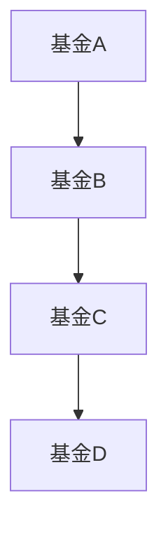
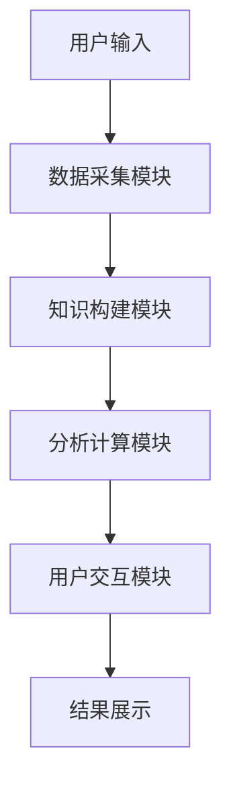
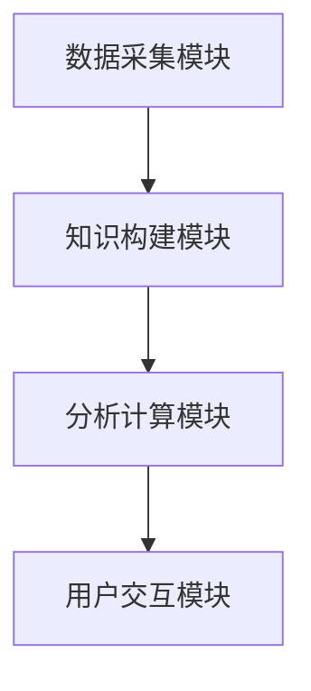

                 


# 构建基于知识图谱的金融产品比较平台

> 关键词：知识图谱、金融产品、比较平台、数据挖掘、人工智能

> 摘要：本文详细探讨了如何利用知识图谱构建一个高效、智能的金融产品比较平台。通过分析金融产品的复杂性和多样性，结合知识图谱的技术优势，提出了从数据收集、知识构建到系统设计的完整解决方案。文章还详细讲解了算法原理、系统架构设计以及项目实战，为读者提供了从理论到实践的全面指导。

---

# 第一部分: 知识图谱与金融产品比较平台概述

## 第1章: 知识图谱的概述与应用背景

### 1.1 知识图谱的基本概念

#### 1.1.1 知识图谱的定义
知识图谱是一种以图结构形式表示知识的语义网络，由节点（实体）和边（关系）组成。节点代表具体的概念、实体或事件，边表示它们之间的关系。例如，在金融领域，节点可以是“理财产品”、“基金”或“股票”，边可以是“属于”、“推荐”或“风险等级”。

#### 1.1.2 知识图谱的核心特征
1. **语义性**：知识图谱不仅仅是数据的存储，还包含数据之间的语义关系。
2. **可扩展性**：知识图谱可以动态扩展，支持新增实体和关系。
3. **结构化**：通过标准化的格式（如RDF、JSON-LD）存储，便于机器理解和分析。

#### 1.1.3 知识图谱与传统数据库的区别
传统的数据库（如关系型数据库）主要用于存储结构化数据，查询基于预定义的关系模式。而知识图谱则更注重语义连接和知识推理，能够处理非结构化和半结构化数据。

### 1.2 金融产品比较平台的背景与需求

#### 1.2.1 金融产品的复杂性与多样性
金融产品种类繁多，包括存款、贷款、基金、保险、股票等，每类产品又有多个子类别和属性。例如，基金有风险等级、历史收益、投资策略等属性；保险有保费、保障范围、理赔条件等属性。

#### 1.2.2 用户在金融产品比较中的痛点
1. **信息过载**：用户面对大量金融产品信息，难以快速找到适合自己的产品。
2. **信息不透明**：不同产品之间的关联性复杂，用户难以理解其差异和优劣。
3. **个性化需求**：用户需要根据自身需求（如风险承受能力、投资目标）进行精准匹配，传统平台难以满足。

#### 1.2.3 知识图谱在金融产品比较中的价值
知识图谱可以通过构建金融产品的知识网络，帮助用户快速理解产品之间的关系，实现智能推荐和精准匹配。例如，通过知识图谱可以分析不同基金的风险等级和历史收益，帮助用户选择最适合自己的产品。

### 1.3 本章小结
本章介绍了知识图谱的基本概念和核心特征，并结合金融产品的复杂性，阐述了知识图谱在金融产品比较中的重要性。通过分析用户的痛点，提出了构建基于知识图谱的金融产品比较平台的必要性和价值。

---

## 第2章: 金融产品比较平台的技术背景

### 2.1 知识图谱在金融领域的应用现状
知识图谱已经在金融领域得到了广泛应用，例如：
1. **智能投顾**：通过分析用户的财务状况和投资目标，推荐适合的金融产品。
2. **风险评估**：通过分析产品之间的关系，识别潜在风险。
3. **信息整合**：将分散在不同来源的金融信息整合到统一的知识网络中。

### 2.2 本章小结
本章分析了知识图谱在金融领域的应用现状，为后续的平台构建提供了背景支持。

---

# 第二部分: 知识图谱的构建与技术基础

## 第2章: 知识图谱的构建流程

### 2.1 数据收集与预处理

#### 2.1.1 数据来源与多样性
数据来源包括：
1. **公开数据**：如金融监管机构发布的数据、上市公司的财报。
2. **第三方API**：如基金评级机构的数据接口。
3. **用户生成内容**：如用户的评论、评分。

#### 2.1.2 数据清洗与标准化
数据清洗步骤包括：
1. **去重**：去除重复数据。
2. **补全**：填充缺失值。
3. **格式统一**：将不同来源的数据格式统一。

#### 2.1.3 数据标注与结构化
通过NLP技术对文本数据进行标注，提取实体和关系。例如，从新闻中提取“基金A”与“基金经理B”之间的关系。

### 2.2 知识抽取与建模

#### 2.2.1 实体识别与提取
使用NER（Named Entity Recognition）算法从文本中提取实体。例如，从“基金XYZ由经理张三管理”中提取“基金XYZ”和“张三”。

#### 2.2.2 关系抽取与建模
通过关系抽取算法（如RElation Extraction）识别实体之间的关系。例如，从“基金XYZ属于风险等级中等”中抽取“基金XYZ”与“风险等级中等”的关系。

#### 2.2.3 知识图谱的构建算法
常用的构建算法包括：
1. **基于规则的构建**：通过预定义的规则提取实体和关系。
2. **基于统计的构建**：通过统计模型（如条件随机场）提取实体和关系。
3. **基于深度学习的构建**：使用神经网络（如LSTM）进行关系抽取。

### 2.3 知识图谱的存储与管理

#### 2.3.1 图数据库的选择与使用
常用的图数据库包括：
1. **Neo4j**：支持关系型查询，适合中小规模的数据。
2. **Neo4j Enterprise**：支持企业级功能，适合大规模数据。
3. **OrientDB**：支持文档和图数据模型，适合混合型数据。

#### 2.3.2 知识图谱的存储结构
知识图谱的存储结构包括：
1. **节点**：表示实体，如“基金XYZ”。
2. **边**：表示关系，如“属于风险等级中等”。

#### 2.3.3 知识图谱的更新与维护
通过定期爬取新数据并更新知识图谱，确保数据的时效性。

### 2.4 本章小结
本章详细讲解了知识图谱的构建流程，包括数据收集、预处理、知识抽取与建模，以及存储与管理。通过这些步骤，可以构建一个完整的金融产品知识图谱。

---

# 第三部分: 基于知识图谱的金融产品分析

## 第3章: 金融产品比较的核心算法与模型

### 3.1 基于知识图谱的相似度计算

#### 3.1.1 Word2Vec在金融产品中的应用
Word2Vec是一种用于词向量表示的算法，可以用于表示金融产品的属性和关系。例如，将“基金”和“理财产品”表示为向量，计算它们的相似度。

#### 3.1.2 基于图嵌入的相似度计算
图嵌入算法（如TransE、GAT）可以将知识图谱中的节点表示为向量，计算节点之间的相似度。例如，计算基金A和基金B的相似度。

#### 3.1.3 基于知识图谱的推荐算法
通过分析用户的历史行为（如点击、购买）和产品属性，推荐相似的金融产品。例如，推荐与用户已购买的基金相似的产品。

### 3.2 金融产品属性与关系的建模

#### 3.2.1 金融产品的核心属性
1. **风险等级**：如低风险、中风险、高风险。
2. **收益类型**：如固定收益、浮动收益。
3. **投资期限**：如短期、中期、长期。

#### 3.2.2 产品之间的关系建模
1. **推荐关系**：如基金A推荐给风险承受能力较高的用户。
2. **替代关系**：如基金A可以替代基金B。
3. **组合关系**：如基金A和基金B可以组合成一个投资组合。

#### 3.2.3 知识图谱中的实体关系图
使用Mermaid图展示金融产品的实体关系图，例如：



### 3.3 本章小结
本章详细讲解了基于知识图谱的金融产品分析算法，包括相似度计算和推荐算法。通过这些算法，可以实现金融产品的智能推荐和精准匹配。

---

# 第四部分: 系统架构与实现

## 第4章: 系统架构设计与实现

### 4.1 系统功能设计

#### 4.1.1 用户需求分析
用户需求包括：
1. **产品比较**：用户可以输入多个金融产品，进行比较。
2. **智能推荐**：系统根据用户需求推荐相关产品。
3. **知识图谱可视化**：用户可以查看金融产品的知识图谱。

#### 4.1.2 系统功能模块划分
系统功能模块包括：
1. **数据采集模块**：负责数据的采集和预处理。
2. **知识构建模块**：负责知识图谱的构建。
3. **分析计算模块**：负责相似度计算和推荐算法。
4. **用户交互模块**：负责与用户的交互和结果展示。

#### 4.1.3 系统功能流程图
使用Mermaid图展示系统功能流程图，例如：



### 4.2 系统架构设计

#### 4.2.1 分层架构设计
系统架构采用分层架构，包括：
1. **数据层**：负责数据的存储和管理。
2. **服务层**：负责业务逻辑的实现。
3. **表现层**：负责用户界面的展示。

#### 4.2.2 微服务架构设计
系统架构采用微服务架构，包括：
1. **数据服务**：负责数据的存储和查询。
2. **知识构建服务**：负责知识图谱的构建和更新。
3. **分析服务**：负责相似度计算和推荐算法。

#### 4.2.3 系统组件间的交互关系
使用Mermaid图展示系统组件间的交互关系，例如：



### 4.3 接口设计与实现

#### 4.3.1 API接口
系统设计了以下API接口：
1. `/api/v1/fetch_data`：用于数据采集。
2. `/api/v1/build_kg`：用于知识图谱构建。
3. `/api/v1/recommend`：用于智能推荐。

#### 4.3.2 API接口的设计原则
1. **RESTful原则**：采用RESTful风格设计接口。
2. **可扩展性**：接口设计具有良好的扩展性，便于后续功能的添加。
3. **安全性**：采用JWT进行身份认证和权限控制。

### 4.4 本章小结
本章详细讲解了系统的架构设计和接口设计，为后续的系统实现奠定了基础。

---

# 第五部分: 项目实战

## 第5章: 项目实战与代码实现

### 5.1 环境搭建

#### 5.1.1 安装依赖
安装以下依赖：
1. Python 3.8+
2. pip install neo4j
3. pip install spacy
4. pip install word2vec

#### 5.1.2 数据准备
准备金融产品的数据，包括：
1. 基金数据
2. 股票数据
3. 保险数据

### 5.2 系统核心实现

#### 5.2.1 数据预处理代码
```python
import pandas as pd

# 读取数据
df = pd.read_csv('financial_products.csv')

# 数据清洗
df.dropna(inplace=True)
df.drop_duplicates(inplace=True)

# 数据标注
from spacy.lang.zh import Chinese

nlp = Chinese()
doc = nlp(df['description'][0])
entities = [token.text for token in doc.ents]
```

#### 5.2.2 知识图谱构建代码
```python
from neo4j import GraphDatabase

# 连接数据库
driver = GraphDatabase.driver('neo4j://localhost:7687', auth=('neo4j', 'password'))

# 创建节点
def create_node(tx, label, properties):
    tx.run('CREATE (:{} {{})'.format(label, properties))

# 创建关系
def create_relation(tx, start_node, end_node, relation):
    tx.run('MATCH (a:{}), (b:{}) WHERE a.id = {} AND b.id = {} CREATE (a)-[r:{}]->(b)'.format(start_node['label'], end_node['label'], start_node['id'], end_node['id'], relation))

# 使用事务
with driver.session() as session:
    session.write_transaction(create_node, 'Product', {'name': '基金A'})
    session.write_transaction(create_node, 'Manager', {'name': '张三'})
    session.write_transaction(create_relation, {'label': 'Product', 'id': '基金A'}, {'label': 'Manager', 'id': '张三'}, 'managed_by')
```

#### 5.2.3 分析计算代码
```python
from sklearn.metrics.pairwise import cosine_similarity

# 计算相似度
def calculate_similarity(products):
    # 将产品向量化
    vectors = [get_product_vector(p) for p in products]
    # 计算余弦相似度
    similarity_matrix = cosine_similarity(vectors)
    return similarity_matrix

# 推荐算法
def recommend_products(similarity_matrix, user_input):
    # 根据相似度排序
    sorted_indices = similarity_matrix[user_input].argsort()[::-1]
    return [products[i] for i in sorted_indices]
```

### 5.3 项目小结
本章通过具体的代码实现，展示了如何构建基于知识图谱的金融产品比较平台。从数据预处理到知识图谱构建，再到分析计算，每个步骤都进行了详细的实现和解释。

---

# 第六部分: 总结与展望

## 第6章: 总结与展望

### 6.1 总结
本文详细探讨了如何利用知识图谱构建一个高效、智能的金融产品比较平台。通过分析金融产品的复杂性和多样性，结合知识图谱的技术优势，提出了从数据收集、知识构建到系统设计的完整解决方案。通过具体的代码实现，展示了如何构建基于知识图谱的金融产品比较平台。

### 6.2 展望
未来的工作可以包括：
1. **优化算法**：进一步优化相似度计算算法，提高推荐的准确性。
2. **扩展数据源**：引入更多数据源，丰富知识图谱的内容。
3. **增强交互性**：优化用户界面，提高用户体验。

### 6.3 注意事项
在实际应用中，需要注意以下几点：
1. **数据隐私**：确保数据的安全性和隐私性。
2. **性能优化**：优化系统的性能，提高响应速度。
3. **持续更新**：定期更新知识图谱，确保数据的时效性。

### 6.4 拓展阅读
建议读者进一步阅读以下内容：
1. 《知识图谱：概念、方法与应用》
2. 《深度学习在金融领域的应用》
3. 《图数据库：原理与实践》

### 6.5 本章小结
本章总结了本文的主要内容，并展望了未来的研究方向。通过本文的探讨，读者可以对基于知识图谱的金融产品比较平台有一个全面的了解。

---

# 附录

## 附录A: 知识图谱相关工具与库

### A.1 图数据库
1. **Neo4j**：https://neo4j.com/
2. **OrientDB**：https://orientdb.com/

### A.2 知识图谱构建工具
1. **Ubergraph**：https://www.insidera.com/
2. **RDF4J**：https://rdf4j.org/

### A.3 知识图谱可视化工具
1. **Gephi**：https://gephi.org/
2. **Neo4j Browser**：https://neo4j.com/browser/

## 附录B: 项目代码示例

```python
# 示例代码：知识图谱构建
import neo4j
from neo4j.exceptions import Neo4jError

# 连接数据库
driver = neo4j.GraphDatabase.driver('neo4j://localhost:7687', auth=('neo4j', 'password'))

# 创建节点和关系
def create_knowledge_graph(tx, entities, relations):
    for entity in entities:
        tx.run('CREATE (:Entity {{name: "{}"}})'.format(entity))
    for relation in relations:
        tx.run('MATCH (a), (b) WHERE a.name = "{}" AND b.name = "{}" CREATE (a)-[r:RELATED_TO]->(b)'.format(relation[0], relation[1]))

# 使用事务
with driver.session() as session:
    session.write_transaction(create_knowledge_graph, ['基金A', '基金B', '基金C'], [('基金A', '基金B')])
```

---

以上是基于知识图谱的金融产品比较平台的完整构建过程，从理论到实践，详细讲解了每个步骤的技术细节和实现方法。通过本文的探讨，读者可以深入了解如何利用知识图谱技术解决金融产品比较中的复杂问题，并为后续的研究和应用提供参考。

