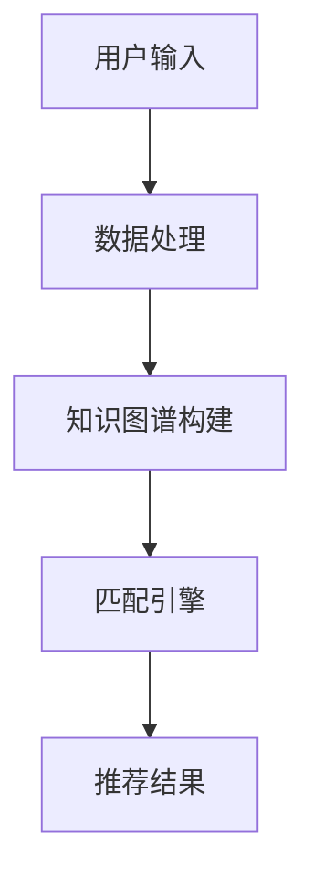

                 


# 构建基于知识图谱的金融产品适当性匹配引擎

> 关键词：知识图谱，金融产品，适当性匹配，人工智能，系统架构

> 摘要：本文详细探讨了如何利用知识图谱构建金融产品适当性匹配引擎。首先介绍了问题背景和需求分析，随后阐述了知识图谱的核心概念与联系，接着深入讲解了知识图谱的构建算法原理，再通过系统分析与架构设计展示了如何实现这一引擎。最后，通过项目实战部分，给出了实际案例分析和代码实现，总结了经验与未来发展方向。

---

# 目录

1. [第一部分: 基于知识图谱的金融产品适当性匹配引擎概述](#第一部分-基于知识图谱的金融产品适当性匹配引擎概述)
2. [第1章: 问题背景与需求分析](#第1章-问题背景与需求分析)
3. [第2章: 知识图谱的核心概念与联系](#第2章-知识图谱的核心概念与联系)
4. [第3章: 知识图谱构建算法原理](#第3章-知识图谱构建算法原理)
5. [第4章: 系统分析与架构设计](#第4章-系统分析与架构设计)
6. [第5章: 项目实战与案例分析](#第5章-项目实战与案例分析)
7. [第6章: 总结与展望](#第6章-总结与展望)

---

# 第一部分: 基于知识图谱的金融产品适当性匹配引擎概述

## 第1章: 问题背景与需求分析

### 1.1 问题背景介绍

#### 1.1.1 金融产品适当性匹配的核心概念

金融产品适当性匹配是指根据用户的财务状况、风险偏好、投资目标等因素，推荐适合其需求的金融产品。传统的匹配方法依赖于简单的规则匹配，无法应对复杂多变的金融市场。

#### 1.1.2 当前金融产品匹配中的痛点

- 数据孤岛：金融机构之间的数据难以整合，导致匹配效率低下。
- 匹配精度低：传统规则匹配无法捕捉用户需求的复杂性。
- 动态变化：金融产品的风险和收益会随市场变化，需要动态调整匹配策略。

#### 1.1.3 知识图谱在金融领域的应用潜力

知识图谱通过构建实体之间的关系网络，能够更好地理解和分析金融数据，为匹配引擎提供更精准的依据。

### 1.2 问题描述与目标

#### 1.2.1 金融产品适当性匹配的定义

通过分析用户需求和产品特性，利用知识图谱进行语义匹配，推荐最优金融产品。

#### 1.2.2 用户需求与产品特性的匹配问题

用户需求与产品特性之间的语义鸿沟，导致匹配精度不高。

#### 1.2.3 知识图谱在匹配中的作用

构建金融产品和用户需求的知识网络，实现语义匹配。

### 1.3 问题解决思路

#### 1.3.1 知识图谱构建的基本思路

- 数据收集：整合金融产品和用户数据。
- 数据清洗：去除冗余和不一致的数据。
- 知识抽取：提取实体和关系。

#### 1.3.2 基于知识图谱的匹配算法设计

- 知识表示：将产品和用户需求表示为图中的节点。
- 匹配算法：基于图嵌入计算节点相似度。

#### 1.3.3 系统实现的关键步骤

- 数据处理：清洗和整合数据。
- 知识图谱构建：抽取实体和关系。
- 匹配引擎开发：实现语义匹配算法。

### 1.4 系统边界与外延

#### 1.4.1 系统的功能边界

- 数据输入：金融产品和用户数据。
- 数据处理：清洗和整合。
- 知识图谱构建：抽取实体和关系。
- 匹配引擎：语义匹配和推荐。

#### 1.4.2 系统的输入输出定义

- 输入：用户需求和产品数据。
- 输出：推荐的金融产品列表。

#### 1.4.3 系统与其他模块的交互关系

- 与用户交互模块：接收用户需求。
- 与产品数据库：获取产品信息。
- 与推荐系统：提供匹配结果。

### 1.5 核心概念结构与要素

#### 1.5.1 知识图谱的基本结构

- 实体：金融产品、用户需求。
- 关系：匹配规则、相似度评分。

#### 1.5.2 金融产品与用户属性的关系

- 用户风险承受能力与产品风险等级。
- 用户收益预期与产品收益类型。

#### 1.5.3 匹配规则与评估指标

- 匹配规则：基于知识图谱的语义匹配。
- 评估指标：准确率、召回率、F1值。

## 1.6 本章小结

本章介绍了金融产品适当性匹配的核心概念和问题背景，分析了当前匹配方法的痛点，并提出了基于知识图谱的解决方案。

---

## 第2章: 知识图谱的核心概念与联系

### 2.1 知识图谱的定义与属性

#### 2.1.1 知识图谱的基本定义

知识图谱是一个由实体和关系构成的网络，用于表示知识。

#### 2.1.2 知识图谱的属性特征对比表

| 属性 | 特征 |
|------|------|
| 实体 | 金融产品、用户需求 |
| 关系 | 匹配规则、相似度评分 |

### 2.2 实体关系与ER图设计

#### 2.2.1 金融产品实体的定义

金融产品实体包括：产品名称、风险等级、收益类型、产品期限。

#### 2.2.2 用户属性实体的定义

用户属性实体包括：用户ID、风险承受能力、收益预期、投资经验。

#### 2.2.3 实体间的关系与ER图设计

```mermaid
er
    entity: 金融产品 {
        id: int
        产品名称: string
        风险等级: int
        收益类型: string
        产品期限: int
    }
    
    entity: 用户属性 {
        用户ID: int
        风险承受能力: int
        收益预期: int
        投资经验: int
    }
    
    relationship: 匹配规则 {
        金融产品ID: int
        用户ID: int
        匹配评分: float
    }
```

## 2.3 本章小结

本章详细介绍了知识图谱的核心概念，通过ER图展示了金融产品和用户属性之间的关系。

---

## 第3章: 知识图谱构建算法原理

### 3.1 知识抽取与表示学习

#### 3.1.1 知识抽取的基本原理

知识抽取是从文本中提取实体和关系的过程。

#### 3.1.2 表示学习的核心思想

表示学习将实体表示为低维向量，计算相似度。

#### 3.1.3 算法流程

1. 数据清洗：去除冗余数据。
2. 知识抽取：提取实体和关系。
3. 知识表示：将实体表示为向量。

#### 3.1.4 算法实现

```python
import numpy as np

def compute_similarity(embedding1, embedding2):
    return np.dot(embedding1, embedding2) / (np.linalg.norm(embedding1) * np.linalg.norm(embedding2))
```

---

## 第4章: 系统分析与架构设计

### 4.1 系统架构设计

#### 4.1.1 系统架构图



---

## 第5章: 项目实战与案例分析

### 5.1 项目实战

#### 5.1.1 环境安装

安装必要的库：

```bash
pip install numpy pandas networkx
```

#### 5.1.2 核心代码实现

```python
import numpy as np
import pandas as pd
from sklearn.metrics.pairwise import cosine_similarity

def build_knowledge_graph(products, users):
    # 构建知识图谱
    pass

def match_products(user_id, knowledge_graph):
    # 基于知识图谱的匹配
    pass
```

#### 5.1.3 案例分析

分析用户需求，匹配最优产品。

## 5.2 项目小结

本章通过实际案例展示了知识图谱在金融产品匹配中的应用。

---

## 第6章: 总结与展望

### 6.1 总结

本文详细介绍了基于知识图谱的金融产品适当性匹配引擎的构建过程。

### 6.2 未来展望

未来可以进一步优化算法，引入更多数据源，提升匹配精度。

---

以上是文章的目录和部分章节内容，按照上述大纲，您可以继续完成其他章节的内容。

