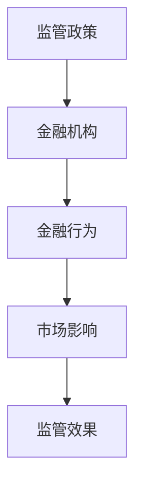
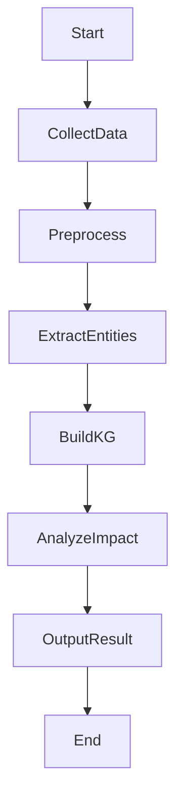
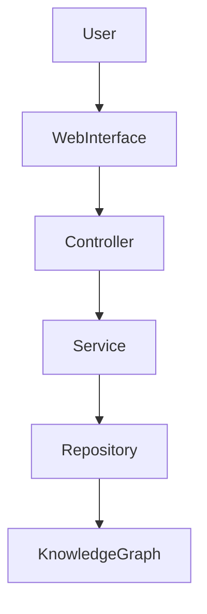

                 


# 构建基于知识图谱的金融监管政策影响追踪系统

> 关键词：知识图谱，金融监管，政策影响追踪，图神经网络，系统架构

> 摘要：本文系统地探讨了如何利用知识图谱技术构建金融监管政策影响追踪系统。首先介绍了知识图谱的基本概念及其在金融监管中的应用价值，然后详细分析了知识图谱的构建方法和政策影响传播的网络模型，接着从系统架构设计、功能实现、接口设计等多个维度详细阐述了系统的构建过程。最后通过一个具体案例展示了系统的实际应用，并总结了该系统的实际价值和未来发展方向。

---

# 第一部分: 背景与核心概念

## 第1章: 知识图谱与金融监管政策影响追踪概述

### 1.1 问题背景与描述
#### 1.1.1 金融监管的复杂性与挑战
金融监管是维护金融市场稳定、保护投资者利益的重要手段。然而，随着金融市场的发展，金融产品日益复杂化、多样化，监管政策的制定和执行面临着前所未有的挑战。政策的制定者和执行者需要快速理解政策的潜在影响，以便及时调整监管策略。

#### 1.1.2 政策影响追踪的重要性
政策的出台往往会对市场产生深远的影响，例如影响金融机构的行为、投资者的决策等。如何准确、快速地追踪政策的实施效果，评估政策的实际影响，是金融监管的核心问题之一。

#### 1.1.3 知识图谱在金融监管中的应用价值
知识图谱是一种结构化的知识表示方式，能够将复杂的金融监管政策及其影响以图的形式直观地表示出来。通过知识图谱，可以实现对政策影响的动态追踪和可视化分析。

### 1.2 核心概念与问题解决
#### 1.2.1 知识图谱的基本概念
知识图谱是一种以图结构形式表示知识的技术，由实体（节点）和关系（边）组成。每个实体可以有多种属性和关系，构成一个复杂的网络。

#### 1.2.2 金融监管政策影响追踪的目标
政策影响追踪的目标是通过分析政策的实施，评估其对市场、金融机构和投资者的影响，为政策的优化和调整提供数据支持。

#### 1.2.3 知识图谱如何解决政策影响追踪问题
知识图谱能够将政策、金融机构、市场行为等实体及其关系进行建模，通过图结构分析政策的传播路径和影响范围，为政策评估提供直观的可视化支持。

### 1.3 知识图谱与金融监管的关系
#### 1.3.1 知识图谱的特性与优势
知识图谱具有语义丰富、结构化程度高、可扩展性强等特点，能够很好地支持金融监管中的复杂关系分析。

#### 1.3.2 金融监管中的实体关系分析
在金融监管中，政策与金融机构、市场行为、投资者等实体之间存在复杂的关联关系，知识图谱能够将这些关系清晰地表达出来。

#### 1.3.3 政策影响追踪的边界与外延
政策影响追踪不仅关注政策直接作用的金融机构，还涉及政策对整个市场的间接影响，例如市场波动、投资者行为变化等。

---

## 第2章: 知识图谱与金融监管的核心概念

### 2.1 知识图谱的构建原理
#### 2.1.1 实体与关系的定义
实体是知识图谱的基本单位，表示具有独立存在意义的个体或概念。关系描述了实体之间的关联方式。

#### 2.1.2 知识图谱的属性特征
知识图谱中的实体和关系可以具有多种属性，例如时间、地点、类型等，这些属性能够进一步丰富知识图谱的语义信息。

#### 2.1.3 知识图谱的构建流程
知识图谱的构建通常包括数据收集、数据预处理、实体识别、关系抽取和知识融合等步骤。

### 2.2 金融监管政策影响追踪的系统模型
#### 2.2.1 实体关系图的构建
通过构建包含政策、金融机构、市场行为等实体的关系图，可以直观地展示政策的影响路径。

#### 2.2.2 系统模型的数学表达
政策影响追踪可以通过图结构模型进行建模，例如使用图论中的路径分析方法，量化政策对不同实体的影响程度。

#### 2.2.3 金融监管政策影响的传播路径
政策通过影响金融机构的行为，进一步影响市场和投资者，最终形成复杂的传播网络。

### 2.3 核心概念的ER实体关系图


---

# 第二部分: 知识图谱构建与算法原理

## 第3章: 知识图谱的构建方法

### 3.1 数据收集与预处理
#### 3.1.1 数据来源与清洗
数据可以来源于政策文件、新闻报道、市场数据等多种渠道。清洗过程包括去重、去噪等步骤。

#### 3.1.2 数据格式转换
将不同来源的数据转换为统一的格式，以便后续处理。

#### 3.1.3 数据标注与实体识别
通过自然语言处理技术，识别文本中的实体，并标注其类型和关系。

### 3.2 知识图谱构建算法
#### 3.2.1 基于规则的实体关系抽取
通过预定义的规则，从文本中抽取实体关系。例如，从政策文件中抽取“政策X影响机构Y”的关系。

#### 3.2.2 基于深度学习的关系抽取
使用神经网络模型，如BERT、LSTM等，从文本中自动抽取实体关系。

#### 3.2.3 知识图谱的融合与优化
将多个来源的数据进行融合，消除冲突，优化知识图谱的质量。

### 3.3 知识图谱构建的数学模型
#### 3.3.1 实体表示的向量空间模型
实体可以表示为向量空间中的点，向量的维度表示实体的属性特征。

#### 3.3.2 关系抽取的条件随机场模型
条件随机场（CRF）是一种常用的序列标注模型，可以用于关系抽取任务。

#### 3.3.3 知识图谱的优化算法
通过优化算法，如拉普拉斯 smoothing，提升知识图谱的准确性和完整性。

## 第4章: 金融监管政策影响追踪的算法实现

### 4.1 政策影响传播的网络模型
#### 4.1.1 政策影响的网络表示
将政策、金融机构、市场行为等实体及其关系表示为图结构，形成政策影响的传播网络。

#### 4.1.2 政策影响的传播路径分析
通过图遍历算法，如BFS、DFS，分析政策影响的传播路径。

#### 4.1.3 基于图神经网络的传播模型
使用图神经网络（GNN）模型，预测政策影响的传播概率和强度。

### 4.2 算法流程图


---

## 第5章: 系统架构设计与实现

### 5.1 系统功能设计
#### 5.1.1 领域模型设计
通过领域模型（如金融监管领域的实体关系模型），明确系统的功能模块和交互流程。

#### 5.1.2 功能模块划分
系统通常包括数据采集模块、知识图谱构建模块、政策影响分析模块和结果展示模块。

#### 5.1.3 功能实现流程
从数据采集到知识图谱构建，再到政策影响分析，最后结果展示，形成完整的功能流程。

### 5.2 系统架构设计
#### 5.2.1 系统架构图


#### 5.2.2 接口设计
系统提供RESTful API接口，供外部调用知识图谱构建和政策影响分析功能。

#### 5.2.3 系统交互流程
```mermaid
graph TD
    User --> (1) 发起请求
    WebInterface --> (2) 转发请求
    Controller --> (3) 执行业务逻辑
    Service --> (4) 调用知识图谱服务
    Repository --> (5) 返回结果
    WebInterface --> (6) 返回响应
    User --> (7) 获取结果
```

### 5.3 系统实现与代码示例

#### 5.3.1 环境安装
需要安装的知识图谱相关工具和框架，如Neo4j、TensorFlow、PyTorch等。

#### 5.3.2 核心代码实现
以下是一个简单的知识图谱构建代码示例：
```python
import neo4j-driver
from neo4j-driver import GraphDatabase

def create_entity(tx, entity_type, entity_name):
    tx.run("CREATE (n:{entity_type} {{name: '{entity_name}'}})".format(entity_type=entity_type, entity_name=entity_name))

driver = GraphDatabase.driver("neo4j://localhost:7687", auth=("user", "password"))
with driver.session() as session:
    session.write_transaction(create_entity, "Policy", "Regulation2023")
    session.write_transaction(create_entity, "FinancialInstitution", "BankA")
```

#### 5.3.3 代码应用解读
通过上述代码，可以将政策和金融机构实体插入知识图谱数据库中，为后续的政策影响分析提供基础数据。

### 5.4 实际案例分析
通过具体案例，展示系统如何从数据采集、知识图谱构建到政策影响分析的完整流程。

---

## 第6章: 项目实战与经验总结

### 6.1 项目背景与目标
介绍一个具体的金融监管政策影响追踪项目，描述其背景、目标和实施范围。

### 6.2 项目实施步骤
详细描述项目实施的各个步骤，包括需求分析、系统设计、开发实现、测试优化等。

### 6.3 项目成果与经验总结
总结项目的成果，分析实施过程中遇到的问题和解决方案，提炼经验教训。

### 6.4 项目小结
简要总结项目的实施过程和取得的成效，为后续类似项目提供参考。

---

## 第7章: 系统优化与未来展望

### 7.1 系统优化方向
分析系统当前存在的不足，提出优化方向，例如算法优化、性能提升、功能扩展等。

### 7.2 知识图谱技术的前沿发展
介绍知识图谱领域的最新技术进展，如可解释性图神经网络、动态知识图谱等。

### 7.3 金融监管政策影响追踪的未来趋势
预测金融监管政策影响追踪领域的未来发展方向，例如智能化、实时化、个性化等。

### 7.4 总结与展望
总结全文的核心内容，展望未来的研究和实践方向。

---

## 第8章: 最佳实践与注意事项

### 8.1 最佳实践
总结在知识图谱构建和金融监管政策影响追踪系统设计中的最佳实践，例如数据质量管理、模型调优、系统安全性等。

### 8.2 注意事项
提醒读者在实施类似项目时需要注意的关键点，例如数据隐私保护、模型的可解释性等。

### 8.3 拓展阅读
推荐一些相关的技术书籍、论文和资源，供读者深入学习和研究。

### 8.4 小结
总结全文的核心内容，强调知识图谱在金融监管中的重要价值。

---

# 结语

通过本文的系统阐述，读者可以全面了解基于知识图谱的金融监管政策影响追踪系统的构建方法和实现过程。从理论到实践，从概念到代码，本文为读者提供了一套完整的解决方案，同时也为未来的研究和实践提供了宝贵的参考和启示。

