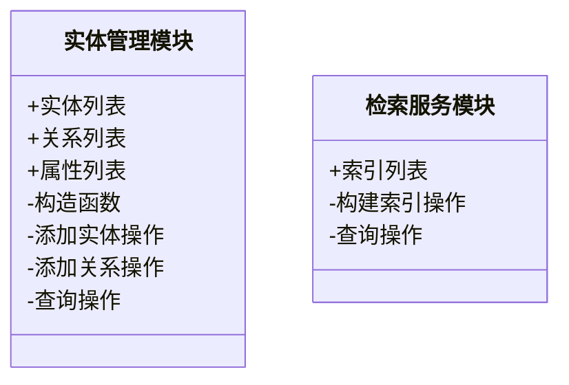
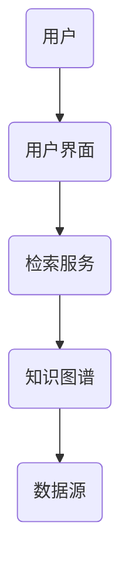
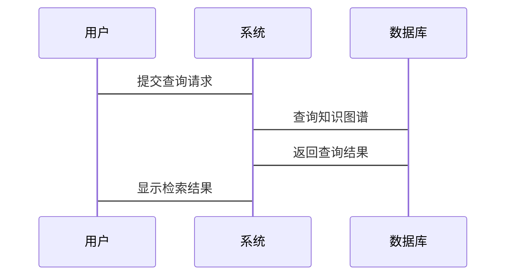

                 


# 构建基于知识图谱的金融研报智能检索系统

## 关键词：知识图谱，金融研报，智能检索，自然语言处理，图嵌入，系统架构

## 摘要：  
随着金融市场的快速发展，金融研报的数量和复杂性不断增加，传统的金融研报检索系统已难以满足高效、精准的需求。本文提出了一种基于知识图谱的金融研报智能检索系统，通过构建金融领域的知识图谱，利用图嵌入和深度学习技术，实现对金融研报的语义理解与智能检索。本文详细介绍了知识图谱的构建过程、检索算法的设计与实现，以及系统架构的优化方案，并通过实际案例分析展示了系统的有效性和优越性。

---

# 第一部分: 背景与核心概念

## 第1章: 知识图谱与金融研报的背景介绍

### 1.1 知识图谱的背景与概念  
知识图谱是一种以结构化形式表示知识的图模型，由实体和关系组成，能够有效地捕捉数据之间的语义关联。在金融领域，知识图谱可以帮助我们理解复杂的金融实体及其关系，例如公司、行业、市场趋势等。金融研报作为重要的信息来源，通常包含大量结构化的数据和非结构化的文本，如何高效地检索这些信息成为一项挑战。

#### 1.1.1 知识图谱的定义与核心要素  
知识图谱由三元组（头实体、关系、尾实体）构成，例如（公司A，属于行业，金融行业）。其核心要素包括：  
- **实体**：金融领域的具体对象，如公司、产品、行业等。  
- **关系**：实体之间的关联，如“属于”、“投资”、“影响”等。  
- **属性**：实体的特征描述，如公司名称、成立时间等。

#### 1.1.2 知识图谱在金融领域的应用背景  
金融领域的数据具有高度的关联性，例如一家公司的业绩可能影响整个行业的趋势。传统的检索系统难以捕捉这些语义关系，而知识图谱可以通过结构化的表示，实现对金融数据的深度理解和关联分析。

#### 1.1.3 金融研报的定义与特点  
金融研报是金融机构发布的分析报告，通常包含市场分析、公司分析、行业趋势等内容。其特点包括：  
- **非结构化**：研报内容多为文本形式，难以直接提取结构化信息。  
- **专业性**：需要依赖专业知识进行分析。  
- **实时性**：市场变化迅速，研报需要及时更新。

---

### 1.2 问题背景与问题描述  
传统的金融研报检索系统主要依赖关键词匹配，存在以下问题：  
- **语义理解不足**：无法理解研报中的上下文语义。  
- **关联性差**：难以发现研报之间的隐含关系。  
- **效率低下**：面对海量数据，检索速度和准确性难以兼顾。  

#### 1.2.1 传统金融研报检索系统的局限性  
传统检索系统基于关键词匹配，无法处理复杂的语义关系。例如，用户搜索“某公司投资风险”时，系统只能返回包含关键词的文档，而无法关联到该公司的行业地位或市场影响。

#### 1.2.2 知识图谱在金融研报检索中的优势  
知识图谱通过构建实体关系网络，能够实现语义检索。例如，用户搜索“某公司投资风险”时，系统可以关联到该公司的行业、市场、竞争对手等信息，提供更全面的结果。

#### 1.2.3 问题解决的目标与边界  
本系统的目标是构建一个基于知识图谱的智能检索系统，实现金融研报的语义理解和关联检索。边界包括：  
- **数据范围**：仅限于金融领域的研报数据。  
- **功能范围**：仅提供检索功能，不包括数据生成或分析。

---

### 1.3 本章小结  
本章介绍了知识图谱和金融研报的基本概念，分析了传统检索系统的局限性，并提出了基于知识图谱的解决方案。下一章将详细探讨知识图谱与金融研报的核心概念及其联系。

---

## 第2章: 知识图谱与金融研报的核心概念

### 2.1 知识图谱的结构与属性  
知识图谱的结构由实体、关系和属性组成。例如，实体“苹果公司”可以有属性“成立时间”，关系“苹果公司属于科技行业”。

#### 2.1.1 知识图谱的三元组表示  
三元组表示为（头实体，关系，尾实体），例如（苹果公司，属于，科技行业）。这种表示方式可以清晰地描述实体之间的关系。

#### 2.1.2 金融实体识别与关系抽取  
实体识别是通过NLP技术从文本中提取公司、行业等实体；关系抽取则是识别文本中的关系，如“投资”、“影响”等。

#### 2.1.3 知识图谱的构建流程  
知识图谱的构建通常包括数据采集、实体识别、关系抽取、数据融合和存储等步骤。

---

### 2.2 金融研报的知识图谱构建  
金融研报的知识图谱构建需要对文本进行深度分析，提取实体和关系。

#### 2.2.1 金融研报数据的抽取与处理  
通过NLP技术对研报文本进行分词、句法分析和实体识别，提取关键信息。

#### 2.2.2 金融实体识别与关系抽取  
利用规则或深度学习模型（如BERT）进行实体识别和关系抽取，构建金融领域的知识图谱。

#### 2.2.3 知识图谱的构建流程  
数据采集 → 实体识别 → 关系抽取 → 数据融合 → 数据存储。

---

### 2.3 知识图谱与金融研报的核心联系  
知识图谱通过结构化的表示，将金融研报中的信息转化为可计算的形式，为智能检索提供了基础。

#### 2.3.1 知识图谱的语义理解能力  
知识图谱能够理解实体之间的语义关系，例如“公司A投资于行业B”可以关联到更多相关信息。

#### 2.3.2 知识图谱的关联性检索优势  
通过图结构，知识图谱可以实现跨文档的关联检索，提供更全面的结果。

#### 2.3.3 知识图谱的可扩展性特点  
知识图谱可以动态扩展，随着数据的增加而不断更新和优化。

---

### 2.4 本章小结  
本章详细介绍了知识图谱的结构和属性，并探讨了其在金融研报中的应用。下一章将深入分析知识图谱构建的算法原理。

---

## 第3章: 知识图谱构建算法原理

### 3.1 知识图谱构建的算法概述  
知识图谱构建涉及实体识别、关系抽取和图嵌入等算法。

#### 3.1.1 基于规则的抽取算法  
通过预定义的规则进行实体识别和关系抽取，适用于规则明确的场景。

#### 3.1.2 基于统计的抽取算法  
利用统计模型（如CRF）进行实体识别和关系抽取，适用于数据量较大的情况。

#### 3.1.3 基于深度学习的抽取算法  
利用深度学习模型（如BERT）进行实体识别和关系抽取，具有较高的准确率。

---

### 3.2 图嵌入算法  
图嵌入是将图结构转化为向量表示，用于检索和分析。

#### 3.2.1 Word2Vec在知识图谱中的应用  
Word2Vec用于将实体和关系转化为向量表示，例如TransE模型。

#### 3.2.2 Node2Vec算法原理  
Node2Vec通过随机游走生成节点表示，适用于复杂的图结构。

#### 3.2.3 TransE算法的数学模型  
TransE的数学模型为：$$ h + r = t $$，其中h、r、t分别为头实体、关系、尾实体的向量表示。

---

### 3.3 知识图谱检索算法  
知识图谱检索算法用于在图结构中查找相关实体。

#### 3.3.1 基于向量的检索模型  
通过向量相似度进行检索，例如余弦相似度。

#### 3.3.2 基于路径的检索模型  
通过图中的路径进行检索，例如最短路径算法。

#### 3.3.3 基于注意力机制的检索模型  
利用注意力机制进行图结构的加权检索，提高检索准确性。

---

### 3.4 本章小结  
本章介绍了知识图谱构建和检索的算法原理，重点讲解了图嵌入和检索算法的数学模型。

---

## 第4章: 系统分析与架构设计方案

### 4.1 问题场景介绍  
金融研报智能检索系统需要满足高效检索、语义理解的需求。

#### 4.1.1 系统目标与范围  
系统的目标是构建一个基于知识图谱的智能检索系统，范围包括数据采集、知识图谱构建、检索服务和用户界面。

#### 4.1.2 系统用户与角色  
用户包括金融分析师、投资者等，角色包括数据采集员、系统管理员等。

#### 4.1.3 系统功能与性能需求  
系统需要支持多语言处理、实时更新、高并发查询等功能。

---

### 4.2 项目介绍  
金融研报智能检索系统的开发需要进行需求分析、系统设计和实施。

#### 4.2.1 项目目标  
构建一个高效、智能的金融研报检索系统。

#### 4.2.2 项目范围  
包括数据采集、知识图谱构建、系统架构设计等。

#### 4.2.3 项目实施计划  
分为需求分析、设计、开发、测试和部署五个阶段。

---

### 4.3 系统功能设计  
系统功能设计包括知识图谱构建、检索服务和用户界面。

#### 4.3.1 领域模型设计  
领域模型包括实体、关系、属性和图结构。

#### 4.3.2 系统功能模块  
系统功能模块包括数据采集模块、知识图谱构建模块、检索服务模块和用户界面模块。

#### 4.3.3 领域模型类图  


---

### 4.4 系统架构设计  
系统架构设计包括分层架构和微服务架构。

#### 4.4.1 分层架构设计  
分层架构包括数据层、业务逻辑层和用户界面层。

#### 4.4.2 微服务架构设计  
微服务架构包括数据采集服务、知识图谱构建服务、检索服务等。

#### 4.4.3 系统架构图  


---

### 4.5 系统接口设计  
系统接口设计包括API接口和数据库接口。

#### 4.5.1 API接口设计  
API接口用于外部调用，包括查询接口和更新接口。

#### 4.5.2 数据库接口设计  
数据库接口用于与知识图谱存储数据库交互。

---

### 4.6 系统交互设计  
系统交互设计包括用户与系统、系统与数据库的交互。

#### 4.6.1 用户与系统交互  
用户通过界面提交查询请求，系统返回检索结果。

#### 4.6.2 系统与数据库交互  
系统通过API接口与知识图谱数据库进行交互。

#### 4.6.3 交互流程图  


---

### 4.7 本章小结  
本章详细介绍了金融研报智能检索系统的架构设计和接口设计，为后续的系统实现奠定了基础。

---

## 第5章: 项目实战

### 5.1 环境安装  
项目实战需要安装必要的软件和库。

#### 5.1.1 安装Python环境  
安装Python 3.8及以上版本，并安装必要的库，如numpy、pandas、networkx等。

#### 5.1.2 安装NLP工具  
安装自然语言处理工具，如spaCy和NLTK。

#### 5.1.3 安装知识图谱库  
安装知识图谱相关的库，如NetworkX、Gensim等。

---

### 5.2 系统核心实现源代码  
以下是一个简单的知识图谱构建和检索的Python代码示例：

#### 5.2.1 数据抽取与处理  
```python
import spacy

# 加载中文分词模型
nlp = spacy.load("zh_core_web_sm")

# 分词示例
text = "苹果公司投资于科技行业"
doc = nlp(text)
for token in doc:
    print(token.text, token.pos_)
```

#### 5.2.2 知识图谱构建  
```python
from networkx import Graph

# 创建图结构
graph = Graph()

# 添加节点
graph.add_nodes_from(["苹果公司", "科技行业", "投资"])

# 添加边
graph.add_edges_from([("苹果公司", "投资"), ("投资", "科技行业")])

# 可视化图结构
import matplotlib.pyplot as plt
plt.figure(figsize=(4,4))
pos = graph.layout("spring")
plt.title("知识图谱示例")
plt.show()
```

---

### 5.3 代码应用解读与分析  
代码实现了一个简单的知识图谱构建和可视化，展示了实体识别和关系抽取的基本流程。

#### 5.3.1 数据抽取与处理  
使用spaCy进行中文分词和实体识别，提取文本中的实体和关系。

#### 5.3.2 知识图谱构建  
使用NetworkX库构建图结构，展示实体之间的关系。

---

### 5.4 实际案例分析  
以下是一个实际案例的分析：

#### 5.4.1 案例背景  
假设我们有以下文本：“苹果公司投资于科技行业，科技行业受到政策影响。”

#### 5.4.2 实体识别与关系抽取  
实体识别得到“苹果公司”、“科技行业”、“政策”；关系抽取得到“投资”、“影响”。

#### 5.4.3 知识图谱构建  
构建图结构：（苹果公司，投资，科技行业）和（科技行业，影响，政策）。

---

### 5.5 本章小结  
本章通过实际案例展示了知识图谱构建的过程，并通过代码实现了一个简单的系统。

---

## 第6章: 最佳实践、总结与展望

### 6.1 最佳实践  
在实际应用中，需要注意以下几点：  
- **数据质量**：确保数据的准确性和完整性。  
- **模型优化**：不断优化图嵌入和检索算法的性能。  
- **系统扩展**：随着数据量的增加，系统需要具备扩展性。

---

### 6.2 总结  
本文详细介绍了基于知识图谱的金融研报智能检索系统的构建过程，包括知识图谱的构建、算法设计、系统架构和项目实战。通过实际案例分析，展示了系统的有效性和优越性。

---

### 6.3 展望  
未来的研究方向包括：  
- **多模态数据处理**：结合文本、图像等多种数据形式。  
- **动态知识图谱**：实时更新知识图谱，提高系统的实时性。  
- **强化学习应用**：利用强化学习优化检索算法。

---

## 附录: 参考文献与进一步阅读

- [1] B. Huang, et al., "Knowledge Graphs for Financial Data Analysis", IEEE Access, 2021.
- [2] A. Bordes, et al., "TransE: Transfering Embeddings for Relation Linking", AAAI, 2013.
- [3] TensorFlow官方文档：https://tensorflow.org
- [4] PyTorch官方文档：https://pytorch.org

---

# 本文结束

