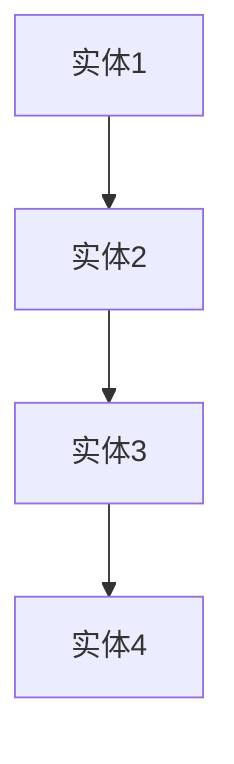
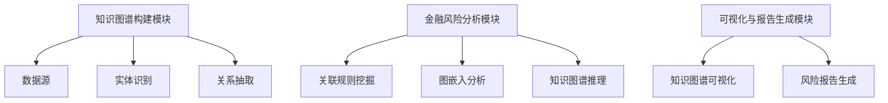
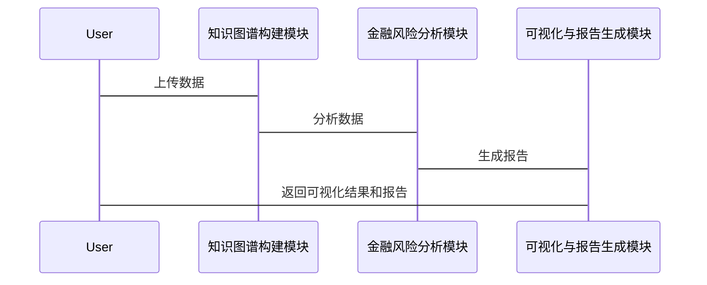

                 


# 构建基于知识图谱的金融风险关联分析系统

> 关键词：知识图谱，金融风险，关联分析，图嵌入，实体关系

> 摘要：本文详细探讨了基于知识图谱的金融风险关联分析系统的构建方法。通过分析知识图谱的核心概念与金融风险关联分析的结合，提出了系统的构建流程、算法原理、系统架构设计方案，并通过实际案例展示了系统的实现与应用。本文旨在为金融行业提供一种高效的风险管理工具，帮助金融机构更好地识别和应对潜在风险。

---

# 第一部分: 知识图谱与金融风险关联分析概述

## 第1章: 知识图谱的基本概念与背景

### 1.1 知识图谱的定义与特点

#### 1.1.1 知识图谱的定义
知识图谱是一种以图结构形式表示知识的语义网络，由实体（概念）和关系（属性）组成。实体通过属性和关系连接，形成一个网络化的知识体系。

#### 1.1.2 知识图谱的核心特点
- **结构化**：实体与关系通过图结构清晰表示，便于计算机处理。
- **语义化**：实体之间的关系具有明确的语义，能够表达复杂的关联。
- **动态性**：知识图谱可以根据实时数据动态更新，保持信息的准确性。

#### 1.1.3 知识图谱与传统数据库的区别
| 特性 | 知识图谱 | 传统数据库 |
|------|----------|-------------|
| 数据结构 | 图结构 | 行列结构 |
| 数据关系 | 显式表示复杂关系 | 隐含关系，难以表达复杂关联 |
| 查询能力 | 支持语义查询 | 仅支持基本查询 |

### 1.2 金融风险关联分析的背景

#### 1.2.1 金融风险的定义与类型
金融风险是指在金融活动中可能发生的损失或收益波动。主要类型包括市场风险、信用风险、流动性风险等。

#### 1.2.2 传统金融风险分析的局限性
- 数据孤岛：传统数据库难以整合多源异构数据。
- 关联性弱：难以发现隐性关联的金融风险。
- 动态性不足：难以实时更新和捕捉新兴风险。

#### 1.2.3 知识图谱在金融风险分析中的优势
- 能够整合多源数据，发现隐性关联。
- 支持语义查询，提升分析效率。
- 动态更新能力，适应金融市场的变化。

### 1.3 知识图谱在金融领域的应用前景

#### 1.3.1 知识图谱在金融领域的潜在应用
- 信用风险评估
- 市场风险预警
- 投资组合优化
- 反洗钱（AML）

#### 1.3.2 金融风险关联分析的市场需求
- 金融机构需要更高效的金融风险管理工具。
- 监管机构需要更全面的金融风险监控系统。

#### 1.3.3 知识图谱技术的未来发展趋势
- 结合人工智能技术，提升分析能力。
- 应用于更多金融场景，如智能投顾、量化交易。

## 第2章: 知识图谱的核心概念与联系

### 2.1 知识图谱的原理与架构

#### 2.1.1 知识图谱的构建流程
- 数据采集：从多种数据源获取数据。
- 数据清洗：去除噪声数据，确保数据质量。
- 实体识别与链接：识别实体并建立关联。
- 关系抽取：提取实体之间的关系。
- 知识融合：整合多源数据，消除冲突。
- 知识存储：将知识图谱存储在数据库中。
- 知识应用：将知识图谱应用于具体场景。

#### 2.1.2 知识图谱的存储与表示
知识图谱通常使用图数据库（如Neo4j）存储，实体和关系以节点和边的形式表示。

#### 2.1.3 知识图谱的查询与推理
通过SPARQL查询语言进行数据检索，结合推理算法（如RDFS推理）发现隐性关联。

#### 2.1.4 知识图谱的可视化
使用Gephi或Graphviz等工具将知识图谱可视化，便于理解和分析。

#### 2.1.5 知识图谱的更新与维护
定期更新知识图谱以反映最新的数据变化，确保信息的准确性。

### 2.2 知识图谱与金融风险关联分析的关系

#### 2.2.1 知识图谱在风险关联中的作用
- 通过图结构发现隐性关联。
- 提供语义化的数据表示，提升分析效率。
- 支持实时更新，适应金融市场动态变化。

#### 2.2.2 金融风险关联分析的核心要素
- 实体：如公司、交易、市场等。
- 关系：如交易金额、时间、地理位置等。
- 属性：如信用评分、市场波动率等。

#### 2.2.3 知识图谱与风险关联分析的结合点
- 通过图结构发现潜在风险。
- 利用关联规则挖掘识别高风险模式。
- 基于图嵌入技术进行风险预测。

### 2.3 知识图谱的实体关系与属性特征

#### 2.3.1 实体关系对比表格
| 实体关系类型 | 描述 | 示例 |
|--------------|------|------|
| 交易关系 | 表示交易行为 | A公司购买B公司的股票 |
| 组织关系 | 表示组织结构 | A公司是B公司的子公司 |
| 人员关系 | 表示人员之间的关系 | 张三是A公司的CEO |

#### 2.3.2 实体关系的Mermaid流程图


---

## 第3章: 知识图谱构建算法原理

### 3.1 知识图谱构建的流程与方法

#### 3.1.1 数据采集与预处理
- 数据源：结构化数据（如数据库）、非结构化数据（如文本、图像）。
- 数据清洗：去除重复、错误或噪声数据。

#### 3.1.2 实体识别与链接
- 实体识别：使用NLP技术从文本中提取实体。
- 实体链接：将实体与知识图谱中的节点对齐。

#### 3.1.3 关系抽取与构建
- 关系抽取：从文本中识别实体之间的关系。
- 关系构建：将关系添加到知识图谱中。

### 3.2 知识图谱构建的数学模型

#### 3.2.1 实体表示的向量空间模型
- 实体表示为向量，向量长度为词汇表的大小。
- 示例：实体“公司”表示为一个向量，其中某些维度为1，其他为0。

#### 3.2.2 关系表示的图嵌入模型
- 使用图嵌入算法（如Node2Vec）将实体和关系嵌入到低维空间。
- 示例：实体A和实体B之间的关系表示为一个向量。

#### 3.2.3 知识图谱的构建算法公式
$$
\text{实体相似度} = \frac{\text{共同属性}}{\text{属性总数}}
$$

### 3.3 算法实现的Python代码示例

#### 3.3.1 实体识别代码
```python
def entity_recognition(text):
    # 使用spaCy进行实体识别
    import spacy
    nlp = spacy.load("en_core_web_sm")
    doc = nlp(text)
    entities = [ent.text for ent in doc.ents]
    return entities
```

#### 3.3.2 实体链接代码
```python
def entity_linking(entities, kg):
    # kg为知识图谱数据库
    linked_entities = []
    for entity in entities:
        # 在知识图谱中查找与entity匹配的节点
        matches = kg.find_matches(entity)
        if matches:
            linked_entities.append(matches[0])
    return linked_entities
```

---

## 第4章: 金融风险关联分析算法

### 4.1 金融风险关联分析的核心算法

#### 4.1.1 关联规则挖掘算法
- 关联规则挖掘用于发现数据中的频繁项集。
- 示例：发现某些交易模式与市场波动的关联。

#### 4.1.2 图嵌入算法
- 使用图嵌入技术将实体和关系嵌入到低维空间。
- 示例：将公司和交易嵌入到向量空间，用于风险预测。

#### 4.1.3 知识图谱推理算法
- 基于知识图谱的推理算法发现隐性关联。
- 示例：通过路径分析发现公司之间的潜在关联。

### 4.2 金融风险关联分析的数学模型

#### 4.2.1 关联规则挖掘的公式
$$
\text{支持度} = \frac{\text{频繁项集的出现次数}}{\text{总数据量}}
$$

#### 4.2.2 图嵌入的公式
$$
\text{节点向量} = \text{输入向量} \times \text{权重矩阵}
$$

### 4.3 算法实现的Python代码示例

#### 4.3.1 关联规则挖掘代码
```python
from mlxtend.frequent_itemsets import apriori

# 假设transactions是事务列表
frequent_itemsets = apriori(transactions, min_support=0.5)
```

#### 4.3.2 图嵌入代码
```python
import node2vec
from gensim.models import Word2Vec

# 假设graph是图结构
model = node2vec.Node2Vec(graph, vector_size=100, random_walk_length=10)
model.train(total_iter=10)
```

---

## 第5章: 系统分析与架构设计方案

### 5.1 系统功能设计

#### 5.1.1 知识图谱构建模块
- 数据采集与预处理。
- 实体识别与链接。
- 关系抽取与构建。

#### 5.1.2 金融风险关联分析模块
- 关联规则挖掘。
- 图嵌入分析。
- 知识图谱推理。

#### 5.1.3 可视化与报告生成模块
- 知识图谱可视化。
- 风险报告生成。

### 5.2 系统架构设计

#### 5.2.1 系统架构图


#### 5.2.2 系统接口设计
- API接口：提供RESTful API，支持数据上传、查询等操作。
- 数据接口：与数据库、数据源对接，获取实时数据。

#### 5.2.3 系统交互流程图


---

## 第6章: 项目实战

### 6.1 项目背景与目标

#### 6.1.1 项目背景
- 某大型金融机构需要构建金融风险关联分析系统，提升风险管理能力。

#### 6.1.2 项目目标
- 实现基于知识图谱的金融风险关联分析系统。
- 提供实时风险预警和风险报告生成功能。

### 6.2 项目实现步骤

#### 6.2.1 环境安装
```bash
pip install neo4j
pip install spacy
pip install mlxtend
pip install node2vec
```

#### 6.2.2 核心功能实现

##### 6.2.2.1 知识图谱构建
```python
# 数据采集与预处理
import neo4j
driver = neo4j.GraphDatabaseService("http://localhost:7474")
```

##### 6.2.2.2 金融风险分析
```python
# 关联规则挖掘
from mlxtend.frequent_itemsets import apriori

transactions = [
    ["股票A", "股票B"],
    ["股票B", "股票C"],
    ["股票C", "股票D"],
]
frequent_itemsets = apriori(transactions, min_support=0.5)
```

##### 6.2.2.3 可视化与报告生成
```python
# 知识图谱可视化
import graphviz

dot = graphviz.Digraph()
dot.edge("公司A", "交易1")
dot.edge("交易1", "公司B")
dot.render("graph.png")
```

#### 6.2.3 系统测试与优化
- 功能测试：测试系统各模块的功能是否正常。
- 性能测试：测试系统在大规模数据下的运行性能。
- 用户体验优化：优化系统界面，提升用户体验。

### 6.3 项目小结

#### 6.3.1 实践收获
- 掌握了知识图谱构建的核心流程。
- 熟悉了金融风险关联分析的主要算法。

#### 6.3.2 项目总结
- 成功构建了基于知识图谱的金融风险关联分析系统。
- 为金融机构提供了高效的金融风险管理工具。

---

## 第7章: 最佳实践与注意事项

### 7.1 最佳实践

#### 7.1.1 数据质量管理
- 确保数据的准确性和完整性。
- 定期更新数据，保持知识图谱的实时性。

#### 7.1.2 系统安全性
- 加强数据加密和访问控制，确保系统安全性。
- 定期进行安全漏洞扫描和修复。

#### 7.1.3 系统性能优化
- 使用分布式架构，提升系统处理能力。
- 优化算法，提高系统运行效率。

### 7.2 注意事项

#### 7.2.1 数据隐私保护
- 遵守数据隐私相关法律法规，确保数据合法使用。
- 加强用户隐私保护，防止数据泄露。

#### 7.2.2 系统维护
- 定期进行系统维护，确保系统稳定运行。
- 及时修复系统漏洞，提升系统安全性。

### 7.3 拓展阅读

#### 7.3.1 知识图谱相关书籍
- 《知识图谱：概念、方法与应用》
- 《图嵌入与知识表示》

#### 7.3.2 金融风险管理相关书籍
- 《金融风险管理》
- 《金融数据分析与挖掘》

---

## 第8章: 小结

### 8.1 总结
本文详细探讨了基于知识图谱的金融风险关联分析系统的构建方法，从知识图谱的基本概念到系统构建，再到实际应用，为读者提供了全面的指导。

### 8.2 展望
未来，随着人工智能技术的不断发展，知识图谱在金融领域的应用将更加广泛，金融风险关联分析系统也将更加智能化和高效化。

---

通过本文的系统讲解和实际案例分析，读者可以全面掌握基于知识图谱的金融风险关联分析系统的构建方法，并能够将其应用于实际的金融风险管理中。

