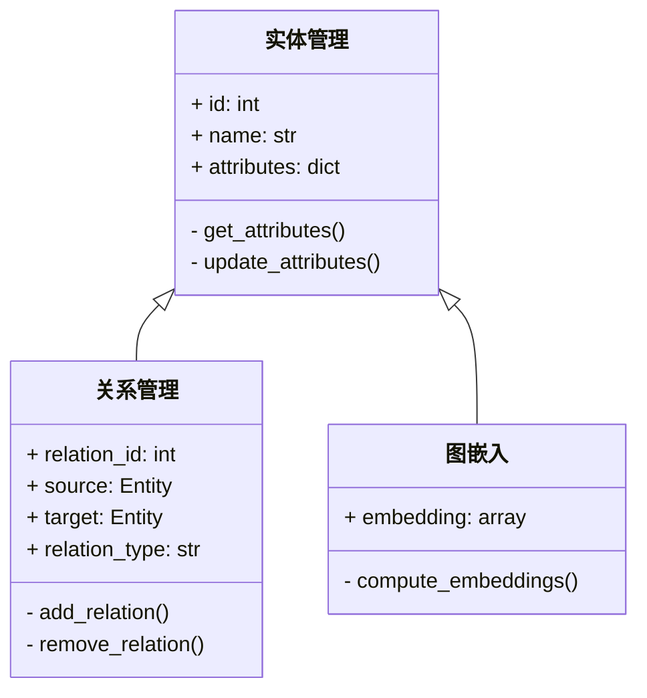
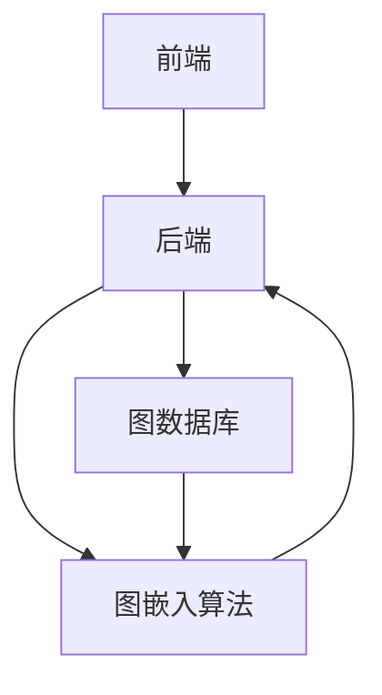
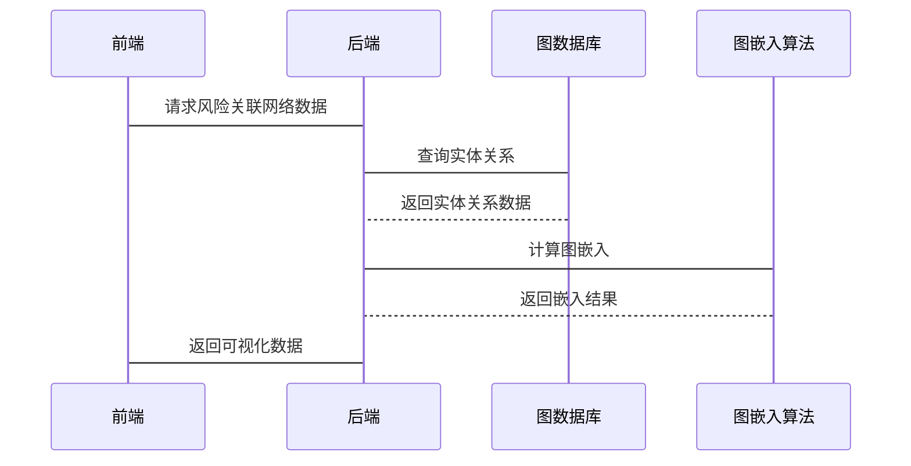

                 


# 构建基于知识图谱的金融风险关联网络可视化系统

## 关键词：知识图谱、金融风险、关联网络、可视化系统、图嵌入算法、系统架构设计

## 摘要：  
本文探讨了如何利用知识图谱和图嵌入算法构建金融风险关联网络可视化系统。通过分析金融数据中的实体关系，结合图嵌入技术，建立风险关联网络，并通过可视化技术直观展示风险传播路径和关联程度，帮助金融机构识别和管理潜在风险。文章从背景、概念、算法、系统架构、实战案例等多个角度进行深入分析，为金融风险管理和分析提供新的思路和技术支持。

---

# 第1章 问题背景与描述

## 1.1 问题背景  
### 1.1.1 金融风险的复杂性与关联性  
金融市场的复杂性使得风险来源多样化，例如市场波动、企业违约、政策变化等。传统的基于单点数据的分析方法难以捕捉跨机构、跨市场的关联性风险。  

### 1.1.2 知识图谱在金融领域的应用潜力  
知识图谱通过构建实体之间的语义关联，能够有效捕捉金融数据中的隐含关系，帮助发现潜在风险。  

### 1.1.3 可视化技术在风险分析中的重要性  
可视化技术能够将复杂的金融风险网络简化为直观的图形，便于分析人员快速理解风险传播路径和关联程度。  

## 1.2 问题描述  
### 1.2.1 金融风险关联网络的定义  
金融风险关联网络是指通过知识图谱构建的，能够反映金融市场中各个实体（如企业、机构、资产等）之间的关联关系和风险传导路径的网络结构。  

### 1.2.2 当前金融风险分析的痛点  
- 数据分散，难以整合。  
- 关联性弱，难以发现隐含风险。  
- 可视化工具复杂，难以快速解读。  

### 1.2.3 知识图谱在风险关联网络中的作用  
知识图谱通过语义理解和关系抽取，将分散的金融数据整合为一个统一的知识网络，为风险分析提供基础。  

## 1.3 问题解决与边界  
### 1.3.1 知识图谱如何解决金融风险问题  
通过构建知识图谱，可以发现隐含的关联关系，量化风险传导路径，从而提前预警和应对潜在风险。  

### 1.3.2 系统的边界与外延  
- 边界：系统仅关注金融领域的风险关联，不涉及其他领域的风险分析。  
- 外延：基于知识图谱的风险关联网络可以扩展到其他领域，如供应链风险、社交网络风险等。  

### 1.3.3 核心要素与组成结构  
核心要素包括：  
- 实体（Entity）：如企业、机构、资产等。  
- 关系（Relation）：如“投资于”、“控股”等。  
- 属性（Attribute）：如企业规模、信用评级等。  

---

# 第2章 知识图谱与风险关联网络

## 2.1 知识图谱原理  
### 2.1.1 知识图谱的定义与特点  
知识图谱是一种以图结构形式表示知识的工具，具有语义丰富、结构化程度高、可扩展性强等特点。  

### 2.1.2 知识图谱的构建流程  
1. 数据抽取：从文本、数据库等来源中提取实体和关系。  
2. 数据清洗：去除冗余和错误数据。  
3. 数据存储：将实体和关系存储到图数据库中。  
4. 数据可视化：通过图表展示知识图谱的结构。  

### 2.1.3 知识图谱的存储与表示  
常用的图数据库包括Neo4j、RDF等，知识图谱可以用RDF三元组（主语-谓词-宾语）形式表示。  

## 2.2 风险关联网络构建  
### 2.2.1 风险关联网络的定义  
风险关联网络是通过知识图谱构建的，反映金融市场中各实体之间的风险传导路径和关联程度的网络结构。  

### 2.2.2 风险关联的计算方法  
通过图嵌入算法（如Node2Vec）计算实体之间的语义相似性，相似性越高，关联程度越大。  

### 2.2.3 网络可视化的实现逻辑  
- 将图结构数据转换为可可视化的格式。  
- 使用可视化工具（如Gephi、D3.js）绘制网络图，展示实体之间的关联关系。  

## 2.3 知识图谱与风险关联的关联分析  
### 2.3.1 知识图谱在风险关联中的应用  
通过知识图谱可以发现企业之间的隐含关联，例如通过“控股”关系发现企业集团的风险传导路径。  

### 2.3.2 风险关联网络的构建方法  
- 数据抽取：从新闻、财报等数据中提取实体和关系。  
- 关系建模：通过RDF或类似形式建模实体之间的关系。  
- 关联计算：通过图嵌入算法计算实体之间的语义相似性。  

## 2.4 核心概念对比表  
| 核心概念 | 定义 | 优缺点 | 应用场景 |  
|----------|------|--------|----------|  
| 知识图谱 | 以图结构表示知识的工具 | 语义丰富、可扩展性强 | 金融风险分析、智能客服等 |  
| 风险关联网络 | 反映金融实体之间风险传导的网络结构 | 能够量化风险关联程度 | 金融风险管理、投资决策等 |  

## 2.5 ER实体关系图  
```mermaid
er
title 实体关系图
_actor(投资者, id, 姓名, 资产规模)
_company(公司, id, 名称, 股票代码)
_investment(投资, id, 投资金额, 投资时间)
_actor -->[投资] _company
_actor -->[持有] _company
```

---

# 第3章 算法原理与数学模型

## 3.1 知识图谱构建算法  
### 3.1.1 知识抽取与表示  
- 知识抽取：从文本中提取实体和关系。  
- 知识表示：使用向量空间模型表示实体和关系。  

### 3.1.2 知识图谱的构建流程  
1. 数据清洗：去除冗余和错误数据。  
2. 数据整合：将多个数据源整合到统一的知识图谱中。  
3. 数据存储：将知识图谱存储到图数据库中。  

## 3.2 图嵌入算法  
### 3.2.1 Node2Vec算法原理  
Node2Vec是一种基于随机游走的图嵌入算法，能够将图中的节点嵌入到低维向量空间中。  

### 3.2.2 图嵌入的数学模型  
图嵌入的目标是将图中的节点映射到低维向量空间，同时保留节点之间的语义相似性。  
$$ x_i = f(N_i, \theta) $$  
其中，$x_i$是节点$i$的向量表示，$N_i$是节点$i$的邻居节点，$\theta$是模型参数。  

### 3.2.3 Node2Vec算法实现步骤  
1. 初始化：随机选择节点作为起点。  
2. 随机游走：在图中进行随机游走，生成节点序列。  
3. 嵌入学习：使用Skip-Gram模型学习节点的向量表示。  

### 3.2.4 Node2Vec算法的Python代码示例  
```python
import numpy as np
from sklearn.model_selection import train_test_split
from sklearn.linear_model import LogisticRegression
from sklearn.metrics import accuracy_score

# 假设graph是图的邻接表示
def node2vec(graph, p, q):
    # 算法实现细节...
    pass

# 示例数据
graph = {
    'A': ['B', 'C'],
    'B': ['A', 'D'],
    'C': ['A', 'D'],
    'D': ['B', 'C']
}

# 训练节点分类模型
X = [...]  # 节点嵌入向量
y = [...]  # 节点标签
X_train, X_test, y_train, y_test = train_test_split(X, y)
model = LogisticRegression().fit(X_train, y_train)
y_pred = model.predict(X_test)
print(accuracy_score(y_test, y_pred))
```

## 3.3 数学模型  
### 3.3.1 图嵌入模型的数学公式  
$$ x_i = f(N_i, \theta) $$  
其中，$N_i$是节点$i$的邻居节点集合，$f$是嵌入学习函数，$\theta$是模型参数。  

### 3.3.2 边权重计算公式  
$$ w_{ij} = \frac{1}{\log(d_i + 1) \cdot \log(d_j + 1)} $$  
其中，$d_i$和$d_j$分别是节点$i$和$j$的度数。  

### 3.3.3 节点相似性计算公式  
$$ s(i, j) = \frac{1}{1 + |x_i - x_j|} $$  
其中，$x_i$和$x_j$分别是节点$i$和$j$的向量表示。  

---

# 第4章 系统架构设计与实现

## 4.1 问题场景介绍  
本文设计的系统旨在帮助金融机构识别和管理金融风险。系统通过构建知识图谱，发现潜在风险关联，并通过可视化技术直观展示风险传播路径。  

## 4.2 项目介绍  
### 4.2.1 项目目标  
- 构建金融知识图谱，发现潜在风险关联。  
- 实现风险关联网络的可视化展示。  
- 提供风险预警和决策支持功能。  

## 4.3 系统功能设计  
### 4.3.1 领域模型类图  


### 4.3.2 系统架构设计  


### 4.3.3 系统接口设计  
- 前端接口：  
  - GET /risk_network：获取风险关联网络数据。  
  - POST /analyze：提交分析请求。  
- 后端接口：  
  - GET /entities：获取实体列表。  
  - POST /embedding：计算图嵌入。  

### 4.3.4 系统交互流程图  


---

# 第5章 项目实战

## 5.1 环境安装  
### 5.1.1 安装Python和相关库  
- 安装Python 3.8及以上版本。  
- 安装库：`pip install networkx, neo4j, numpy, sklearn`  

### 5.1.2 安装可视化工具  
- 安装Gephi或D3.js用于可视化展示。  

## 5.2 核心代码实现  
### 5.2.1 数据抽取与建模  
```python
import neo4j
from neo4j import GraphDatabase

# 连接到Neo4j数据库
driver = GraphDatabase.driver("bolt://localhost:7687", auth=("neo4j", "password"))

# 查询实体关系
def get_entities(tx):
    result = tx.run("MATCH (a)-[r]->(b) RETURN a, r, b")
    return list(result)

# 建立实体关系图
entities = []
relations = []
with driver.session() as session:
    result = session.read_transaction(get_entities)
    entities.extend(result)
```

### 5.2.2 图嵌入算法实现  
```python
import numpy as np
from sklearn.linear_model import LogisticRegression
from sklearn.metrics import accuracy_score

def node2vec(graph, p, q):
    # 算法实现细节...
    pass

# 示例数据
graph = {
    'A': ['B', 'C'],
    'B': ['A', 'D'],
    'C': ['A', 'D'],
    'D': ['B', 'C']
}

# 训练节点分类模型
X = [...]  # 节点嵌入向量
y = [...]  # 节点标签
X_train, X_test, y_train, y_test = train_test_split(X, y)
model = LogisticRegression().fit(X_train, y_train)
y_pred = model.predict(X_test)
print(accuracy_score(y_test, y_pred))
```

### 5.2.3 可视化实现  
```python
import networkx as nx
import matplotlib.pyplot as plt

G = nx.DiGraph()
G.add_edges_from([('A', 'B'), ('A', 'C'), ('B', 'D'), ('C', 'D')])
nx.draw(G, with_labels=True, edge_color='blue', node_color='yellow')
plt.show()
```

## 5.3 案例分析  
### 5.3.1 案例背景  
某金融机构希望通过系统识别潜在的关联风险，例如企业之间的控股关系和投资关系。  

### 5.3.2 数据准备  
从企业财报和新闻数据中提取实体和关系，构建企业之间的控股和投资关系图。  

### 5.3.3 系统实现  
1. 数据抽取与建模：使用Neo4j构建知识图谱。  
2. 图嵌入算法：使用Node2Vec算法计算企业之间的语义相似性。  
3. 可视化展示：使用Gephi绘制风险关联网络图。  

### 5.3.4 实际应用与效果  
通过系统，金融机构能够快速发现潜在风险，例如某企业违约可能会影响其控股公司的信用评级。  

## 5.4 项目总结  
通过本项目，我们成功构建了一个基于知识图谱的金融风险关联网络可视化系统，能够帮助金融机构识别和管理潜在风险，提升风险预警能力。

---

# 第6章 最佳实践与总结

## 6.1 小结  
本文通过知识图谱和图嵌入算法构建了金融风险关联网络可视化系统，解决了传统方法难以捕捉复杂关联性的问题。  

## 6.2 注意事项  
- 数据质量对系统性能影响较大，需确保数据来源可靠。  
- 图嵌入算法的参数设置会影响结果，需通过实验进行调优。  

## 6.3 拓展阅读  
- 知识图谱相关书籍：《知识图谱：概念、方法与应用》  
- 图嵌入相关论文：《Node2Vec: Distributed Representations of Graphs through Random Walks》  

## 6.4 附录  
### 6.4.1 系统架构图  


### 6.4.2 实体关系图  
```mermaid
er
title 实体关系图
_actor(投资者, id, 姓名, 资产规模)
_company(公司, id, 名称, 股票代码)
_investment(投资, id, 投资金额, 投资时间)
_actor -->[投资] _company
_actor -->[持有] _company
```

---

# 结语  
通过本文的探讨，我们展示了如何利用知识图谱和图嵌入算法构建金融风险关联网络可视化系统。这一系统不仅能够帮助金融机构识别和管理潜在风险，还为金融领域的数据分析和决策支持提供了新的思路和技术手段。未来，随着人工智能和大数据技术的不断发展，知识图谱在金融领域的应用将更加广泛和深入。

--- 

**END**

