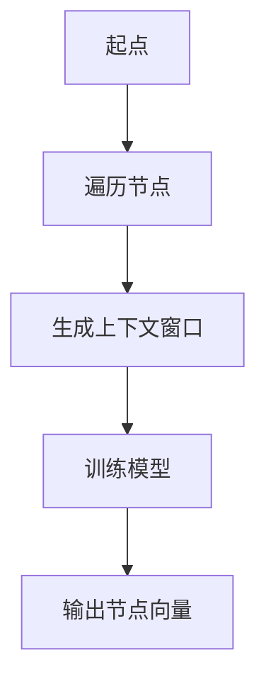
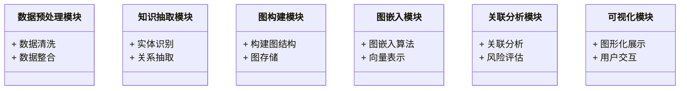
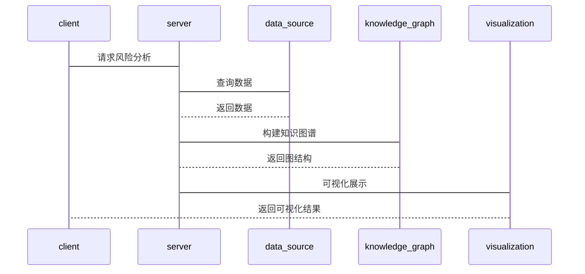
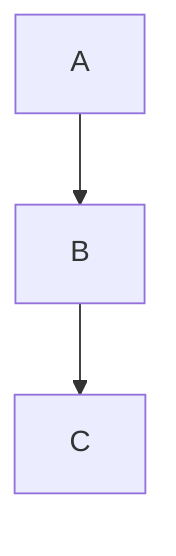

                 


# 构建基于知识图谱的金融风险关联网络可视化系统

> 关键词：知识图谱、金融风险、关联网络、可视化、图嵌入、风险分析、系统架构

> 摘要：本文详细探讨了如何利用知识图谱技术构建金融风险关联网络，并通过可视化手段进行风险分析和管理。文章首先介绍了金融风险分析的背景与挑战，随后深入讲解了知识图谱的核心概念与构建方法，接着分析了图嵌入算法在关联网络中的应用，最后通过实际案例展示了系统的实现过程和应用价值。

---

# 第一部分: 背景与核心概念

## 第1章: 问题背景与描述

### 1.1 问题背景

金融市场的复杂性和不确定性使得风险分析变得至关重要。传统的基于单一数据源的风险评估方法往往难以捕捉市场中的隐性关联和系统性风险。例如，一家企业的财务危机可能通过供应链影响多家上下游企业，甚至引发连锁反应。传统的统计方法难以揭示这些复杂的关联关系。

知识图谱作为一种新兴的技术，能够将结构化和非结构化的数据整合到一个统一的语义网络中。通过知识图谱，我们可以将金融市场中的实体（如企业、金融机构、市场数据等）及其关系表示为图结构，从而更好地发现和理解风险的传播路径和关联性。

此外，可视化技术可以帮助用户直观地理解和分析复杂的金融网络结构。通过将知识图谱中的实体和关系可视化，用户可以快速识别关键风险节点和潜在的系统性风险。

### 1.2 问题描述

在金融风险分析中，我们面临以下关键问题：

1. **数据异构性**：金融市场中的数据来源广泛，包括财务报表、新闻报道、社交媒体等多种形式，如何整合这些异构数据是构建风险关联网络的核心挑战。
2. **关联复杂性**：金融实体之间的关联可能是间接的、多层次的，传统的统计方法难以捕捉这些复杂关系。
3. **实时性要求**：金融市场变化迅速，风险分析需要实时或近实时的处理能力。

知识图谱和可视化技术的结合为解决上述问题提供了新的思路。通过构建金融风险关联网络，我们可以实时监控市场动态，发现潜在风险，并制定有效的风险管理策略。

### 1.3 问题解决与边界

知识图谱的核心优势在于其能够将复杂的关系表示为图结构，并通过图嵌入等技术将图结构转化为低维向量表示，从而为关联分析提供高效的计算基础。在此过程中，可视化技术起到了关键作用，它不仅帮助用户理解复杂的关联关系，还能够辅助决策者制定风险管理策略。

系统的核心要素包括：

- **实体识别**：识别金融市场中的关键实体，如企业、金融机构、市场指数等。
- **关系抽取**：从多种数据源中提取实体之间的关系，如“投资关系”、“供应链关系”等。
- **图嵌入**：将图结构转换为低维向量表示，便于后续的关联分析和可视化。
- **关联分析**：基于图嵌入结果，发现潜在的风险传播路径和关键风险节点。
- **可视化展示**：将关联网络以图形化的方式展示，帮助用户理解和分析风险。

---

# 第二部分: 核心概念与原理

## 第2章: 知识图谱与风险关联网络

### 2.1 知识图谱原理

知识图谱是一种将实体及其关系表示为图结构的技术。其核心概念包括：

- **实体（Entity）**：知识图谱中的基本单元，代表现实世界中的具体事物，如“企业”、“金融机构”等。
- **关系（Relation）**：实体之间的关联，如“投资”、“控股”等。
- **属性（Attribute）**：描述实体的特征，如“成立时间”、“注册资本”等。

知识图谱的构建过程包括以下步骤：

1. **数据抽取**：从多种数据源中提取结构化和非结构化的数据。
2. **实体识别**：通过自然语言处理技术识别文本中的实体。
3. **关系抽取**：识别实体之间的关系。
4. **知识融合**：将不同数据源中的知识进行整合，消除冗余和冲突。
5. **知识存储**：将知识图谱存储在图数据库中，如Neo4j。

### 2.2 风险关联网络构建

风险关联网络是将金融市场的实体及其关系表示为图结构。构建过程包括以下步骤：

1. **数据预处理**：清洗和整合多源数据。
2. **实体识别与关系抽取**：从文本数据中提取实体及其关系。
3. **图构建**：将实体和关系表示为图结构。
4. **图嵌入**：将图结构转换为低维向量表示。
5. **关联分析**：基于图嵌入结果，发现潜在风险关联。

### 2.3 知识图谱与风险关联的关联分析

通过图嵌入技术，我们可以将图结构中的实体表示为低维向量。这些向量可以用于计算实体之间的相似性，从而发现潜在的风险关联。例如，如果两个企业的图嵌入向量相似度较高，可能意味着它们之间存在某种未被直接观察到的关联关系。

### 2.4 核心概念对比表

| 概念       | 传统数据库 | 知识图谱       |
|------------|------------|---------------|
| 数据结构   | 行为表       | 图结构         |
| 关系表示   | 通过外键关联 | 通过边直接表示 |
| 查询效率   | 较低         | 较高           |
| 可视化能力 | 有限         | 强大           |

### 2.5 ER实体关系图

以下是知识图谱的实体关系图：

```mermaid
erDiagram
    actor 顾客 {
        string 名称
        string 关系类型
    }
    actor 企业 {
        string 名称
        string 股东
    }
    actor 市场指标 {
        string 名称
        string 指标值
    }
    顾客 --> 关系: 关系
    顾客 --> 企业: 关系
    顾客 --> 指标: 关系
```

---

# 第三部分: 算法原理与数学模型

## 第3章: 知识图谱构建算法

### 3.1 知识抽取与表示

知识抽取是构建知识图谱的第一步。通过自然语言处理技术，我们可以从文本数据中提取实体及其关系。例如，从新闻报道中提取“企业A投资企业B”的关系。

### 3.2 图嵌入算法

图嵌入算法将图结构中的实体表示为低维向量。Node2Vec是一种常用的图嵌入算法，其核心思想是通过随机游走生成节点的上下文表示。

以下是Node2Vec算法的流程图：



以下是Node2Vec算法的Python实现示例：

```python
import numpy as np
from sklearn.linear_model import LogisticRegression

def node2vec(adj_matrix, walk_length, num_walks):
    # 初始化节点向量
    nodes = adj_matrix.shape[0]
    vectors = np.zeros((nodes, walk_length))
    
    for i in range(nodes):
        # 开始随机游走
        current_node = i
        for _ in range(num_walks):
            walk = []
            for _ in range(walk_length):
                # 随机选择邻居节点
                neighbors = [j for j in range(nodes) if adj_matrix[i][j] > 0]
                if not neighbors:
                    break
                next_node = np.random.choice(neighbors)
                walk.append(next_node)
                current_node = next_node
            # 更新向量
            vectors[i] += np.array(walk)
    
    return vectors / num_walks
```

以下是图嵌入的数学模型：

$$
v_i = \sum_{j} w_{ij} v_j
$$

其中，\( v_i \) 是节点 \( i \) 的向量表示，\( w_{ij} \) 是节点 \( i \) 和 \( j \) 之间的边权重。

### 3.3 算法与公式

以下是图嵌入的数学公式：

$$
v_i = \sum_{j} w_{ij} v_j
$$

其中，\( v_i \) 是节点 \( i \) 的向量表示，\( w_{ij} \) 是节点 \( i \) 和 \( j \) 之间的边权重。

---

# 第四部分: 系统分析与架构设计

## 第4章: 系统架构设计方案

### 4.1 问题场景介绍

金融风险关联网络可视化系统需要满足以下需求：

1. 实时监控金融市场动态。
2. 自动构建金融风险关联网络。
3. 提供直观的可视化界面。

### 4.2 项目介绍

金融风险关联网络可视化系统由以下模块组成：

- **数据预处理模块**：清洗和整合多源数据。
- **知识抽取模块**：从文本数据中提取实体及其关系。
- **图构建模块**：将实体和关系表示为图结构。
- **图嵌入模块**：将图结构转换为低维向量表示。
- **关联分析模块**：基于图嵌入结果，发现潜在风险关联。
- **可视化模块**：将关联网络以图形化的方式展示。

以下是系统的架构图：


### 4.3 系统功能设计

以下是系统的功能模块类图：



### 4.4 系统接口设计

系统接口设计包括以下部分：

1. 数据预处理模块接口。
2. 知识抽取模块接口。
3. 图构建模块接口。
4. 图嵌入模块接口。
5. 关联分析模块接口。
6. 可视化模块接口。

### 4.5 系统交互流程

以下是系统的交互流程图：



---

# 第五部分: 项目实战

## 第5章: 项目实现与案例分析

### 5.1 环境安装

以下是项目所需的环境配置：

```bash
pip install numpy
pip install networkx
pip install matplotlib
pip install scikit-learn
```

### 5.2 核心代码实现

以下是知识抽取模块的Python代码示例：

```python
from sklearn.feature_extraction.text import TfidfVectorizer
from sklearn.decomposition import NMF

def extract_entities(texts):
    vectorizer = TfidfVectorizer()
    tfidf = vectorizer.fit_transform(texts)
    nmf = NMF(n_components=5).fit(tfidf)
    return nmf.components_
```

以下是图嵌入模块的Python代码示例：

```python
import numpy as np

def compute_embeddings(adj_matrix):
    embeddings = np.random.randn(len(adj_matrix), 100)
    for i in range(len(adj_matrix)):
        for j in range(len(adj_matrix[i])):
            if adj_matrix[i][j] > 0:
                embeddings[i] += embeddings[j]
    return embeddings
```

### 5.3 代码解读与分析

知识抽取模块使用TF-IDF和NMF技术从文本数据中提取实体表示。图嵌入模块通过随机游走算法生成节点的向量表示。

### 5.4 案例分析

以下是一个简单的案例分析：

假设我们有以下文本数据：

```plaintext
企业A投资企业B
企业B投资企业C
```

构建的知识图谱如下：



通过图嵌入算法，我们可以将企业A、B、C表示为低维向量，并发现它们之间的关联关系。

### 5.5 项目小结

通过本项目，我们成功构建了一个基于知识图谱的金融风险关联网络可视化系统。系统能够从多源数据中提取实体及其关系，并通过图嵌入技术发现潜在的风险关联。

---

# 第六部分: 最佳实践

## 第6章: 最佳实践与总结

### 6.1 小结

本文详细探讨了如何利用知识图谱技术构建金融风险关联网络，并通过可视化手段进行风险分析和管理。通过系统的构建和实现，我们展示了知识图谱在金融风险管理中的巨大潜力。

### 6.2 注意事项

在实际应用中，需要注意以下几点：

1. 数据质量和完整性直接影响系统的性能。
2. 图嵌入算法的选择和参数调优对结果有重要影响。
3. 可视化界面的设计需要考虑用户体验。

### 6.3 拓展阅读

1. 《Knowledge Graphs: From Research to Practice》
2. 《Graph Neural Networks: A Review of Methods, Applications, and Open Challenges》
3. 《Financial Risk Management: Theory and Practice》

---

# 结语

通过本文的介绍和实践，我们希望读者能够理解基于知识图谱的金融风险关联网络可视化系统的核心思想和实现方法。未来，随着技术的不断发展，知识图谱在金融领域的应用将更加广泛和深入。

---

# 参考文献

1. Bizer, F., Kobilarov, S., & Völpel, R. (2007). Semantic web meets linked data—design issues and a reference model for linked data vocabularies.
2. Nickel, M., Kiela, D., & Riedel, S. (2016). Text2vec: Distributed representations of text and their applications.

---

