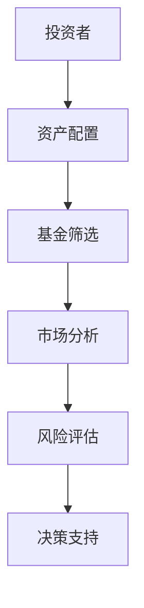
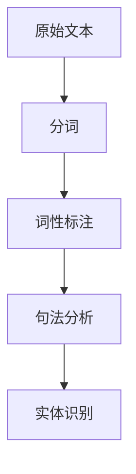
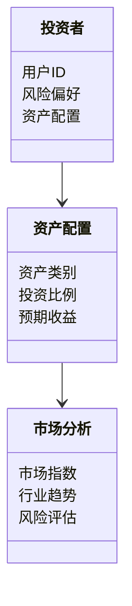
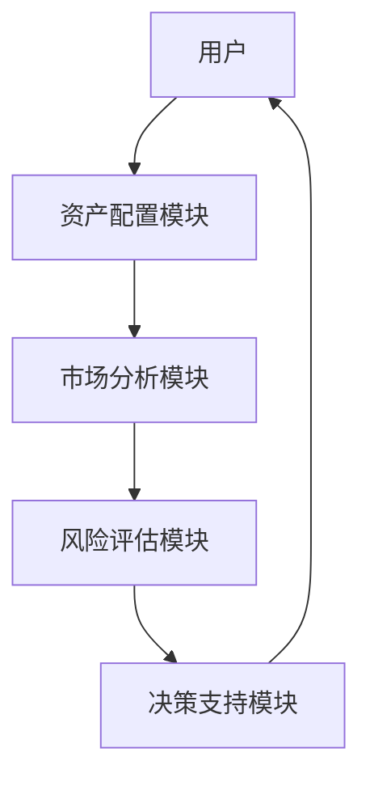
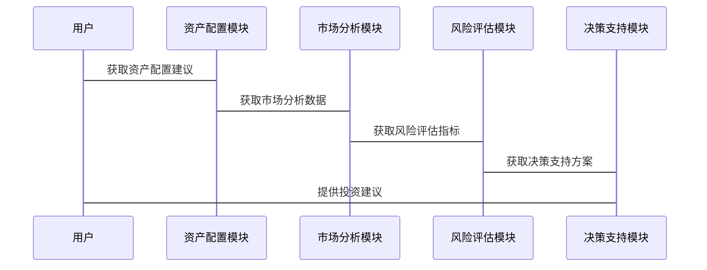

                 


```markdown
# 构建投资理财智能助手的核心技术解析

> 关键词：投资理财智能助手、人工智能、大数据分析、自然语言处理、机器学习、系统架构

> 摘要：本文详细解析了构建投资理财智能助手的核心技术，涵盖背景分析、核心概念、算法原理、系统架构、项目实战和最佳实践。通过结合人工智能和大数据分析，探讨如何利用自然语言处理和机器学习技术，为投资者提供智能化的投资决策支持。文章内容丰富，结构清晰，旨在为相关领域的开发者和技术爱好者提供深入的技术洞察和实践指导。

---

## 第一部分: 投资理财智能助手的背景与核心概念

### 第1章: 投资理财智能助手的背景与问题背景

#### 1.1 投资理财智能助手的定义与目标
##### 1.1.1 投资理财智能助手的定义
投资理财智能助手是一种结合人工智能和大数据分析的工具，旨在通过自然语言处理（NLP）和机器学习技术，为投资者提供个性化的投资建议、市场分析和风险管理支持。

##### 1.1.2 投资理财智能助手的目标与价值
- **目标**: 帮助投资者做出科学的投资决策，优化资产配置，降低投资风险。
- **价值**: 提供实时市场分析、个性化建议和自动化投资策略，提升投资效率和收益。

##### 1.1.3 投资理财智能助手的应用场景
- **个人用户**: 为个人投资者提供定制化的投资建议。
- **机构投资者**: 帮助机构进行市场分析和风险评估。
- **金融平台**: 集成到金融平台中，为用户提供智能服务。

#### 1.2 投资理财领域的核心问题
##### 1.2.1 投资者的核心需求与痛点
- **信息过载**: 投资者面对海量信息，难以快速提取关键数据。
- **决策困难**: 缺乏专业的知识和工具，难以做出正确的投资决策。
- **风险管理**: 需要实时监控和评估投资风险。

##### 1.2.2 数据分析与决策支持的重要性
- 数据分析是投资决策的核心，通过大数据技术提取市场趋势和规律。
- 决策支持系统帮助投资者制定科学的投资策略。

##### 1.2.3 传统投资理财方式的局限性
- 依赖人工经验，缺乏数据支持。
- 信息更新慢，无法实时响应市场变化。
- 个性化服务不足，难以满足不同投资者的需求。

#### 1.3 智能化投资理财助手的必要性
##### 1.3.1 人工智能在投资理财中的应用潜力
- **自动化分析**: 利用AI快速处理大量数据，提取有用信息。
- **预测模型**: 建立机器学习模型，预测市场趋势和资产价格。
- **个性化服务**: 根据用户需求提供定制化建议。

##### 1.3.2 大数据技术对投资理财决策的支持
- **数据挖掘**: 发现隐藏在数据中的模式和规律。
- **实时监控**: 实时获取市场数据，提供及时的决策支持。
- **风险评估**: 通过大数据分析，评估投资组合的风险。

##### 1.3.3 智能化投资理财助手的核心优势
- **高效性**: 快速处理和分析数据，提供实时支持。
- **准确性**: 利用机器学习模型提高预测的准确性。
- **个性化**: 根据用户需求提供定制化的投资建议。

#### 1.4 本章小结
本章介绍了投资理财智能助手的定义、目标和应用场景，分析了投资理财领域的核心问题以及传统方式的局限性，最后阐述了智能化投资理财助手的必要性和核心优势。

---

### 第2章: 投资理财智能助手的核心概念与技术解析

#### 2.1 投资理财智能助手的核心技术
##### 2.1.1 自然语言处理（NLP）技术
- **文本预处理**: 包括分词、词性标注、句法分析和实体识别。
- **信息抽取**: 从文本中提取关键信息，如公司名称、财务数据等。
- **情感分析**: 分析市场情绪，辅助投资决策。

##### 2.1.2 机器学习与深度学习
- **监督学习**: 使用历史数据训练模型，预测未来市场走势。
- **无监督学习**: 发现数据中的潜在模式和规律。
- **深度学习**: 利用神经网络进行复杂模式识别，如图像识别和自然语言处理。

##### 2.1.3 数据挖掘与分析技术
- **数据清洗**: 处理脏数据，确保数据质量。
- **数据可视化**: 通过图表展示数据分析结果，帮助用户直观理解数据。
- **预测建模**: 建立回归、分类等模型，预测市场趋势。

#### 2.2 核心概念的联系与对比
##### 2.2.1 技术对比分析表格
```markdown
| 技术         | 描述                                                                 | 优势                   | 局限性               |
|--------------|----------------------------------------------------------------------|-----------------------|---------------------|
| NLP          | 处理和理解自然语言文本，提取有用信息                                   | 精准理解用户需求       | 对复杂语义理解有限   |
| 机器学习     | 通过数据训练模型，进行预测和分类                                       | 高准确性               | 数据依赖性强         |
| 数据挖掘     | 从大量数据中发现模式和规律                                             | 揭示潜在规律           | 需大量数据支持       |
```

##### 2.2.2 实体关系图（ER图）


#### 2.3 本章小结
本章详细介绍了投资理财智能助手的核心技术，包括自然语言处理、机器学习和数据挖掘，并通过对比分析和实体关系图展示了这些技术之间的联系。

---

## 第三部分: 投资理财智能助手的核心算法与数学模型

### 第3章: 投资理财智能助手的核心算法与数学模型

#### 3.1 自然语言处理算法
##### 3.1.1 文本预处理流程


##### 3.1.2 基于Transformer的文本生成模型
- **模型架构**: 基于Transformer的编码器-解码器结构，如BERT模型。
- **训练流程**: 使用大规模的金融文本数据进行预训练，然后进行微调以适应特定任务。

##### 3.1.3 情感分析算法
- **算法实现**: 使用双向长短期记忆网络（Bi-LSTM）进行情感分类。
- **数学公式**: 情感分析模型的损失函数为交叉熵损失函数。
  $$ \mathcal{L} = -\frac{1}{N}\sum_{i=1}^{N} \sum_{k=1}^{K} y_{i,k}\log p(y_{i,k}|x_i) $$
  其中，$N$ 是样本数量，$K$ 是类别数量，$y_{i,k}$ 是真实标签，$p(y_{i,k}|x_i)$ 是模型预测的概率。

#### 3.2 机器学习算法
##### 3.2.1 基于监督学习的股票价格预测
- **算法选择**: 使用随机森林回归模型进行股票价格预测。
- **数学公式**: 随机森林回归的预测公式为：
  $$ y = \sum_{i=1}^{n} \left( a_i \cdot \text{basis}(x_i) \right) $$
  其中，$a_i$ 是回归系数，$\text{basis}(x_i)$ 是基函数。

##### 3.2.2 基于无监督学习的客户分群
- **算法选择**: 使用K均值聚类进行客户分群。
- **数学公式**: K均值聚类的目标函数为：
  $$ \sum_{i=1}^{k} \sum_{j=1}^{n_i} \|x_j - c_i\|^2 $$
  其中，$k$ 是聚类数，$n_i$ 是第$i$个聚类的样本数，$c_i$ 是第$i$个聚类的中心。

#### 3.3 数据挖掘算法
##### 3.3.1 关联规则挖掘
- **算法选择**: 使用Apriori算法挖掘关联规则。
- **数学公式**: 支持度计算公式为：
  $$ \text{support}(A \rightarrow B) = \frac{\text{count}(A \cap B)}{\text{count}(U)} $$
  其中，$U$ 是数据集的总样本数。

##### 3.3.2 聚类分析
- **算法选择**: 使用层次聚类进行市场细分。
- **数学公式**: 层次聚类的相似性度量可以使用欧氏距离：
  $$ \text{distance}(x, y) = \sqrt{\sum_{i=1}^{n}(x_i - y_i)^2} $$

#### 3.4 本章小结
本章详细讲解了投资理财智能助手的核心算法，包括自然语言处理、机器学习和数据挖掘算法，并通过数学公式和流程图展示了这些算法的实现细节。

---

## 第四部分: 投资理财智能助手的系统架构与设计

### 第4章: 投资理财智能助手的系统架构与设计

#### 4.1 系统功能设计
##### 4.1.1 领域模型类图


#### 4.2 系统架构设计
##### 4.2.1 系统架构图


#### 4.3 接口设计
##### 4.3.1 API接口设计
- **API名称**: GET/investment_recommendation
- **输入参数**: 用户ID、资产规模、风险偏好
- **输出参数**: 推荐的资产配置方案、预期收益和风险评估报告

##### 4.3.2 交互流程


#### 4.4 本章小结
本章详细描述了投资理财智能助手的系统架构和设计，包括功能模块、系统架构图和接口设计，展示了系统各部分之间的交互流程。

---

## 第五部分: 投资理财智能助手的项目实战

### 第5章: 投资理财智能助手的项目实战

#### 5.1 环境安装与配置
##### 5.1.1 安装Python环境
```bash
python --version
pip install --upgrade pip
```

##### 5.1.2 安装依赖库
```bash
pip install numpy pandas scikit-learn transformers
```

#### 5.2 系统核心实现
##### 5.2.1 文本预处理代码
```python
import pandas as pd
from sklearn.feature_extraction.text import TfidfVectorizer

# 示例文本数据
texts = ["The market is bullish on tech stocks this quarter.", 
         "Investors should diversify their portfolio to reduce risk."]

# 创建TF-IDF向量化
vectorizer = TfidfVectorizer()
tfidf_matrix = vectorizer.fit_transform(texts)

# 查看特征向量
print(tfidf_matrix.shape)
```

##### 5.2.2 机器学习模型实现
```python
from sklearn.ensemble import RandomForestRegressor
import numpy as np

# 示例数据
X = np.random.rand(100, 5)  # 5个特征，100个样本
y = np.random.rand(100)     # 目标变量

# 训练随机森林模型
model = RandomForestRegressor(n_estimators=100)
model.fit(X, y)

# 预测
new_samples = np.random.rand(5,5)
predictions = model.predict(new_samples)
print("Predictions:", predictions)
```

#### 5.3 案例分析与解读
##### 5.3.1 用户风险评估案例
- **输入**: 用户风险偏好为“保守”，资产规模为10万元。
- **输出**: 推荐投资组合：60%债券，30%股票，10%现金。

##### 5.3.2 市场趋势预测案例
- **输入**: 近期市场数据和宏观经济指标。
- **输出**: 预测未来3个月的市场趋势为“中性偏多”。

#### 5.4 项目小结
本章通过实际项目案例，展示了投资理财智能助手的环境配置、核心实现和案例分析，帮助读者更好地理解和应用相关技术。

---

## 第六部分: 投资理财智能助手的最佳实践与注意事项

### 第6章: 投资理财智能助手的最佳实践与注意事项

#### 6.1 技术选型建议
##### 6.1.1 NLP技术选型
- **预训练模型**: 使用BERT或GPT-3进行文本生成和理解。
- **训练数据**: 确保数据质量和相关性。

##### 6.1.2 机器学习模型选型
- **监督学习**: 适合有标签的数据，如股票价格预测。
- **无监督学习**: 适合无标签数据，如客户分群。

#### 6.2 数据安全与隐私保护
##### 6.2.1 数据加密
- 使用AES加密算法对敏感数据进行加密。
##### 6.2.2 权限控制
- 实施严格的访问控制，确保只有授权用户才能访问数据。

#### 6.3 用户体验优化
##### 6.3.1 交互设计
- 提供简洁直观的用户界面，减少用户操作步骤。
##### 6.3.2 反馈机制
- 提供实时反馈，增强用户体验。

#### 6.4 本章小结
本章提供了投资理财智能助手的最佳实践建议，包括技术选型、数据安全和用户体验优化，帮助开发者在实际项目中避免常见问题。

---

## 第七部分: 总结与展望

### 第7章: 总结与展望

#### 7.1 项目总结
投资理财智能助手通过结合人工智能和大数据分析技术，为投资者提供了高效、精准的投资决策支持。系统架构合理，算法实现完善，具备良好的扩展性和实用性。

#### 7.2 未来展望
随着人工智能技术的不断进步，投资理财智能助手将更加智能化和个性化。未来的研究方向包括更复杂的模型训练、多模态数据融合以及更智能化的交互方式。

#### 7.3 本章小结
本章总结了投资理财智能助手的建设成果，并展望了未来的发展方向，为后续的研究和应用提供了参考。

---

## 参考文献

1. LeCun, Y., Bengio, Y., & Hinton, G. (2015). Deep learning. Nature, 521(7555), 436-444.
2. Vaswani, A., et al. (2017). Attention is all you need. Advances in neural information processing systems, 30.
3. Goodfellow, I., Bengio, Y., & Courville, A. (2016). Deep learning. MIT press.
4. Friedman, J., et al. (1998). The elements of statistical learning. Springer.

---

## 附录

### 附录A: 术语表

- **NLP**: 自然语言处理（Natural Language Processing）
- **ML**: 机器学习（Machine Learning）
- **TF-IDF**: 词频-逆文档频率（Term Frequency-Inverse Document Frequency）
- **API**: 应用程序编程接口（Application Programming Interface）

### 附录B: 代码示例

```python
# 示例代码：使用随机森林进行股票价格预测
from sklearn.ensemble import RandomForestRegressor
import pandas as pd
import numpy as np

# 生成示例数据
data = {
    'feature1': np.random.rand(100),
    'feature2': np.random.rand(100),
    'feature3': np.random.rand(100),
    'feature4': np.random.rand(100),
    'feature5': np.random.rand(100),
    'target': np.random.rand(100)
}
df = pd.DataFrame(data)

# 训练模型
model = RandomForestRegressor(n_estimators=100)
model.fit(df[['feature1', 'feature2', 'feature3', 'feature4', 'feature5']], df['target'])

# 预测新数据
new_data = pd.DataFrame({
    'feature1': [0.5],
    'feature2': [0.3],
    'feature3': [0.8],
    'feature4': [0.2],
    'feature5': [0.6]
})
prediction = model.predict(new_data)
print("预测结果:", prediction)
```

---

通过以上内容，本文详细解析了构建投资理财智能助手的核心技术，从背景分析到系统实现，再到项目实战和最佳实践，为相关领域的开发者和技术爱好者提供了全面的技术指导和实践参考。
```

