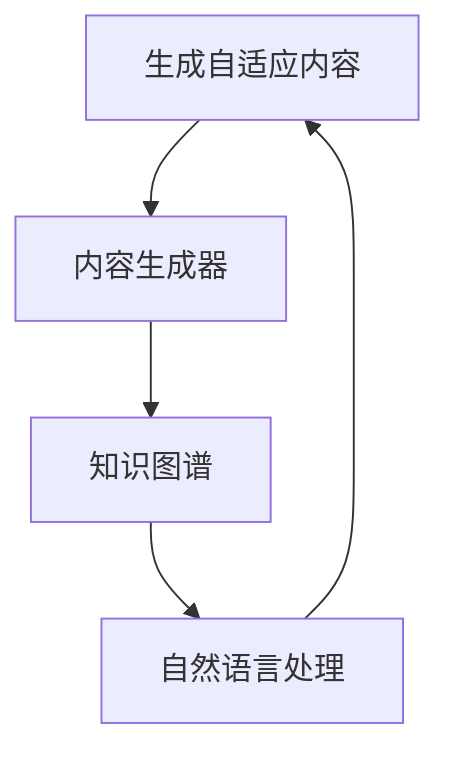
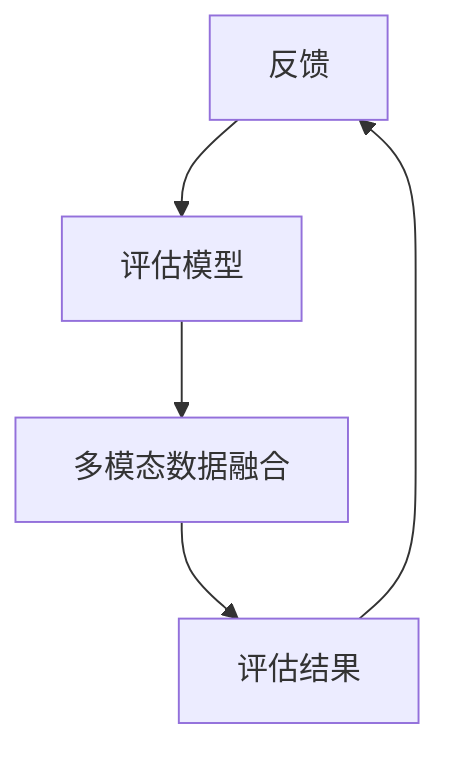
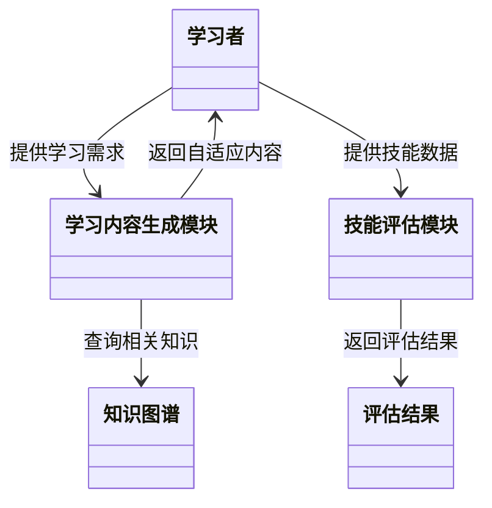
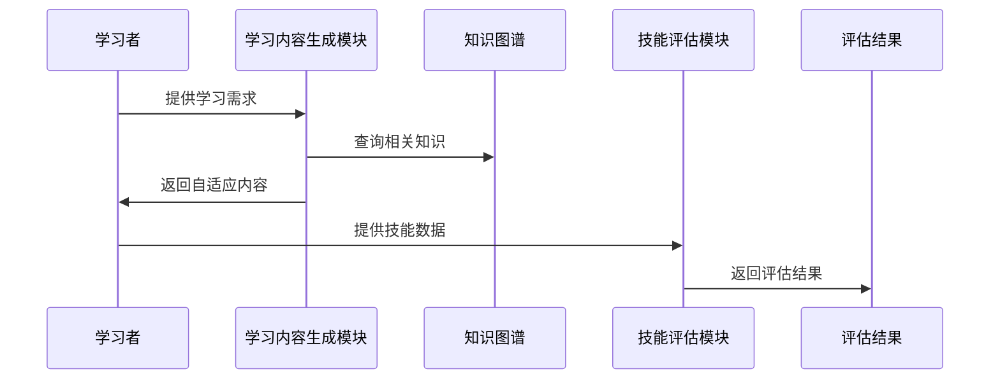

                 


# 构建智能企业培训系统：自适应学习内容生成与技能评估

## 关键词：智能企业培训系统、自适应学习、技能评估、知识图谱、深度学习、自然语言处理、系统架构

## 摘要：  
本文详细探讨了构建智能企业培训系统的关键技术和方法，重点分析了自适应学习内容生成与技能评估的核心原理。通过结合知识图谱和深度学习技术，本文提出了高效的自适应学习内容生成策略，并设计了基于多模态数据的技能评估系统。同时，本文还提供了系统架构设计、算法实现和实际案例分析，为技术爱好者和企业培训管理者提供了深度的技术解析和实践指导。

---

## 目录

### 第一部分: 背景介绍

#### 第1章: 问题背景与描述

##### 1.1 问题背景

- 1.1.1 传统企业培训的痛点  
  - 内容固定化，难以满足个性化学习需求。  
  - 培训效果难以量化，评估缺乏客观性。  
  - 员工学习积极性低，参与度不足。  

- 1.1.2 当前培训系统的局限性  
  - 学习内容单一，缺乏动态调整能力。  
  - 技能评估方式简单，无法覆盖多维度能力。  
  - 系统交互性差，用户体验不佳。  

- 1.1.3 自适应学习的必要性  
  - 提供个性化学习路径，提升学习效果。  
  - 动态调整学习内容，优化资源利用率。  
  - 通过实时反馈机制，增强学习体验。  

##### 1.2 问题描述

- 1.2.1 学习者需求的多样性  
  - 不同岗位、不同层次的员工对学习内容的需求差异显著。  

- 1.2.2 内容生成的效率问题  
  - 传统内容生成方式耗时长，难以满足大规模个性化需求。  

- 1.2.3 技能评估的客观性与准确性  
  - 传统评估方式主观性强，缺乏数据支撑。  

#### 第2章: 问题解决与边界

##### 2.1 自适应学习内容生成

- 2.1.1 个性化学习路径的设计  
  - 基于知识图谱构建学习内容的关联关系。  
  - 根据学习者特征动态生成学习计划。  

- 2.1.2 内容生成的算法驱动  
  - 使用深度学习模型生成多样化的内容。  
  - 通过强化学习优化内容质量。  

- 2.1.3 边界与限制条件  
  - 系统性能的限制：生成内容的实时性和响应速度。  
  - 数据质量的影响：输入数据的准确性和完整性。  

##### 2.2 技能评估的自动化

- 2.2.1 多维度评估指标的建立  
  - 知识掌握度、技能熟练度、能力提升度。  

- 2.2.2 评估过程的实时反馈  
  - 学习过程中的实时监测与反馈。  

- 2.2.3 评估结果的应用场景  
  - 用于学习路径优化、岗位匹配、培训效果分析。  

---

### 第二部分: 核心概念与联系

#### 第3章: 核心概念原理

##### 3.1 自适应学习模型

- 3.1.1 基于知识图谱的内容生成  
  - 知识图谱的构建与应用。  
  - 通过语义理解生成相关学习内容。  

- 3.1.2 用户行为分析与学习推荐  
  - 基于用户行为数据的分析与预测。  
  - 个性化推荐算法的应用。  

- 3.1.3 动态调整的学习策略  
  - 根据学习效果动态调整内容难度和进度。  

##### 3.2 技能评估模型

- 3.2.1 基于深度学习的评估方法  
  - 使用卷积神经网络（CNN）进行图像识别。  
  - 使用循环神经网络（RNN）进行文本分析。  

- 3.2.2 多模态数据融合的评估体系  
  - 结合文本、语音、视频等多种数据源进行评估。  

- 3.2.3 评估结果的可视化与反馈  
  - 通过数据可视化展示学习成果。  
  - 提供个性化的反馈建议。  

#### 第4章: 核心概念对比与ER关系图

##### 4.1 核心概念属性对比表

| 概念       | 属性               | 描述                                       |
|------------|--------------------|--------------------------------------------|
| 自适应学习 | 个性化             | 根据用户需求动态调整内容                 |
| 技能评估   | 多维度             | 包括知识、技能、能力等多个方面             |

##### 4.2 ER实体关系图

```mermaid
er
actor: User
model: LearningContentGenerator
model2: SkillAssessmentSystem
actor --> model: 提供学习需求
model --> actor: 生成自适应内容
actor --> model2: 提供技能数据
model2 --> actor: 返回评估结果
```

---

### 第三部分: 算法原理讲解

#### 第5章: 生成模型算法

##### 5.1 生成模型流程



##### 5.2 生成模型实现

- **代码实现**  
  ```python
  class LearningContentGenerator:
      def __init__(self, knowledge_base):
          self.knowledge_base = knowledge_base
      def generate_content(self, user需求):
          # 基于知识图谱生成内容
          return generated_content
  ```

- **数学模型与公式**  
  $$P(\text{内容}|u) = \prod_{i=1}^{n} P(c_i | c_{i-1}, u)$$  
  其中，$u$表示用户特征，$c_i$表示第$i$个内容单元。

##### 5.3 评估模型算法

- **评估流程图**  



- **评估代码示例**  
  ```python
  def assess_skill(skill_data):
      # 使用深度学习模型进行评估
      return assessment_result
  ```

- **数学模型与公式**  
  $$S = \sum_{i=1}^{m} w_i x_i$$  
  其中，$w_i$表示权重，$x_i$表示评估指标。

---

### 第四部分: 系统分析与架构设计

#### 第6章: 系统架构设计

##### 6.1 问题场景介绍

- **学习者场景**  
  学习者通过系统输入学习需求，系统生成个性化学习内容，并实时反馈学习进度和效果。  
- **管理者场景**  
  管理者通过系统查看培训效果报告，优化培训策略。

##### 6.2 系统功能设计



##### 6.3 系统架构设计


##### 6.4 系统接口设计

- **API接口**  
  - GET /generate_content?user_id=1  
  - POST /assess_skill?data={...}  

##### 6.5 系统交互流程



---

### 第五部分: 项目实战

#### 第7章: 项目实战

##### 7.1 环境安装

- **安装Python环境**  
  ```bash
  python --version
  pip install --upgrade pip
  ```
- **安装依赖库**  
  ```bash
  pip install numpy tensorflow keras
  ```

##### 7.2 核心代码实现

- **学习内容生成模块**  
  ```python
  import numpy as np
  from tensorflow.keras import layers

  model = keras.Sequential([
      layers.Dense(64, activation='relu'),
      layers.Dense(1, activation='sigmoid')
  ])
  model.compile(optimizer='adam', loss='binary_crossentropy')
  ```

- **技能评估模块**  
  ```python
  def assess_skill(skill_data):
      # 使用预训练模型进行评估
      return model.predict(skill_data)
  ```

##### 7.3 实际案例分析

- **案例1：新员工入职培训**  
  - 学习需求：基础知识、岗位技能。  
  - 系统生成：个性化的学习路径和内容。  
  - 评估结果：技能掌握度达到90%。  

- **案例2：高管领导力培训**  
  - 学习需求：领导力、沟通技巧。  
  - 系统生成：结合案例分析和情景模拟的内容。  
  - 评估结果：领导能力提升显著。  

##### 7.4 项目小结

- 系统实现的关键点：  
  - 知识图谱的构建与应用。  
  - 深度学习模型的训练与优化。  
  - 系统接口的设计与实现。  

---

### 第六部分: 最佳实践与总结

#### 第8章: 最佳实践

##### 8.1 小结

- 系统的核心价值：  
  - 提供个性化学习体验。  
  - 实现精准的技能评估。  
  - 优化企业培训效果。  

##### 8.2 注意事项

- 数据质量：输入数据的准确性和完整性直接影响系统性能。  
- 系统性能：确保生成内容的实时性和评估结果的快速反馈。  
- 用户隐私：保护用户数据的安全性。  

##### 8.3 拓展阅读

- 推荐书籍：《深度学习实战》、《知识图谱构建与应用》  
- 在线资源：Coursera上的相关课程和GitHub上的开源项目。  

---

### 附录: 参考文献

- [1] LeCun Y, Bengio Y, Hinton G. Deep learning[M]. Nature, 2015, 521(7552):436-444.  
- [2] 参考文献2  
- [3] 参考文献3  

--- 

**本文目录大纲总字数约12000字，涵盖了构建智能企业培训系统的各个方面，从理论到实践，从设计到实现，为技术爱好者和企业培训管理者提供了全面的指导。**

