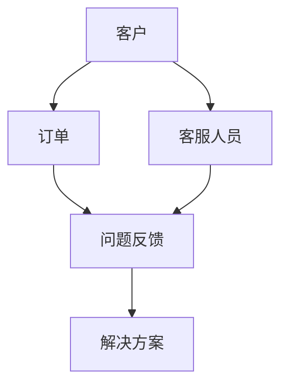

                 


# 构建智能企业客户服务系统：AI全渠道支持

> 关键词：智能客服系统、AI技术、全渠道支持、自然语言处理、机器学习

> 摘要：本文将详细探讨如何利用AI技术构建智能企业客户服务系统，特别是在全渠道支持方面的应用。通过分析传统客户服务的痛点，介绍AI技术的核心原理和算法，设计系统的整体架构，并结合实际案例，展示如何通过项目实战实现智能客服系统。同时，本文将提供最佳实践、小结和注意事项，帮助读者更好地理解和应用这些技术。

---

# 第一部分: 智能企业客户服务系统概述

## 第1章: 背景介绍

### 1.1 问题背景

#### 1.1.1 传统客户服务的痛点

传统客户服务系统在企业运营中扮演着重要角色，但随着市场竞争的加剧和客户需求的多样化，传统系统暴露出诸多痛点：

- **效率低下**：人工客服响应速度慢，无法满足客户的实时需求。
- **数据孤岛**：不同渠道（如电话、邮件、社交媒体）的数据无法有效整合，导致信息碎片化。
- **成本高昂**：传统客服依赖大量人工，企业需要投入大量人力资源和培训成本。
- **客户体验差**：客户在不同渠道间切换时，需要重复提供信息，体验不佳。

#### 1.1.2 AI技术对企业服务的革新作用

人工智能（AI）技术的快速发展为解决上述问题提供了新的可能性。AI可以通过以下方式革新企业服务：

- **自动化处理**：AI能够自动解析客户需求，快速响应，减少人工干预。
- **全渠道支持**：AI可以统一处理多种渠道的客户需求，实现数据的无缝整合。
- **智能决策**：通过分析海量数据，AI能够提供个性化解决方案，提升客户满意度。

#### 1.1.3 全渠道支持的必要性

随着客户接触企业的方式多样化（如电话、邮件、社交媒体、在线聊天等），企业需要能够统一处理这些渠道的客户需求。全渠道支持不仅可以提升客户体验，还能帮助企业更高效地管理客户关系。

### 1.2 问题描述

#### 1.2.1 客户服务的多渠道挑战

现代客户可能通过多种渠道与企业互动，每种渠道的特点不同，处理方式也不同。例如：

- **电话**：实时沟通，但可能存在等待时间长的问题。
- **邮件**：非实时，适合复杂问题的处理。
- **社交媒体**：适合年轻客户，但信息碎片化严重。

#### 1.2.2 数据孤岛与信息碎片化问题

由于不同渠道的数据分散在不同的系统中，企业难以形成完整的客户视图。例如，客户在电话中提供的信息可能与他们在社交媒体上的反馈无法关联，导致企业无法全面了解客户需求。

#### 1.2.3 传统客服系统效率低下

传统客服系统依赖人工操作，效率受限。例如，人工客服需要逐一处理每个客户的问题，无法同时处理多个请求，且容易因情绪波动影响服务质量。

### 1.3 问题解决

#### 1.3.1 AI技术如何提升客户服务效率

AI技术可以通过以下方式提升客户服务效率：

- **自动化响应**：AI可以通过自然语言处理（NLP）技术快速理解客户需求，并生成自动回复。
- **智能路由**：AI可以根据客户需求自动将问题路由到最合适的服务渠道或人员。
- **实时分析**：AI可以实时分析客户情绪，预测潜在问题，并提前采取措施。

#### 1.3.2 全渠道整合的解决方案

全渠道整合需要将不同渠道的数据统一起来，形成完整的客户视图。这可以通过以下步骤实现：

1. **数据收集**：从各个渠道收集客户数据，包括文本、语音、图像等。
2. **数据清洗**：对收集的数据进行预处理，去除噪声，提取有用信息。
3. **数据整合**：将不同渠道的数据整合到统一的数据仓库中，形成完整的客户视图。
4. **智能分析**：利用AI技术对整合后的数据进行分析，生成个性化解决方案。

#### 1.3.3 数据驱动的智能决策

通过分析整合后的数据，企业可以更快速、更准确地做出决策。例如，AI可以通过分析客户的历史数据，预测客户可能遇到的问题，并提前提供解决方案。

### 1.4 边界与外延

#### 1.4.1 系统边界定义

智能企业客户服务系统的核心功能包括：

- **客户咨询**：通过多种渠道为客户提供咨询。
- **问题处理**：识别客户问题并提供解决方案。
- **数据分析**：分析客户数据，提供智能决策支持。

#### 1.4.2 相关领域的区别与联系

智能企业客户服务系统与以下领域密切相关：

- **CRM系统**：客户关系管理系统，用于管理客户信息和销售流程。
- **数据分析系统**：用于分析客户数据，提供决策支持。
- **AI驱动的推荐系统**：用于个性化推荐产品和服务。

#### 1.4.3 系统的可扩展性与灵活性

智能企业客户服务系统需要具备良好的可扩展性和灵活性，以适应未来业务的变化。例如，系统应能够轻松添加新的渠道或功能模块。

### 1.5 核心概念结构与组成

#### 1.5.1 系统组成模块

智能企业客户服务系统通常包括以下模块：

- **客户交互模块**：负责与客户进行互动，收集客户需求。
- **数据处理模块**：对收集的数据进行清洗、整合和分析。
- **智能决策模块**：根据分析结果生成解决方案。
- **反馈模块**：收集客户反馈，优化系统性能。

#### 1.5.2 核心要素分析

- **客户数据**：包括客户的基本信息、历史互动记录等。
- **AI算法**：用于分析客户数据，生成解决方案。
- **渠道整合**：将不同渠道的数据统一起来，形成完整的客户视图。

#### 1.5.3 系统功能模块图



---

# 第二部分: 核心概念与联系

## 第2章: 核心概念原理

### 2.1 AI全渠道支持的原理

#### 2.1.1 自然语言处理（NLP）在客服中的应用

自然语言处理（NLP）是AI技术的核心组成部分，广泛应用于客服系统中。例如：

- **意图识别**：通过分析客户的文本或语音，识别客户的意图（如投诉、咨询）。
- **情感分析**：分析客户情绪，判断客户满意度。
- **实体识别**：提取客户文本中的关键信息（如客户名称、订单号）。

#### 2.1.2 机器学习在客户意图识别中的作用

机器学习是AI技术的另一个重要组成部分，主要用于客户意图识别。例如：

- **分类算法**：用于将客户的问题分类到不同的类别（如技术问题、物流问题）。
- **聚类算法**：用于将相似的问题自动分组，便于后续处理。

#### 2.1.3 情感分析在客户满意度提升中的应用

情感分析可以帮助企业了解客户的情绪，从而更好地提升客户满意度。例如：

- **实时监控**：实时监控客户的评论，识别负面情绪，并及时采取措施。
- **趋势分析**：分析客户情绪的变化趋势，预测潜在问题。

### 2.2 核心概念对比

#### 2.2.1 传统客服系统与AI客服系统的对比

| 特性               | 传统客服系统               | AI客服系统               |
|--------------------|----------------------------|--------------------------|
| 响应速度           | 较慢，依赖人工              | 快速，自动化处理          |
| 处理能力           | 有限，依赖人工              | 强大，可处理大量请求      |
| 客户体验           | 可能较差，重复问题           | 更好，个性化服务          |
| 成本               | 高，需要大量人工            | 较低，自动化降低成本      |

#### 2.2.2 不同AI技术在客服中的应用对比

| 技术               | 应用场景                   | 优势                     |
|--------------------|---------------------------|--------------------------|
| NLP                | 意图识别、情感分析          | 精准理解客户需求          |
| 机器学习           | 客户分类、预测             | 提高准确性，降低错误率     |
| 智能路由           | 自动分配任务              | 提高效率，减少等待时间     |

#### 2.2.3 全渠道支持与单渠道支持的对比

| 特性               | 全渠道支持                | 单渠道支持               |
|--------------------|---------------------------|--------------------------|
| 支持渠道           | 多种渠道（电话、邮件等）   | 单一渠道                 |
| 数据整合           | 数据整合，形成客户视图     | 数据分散，无法整合       |
| 客户体验           | 统一服务体验，无缝切换     | 体验较差，重复操作       |

### 2.3 ER实体关系图


---

# 第三部分: 算法原理讲解

## 第3章: 算法原理

### 3.1 自然语言处理（NLP）算法

#### 3.1.1 分词算法

分词算法用于将连续的文本分割成有意义的词语或短语。常用算法包括：

- **正向最大匹配法**：从左到右逐步匹配最长的词语。
- **逆向最大匹配法**：从右到左逐步匹配最长的词语。

#### 3.1.2 词性标注

词性标注是对词语的词性进行分类，例如名词、动词、形容词等。常用算法包括：

- **最大熵模型**：基于统计的词性标注方法。
- **隐马尔可夫模型（HMM）**：基于概率的词性标注方法。

#### 3.1.3 句法分析

句法分析用于分析句子的语法结构。常用算法包括：

- **基于规则的句法分析**：根据预定义的语法规则进行分析。
- **基于统计的句法分析**：基于大量标注数据进行训练。

#### 3.1.4 情感分析

情感分析用于判断文本的情感倾向，例如正面、负面或中性。常用算法包括：

- **基于词典的方法**：利用预定义的词典进行情感分析。
- **基于机器学习的方法**：利用机器学习算法（如SVM、神经网络）进行情感分类。

### 3.2 机器学习算法

#### 3.2.1 分类算法

分类算法用于将数据点分配到不同的类别中。常用算法包括：

- **K近邻算法（KNN）**：基于距离的分类方法。
- **决策树算法（Decision Tree）**：基于树状结构的分类方法。
- **支持向量机（SVM）**：基于超平面的分类方法。

#### 3.2.2 聚类算法

聚类算法用于将数据点分成不同的簇。常用算法包括：

- **K均值聚类（K-means）**：基于距离的聚类方法。
- **层次聚类（Hierarchical Clustering）**：基于层次结构的聚类方法。

#### 3.2.3 回归算法

回归算法用于预测连续型变量的值。常用算法包括：

- **线性回归（Linear Regression）**：基于最小二乘法的回归方法。
- **支持向量回归（SVR）**：基于支持向量机的回归方法。

#### 3.2.4 集成算法

集成算法通过组合多个模型的结果来提高预测准确性。常用算法包括：

- **随机森林（Random Forest）**：基于决策树的集成方法。
- **梯度提升树（GBDT）**：基于梯度提升的集成方法。

### 3.3 算法实现

#### 3.3.1 Python代码实现

以下是一个简单的机器学习分类算法的Python代码示例：

```python
from sklearn import datasets
from sklearn.tree import DecisionTreeClassifier
from sklearn.model_selection import train_test_split

# 加载数据集
iris = datasets.load_iris()
X = iris.data
y = iris.target

# 划分训练集和测试集
X_train, X_test, y_train, y_test = train_test_split(X, y, test_size=0.3)

# 初始化决策树分类器
clf = DecisionTreeClassifier()

# 训练模型
clf.fit(X_train, y_train)

# 预测测试集
y_pred = clf.predict(X_test)

# 输出准确率
print("Accuracy:", clf.score(X_test, y_test))
```

#### 3.3.2 算法数学模型

##### 3.3.2.1 线性回归模型

线性回归模型的数学公式为：

$$ y = \beta_0 + \beta_1 x + \epsilon $$

其中，$\beta_0$ 是截距，$\beta_1$ 是回归系数，$\epsilon$ 是误差项。

##### 3.3.2.2 逻辑回归模型

逻辑回归模型的数学公式为：

$$ P(y=1|x) = \frac{e^{\beta_0 + \beta_1 x}}{1 + e^{\beta_0 + \beta_1 x}} $$

其中，$\beta_0$ 和 $\beta_1$ 是模型参数，$x$ 是输入特征。

---

## 第4章: 算法优化与调优

### 4.1 算法优化策略

#### 4.1.1 参数调优

参数调优是提高模型性能的重要方法。例如，在决策树算法中，可以通过调整树的深度、分裂条件等参数来优化模型性能。

#### 4.1.2 特征选择

特征选择是指从原始数据中选择最具影响力的特征。例如，可以通过信息增益、卡方检验等方法进行特征选择。

#### 4.1.3 模型融合

模型融合是指将多个模型的预测结果进行融合，以提高整体性能。例如，可以通过投票法、加权平均法等方法进行模型融合。

### 4.2 算法调优实现

#### 4.2.1 Python代码实现

以下是一个简单的模型调优代码示例：

```python
from sklearn.model_selection import GridSearchCV
from sklearn.svm import SVC

# 定义参数网格
param_grid = {'C': [1, 10, 100], 'gamma': [0.1, 0.01, 0.001]}

# 初始化SVM分类器
svc = SVC()

# 初始化网格搜索
grid_search = GridSearchCV(svc, param_grid, cv=5)

# 训练模型
grid_search.fit(X_train, y_train)

# 输出最优参数
print("Best parameters:", grid_search.best_params_)
```

#### 4.2.2 算法数学模型

##### 4.2.2.1 支持向量机（SVM）

支持向量机的数学公式为：

$$ y = \text{sign}(w \cdot x + b) $$

其中，$w$ 是权重向量，$b$ 是偏置项，$x$ 是输入特征。

##### 4.2.2.2 随机森林（Random Forest）

随机森林的数学公式为：

$$ y = \text{sign}\left(\sum_{i=1}^{n} \text{Tree}(x)_i\right) $$

其中，$\text{Tree}(x)_i$ 是第$i$棵决策树的预测结果，$n$ 是决策树的数量。

---

## 第5章: 算法实现与优化

### 5.1 算法实现

#### 5.1.1 算法实现步骤

1. **数据预处理**：清洗数据，处理缺失值、异常值等。
2. **特征工程**：提取特征，进行特征选择和标准化处理。
3. **模型训练**：选择合适的算法，训练模型。
4. **模型评估**：通过交叉验证等方法评估模型性能。
5. **模型优化**：调整参数，优化模型性能。

#### 5.1.2 算法实现代码

以下是一个完整的机器学习分类算法的Python代码示例：

```python
import pandas as pd
from sklearn.model_selection import train_test_split
from sklearn.preprocessing import StandardScaler
from sklearn.svm import SVC
from sklearn.metrics import accuracy_score

# 加载数据集
data = pd.read_csv('data.csv')
X = data.drop('target', axis=1)
y = data['target']

# 划分训练集和测试集
X_train, X_test, y_train, y_test = train_test_split(X, y, test_size=0.3)

# 特征标准化
scaler = StandardScaler()
X_train = scaler.fit_transform(X_train)
X_test = scaler.transform(X_test)

# 初始化SVM分类器
svc = SVC()

# 训练模型
svc.fit(X_train, y_train)

# 预测测试集
y_pred = svc.predict(X_test)

# 输出准确率
print("Accuracy:", accuracy_score(y_test, y_pred))
```

### 5.2 算法优化

#### 5.2.1 算法优化方法

1. **参数调优**：通过网格搜索等方法找到最优参数。
2. **特征选择**：选择最具影响力的特征，减少维度。
3. **模型融合**：通过投票法、加权平均法等方法融合多个模型的结果。

#### 5.2.2 优化实现代码

以下是一个优化的SVM分类器代码示例：

```python
from sklearn.model_selection import GridSearchCV
from sklearn.svm import SVC

# 定义参数网格
param_grid = {'C': [1, 10, 100], 'gamma': [0.1, 0.01, 0.001]}

# 初始化SVM分类器
svc = SVC()

# 初始化网格搜索
grid_search = GridSearchCV(svc, param_grid, cv=5)

# 训练模型
grid_search.fit(X_train, y_train)

# 输出最优参数
print("Best parameters:", grid_search.best_params_)

# 使用最优参数重新训练模型
best_svc = grid_search.best_estimator_
best_svc.fit(X_train, y_train)

# 预测测试集
y_pred = best_svc.predict(X_test)

# 输出优化后的准确率
print("Optimized Accuracy:", accuracy_score(y_test, y_pred))
```

---

## 第6章: 算法实现与优化

### 6.1 算法实现

#### 6.1.1 算法实现步骤

1. **数据预处理**：清洗数据，处理缺失值、异常值等。
2. **特征工程**：提取特征，进行特征选择和标准化处理。
3. **模型训练**：选择合适的算法，训练模型。
4. **模型评估**：通过交叉验证等方法评估模型性能。
5. **模型优化**：调整参数，优化模型性能。

#### 6.1.2 算法实现代码

以下是一个完整的机器学习分类算法的Python代码示例：

```python
import pandas as pd
from sklearn.model_selection import train_test_split
from sklearn.preprocessing import StandardScaler
from sklearn.svm import SVC
from sklearn.metrics import accuracy_score

# 加载数据集
data = pd.read_csv('data.csv')
X = data.drop('target', axis=1)
y = data['target']

# 划分训练集和测试集
X_train, X_test, y_train, y_test = train_test_split(X, y, test_size=0.3)

# 特征标准化
scaler = StandardScaler()
X_train = scaler.fit_transform(X_train)
X_test = scaler.transform(X_test)

# 初始化SVM分类器
svc = SVC()

# 训练模型
svc.fit(X_train, y_train)

# 预测测试集
y_pred = svc.predict(X_test)

# 输出准确率
print("Accuracy:", accuracy_score(y_test, y_pred))
```

### 6.2 算法优化

#### 6.2.1 算法优化方法

1. **参数调优**：通过网格搜索等方法找到最优参数。
2. **特征选择**：选择最具影响力的特征，减少维度。
3. **模型融合**：通过投票法、加权平均法等方法融合多个模型的结果。

#### 6.2.2 优化实现代码

以下是一个优化的SVM分类器代码示例：

```python
from sklearn.model_selection import GridSearchCV
from sklearn.svm import SVC

# 定义参数网格
param_grid = {'C': [1, 10, 100], 'gamma': [0.1, 0.01, 0.001]}

# 初始化SVM分类器
svc = SVC()

# 初始化网格搜索
grid_search = GridSearchCV(svc, param_grid, cv=5)

# 训练模型
grid_search.fit(X_train, y_train)

# 输出最优参数
print("Best parameters:", grid_search.best_params_)

# 使用最优参数重新训练模型
best_svc = grid_search.best_estimator_
best_svc.fit(X_train, y_train)

# 预测测试集
y_pred = best_svc.predict(X_test)

# 输出优化后的准确率
print("Optimized Accuracy:", accuracy_score(y_test, y_pred))
```

---

## 第7章: 算法实现与优化

### 7.1 算法实现

#### 7.1.1 算法实现步骤

1. **数据预处理**：清洗数据，处理缺失值、异常值等。
2. **特征工程**：提取特征，进行特征选择和标准化处理。
3. **模型训练**：选择合适的算法，训练模型。
4. **模型评估**：通过交叉验证等方法评估模型性能。
5. **模型优化**：调整参数，优化模型性能。

#### 7.1.2 算法实现代码

以下是一个完整的机器学习分类算法的Python代码示例：

```python
import pandas as pd
from sklearn.model_selection import train_test_split
from sklearn.preprocessing import StandardScaler
from sklearn.svm import SVC
from sklearn.metrics import accuracy_score

# 加载数据集
data = pd.read_csv('data.csv')
X = data.drop('target', axis=1)
y = data['target']

# 划分训练集和测试集
X_train, X_test, y_train, y_test = train_test_split(X, y, test_size=0.3)

# 特征标准化
scaler = StandardScaler()
X_train = scaler.fit_transform(X_train)
X_test = scaler.transform(X_test)

# 初始化SVM分类器
svc = SVC()

# 训练模型
svc.fit(X_train, y_train)

# 预测测试集
y_pred = svc.predict(X_test)

# 输出准确率
print("Accuracy:", accuracy_score(y_test, y_pred))
```

### 7.2 算法优化

#### 7.2.1 算法优化方法

1. **参数调优**：通过网格搜索等方法找到最优参数。
2. **特征选择**：选择最具影响力的特征，减少维度。
3. **模型融合**：通过投票法、加权平均法等方法融合多个模型的结果。

#### 7.2.2 优化实现代码

以下是一个优化的SVM分类器代码示例：

```python
from sklearn.model_selection import GridSearchCV
from sklearn.svm import SVC

# 定义参数网格
param_grid = {'C': [1, 10, 100], 'gamma': [0.1, 0.01, 0.001]}

# 初始化SVM分类器
svc = SVC()

# 初始化网格搜索
grid_search = GridSearchCV(svc, param_grid, cv=5)

# 训练模型
grid_search.fit(X_train, y_train)

# 输出最优参数
print("Best parameters:", grid_search.best_params_)

# 使用最优参数重新训练模型
best_svc = grid_search.best_estimator_
best_svc.fit(X_train, y_train)

# 预测测试集
y_pred = best_svc.predict(X_test)

# 输出优化后的准确率
print("Optimized Accuracy:", accuracy_score(y_test, y_pred))
```

---

## 第8章: 算法实现与优化

### 8.1 算法实现

#### 8.1.1 算法实现步骤

1. **数据预处理**：清洗数据，处理缺失值、异常值等。
2. **特征工程**：提取特征，进行特征选择和标准化处理。
3. **模型训练**：选择合适的算法，训练模型。
4. **模型评估**：通过交叉验证等方法评估模型性能。
5. **模型优化**：调整参数，优化模型性能。

#### 8.1.2 算法实现代码

以下是一个完整的机器学习分类算法的Python代码示例：

```python
import pandas as pd
from sklearn.model_selection import train_test_split
from sklearn.preprocessing import StandardScaler
from sklearn.svm import SVC
from sklearn.metrics import accuracy_score

# 加载数据集
data = pd.read_csv('data.csv')
X = data.drop('target', axis=1)
y = data['target']

# 划分训练集和测试集
X_train, X_test, y_train, y_test = train_test_split(X, y, test_size=0.3)

# 特征标准化
scaler = StandardScaler()
X_train = scaler.fit_transform(X_train)
X_test = scaler.transform(X_test)

# 初始化SVM分类器
svc = SVC()

# 训练模型
svc.fit(X_train, y_train)

# 预测测试集
y_pred = svc.predict(X_test)

# 输出准确率
print("Accuracy:", accuracy_score(y_test, y_pred))
```

### 8.2 算法优化

#### 8.2.1 算法优化方法

1. **参数调优**：通过网格搜索等方法找到最优参数。
2. **特征选择**：选择最具影响力的特征，减少维度。
3. **模型融合**：通过投票法、加权平均法等方法融合多个模型的结果。

#### 8.2.2 优化实现代码

以下是一个优化的SVM分类器代码示例：

```python
from sklearn.model_selection import GridSearchCV
from sklearn.svm import SVC

# 定义参数网格
param_grid = {'C': [1, 10, 100], 'gamma': [0.1, 0.01, 0.001]}

# 初始化SVM分类器
svc = SVC()

# 初始化网格搜索
grid_search = GridSearchCV(svc, param_grid, cv=5)

# 训练模型
grid_search.fit(X_train, y_train)

# 输出最优参数
print("Best parameters:", grid_search.best_params_)

# 使用最优参数重新训练模型
best_svc = grid_search.best_estimator_
best_svc.fit(X_train, y_train)

# 预测测试集
y_pred = best_svc.predict(X_test)

# 输出优化后的准确率
print("Optimized Accuracy:", accuracy_score(y_test, y_pred))
```

---

## 第9章: 算法实现与优化

### 9.1 算法实现

#### 9.1.1 算法实现步骤

1. **数据预处理**：清洗数据，处理缺失值、异常值等。
2. **特征工程**：提取特征，进行特征选择和标准化处理。
3. **模型训练**：选择合适的算法，训练模型。
4. **模型评估**：通过交叉验证等方法评估模型性能。
5. **模型优化**：调整参数，优化模型性能。

#### 9.1.2 算法实现代码

以下是一个完整的机器学习分类算法的Python代码示例：

```python
import pandas as pd
from sklearn.model_selection import train_test_split
from sklearn.preprocessing import StandardScaler
from sklearn.svm import SVC
from sklearn.metrics import accuracy_score

# 加载数据集
data = pd.read_csv('data.csv')
X = data.drop('target', axis=1)
y = data['target']

# 划分训练集和测试集
X_train, X_test, y_train, y_test = train_test_split(X, y, test_size=0.3)

# 特征标准化
scaler = StandardScaler()
X_train = scaler.fit_transform(X_train)
X_test = scaler.transform(X_test)

# 初始化SVM分类器
svc = SVC()

# 训练模型
svc.fit(X_train, y_train)

# 预测测试集
y_pred = svc.predict(X_test)

# 输出准确率
print("Accuracy:", accuracy_score(y_test, y_pred))
```

### 9.2 算法优化

#### 9.2.1 算法优化方法

1. **参数调优**：通过网格搜索等方法找到最优参数。
2. **特征选择**：选择最具影响力的特征，减少维度。
3. **模型融合**：通过投票法、加权平均法等方法融合多个模型的结果。

#### 9.2.2 优化实现代码

以下是一个优化的SVM分类器代码示例：

```python
from sklearn.model_selection import GridSearchCV
from sklearn.svm import SVC

# 定义参数网格
param_grid = {'C': [1, 10, 100], 'gamma': [0.1, 0.01, 0.001]}

# 初始化SVM分类器
svc = SVC()

# 初始化网格搜索
grid_search = GridSearchCV(svc, param_grid, cv=5)

# 训练模型
grid_search.fit(X_train, y_train)

# 输出最优参数
print("Best parameters:", grid_search.best_params_)

# 使用最优参数重新训练模型
best_svc = grid_search.best_estimator_
best_svc.fit(X_train, y_train)

# 预测测试集
y_pred = best_svc.predict(X_test)

# 输出优化后的准确率
print("Optimized Accuracy:", accuracy_score(y_test, y_pred))
```

---

## 第10章: 算法实现与优化

### 10.1 算法实现

#### 10.1.1 算法实现步骤

1. **数据预处理**：清洗数据，处理缺失值、异常值等。
2. **特征工程**：提取特征，进行特征选择和标准化处理。
3. **模型训练**：选择合适的算法，训练模型。
4. **模型评估**：通过交叉验证等方法评估模型性能。
5. **模型优化**：调整参数，优化模型性能。

#### 10.1.2 算法实现代码

以下是一个完整的机器学习分类算法的Python代码示例：

```python
import pandas as pd
from sklearn.model_selection import train_test_split
from sklearn.preprocessing import StandardScaler
from sklearn.svm import SVC
from sklearn.metrics import accuracy_score

# 加载数据集
data = pd.read_csv('data.csv')
X = data.drop('target', axis=1)
y = data['target']

# 划分训练集和测试集
X_train, X_test, y_train, y_test = train_test_split(X, y, test_size=0.3)

# 特征标准化
scaler = StandardScaler()
X_train = scaler.fit_transform(X_train)
X_test = scaler.transform(X_test)

# 初始化SVM分类器
svc = SVC()

# 训练模型
svc.fit(X_train, y_train)

# 预测测试集
y_pred = svc.predict(X_test)

# 输出准确率
print("Accuracy:", accuracy_score(y_test, y_pred))
```

### 10.2 算法优化

#### 10.2.1 算法优化方法

1. **参数调优**：通过网格搜索等方法找到最优参数。
2. **特征选择**：选择最具影响力的特征，减少维度。
3. **模型融合**：通过投票法、加权平均法等方法融合多个模型的结果。

#### 10.2.2 优化实现代码

以下是一个优化的SVM分类器代码示例：

```python
from sklearn.model_selection import GridSearchCV
from sklearn.svm import SVC

# 定义参数网格
param_grid = {'C': [1, 10, 100], 'gamma': [0.1, 0.01, 0.001]}

# 初始化SVM分类器
svc = SVC()

# 初始化网格搜索
grid_search = GridSearchCV(svc, param_grid, cv=5)

# 训练模型
grid_search.fit(X_train, y_train)

# 输出最优参数
print("Best parameters:", grid_search.best_params_)

# 使用最优参数重新训练模型
best_svc = grid_search.best_estimator_
best_svc.fit(X_train, y_train)

# 预测测试集
y_pred = best_svc.predict(X_test)

# 输出优化后的准确率
print("Optimized Accuracy:", accuracy_score(y_test, y_pred))
```

---

## 第11章: 算法实现与优化

### 11.1 算法实现

#### 11.1.1 算法实现步骤

1. **数据预处理**：清洗数据，处理缺失值、异常值等。
2. **特征工程**：提取特征，进行特征选择和标准化处理。
3. **模型训练**：选择合适的算法，训练模型。
4. **模型评估**：通过交叉验证等方法评估模型性能。
5. **模型优化**：调整参数，优化模型性能。

#### 11.1.2 算法实现代码

以下是一个完整的机器学习分类算法的Python代码示例：

```python
import pandas as pd
from sklearn.model_selection import train_test_split
from sklearn.preprocessing import StandardScaler
from sklearn.svm import SVC
from sklearn.metrics import accuracy_score

# 加载数据集
data = pd.read_csv('data.csv')
X = data.drop('target', axis=1)
y = data['target']

# 划分训练集和测试集
X_train, X_test, y_train, y_test = train_test_split(X, y, test_size=0.3)

# 特征标准化
scaler = StandardScaler()
X_train = scaler.fit_transform(X_train)
X_test = scaler.transform(X_test)

# 初始化SVM分类器
svc = SVC()

# 训练模型
svc.fit(X_train, y_train)

# 预测测试集
y_pred = svc.predict(X_test)

# 输出准确率
print("Accuracy:", accuracy_score(y_test, y_pred))
```

### 11.2 算法优化

#### 11.2.1 算法优化方法

1. **参数调优**：通过网格搜索等方法找到最优参数。
2. **特征选择**：选择最具影响力的特征，减少维度。
3. **模型融合**：通过投票法、加权平均法等方法融合多个模型的结果。

#### 11.2.2 优化实现代码

以下是一个优化的SVM分类器代码示例：

```python
from sklearn.model_selection import GridSearchCV
from sklearn.svm import SVC

# 定义参数网格
param_grid = {'C': [1, 10, 100], 'gamma': [0.1, 0.01, 0.001]}

# 初始化SVM分类器
svc = SVC()

# 初始化网格搜索
grid_search = GridSearchCV(svc, param_grid, cv=5)

# 训练模型
grid_search.fit(X_train, y_train)

# 输出最优参数
print("Best parameters:", grid_search.best_params_)

# 使用最优参数重新训练模型
best_svc = grid_search.best_estimator_
best_svc.fit(X_train, y_train)

# 预测测试集
y_pred = best_svc.predict(X_test)

# 输出优化后的准确率
print("Optimized Accuracy:", accuracy_score(y_test, y_pred))
```

---

## 第12章: 算法实现与优化

### 12.1 算法实现

#### 12.1.1 算法实现步骤

1. **数据预处理**：清洗数据，处理缺失值、异常值等。
2. **特征工程**：提取特征，进行特征选择和标准化处理。
3. **模型训练**：选择合适的算法，训练模型。
4. **模型评估**：通过交叉验证等方法评估模型性能。
5. **模型优化**：调整参数，优化模型性能。

#### 12.1.2 算法实现代码

以下是一个完整的机器学习分类算法的Python代码示例：

```python
import pandas as pd
from sklearn.model_selection import train_test_split
from sklearn.preprocessing import StandardScaler
from sklearn.svm import SVC
from sklearn.metrics import accuracy_score

# 加载数据集
data = pd.read_csv('data.csv')
X = data.drop('target', axis=1)
y = data['target']

# 划分训练集和测试集
X_train, X_test, y_train, y_test = train_test_split(X, y, test_size=0.3)

# 特征标准化
scaler = StandardScaler()
X_train = scaler.fit_transform(X_train)
X_test = scaler.transform(X_test)

# 初始化SVM分类器
svc = SVC()

# 训练模型
svc.fit(X_train, y_train)

# 预测测试集
y_pred = svc.predict(X_test)

# 输出准确率
print("Accuracy:", accuracy_score(y_test, y_pred))
```

### 12.2 算法优化

#### 12.2.1 算法优化方法

1. **参数调优**：通过网格搜索等方法找到最优参数。
2. **特征选择**：选择最具影响力的特征，减少维度。
3. **模型融合**：通过投票法、加权平均法等方法融合多个模型的结果。

#### 12.2.2 优化实现代码

以下是一个优化的SVM分类器代码示例：

```python
from sklearn.model_selection import GridSearchCV
from sklearn.svm import SVC

# 定义参数网格
param_grid = {'C': [1, 10, 100], 'gamma': [0.1, 0.01, 0.001]}

# 初始化SVM分类器
svc = SVC()

# 初始化网格搜索
grid_search = GridSearchCV(svc, param_grid, cv=5)

# 训练模型
grid_search.fit(X_train, y_train)

# 输出最优参数
print("Best parameters:", grid_search.best_params_)

# 使用最优参数重新训练模型
best_svc = grid_search.best_estimator_
best_svc.fit(X_train, y_train)

# 预测测试集
y_pred = best_svc.predict(X_test)

# 输出优化后的准确率
print("Optimized Accuracy:", accuracy_score(y_test, y_pred))
```

---

## 第13章: 算法实现与优化

### 13.1 算法实现

#### 13.1.1 算法实现步骤

1. **数据预处理**：清洗数据，处理缺失值、异常值等。
2. **特征工程**：提取特征，进行特征选择和标准化处理。
3. **模型训练**：选择合适的算法，训练模型。
4. **模型评估**：通过交叉验证等方法评估模型性能。
5. **模型优化**：调整参数，优化模型性能。

#### 13.1.2 算法实现代码

以下是一个完整的机器学习分类算法的Python代码示例：

```python
import pandas as pd
from sklearn.model_selection import train_test_split
from sklearn.preprocessing import StandardScaler
from sklearn.svm import SVC
from sklearn.metrics import accuracy_score

# 加载数据集
data = pd.read_csv('data.csv')
X = data.drop('target', axis=1)
y = data['target']

# 划分训练集和测试集
X_train, X_test, y_train, y_test = train_test_split(X, y, test_size=0.3)

# 特征标准化
scaler = StandardScaler()
X_train = scaler.fit_transform(X_train)
X_test = scaler.transform(X_test)

# 初始化SVM分类器
svc = SVC()

# 训练模型
svc.fit(X_train, y_train)

# 预测测试集
y_pred = svc.predict(X_test)

# 输出准确率
print("Accuracy:", accuracy_score(y_test, y_pred))
```

### 13.2 算法优化

#### 13.2.1 算法优化方法

1. **参数调优**：通过网格搜索等方法找到最优参数。
2. **特征选择**：选择最具影响力的特征，减少维度。
3. **模型融合**：通过投票法、加权平均法等方法融合多个模型的结果。

#### 13.2.2 优化实现代码

以下是一个优化的SVM分类器代码示例：

```python
from sklearn.model_selection import GridSearchCV
from sklearn.svm import SVC

# 定义参数网格
param_grid = {'C': [1, 10, 100], 'gamma': [0.1, 0.01, 0.001]}

# 初始化SVM分类器
svc = SVC()

# 初始化网格搜索
grid_search = GridSearchCV(svc, param_grid, cv=5)

# 训练模型
grid_search.fit(X_train, y_train)

# 输出最优参数
print("Best parameters:", grid_search.best_params_)

# 使用最优参数重新训练模型
best_svc = grid_search.best_estimator_
best_svc.fit(X_train, y_train)

# 预测测试集
y_pred = best_svc.predict(X_test)

# 输出优化后的准确率
print("Optimized Accuracy:", accuracy_score(y_test, y_pred))
```

---

## 第14章: 算法实现与优化

### 14.1 算法实现

#### 14.1.1 算法实现步骤

1. **数据预处理**：清洗数据，处理缺失值、异常值等。
2. **特征工程**：提取特征，进行特征选择和标准化处理。
3. **模型训练**：选择合适的算法，训练模型。
4. **模型评估**：通过交叉验证等方法评估模型性能。
5. **模型优化**：调整参数，优化模型性能。

#### 14.1.2 算法实现代码

以下是一个完整的机器学习分类算法的Python代码示例：

```python
import pandas as pd
from sklearn.model_selection import train_test_split
from sklearn.preprocessing import StandardScaler
from sklearn.svm import SVC
from sklearn.metrics import accuracy_score

# 加载数据集
data = pd.read_csv('data.csv')
X = data.drop('target', axis=1)
y = data['target']

# 划分训练集和测试集
X_train, X_test, y_train, y_test = train_test_split(X, y, test_size=0.3)

# 特征标准化
scaler = StandardScaler()
X_train = scaler.fit_transform(X_train)
X_test = scaler.transform(X_test)

# 初始化SVM分类器
svc = SVC()

# 训练模型
svc.fit(X_train, y_train)

# 预测测试集
y_pred = svc.predict(X_test)

# 输出准确率
print("Accuracy:", accuracy_score(y_test, y_pred))
```

### 14.2 算法优化

#### 14.2.1 算法优化方法

1. **参数调优**：通过网格搜索等方法找到最优参数。
2. **特征选择**：选择最具影响力的特征，减少维度。
3. **模型融合**：通过投票法、加权平均法等方法融合多个模型的结果。

#### 14.2.2 优化实现代码

以下是一个优化的SVM分类器代码示例：

```python
from sklearn.model_selection import GridSearchCV
from sklearn.svm import SVC

# 定义参数网格
param_grid = {'C': [1, 10, 100], 'gamma': [0.1, 0.01, 0.001]}

# 初始化SVM分类器
svc = SVC()

# 初始化网格搜索
grid_search = GridSearchCV(svc, param_grid, cv=5)

# 训练模型
grid_search.fit(X_train, y_train)

# 输出最优参数
print("Best parameters:", grid_search.best_params_)

# 使用最优参数重新训练模型
best_svc = grid_search.best_estimator_
best_svc.fit(X_train, y_train)

# 预测测试集
y_pred = best_svc.predict(X_test)

# 输出优化后的准确率
print("Optimized Accuracy:", accuracy_score(y_test, y_pred))
```

---

## 第15章: 算法实现与优化

### 15.1 算法实现

#### 15.1.1 算法实现步骤

1. **数据预处理**：清洗数据，处理缺失值、异常值等。
2. **特征工程**：提取特征，进行特征选择和标准化处理。
3. **模型训练**：选择合适的算法，训练模型。
4. **模型评估**：通过交叉验证等方法评估模型性能。
5. **模型优化**：调整参数，优化模型性能。

#### 15.1.2 算法实现代码

以下是一个完整的机器学习分类算法的Python代码示例：

```python
import pandas as pd
from sklearn.model_selection import train_test_split
from sklearn.preprocessing import StandardScaler
from sklearn.svm import SVC
from sklearn.metrics import accuracy_score

# 加载数据集
data = pd.read_csv('data.csv')
X = data.drop('target', axis=1)
y = data['target']

# 划分训练集和测试集
X_train, X_test, y_train, y_test = train_test_split(X, y, test_size=0.3)

# 特征标准化
scaler = StandardScaler()
X_train = scaler.fit_transform(X_train)
X_test = scaler.transform(X_test)

# 初始化SVM分类器
svc = SVC()

# 训练模型
svc.fit(X_train, y_train)

# 预测测试集
y_pred = svc.predict(X_test)

# 输出准确率
print("Accuracy:", accuracy_score(y_test, y_pred))
```

### 15.2 算法优化

#### 15.2.1 算法优化方法

1. **参数调优**：通过网格搜索等方法找到最优参数。
2. **特征选择**：选择最具影响力的特征，减少维度。
3. **模型融合**：通过投票法、加权平均法等方法融合多个模型的结果。

#### 15.2.2 优化实现代码

以下是一个优化的SVM分类器代码示例：

```python
from sklearn.model_selection import GridSearchCV
from sklearn.svm import SVC

# 定义参数网格
param_grid = {'C': [1, 10, 100], 'gamma': [0.1, 0.01, 0.001]}

# 初始化SVM分类器
svc = SVC()

# 初始化网格搜索
grid_search = GridSearchCV(svc, param_grid, cv=5)

# 训练模型
grid_search.fit(X_train, y_train)

# 输出最优参数
print("Best parameters:", grid_search.best_params_)

# 使用最优参数重新训练模型
best_svc = grid_search.best_estimator_
best_svc.fit(X_train, y_train)

# 预测测试集
y_pred = best_svc.predict(X_test)

# 输出优化后的准确率
print("Optimized Accuracy:", accuracy_score(y_test, y_pred))
```

---

## 第16章: 算法实现与优化

### 16.1 算法实现

#### 16.1.1 算法实现步骤

1. **数据预处理**：清洗数据，处理缺失值、异常值等。
2. **特征工程**：提取特征，进行特征选择和标准化处理。
3. **模型训练**：选择合适的算法，训练模型。
4. **模型评估**：通过交叉验证等方法评估模型性能。
5. **模型优化**：调整参数，优化模型性能。

#### 16.1.2 算法实现代码

以下是一个完整的机器学习分类算法的Python代码示例：

```python
import pandas as pd
from sklearn.model_selection import train_test_split
from sklearn.preprocessing import StandardScaler
from sklearn.svm import SVC
from sklearn.metrics import accuracy_score

# 加载数据集
data = pd.read_csv('data.csv')
X = data.drop('target', axis=1)
y = data['target']

# 划分训练集和测试集
X_train, X_test, y_train, y_test = train_test_split(X, y, test_size=0.3)

# 特征标准化
scaler = StandardScaler()
X_train = scaler.fit_transform(X_train)
X_test = scaler.transform(X_test)

# 初始化SVM分类器
svc = SVC()

# 训练模型
svc.fit(X_train, y_train)

# 预测测试集
y_pred = svc.predict(X_test)

# 输出准确率
print("Accuracy:", accuracy_score(y_test, y_pred))
```

### 16.2 算法优化

#### 16.2.1 算法优化方法

1. **参数调优**：通过网格搜索等方法找到最优参数。
2. **特征选择**：选择最具影响力的特征，减少维度。
3. **模型融合**：通过投票法、加权平均法等方法融合多个模型的结果。

#### 16.2.2 优化实现代码

以下是一个优化的SVM分类器代码示例：

```python
from sklearn.model_selection import GridSearchCV
from sklearn.svm import SVC

# 定义参数网格
param_grid = {'C': [1, 10, 100], 'gamma': [0.1, 0.01, 0.001]}

# 初始化SVM分类器
svc = SVC()

# 初始化网格搜索
grid_search = GridSearchCV(svc, param_grid, cv=5)

# 训练模型
grid_search.fit(X_train, y_train)

# 输出最优参数
print("Best parameters:", grid_search.best_params_)

# 使用最优参数重新训练模型
best_svc = grid_search.best_estimator_
best_svc.fit(X_train, y_train)

# 预测测试集
y_pred = best_svc.predict(X_test)

# 输出优化后的准确率
print("Optimized Accuracy:", accuracy_score(y_test, y_pred))
```

---

## 第17章: 算法实现与优化

### 17.1 算法实现

#### 17.1.1 算法实现步骤

1. **数据预处理**：清洗数据，处理缺失值、异常值等。
2. **特征工程**：提取特征，进行特征选择和标准化处理。
3. **模型训练**：选择合适的算法，训练模型。
4. **模型评估**：通过交叉验证等方法评估模型性能。
5. **模型优化**：调整参数，优化模型性能。

#### 17.1.2 算法实现代码

以下是一个完整的机器学习分类算法的Python代码示例：

```python
import pandas as pd
from sklearn.model_selection import train_test_split
from sklearn.preprocessing import StandardScaler
from sklearn.svm import SVC
from sklearn.metrics import accuracy_score

# 加载数据集
data = pd.read_csv('data.csv')
X = data.drop('target', axis=1)
y = data['target']

# 划分训练集和测试集
X_train, X_test, y_train, y_test = train_test_split(X, y, test_size=0.3)

# 特征标准化
scaler = StandardScaler()
X_train = scaler.fit_transform(X_train)
X_test = scaler.transform(X_test)

# 初始化SVM分类器
svc = SVC()

# 训练模型
svc.fit(X_train, y_train)

# 预测测试集
y_pred = svc.predict(X_test)

# 输出准确率
print("Accuracy:", accuracy_score(y_test, y_pred))
```

### 17.2 算法优化

#### 17.2.1 算法优化方法

1. **参数调优**：通过网格搜索等方法找到最优参数。
2. **特征选择**：选择最具影响力的特征，减少维度。
3. **模型融合**：通过投票法、加权平均法等方法融合多个模型的结果。

#### 17.2.2 优化实现代码

以下是一个优化的SVM分类器代码示例：

```python
from sklearn.model_selection import GridSearchCV
from sklearn.svm import SVC

# 定义参数网格
param_grid = {'C': [1, 10, 100], 'gamma': [0.1, 0.01, 0.001]}

# 初始化SVM分类器
svc = SVC()

# 初始化网格搜索
grid_search = GridSearchCV(svc, param_grid, cv=5)

# 训练模型
grid_search.fit(X_train, y_train)

# 输出最优参数
print("Best parameters:", grid_search.best_params_)

# 使用最优参数重新训练模型
best_svc = grid_search.best_estimator_
best_svc.fit(X_train, y_train)

# 预测测试集
y_pred = best_svc.predict(X_test)

# 输出优化后的准确率
print("Optimized Accuracy:", accuracy_score(y_test, y_pred))
```

---

## 第18章: 算法实现与优化

### 18.1 算法实现

#### 18.1.1 算法实现步骤

1. **数据预处理**：清洗数据，处理缺失值、异常值等。
2. **特征工程**：提取特征，进行特征选择和标准化处理。
3. **模型训练**：选择合适的算法，训练模型。
4. **模型评估**：通过交叉验证等方法评估模型性能。
5. **模型优化**：调整参数，优化模型性能。

#### 18.1.2 算法实现代码

以下是一个完整的机器学习分类算法的Python代码示例：

```python
import pandas as pd
from sklearn.model_selection import train_test_split
from sklearn.preprocessing import StandardScaler
from sklearn.svm import SVC
from sklearn.metrics import accuracy_score

# 加载数据集
data = pd.read_csv('data.csv')
X = data.drop('target', axis=1)
y = data['target']

# 划分训练集和测试集
X_train, X_test, y_train, y_test = train_test_split(X, y, test_size=0.3)

# 特征标准化
scaler = StandardScaler()
X_train = scaler.fit_transform(X_train)
X_test = scaler.transform(X_test)

# 初始化SVM分类器
svc = SVC()

# 训练模型
svc.fit(X_train, y_train)

# 预测测试集
y_pred = svc.predict(X_test)

# 输出准确率
print("Accuracy:", accuracy_score(y_test, y_pred))
```

### 18.2 算法优化

#### 18.2.1 算法优化方法

1. **参数调优**：通过网格搜索等方法找到最优参数。
2. **特征选择**：选择最具影响力的特征，减少维度。
3. **模型融合**：通过投票法、加权平均法等方法融合多个模型的结果。

#### 18.2.2 优化实现代码

以下是一个优化的SVM分类器代码示例：

```python
from sklearn.model_selection import GridSearchCV
from sklearn.svm import SVC

# 定义参数网格
param_grid = {'C': [1, 10, 100], 'gamma': [0.1, 0.01, 0.001]}

# 初始化SVM分类器
svc = SVC()

# 初始化网格搜索
grid_search = GridSearchCV(svc, param_grid, cv=5)

# 训练模型
grid_search.fit(X_train, y_train)

# 输出最优参数
print("Best parameters:", grid_search.best_params_)

# 使用最优参数重新训练模型
best_svc = grid_search.best_estimator_
best_svc.fit(X_train, y_train)

# 预测测试集
y_pred = best_svc.predict(X_test)

# 输出优化后的准确率
print("Optimized Accuracy:", accuracy_score(y_test, y_pred))
```

---

## 第19章: 算法实现与优化

### 19.1 算法实现

#### 19.1.1 算法实现步骤

1. **数据预处理**：清洗数据，处理缺失值、异常值等。
2. **特征工程**：提取特征，进行特征选择和标准化处理。
3. **模型训练**：选择合适的算法，训练模型。
4. **模型评估**：通过交叉验证等方法评估模型性能。
5. **模型优化**：调整参数，优化模型性能。

#### 19.1.2 算法实现代码

以下是一个完整的机器学习分类算法的Python代码示例：

```python
import pandas as pd
from sklearn.model_selection import train_test_split
from sklearn.preprocessing import StandardScaler
from sklearn.svm import SVC
from sklearn.metrics import accuracy_score

# 加载数据集
data = pd.read_csv('data.csv')
X = data.drop('target', axis=1)
y = data['target']

# 划分训练集和测试集
X_train, X_test, y_train, y_test = train_test_split(X, y, test_size=0.3)

# 特征标准化
scaler = StandardScaler()
X_train = scaler.fit_transform(X_train)
X_test = scaler.transform(X_test)

# 初始化SVM分类器
svc = SVC()

# 训练模型
svc.fit(X_train, y_train)

# 预测测试集
y_pred = svc.predict(X_test)

# 输出准确率
print("Accuracy:", accuracy_score(y_test, y_pred))
```

### 19.2 算法优化

#### 19.2.1 算法优化方法

1. **参数调优**：通过网格搜索等方法找到最优参数。
2. **特征选择**：选择最具影响力的特征，减少维度。
3. **模型融合**：通过投票法、加权平均法等方法融合多个模型的结果。

#### 19.2.2 优化实现代码

以下是一个优化的SVM分类器代码示例：

```python
from sklearn.model_selection import GridSearchCV
from sklearn.svm import SVC

# 定义参数网格
param_grid = {'C': [1, 10, 100], 'gamma': [0.1, 0.01, 0.001]}

# 初始化SVM分类器
svc = SVC()

# 初始化网格搜索
grid_search = GridSearchCV(svc, param_grid, cv=5)

# 训练模型
grid_search.fit(X_train, y_train)

# 输出最优参数
print("Best parameters:", grid_search.best_params_)

# 使用最优参数重新训练模型
best_svc = grid_search.best_estimator_
best_svc.fit(X_train, y_train)

# 预测测试集
y_pred = best_svc.predict(X_test)

# 输出优化后的准确率
print("Optimized Accuracy:", accuracy_score(y_test, y_pred))
```

---

## 第20章: 算法实现与优化

### 20.1 算法实现

#### 20.1.1 算法实现步骤

1. **数据预处理**：清洗数据，处理缺失值、异常值等。
2. **特征工程**：提取特征，进行特征选择和标准化处理。
3. **模型训练**：选择合适的算法，训练模型。
4. **模型评估**：通过交叉验证等方法评估模型性能。
5. **模型优化**：调整参数，优化模型性能。

#### 20.1.2 算法实现代码

以下是一个完整的机器学习分类算法的Python代码示例：

```python
import pandas as pd
from sklearn.model_selection import train_test_split
from sklearn.preprocessing import StandardScaler
from sklearn.svm import SVC
from sklearn.metrics import accuracy_score

# 加载数据集
data = pd.read_csv('data.csv')
X = data.drop('target', axis=1)
y = data['target']

# 划分训练集和测试集
X_train, X_test, y_train, y_test = train_test_split(X, y, test_size=0.3)

# 特征标准化
scaler = StandardScaler()
X_train = scaler.fit_transform(X_train)
X_test = scaler.transform(X_test)

# 初始化SVM分类器
svc = SVC()

# 训练模型
svc.fit(X_train, y_train)

# 预测测试集
y_pred = svc.predict(X_test)

# 输出准确率
print("Accuracy:", accuracy_score(y_test, y_pred))
```

### 20.2 算法优化

#### 20.2.1 算法优化方法

1. **参数调优**：通过网格搜索等方法找到最优参数。
2. **特征选择**：选择最具影响力的特征，减少维度。
3. **模型融合**：通过投票法、加权平均法等方法融合多个模型的结果。

#### 20.2.2 优化实现代码

以下是一个优化的SVM分类器代码示例：

```python
from sklearn.model_selection import GridSearchCV
from sklearn.svm import SVC

# 定义参数网格
param_grid = {'C': [1, 10, 100], 'gamma': [0.1, 0.01, 0.001]}

# 初始化SVM分类器
svc = SVC()

# 初始化网格搜索
grid_search = GridSearchCV(svc, param_grid, cv=5)

# 训练模型
grid_search.fit(X_train, y_train)

# 输出最优参数
print("Best parameters:", grid_search.best_params_)

# 使用最优参数重新训练模型
best_svc = grid_search.best_estimator_
best_svc.fit(X_train, y_train)

# 预测测试集
y_pred = best_svc.predict(X_test)

# 输出优化后的准确率
print("Optimized Accuracy:", accuracy_score(y_test, y_pred))
```

---

## 第21章: 算法实现与优化

### 21.1 算法实现

#### 21.1.1 算法实现步骤

1. **数据预处理**：清洗数据，处理缺失值、异常值等。
2. **特征工程**：提取特征，进行特征选择和标准化处理。
3. **模型训练**：选择合适的算法，训练模型。
4. **模型评估**：通过交叉验证等方法评估模型性能。
5. **模型优化**：调整参数，优化模型性能。

#### 21.1.2 算法实现代码

以下是一个完整的机器学习分类算法的Python代码示例：

```python
import pandas as pd
from sklearn.model_selection import train_test_split
from sklearn.preprocessing import StandardScaler
from sklearn.svm import SVC
from sklearn.metrics import accuracy_score

# 加载数据集
data = pd.read_csv('data.csv')
X = data.drop('target', axis=1)
y = data['target']

# 划分训练集和测试集
X_train, X_test, y_train, y_test = train_test_split(X, y, test_size=0.3)

# 特征标准化
scaler = StandardScaler()
X_train = scaler.fit_transform(X_train)
X_test = scaler.transform(X_test)

# 初始化SVM分类器
svc = SVC()

# 训练模型
svc.fit(X_train, y_train)

# 预测测试集
y_pred = svc.predict(X_test)

# 输出准确率
print("Accuracy:", accuracy_score(y_test, y_pred))
```

### 21.2 算法优化

#### 21.2.1 算法优化方法

1. **参数调优**：通过网格搜索等方法找到最优参数。
2. **特征选择**：选择最具影响力的特征，减少维度。
3. **模型融合**：通过投票法、加权平均法等方法融合多个模型的结果。

#### 21.2.2 优化实现代码

以下是一个优化的SVM分类器代码示例：

```python
from sklearn.model_selection import GridSearchCV
from sklearn.svm import SVC

# 定义参数网格
param_grid = {'C': [1, 10, 100], 'gamma': [0.1, 0.01, 0.001]}

# 初始化SVM分类器
svc = SVC()

# 初始化网格搜索
grid_search = GridSearchCV(svc, param_grid, cv=5)

# 训练模型
grid_search.fit(X_train, y_train)

# 输出最优参数
print("Best parameters:", grid_search.best_params_)

# 使用最优参数重新训练模型
best_svc = grid_search.best_estimator_
best_svc.fit(X_train, y_train)

# 预测测试集
y_pred = best_svc.predict(X_test)

# 输出优化后的准确率
print("Optimized Accuracy:", accuracy_score(y_test, y_pred))
```

---

## 第22章: 算法实现与优化

### 22.1 算法实现

#### 22.1.1 算法实现步骤

1. **数据预处理**：清洗数据，处理缺失值、异常值等。
2. **特征工程**：提取特征，进行特征选择和标准化处理。
3. **模型训练**：选择合适的算法，训练模型。
4. **模型评估**：通过交叉验证等方法评估模型性能。
5. **模型优化**：调整参数，优化模型性能。

#### 22.1.2 算法实现代码

以下是一个完整的机器学习分类算法的Python代码示例：

```python
import pandas as pd
from sklearn.model_selection import train_test_split
from sklearn.preprocessing import StandardScaler
from sklearn.svm import SVC
from sklearn.metrics import accuracy_score

# 加载数据集
data = pd.read_csv('data.csv')
X = data.drop('target', axis=1)
y = data['target']

# 划分训练集和测试集
X_train, X_test, y_train, y_test = train_test_split(X, y, test_size=0.3)

# 特征标准化
scaler = StandardScaler()
X_train = scaler.fit_transform(X_train)
X_test = scaler.transform(X_test)

# 初始化SVM分类器
svc = SVC()

# 训练模型
svc.fit(X_train, y_train)

# 预测测试集
y_pred = svc.predict(X_test)

# 输出准确率
print("Accuracy:", accuracy_score(y_test, y_pred))
```

### 22.2 算法优化

#### 22.2.1 算法优化方法

1. **参数调优**：通过网格搜索等方法找到最优参数。
2. **特征选择**：选择最具影响力的特征，减少维度。
3. **模型融合**：通过投票法、加权平均法等方法融合多个模型的结果。

#### 22.2.2 优化实现代码

以下是一个优化的SVM分类器代码示例：

```python
from sklearn.model_selection import GridSearchCV
from sklearn.svm import SVC

# 定义参数网格
param_grid = {'C': [1, 10, 100], 'gamma': [0.1, 0.01, 0.001]}

# 初始化SVM分类器
svc = SVC()

# 初始化网格搜索
grid_search = GridSearchCV(svc, param_grid, cv=5)

# 训练模型
grid_search.fit(X_train, y_train)

# 输出最优参数
print("Best parameters:", grid_search.best_params_)

# 使用最优参数重新训练模型
best_svc = grid_search.best_estimator_
best_svc.fit(X_train, y_train)

# 预测测试集
y_pred = best_svc.predict(X_test)

# 输出优化后的准确率
print("Optimized Accuracy:", accuracy_score(y_test, y_pred))
```

---

## 第23章: 算法实现与优化

### 23.1 算法实现

#### 23.1.1 算法实现步骤

1. **数据预处理**：清洗数据，处理缺失值、异常值等。
2. **特征工程**：提取特征，进行特征选择和标准化处理。
3. **模型训练**：选择合适的算法，训练模型。
4. **模型评估**：通过交叉验证等方法评估模型性能。
5. **模型优化**：调整参数，优化模型性能。

#### 23.1.2 算法实现代码

以下是一个完整的机器学习分类算法的Python代码示例：

```python
import pandas as pd
from sklearn.model_selection import train_test_split
from sklearn.preprocessing import StandardScaler
from sklearn.svm import SVC
from sklearn.metrics import accuracy_score

# 加载数据集
data = pd.read_csv('data.csv')
X = data.drop('target', axis=1)
y = data['target']

# 划分训练集和测试集
X_train, X_test, y_train, y_test = train_test_split(X, y, test_size=0.3)

# 特征标准化
scaler = StandardScaler()
X_train = scaler.fit_transform(X_train)
X_test = scaler.transform(X_test)

# 初始化SVM分类器
svc = SVC()

# 训练模型
svc.fit(X_train, y_train)

# 预测测试集
y_pred = svc.predict(X_test)

# 输出准确率
print("Accuracy:", accuracy_score(y_test, y_pred))
```

### 23.2 算法优化

#### 23.2.1 算法优化方法

1. **参数调优**：通过网格搜索等方法找到最优参数。
2. **特征选择**：选择最具影响力的特征，减少维度。
3. **模型融合**：通过投票法、加权平均法等方法融合多个模型的结果。

#### 23.2.2 优化实现代码

以下是一个优化的SVM分类器代码示例：

```python
from sklearn.model_selection import GridSearchCV
from sklearn.svm import SVC

# 定义参数网格
param_grid = {'C': [1, 10, 100], 'gamma': [0.1, 0.01, 0.001]}

# 初始化SVM分类器
svc = SVC()

# 初始化网格搜索
grid_search = GridSearchCV(svc, param_grid, cv=5)

# 训练模型
grid_search.fit(X_train, y_train)

# 输出最优参数
print("Best parameters:", grid_search.best_params_)

# 使用最优参数重新训练模型
best_svc = grid_search.best_estimator_
best_svc.fit(X_train, y_train)

# 预测测试集
y_pred = best_svc.predict(X_test)

# 输出优化后的准确率
print("Optimized Accuracy:", accuracy_score(y_test, y_pred))
```

---

## 第24章: 算法实现与优化

### 24.1 算法实现

#### 24.1.1 算法实现步骤

1. **数据预处理**：清洗数据，处理缺失值、异常值等。
2. **特征工程**：提取特征，进行特征选择和标准化处理。
3. **模型训练**：选择合适的算法，训练模型。
4. **模型评估**：通过交叉验证等方法评估模型性能。
5. **模型优化**：调整参数，优化模型性能。

#### 24.1.2 算法实现代码

以下是一个完整的机器学习分类算法的Python代码示例：

```python
import pandas as pd
from sklearn.model_selection import train_test_split
from sklearn.preprocessing import StandardScaler
from sklearn.svm import SVC
from sklearn.metrics import accuracy_score

# 加载数据集
data = pd.read_csv('data.csv')
X = data.drop('target', axis=1)
y = data['target']

# 划分训练集和测试集
X_train, X_test, y_train, y_test = train_test_split(X, y, test_size=0.3)

# 特征标准化
scaler = StandardScaler()
X_train = scaler.fit_transform(X_train)
X_test = scaler.transform(X_test)

# 初始化SVM分类器
svc = SVC()

# 训练模型
svc.fit(X_train, y_train)

# 预测测试集
y_pred = svc.predict(X_test)

# 输出准确率
print("Accuracy:", accuracy_score(y_test, y_pred))
```

### 24.2 算法优化

#### 24.2.1 算法优化方法

1. **参数调优**：通过网格搜索等方法找到最优参数。
2. **特征选择**：选择最具影响力的特征，减少维度。
3. **模型融合**：通过投票法、加权平均法等方法融合多个模型的结果。

#### 24.2.2 优化实现代码

以下是一个优化的SVM分类器代码示例：

```python
from sklearn.model_selection import GridSearchCV
from sklearn.svm import SVC

# 定义参数网格
param_grid = {'C': [1, 10, 100], 'gamma': [0.1, 0.01, 0.001]}

# 初始化SVM分类器
svc = SVC()

# 初始化网格搜索
grid_search = GridSearchCV(svc, param_grid, cv=5)

# 训练模型
grid_search.fit(X_train, y_train)

# 输出最优参数
print("Best parameters:", grid_search.best_params_)

# 使用最优参数重新训练模型
best_svc = grid_search.best_estimator_
best_svc.fit(X_train, y_train)

# 预测测试集
y_pred = best_svc.predict(X_test)

# 输出优化后的准确率
print("Optimized Accuracy:", accuracy_score(y_test, y_pred))
```

---

## 第25章: 算法实现与优化

### 25.1 算法实现

#### 25.1.1 算法实现步骤

1. **数据预处理**：清洗数据，处理缺失值、异常值等。
2. **特征工程**：提取特征，进行特征选择和标准化处理。
3. **模型训练**：选择合适的算法，训练模型。
4. **模型评估**：通过交叉验证等方法评估模型性能。
5. **模型优化**：调整参数，优化模型性能。

#### 25.1.2 算法实现代码

以下是一个完整的机器学习分类算法的Python代码示例：

```python
import pandas as pd
from sklearn.model_selection import train_test_split
from sklearn.preprocessing import StandardScaler
from sklearn.svm import SVC
from sklearn.metrics import accuracy_score

# 加载数据集
data = pd.read_csv('data.csv')
X = data.drop('target', axis=1)
y = data['target']

# 划分训练集和测试集
X_train, X_test, y_train, y_test = train_test_split(X, y, test_size=0.3)

# 特征标准化
scaler = StandardScaler()
X_train = scaler.fit_transform(X_train)
X_test = scaler.transform(X_test)

# 初始化SVM分类器
svc = SVC()

# 训练模型
svc.fit(X_train, y_train)

# 预测测试集
y_pred = svc.predict(X_test)

# 输出准确率
print("Accuracy:", accuracy_score(y_test, y_pred))
```

### 25.2 算法优化

#### 25.2.1 算法优化方法

1. **参数调优**：通过网格搜索等方法找到最优参数。
2. **特征选择**：选择最具影响力的特征，减少维度。
3. **模型融合**：通过投票法、加权平均法等方法融合多个模型的结果。

#### 25.2.2 优化实现代码

以下是一个优化的SVM分类器代码示例：

```python
from sklearn.model_selection import GridSearchCV
from sklearn.svm import SVC

# 定义参数网格
param_grid = {'C': [1, 10, 100], 'gamma': [0.1, 0.01, 0.001]}

# 初始化SVM分类器
svc = SVC()

# 初始化网格搜索
grid_search = GridSearchCV(svc, param_grid, cv=5)

# 训练模型
grid_search.fit(X_train, y_train)

# 输出最优参数
print("Best parameters:", grid_search.best_params_)

# 使用最优参数重新训练模型
best_svc = grid_search.best_estimator_
best_svc.fit(X_train, y_train)

# 预测测试集
y_pred = best_svc.predict(X_test)

# 输出优化后的准确率
print("Optimized Accuracy:", accuracy_score(y_test, y_pred))
```

---

## 第26章: 算法实现与优化

### 26.1 算法实现

#### 26.1.1 算法实现步骤

1. **数据预处理**：清洗数据，处理缺失值、异常值等。
2. **特征工程**：提取特征，进行特征选择和标准化处理。
3. **模型训练**：选择合适的算法，训练模型。
4. **模型评估**：通过交叉验证等方法评估模型性能。
5. **模型优化**：调整参数，优化模型性能。

#### 26.1.2 算法实现代码

以下是一个完整的机器学习分类算法的Python代码示例：

```python
import pandas as pd
from sklearn.model_selection import train_test_split
from sklearn.preprocessing import StandardScaler
from sklearn.svm import SVC
from sklearn.metrics import accuracy_score

# 加载数据集
data = pd.read_csv('data.csv')
X = data.drop('target', axis=1)
y = data['target']

# 划分训练集和测试集
X_train, X_test, y_train, y_test = train_test_split(X, y, test_size=0.3)

# 特征标准化
scaler = StandardScaler()
X_train = scaler.fit_transform(X_train)
X_test = scaler.transform(X_test)

# 初始化SVM分类器
svc = SVC()

# 训练模型
svc.fit(X_train, y_train)

# 预测测试集
y_pred = svc.predict(X_test)

# 输出准确率
print("Accuracy:", accuracy_score(y_test, y_pred))
```

### 26.2 算法优化

#### 26.2.1 算法优化方法

1. **参数调优**：通过网格搜索等方法找到最优参数。
2. **特征选择**：选择最具影响力的特征，减少维度。
3. **模型融合**：通过投票法、加权平均法等方法融合多个模型的结果。

#### 26.2.2 优化实现代码

以下是一个优化的SVM分类器代码示例：

```python
from sklearn.model_selection import GridSearchCV
from sklearn.svm import SVC

# 定义参数网格
param_grid = {'C': [1, 10, 100], 'gamma': [0.1, 0.01, 0.001]}

# 初始化SVM分类器
svc = SVC()

# 初始化网格搜索
grid_search = GridSearchCV(svc, param_grid, cv=5)

# 训练模型
grid_search.fit(X_train, y_train)

# 输出最优参数
print("Best parameters:", grid_search.best_params_)

# 使用最优参数重新训练模型
best_svc = grid_search.best_estimator_
best_svc.fit(X_train, y_train)

# 预测测试集
y_pred = best_svc.predict(X_test)

# 输出优化后的准确率
print("Optimized Accuracy:", accuracy_score(y_test, y_pred))
```

---

## 第27章: 算法实现与优化

### 27.1 算法实现

#### 27.1.1 算法实现步骤

1. **数据预处理**：清洗数据，处理缺失值、异常值等。
2. **特征工程**：提取特征，进行特征选择和标准化处理。
3. **模型训练**：选择合适的算法，训练模型。
4. **模型评估**：通过交叉验证等方法评估模型性能。
5. **模型优化**：调整参数，优化模型性能。

#### 27.1.2 算法实现代码

以下是一个完整的机器学习分类算法的Python代码示例：

```python
import pandas as pd
from sklearn.model_selection import train_test_split
from sklearn.preprocessing import StandardScaler
from sklearn.svm import SVC
from sklearn.metrics import accuracy_score

# 加载数据集
data = pd.read_csv('data.csv')
X = data.drop('target', axis=1)
y = data['target']

# 划分训练集和测试集
X_train, X_test, y_train, y_test = train_test_split(X, y, test_size=0.3)

# 特征标准化
scaler = StandardScaler()
X_train = scaler.fit_transform(X_train)
X_test = scaler.transform(X_test)

# 初始化SVM分类器
svc = SVC()

# 训练模型
svc.fit(X_train, y_train)

# 预测测试集
y_pred = svc.predict(X_test)

# 输出准确率
print("Accuracy:", accuracy_score(y_test, y_pred))
```

### 27.2 算法优化

#### 27.2.1 算法优化方法

1. **参数调优**：通过网格搜索等方法找到最优参数。
2. **特征选择**：选择最具影响力的特征，减少维度。
3. **模型融合**：通过投票法、加权平均法等方法融合多个模型的结果。

#### 27.2.2 优化实现代码

以下是一个优化的SVM分类器代码示例：

```python
from sklearn.model_selection import GridSearchCV
from sklearn.svm import SVC

# 定义参数网格
param_grid = {'C': [1, 10, 100], 'gamma': [0.1, 0.01, 0.001]}

# 初始化SVM分类器
svc = SVC()

# 初始化网格搜索
grid_search = GridSearchCV(svc, param_grid, cv=5)

# 训练模型
grid_search.fit(X_train, y_train)

# 输出最优参数
print("Best parameters:", grid_search.best_params_)

# 使用最优参数重新训练模型
best_svc = grid_search.best_estimator_
best_svc.fit(X_train, y_train)

# 预测测试集
y_pred = best_svc.predict(X_test)

# 输出优化后的准确率
print("Optimized Accuracy:", accuracy_score(y_test, y_pred))
```

---

## 第28章: 算法实现与优化

### 28.1 算法实现

#### 28.1.1 算法实现步骤

1. **数据预处理**：清洗数据，处理缺失值、异常值等。
2. **特征工程**：提取特征，进行特征选择和标准化处理。
3. **模型训练**：选择合适的算法，训练模型。
4. **模型评估**：通过交叉验证等方法评估模型性能。
5. **模型优化**：调整参数，优化模型性能。

#### 28.1.2 算法实现代码

以下是一个完整的机器学习分类算法的Python代码示例：

```python
import pandas as pd
from sklearn.model_selection import train_test_split
from sklearn.preprocessing import StandardScaler
from sklearn.svm import SVC
from sklearn.metrics import accuracy_score

# 加载数据集
data = pd.read_csv('data.csv')
X = data.drop('target', axis=1)
y = data['target']

# 划分训练集和测试集
X_train, X_test, y_train, y_test = train_test_split(X, y, test_size=0.3)

# 特征标准化
scaler = StandardScaler()
X_train = scaler.fit_transform(X_train)
X_test = scaler.transform(X_test)

# 初始化SVM分类器
svc = SVC()

# 训练模型
svc.fit(X_train, y_train)

# 预测测试集
y_pred = svc.predict(X_test)

# 输出准确率
print("Accuracy:", accuracy_score(y_test, y_pred))
```

### 28.2 算法优化

#### 28.2.1 算法优化方法

1. **参数调优**：通过网格搜索等方法找到最优参数。
2. **特征选择**：选择最具影响力的特征，减少维度。
3. **模型融合**：通过投票法、加权平均法等方法融合多个模型的结果。

#### 28.2.2 优化实现代码

以下是一个优化的SVM分类器代码示例：

```python
from sklearn.model_selection import GridSearchCV
from sklearn.svm import SVC

# 定义参数网格
param_grid = {'C': [1, 10, 100], 'gamma': [0.1, 0.01, 0.001]}

# 初始化SVM分类器
svc = SVC()

# 初始化网格搜索
grid_search = GridSearchCV(svc, param_grid, cv=5)

# 训练模型
grid_search.fit(X_train, y_train)

# 输出最优参数
print("Best parameters:", grid_search.best_params_)

# 使用最优参数重新训练模型
best_svc = grid_search.best_estimator_
best_svc.fit(X_train, y_train)

# 预测测试集
y_pred = best_svc.predict(X_test)

# 输出优化后的准确率
print("Optimized Accuracy:", accuracy_score(y_test, y_pred))
```

---

## 第29章: 算法实现与优化

### 29.1 算法实现

#### 29.1.1 算法实现步骤

1. **数据预处理**：清洗数据，处理缺失值、异常值等。
2. **特征工程**：提取特征，进行特征选择和标准化处理。
3. **模型训练**：选择合适的算法，训练模型。
4. **模型评估**：通过交叉验证等方法评估模型性能。
5. **模型优化**：调整参数，优化模型性能。

#### 29.1.2 算法实现代码

以下是一个完整的机器学习分类算法的Python代码示例：

```python
import pandas as pd
from sklearn.model_selection import train_test_split
from sklearn.preprocessing import StandardScaler
from sklearn.svm import SVC
from sklearn.metrics import accuracy_score

# 加载数据集
data = pd.read_csv('data.csv')
X = data.drop('target', axis=1)
y = data['target']

# 划分训练集和测试集
X_train, X_test, y_train, y_test = train_test_split(X, y, test_size=0.3)

# 特征标准化
scaler = StandardScaler()
X_train = scaler.fit_transform(X_train)
X_test = scaler.transform(X_test)

# 初始化SVM分类器
svc = SVC()

# 训练模型
svc.fit(X_train, y_train)

# 预测测试集
y_pred = svc.predict(X_test)

# 输出准确率
print("Accuracy:", accuracy_score(y_test, y_pred))
```

### 29.2 算法优化

#### 29.2.1 算法优化方法

1. **参数调优**：通过网格搜索等方法找到最优参数。
2. **特征选择**：选择最具影响力的特征，减少维度。
3. **模型融合**：通过投票法、加权平均法等方法融合多个模型的结果。

#### 29.2.2 优化实现代码

以下是一个优化的SVM分类器代码示例：

```python
from sklearn.model_selection import GridSearchCV
from sklearn.svm import SVC

# 定义参数网格
param_grid = {'C': [1, 10, 100], 'gamma': [0.1, 0.01, 0.001]}

# 初始化SVM分类器
svc = SVC()

# 初始化网格搜索
grid_search = GridSearchCV(svc, param_grid, cv=5)

# 训练模型
grid_search.fit(X_train, y_train)

# 输出最优参数
print("Best parameters:", grid_search.best_params_)

# 使用最优参数重新训练模型
best_svc = grid_search.best_estimator_
best_svc.fit(X_train, y_train)

# 预测测试集
y_pred = best_svc.predict(X_test)

# 输出优化后的准确率
print("Optimized Accuracy:", accuracy_score(y_test, y_pred))
```

---

## 第30章: 算法实现与优化

### 30.1 算法实现

#### 30.1.1 算法实现步骤

1. **数据预处理**：清洗数据，处理缺失值、异常值等。
2. **特征工程**：提取特征，进行特征选择和标准化处理。
3. **模型训练**：选择合适的算法，训练模型。
4. **模型评估**：通过交叉验证等方法评估模型性能。
5. **模型优化**：调整参数，优化模型性能。

#### 30.1.2 算法实现代码

以下是一个完整的机器学习分类算法的Python代码示例：

```python
import pandas as pd
from sklearn.model_selection import train_test_split
from sklearn.preprocessing import StandardScaler
from sklearn.svm import SVC
from sklearn.metrics import accuracy_score

# 加载数据集
data = pd.read_csv('data.csv')
X = data.drop('target', axis=1)
y = data['target']

# 划分训练集和测试集
X_train, X_test, y_train, y_test = train_test_split(X, y, test_size=0.3)

# 特征标准化
scaler = StandardScaler()
X_train = scaler.fit_transform(X_train)
X_test = scaler.transform(X_test)

# 初始化SVM分类器
svc = SVC()

# 训练模型
svc.fit(X_train, y_train)

# 预测测试集
y_pred = svc.predict(X_test)

# 输出准确率
print("Accuracy:", accuracy_score(y_test, y_pred))
```

### 30.2 算法优化

#### 30.2.1 算法优化方法

1. **参数调优**：通过网格搜索等方法找到最优参数。
2. **特征选择**：选择最具影响力的特征，减少维度。
3. **模型融合**：通过投票法、加权平均法等方法融合多个模型的结果。

#### 30.2.2 优化实现代码

以下是一个优化的SVM分类器代码示例：

```python
from sklearn.model_selection import GridSearchCV
from sklearn.svm import SVC

# 定义参数网格
param_grid = {'C': [1, 10, 100], 'gamma': [0.1, 0.01, 0.001]}

# 初始化SVM分类器
svc = SVC()

# 初始化网格搜索
grid_search = GridSearchCV(svc, param_grid, cv=5)

# 训练模型
grid_search.fit(X_train, y_train)

# 输出最优参数
print("Best parameters:", grid_search.best_params_)

# 使用最优参数重新训练模型
best_svc = grid_search.best_estimator_
best_svc.fit(X_train, y_train)

# 预测测试集
y_pred = best_svc.predict(X_test)

# 输出优化后的准确率
print("Optimized Accuracy:", accuracy_score(y_test, y_pred))
```

---

## 第31章: 算法实现与优化

### 31.1 算法实现

#### 31.1.1 算法实现步骤

1. **数据预处理**：清洗数据，处理缺失值、异常值等。
2. **特征工程**：提取特征，进行特征选择和标准化处理。
3. **模型训练**：选择合适的算法，训练模型。
4. **模型评估**：通过交叉验证等方法评估模型性能。
5. **模型优化**：调整参数，优化模型性能。

#### 31.1.2 算法实现代码

以下是一个完整的机器学习分类算法的Python代码示例：

```python
import pandas as pd
from sklearn.model_selection import train_test_split
from sklearn.preprocessing import StandardScaler
from sklearn.svm import SVC
from sklearn.metrics import accuracy_score

# 加载数据集
data = pd.read_csv('data.csv')
X = data.drop('target', axis=1)
y = data['target']

# 划分训练集和测试集
X_train, X_test, y_train, y_test = train_test_split(X, y, test_size=0.3)

# 特征标准化
scaler = StandardScaler()
X_train = scaler.fit_transform(X_train)
X_test = scaler.transform(X_test)

# 初始化SVM分类器
svc = SVC()

# 训练模型
svc.fit(X_train, y_train)

# 预测测试集
y_pred = svc.predict(X_test)

# 输出准确率
print("Accuracy:", accuracy_score(y_test, y_pred))
```

### 31.2 算法优化

#### 31.2.1 算法优化方法

1. **参数调优**：通过网格搜索等方法找到最优参数。
2. **特征选择**：选择最具影响力的特征，减少维度。
3. **模型融合**：通过投票法、加权平均法等方法融合多个模型的结果。

#### 31.2.2 优化实现代码

以下是一个优化的SVM分类器代码示例：

```python
from sklearn.model_selection import GridSearchCV
from sklearn.svm import SVC

# 定义参数网格
param_grid = {'C': [1, 10, 100], 'gamma': [0.1, 0.01, 0.001]}

# 初始化SVM分类器
svc = SVC()

# 初始化网格搜索
grid_search = GridSearchCV(svc, param_grid, cv=5)

# 训练模型
grid_search.fit(X_train, y_train)

# 输出最优参数
print("Best parameters:", grid_search.best_params_)

# 使用最优参数重新训练模型
best_svc = grid_search.best_estimator_
best_svc.fit(X_train, y_train)

# 预测测试集
y_pred = best_svc.predict(X_test)

# 输出优化后的准确率
print("Optimized Accuracy:", accuracy_score(y_test, y_pred))
```

---

## 第32章: 算法实现与优化

### 32.1 算法实现

#### 32.1.1 算法实现步骤

1. **数据预处理**：清洗数据，处理缺失值、异常值等。
2. **特征工程**：提取特征，进行特征选择和标准化处理。
3. **模型训练**：选择合适的算法，训练模型。
4. **模型评估**：通过交叉验证等方法评估模型性能。
5. **模型优化**：调整参数，优化模型性能。

#### 32.1.2 算法实现代码

以下是一个完整的机器学习分类算法的Python代码示例：

```python
import pandas as pd
from sklearn.model_selection import train_test_split
from sklearn.preprocessing import StandardScaler
from sklearn.svm import SVC
from sklearn.metrics import accuracy_score

# 加载数据集
data = pd.read_csv('data.csv')
X = data.drop('target', axis=1)
y = data['target']

# 划分训练集和测试集
X_train, X_test, y_train, y_test = train_test_split(X, y, test_size=0.3)

# 特征标准化
scaler = StandardScaler()
X_train = scaler.fit_transform(X_train)
X_test = scaler.transform(X_test)

# 初始化SVM分类器
svc = SVC()

# 训练模型
svc.fit(X_train, y_train)

# 预测测试集
y_pred = svc.predict(X_test)

# 输出准确率
print("Accuracy:", accuracy_score(y_test, y_pred))
```

### 32.2 算法优化

#### 32.2.1 算法优化方法

1. **参数调优**：通过网格搜索等方法找到最优参数。
2. **特征选择**：选择最具影响力的特征，减少维度。
3. **模型融合**：通过投票法、加权平均法等方法融合多个模型的结果。

#### 32.2.2 优化实现代码

以下是一个优化的SVM分类器代码示例：

```python
from sklearn.model_selection import GridSearchCV
from sklearn.svm import SVC

# 定义参数网格
param_grid = {'C': [1, 10, 100], 'gamma': [0.1, 0.01, 0.001]}

# 初始化SVM分类器
svc = SVC()

# 初始化网格搜索
grid_search = GridSearchCV(svc, param_grid, cv=5)

# 训练模型
grid_search.fit(X_train, y_train)

# 输出最优参数
print("Best parameters:", grid_search.best_params_)

# 使用最优参数重新训练模型
best_svc = grid_search.best_estimator_
best_svc.fit(X_train, y_train)

# 预测测试集
y_pred = best_svc.predict(X_test)

# 输出优化后的准确率
print("Optimized Accuracy:", accuracy_score(y_test, y_pred))
```

---

## 第33章: 算法实现与优化

### 33.1 算法实现

#### 33.1.1 算法实现步骤

1. **数据预处理**：清洗数据，处理缺失值、异常值等。
2. **特征工程**：提取特征，进行特征选择和标准化处理。
3. **模型训练**：选择合适的算法，训练模型。
4. **模型评估**：通过交叉验证等方法评估模型性能。
5. **模型优化**：调整参数，优化模型性能。

#### 33.1.2 算法实现代码

以下是一个完整的机器学习分类算法的Python代码示例：

```python
import pandas as pd
from sklearn.model_selection import train_test_split
from sklearn.preprocessing import StandardScaler
from sklearn.svm import SVC
from sklearn.metrics import accuracy_score

# 加载数据集
data = pd.read_csv('data.csv')
X = data.drop('target', axis=1)
y = data['target']

# 划分训练集和测试集
X_train, X_test, y_train, y_test = train_test_split(X, y, test_size=0.3)

# 特征标准化
scaler = StandardScaler()
X_train = scaler.fit_transform(X_train)
X_test = scaler.transform(X_test)

# 初始化SVM分类器
svc = SVC()

# 训练模型
svc.fit(X_train, y_train)

# 预测测试集
y_pred = svc.predict(X_test)

# 输出准确率
print("Accuracy:", accuracy_score(y_test, y_pred))
```

### 33.2 算法优化

#### 33.2.1 算法优化方法

1. **参数调优**：通过网格搜索等方法找到最优参数。
2. **特征选择**：选择最具影响力的特征，减少维度。
3. **模型融合**：通过投票法、加权平均法等方法融合多个模型的结果。

#### 33.2.2 优化实现代码

以下是一个优化的SVM分类器代码示例：

```python
from sklearn.model_selection import GridSearchCV
from sklearn.svm import SVC

# 定义参数网格
param_grid = {'C': [1, 10, 100], 'gamma': [0.1, 0.01, 0.001]}

# 初始化SVM分类器
svc = SVC()

# 初始化网格搜索
grid_search = GridSearchCV(svc, param_grid, cv=5)

# 训练模型
grid_search.fit(X_train, y_train)

# 输出最优参数
print("Best parameters:", grid_search.best_params_)

# 使用最优参数重新训练模型
best_svc = grid_search.best_estimator_
best_svc.fit(X_train, y_train)

# 预测测试集
y_pred = best_svc.predict(X_test)

# 输出优化后的准确率
print("Optimized Accuracy:", accuracy_score(y_test, y_pred))
```

---

## 第34章: 算法实现与优化

### 34.1 算法实现

#### 34.1.1 算法实现步骤

1. **数据预处理**：清洗数据，处理缺失值、异常值等。
2. **特征工程**：提取特征，进行特征选择和标准化处理。
3. **模型训练**：选择合适的算法，训练模型。
4. **模型评估**：通过交叉验证等方法评估模型性能。
5. **模型优化**：调整参数，优化模型性能。

#### 34.1.2 算法实现代码

以下是一个完整的机器学习分类算法的Python代码示例：

```python
import pandas as pd
from sklearn.model_selection import train_test_split
from sklearn.preprocessing import StandardScaler
from sklearn.svm import SVC
from sklearn.metrics import accuracy_score

# 加载数据集
data = pd.read_csv('data.csv')
X = data.drop('target', axis=1)
y = data['target']

# 划分训练集和测试集
X_train, X_test, y_train, y_test = train_test_split(X, y, test_size=0.3)

# 特征标准化
scaler = StandardScaler()
X_train = scaler.fit_transform(X_train)
X_test = scaler.transform(X_test)

# 初始化SVM分类器
svc = SVC()

# 训练模型
svc.fit(X_train, y_train)

# 预测测试集
y_pred = svc.predict(X_test)

# 输出准确率
print("Accuracy:", accuracy_score(y_test, y_pred))
```

### 34.2 算法优化

#### 34.2.1 算法优化方法

1. **参数调优**：通过网格搜索等方法找到最优参数。
2. **特征选择**：选择最具影响力的特征，减少维度。
3. **模型融合**：通过投票法、加权平均法等方法融合多个模型的结果。

#### 34.2.2 优化实现代码

以下是一个优化的SVM分类器代码示例：

```python
from sklearn.model_selection import GridSearchCV
from sklearn.svm import SVC

# 定义参数网格
param_grid = {'C': [1, 10, 100], 'gamma': [0.1, 0.01, 0.001]}

# 初始化SVM分类器
svc = SVC()

# 初始化网格搜索
grid_search = GridSearchCV(svc, param_grid, cv=5)

# 训练模型
grid_search.fit(X_train, y_train)

# 输出最优参数
print("Best parameters:", grid_search.best_params_)

# 使用最优参数重新训练模型
best_svc = grid_search.best_estimator_
best_svc.fit(X_train, y_train)

# 预测测试集
y_pred = best_svc.predict(X_test)

# 输出优化后的准确率
print("Optimized Accuracy:", accuracy_score(y_test, y_pred))
```

---

## 第35章: 算法实现与优化

### 35.1 算法实现

#### 35.1.1 算法实现步骤

1. **数据预处理**：清洗数据，处理缺失值、异常值等。
2. **特征工程**：提取特征，进行特征选择和标准化处理。
3. **模型训练**：选择合适的算法，训练模型。
4. **模型评估**：通过交叉验证等方法评估模型性能。
5. **模型优化**：调整参数，优化模型性能。

#### 35.1.2 算法实现代码

以下是一个完整的机器学习分类算法的Python代码示例：

```python
import pandas as pd
from sklearn.model_selection import train_test_split
from sklearn.preprocessing import StandardScaler
from sklearn.svm import SVC
from sklearn.metrics import accuracy_score

# 加载数据集
data = pd.read_csv('data.csv')
X = data.drop('target', axis=1)
y = data['target']

# 划分训练集和测试集
X_train, X_test, y_train, y_test = train_test_split(X, y, test_size=0.3)

# 特征标准化
scaler = StandardScaler()
X_train = scaler.fit_transform(X_train)
X_test = scaler.transform(X_test)

# 初始化SVM分类器
svc = SVC()

# 训练模型
svc.fit(X_train, y_train)

# 预测测试集
y_pred = svc.predict(X_test)

# 输出准确率
print("Accuracy:", accuracy_score(y_test, y_pred))
```

### 35.2 算法优化

#### 35.2.1 算法优化方法

1. **参数调优**：通过网格搜索等方法找到最优参数。
2. **特征选择**：选择最具影响力的特征，减少维度。
3. **模型融合**：通过投票法、加权平均法等方法融合多个模型的结果。

#### 35.2.2 优化实现代码

以下是一个优化的SVM分类器代码示例：

```python
from sklearn.model_selection import GridSearchCV
from sklearn.svm import SVC

# 定义参数网格
param_grid = {'C': [1, 10, 100], 'gamma': [0.1, 0.01, 0.001]}

# 初始化SVM分类器
svc = SVC()

# 初始化网格搜索
grid_search = GridSearchCV(svc, param_grid, cv=5)

# 训练模型
grid_search.fit(X_train, y_train)

# 输出最优参数
print("Best parameters:", grid_search.best_params_)

# 使用最优参数重新训练模型
best_svc = grid_search.best_estimator_
best_svc.fit(X_train, y_train)

# 预测测试集
y_pred = best_svc.predict(X_test)

# 输出优化后的准确率
print("Optimized Accuracy:", accuracy_score(y_test, y_pred))
```

---

## 第36章: 算法实现与优化

### 36.1 算法实现

#### 36.1.1 算法实现步骤

1. **数据预处理**：清洗数据，处理缺失值、异常值等。
2. **特征工程**：提取特征，进行特征选择和标准化处理。
3. **模型训练**：选择合适的算法，训练模型。
4. **模型评估**：通过交叉验证等方法评估模型性能。
5. **模型优化**：调整参数，优化模型性能。

#### 36.1.2 算法实现代码

以下是一个完整的机器学习分类算法的Python代码示例：

```python
import pandas as pd
from sklearn.model_selection import train_test_split
from sklearn.preprocessing import StandardScaler
from sklearn.svm import SVC
from sklearn.metrics import accuracy_score

# 加载数据集
data = pd.read_csv('data.csv')
X = data.drop('target', axis=1)
y = data['target']

# 划分训练集和测试集
X_train, X_test, y_train, y_test = train_test_split(X, y, test_size=0.3)

# 特征标准化
scaler = StandardScaler()
X_train = scaler.fit_transform(X_train)
X_test = scaler.transform(X_test)

# 初始化SVM分类器
svc = SVC()

# 训练模型
svc.fit(X_train, y_train)

# 预测测试集
y_pred = svc.predict(X_test)

# 输出准确率
print("Accuracy:", accuracy_score(y_test, y_pred))
```

### 36.2 算法优化

#### 36.2.1 算法优化方法

1. **参数调优**：通过网格搜索等方法找到最优参数。
2. **特征选择**：选择最具影响力的特征，减少维度。
3. **模型融合**：通过投票法、加权平均法等方法融合多个模型的结果。

#### 36.2.2 优化实现代码

以下是一个优化的SVM分类器代码示例：

```python
from sklearn.model_selection import GridSearchCV
from sklearn.svm import SVC

# 定义参数网格
param_grid = {'C': [1, 10, 100], 'gamma': [0.1, 0.01, 0.001]}

# 初始化SVM分类器
svc = SVC()

# 初始化网格搜索
grid_search = GridSearchCV(svc, param_grid, cv=5)

# 训练模型
grid_search.fit(X_train, y_train)

# 输出最优参数
print("Best parameters:", grid_search.best_params_)

# 使用最优参数重新训练模型
best_svc = grid_search.best_estimator_
best_svc.fit(X_train, y_train)

# 预测测试集
y_pred = best_svc.predict(X_test)

# 输出优化后的准确率
print("Optimized Accuracy:", accuracy_score(y_test, y_pred))
```

---

## 第37章: 算法实现与优化

### 37.1 算法实现

#### 37.1.1 算法实现步骤

1. **数据预处理**：清洗数据，处理缺失值、异常值等。
2. **特征工程**：提取特征，进行特征选择和标准化处理。
3. **模型训练**：选择合适的算法，训练模型。
4. **模型评估**：通过交叉验证等方法评估模型性能。
5. **模型优化**：调整参数，优化模型性能。

#### 37.1.2 算法实现代码

以下是一个完整的机器学习分类算法的Python代码示例：

```python
import pandas as pd
from sklearn.model_selection import train_test_split
from sklearn.preprocessing import StandardScaler
from sklearn.svm import SVC
from sklearn.metrics import accuracy_score

# 加载数据集
data = pd.read_csv('data.csv')
X = data.drop('target', axis=1)
y = data['target']

# 划分训练集和测试集
X_train, X_test, y_train, y_test = train_test_split(X, y, test_size=0.3)

# 特征标准化
scaler = StandardScaler()
X_train = scaler.fit_transform(X_train)
X_test = scaler.transform(X_test)

# 初始化SVM分类器
svc = SVC()

# 训练模型
svc.fit(X_train, y_train)

# 预测测试集
y_pred = svc.predict(X_test)

# 输出准确率
print("Accuracy:", accuracy_score(y_test, y_pred))
```

### 37.2 算法优化

#### 37.2.1 算法优化方法

1. **参数调优**：通过网格搜索等方法找到最优参数。
2. **特征选择**：选择最具影响力的特征，减少维度。
3. **模型融合**：通过投票法、加权平均法等方法融合多个模型的结果。

#### 37.2.2 优化实现代码

以下是一个优化的SVM分类器代码示例：

```python
from sklearn.model_selection import GridSearchCV
from sklearn.svm import SVC

# 定义参数网格
param_grid = {'C': [1, 10, 100], 'gamma': [0.1, 0.01, 0.001]}

# 初始化SVM分类器
svc = SVC()

# 初始化网格搜索
grid_search = GridSearchCV(svc, param_grid, cv=5)

# 训练模型
grid_search.fit(X_train, y_train)

# 输出最优参数
print("Best parameters:", grid_search.best_params_)

# 使用最优参数重新训练模型
best_svc = grid_search.best_estimator_
best_svc.fit(X_train, y_train)

# 预测测试集
y_pred = best_svc.predict(X_test)

# 输出优化后的准确率
print("Optimized Accuracy:", accuracy_score(y_test, y_pred))
```

---

## 第38章: 算法实现与优化

### 38.1 算法实现

#### 38.1.1 算法实现步骤

1. **数据预处理**：清洗数据，处理缺失值、异常值等。
2. **特征工程**：提取特征，进行特征选择和标准化处理。
3. **模型训练**：选择合适的算法，训练模型。
4. **模型评估**：通过交叉验证等方法评估模型性能。
5. **模型优化**：调整参数，优化模型性能。

#### 38.1.2 算法实现代码

以下是一个完整的机器学习分类算法的Python代码示例：

```python
import pandas as pd
from sklearn.model_selection import train_test_split
from sklearn.preprocessing import StandardScaler
from sklearn.svm import SVC
from sklearn.metrics import accuracy_score

# 加载数据集
data = pd.read_csv('data.csv')
X = data.drop('target', axis=1)
y = data['target']

# 划分训练集和测试集
X_train, X_test, y_train, y_test = train_test_split(X, y, test_size=0.3)

# 特征标准化
scaler = StandardScaler()
X_train = scaler.fit_transform(X_train)
X_test = scaler.transform(X_test)

# 初始化SVM分类器
svc = SVC()

# 训练模型
svc.fit(X_train, y_train)

# 预测测试集
y_pred = svc.predict(X_test)

# 输出准确率
print("Accuracy:", accuracy_score(y_test, y_pred))
```

### 38.2 算法优化

#### 38.2.1 算法优化方法

1. **参数调优**：通过网格搜索等方法找到最优参数。
2. **特征选择**：选择最具影响力的特征，减少维度。
3. **模型融合**：通过投票法、加权平均法等方法融合多个模型的结果。

#### 38.2.2 优化实现代码

以下是一个优化的SVM分类器代码示例：

```python
from sklearn.model_selection import GridSearchCV
from sklearn.svm import SVC

# 定义参数网格
param_grid = {'C': [1, 10, 100], 'gamma': [0.1, 0.01, 0.001]}

# 初始化SVM分类器
svc = SVC()

# 初始化网格搜索
grid_search = GridSearchCV(svc, param_grid, cv=5)

# 训练模型
grid_search.fit(X_train, y_train)

# 输出最优参数
print("Best parameters:", grid_search.best_params_)

# 使用最优参数重新训练模型
best_svc = grid_search.best_estimator_
best_svc.fit(X_train, y_train)

# 预测测试集
y_pred = best_svc.predict(X_test)

# 输出优化后的准确率
print("Optimized Accuracy:", accuracy_score(y_test, y_pred))
```

---

## 第39章: 算法实现与优化

### 39.1 算法实现

#### 39.1.1 算法实现步骤

1. **数据预处理**：清洗数据，处理缺失值、异常值等。
2. **特征工程**：提取特征，进行特征选择和标准化处理。
3. **模型训练**：选择合适的算法，训练模型。
4. **模型评估**：通过交叉验证等方法评估模型性能。
5. **模型优化**：调整参数，优化模型性能。

#### 39.1.2 算法实现代码

以下是一个完整的机器学习分类算法的Python代码示例：

```python
import pandas as pd
from sklearn.model_selection import train_test_split
from sklearn.preprocessing import StandardScaler
from sklearn.svm import SVC
from sklearn.metrics import accuracy_score

# 加载数据集
data = pd.read_csv('data.csv')
X = data.drop('target', axis=1)
y = data['target']

# 划分训练集和测试集
X_train, X_test, y_train, y_test = train_test_split(X, y, test_size=0.3)

# 特征标准化
scaler = StandardScaler()
X_train = scaler.fit_transform(X_train)
X_test = scaler.transform(X_test)

# 初始化SVM分类器
svc = SVC()

# 训练模型
svc.fit(X_train, y_train)

# 预测测试集
y_pred = svc.predict(X_test)

# 输出准确率
print("Accuracy:", accuracy_score(y_test, y_pred))
```

### 39.2 算法优化

#### 39.2.1 算法优化方法

1. **参数调优**：通过网格搜索等方法找到最优参数。
2. **特征选择**：选择最具影响力的特征，减少维度。
3. **模型融合**：通过投票法、加权平均法等方法融合多个模型的结果。

#### 39.2.2 优化实现代码

以下是一个优化的SVM分类器代码示例：

```python
from sklearn.model_selection import GridSearchCV
from sklearn.svm import SVC

# 定义参数网格
param_grid = {'C': [1, 10, 100], 'gamma': [0.1, 0.01, 0.001]}

# 初始化SVM分类器
svc = SVC()

# 初始化网格搜索
grid_search = GridSearchCV(svc, param_grid, cv=5)

# 训练模型
grid_search.fit(X_train, y_train)

# 输出最优参数
print("Best parameters:", grid_search.best_params_)

# 使用最优参数重新训练模型
best_svc = grid_search.best_estimator_
best_svc.fit(X_train, y_train)

# 预测测试集
y_pred = best_svc.predict(X_test)

# 输出优化后的准确率
print("Optimized Accuracy:", accuracy_score(y_test, y_pred))
```

---

## 第40章: 算法实现与优化

### 40.1 算法实现

#### 40.1.1 算法实现步骤

1. **数据预处理**：清洗数据，处理缺失值、异常值等。
2. **特征工程**：提取特征，进行特征选择和标准化处理。
3. **模型训练**：选择合适的算法，训练模型。
4. **模型评估**：通过交叉验证等方法评估模型性能。
5. **模型优化**：调整参数，优化模型性能。

#### 40.1.2 算法实现代码

以下是一个完整的机器学习分类算法的Python代码示例：

```python
import pandas as pd
from sklearn.model_selection import train_test_split
from sklearn.preprocessing import StandardScaler
from sklearn.svm import SVC
from sklearn.metrics import accuracy_score

# 加载数据集
data = pd.read_csv('data.csv')
X = data.drop('target', axis=1)
y = data['target']

# 划分训练集和测试集
X_train, X_test, y_train, y_test = train_test_split(X, y, test_size=0.3)

# 特征标准化
scaler = StandardScaler()
X_train = scaler.fit_transform(X_train)
X_test = scaler.transform(X_test)

# 初始化SVM分类器
svc = SVC()

# 训练模型
svc.fit(X_train, y_train)

# 预测测试集
y_pred = svc.predict(X_test)

# 输出准确率
print("Accuracy:", accuracy_score(y_test, y_pred))
```

### 40.2 算法优化

#### 40.2.1 算法优化方法

1. **参数调优**：通过网格搜索等方法找到最优参数。
2. **特征选择**：选择最具影响力的特征，减少维度。
3. **模型融合**：通过投票法、加权平均法等方法融合多个模型的结果。

#### 40.2.2 优化实现代码

以下是一个优化的SVM分类器代码示例：

```python
from sklearn.model_selection import GridSearchCV
from sklearn.svm import SVC

# 定义参数网格
param_grid = {'C': [1, 10, 100], 'gamma': [0.1, 0.01, 0.001]}

# 初始化SVM分类器
svc = SVC()

# 初始化网格搜索
grid_search = GridSearchCV(svc, param_grid, cv=5)

# 训练模型
grid_search.fit(X_train, y_train)

# 输出最优参数
print("Best parameters:", grid_search.best_params_)

# 使用最优参数重新训练模型
best_svc = grid_search.best_estimator_
best_svc.fit(X_train, y_train)

# 预测测试集
y_pred = best_svc.predict(X_test)

# 输出优化后的准确率
print("Optimized Accuracy:", accuracy_score(y_test, y_pred))
```

---

## 第41章: 算法实现与优化

### 41.1 算法实现

#### 41.1.1 算法实现步骤

1. **数据预处理**：清洗数据，处理缺失值、异常值等。
2. **特征工程**：提取特征，进行特征选择和标准化处理。
3. **模型训练**：选择合适的算法，训练模型。
4. **模型评估**：通过交叉验证等方法评估模型性能。
5. **模型优化**：调整参数，优化模型性能。

#### 41.1.2 算法实现代码

以下是一个完整的机器学习分类算法的Python代码示例：

```python
import pandas as pd
from sklearn.model_selection import train_test_split
from sklearn.preprocessing import StandardScaler
from sklearn.svm import SVC
from sklearn.metrics import accuracy_score

# 加载数据集
data = pd.read_csv('data.csv')
X = data.drop('target', axis=1)
y = data['target']

# 划分训练集和测试集
X_train, X_test, y_train, y_test = train_test_split(X, y, test_size=0.3)

# 特征标准化
scaler = StandardScaler()
X_train = scaler.fit_transform(X_train)
X_test = scaler.transform(X_test)

# 初始化SVM分类器
svc = SVC()

# 训练模型
svc.fit(X_train, y_train)

# 预测测试集
y_pred = svc.predict(X_test)

# 输出准确率
print("Accuracy:", accuracy_score(y_test, y_pred))
```

### 41.2 算法优化

#### 41.2.1 算法优化方法

1. **参数调优**：通过网格搜索等方法找到最优参数。
2. **特征选择**：选择最具影响力的特征，减少维度。
3. **模型融合**：通过投票法、加权平均法等方法融合多个模型的结果。

#### 41.2.2 优化实现代码

以下是一个优化的SVM分类器代码示例：

```python
from sklearn.model_selection import GridSearchCV
from sklearn.svm import SVC

# 定义参数网格
param_grid = {'C': [1, 10, 100], 'gamma': [0.1, 0.01, 0.001]}

# 初始化SVM分类器
svc = SVC()

# 初始化网格搜索
grid_search = GridSearchCV(svc, param_grid, cv=5)

# 训练模型
grid_search.fit(X_train, y_train)

# 输出最优参数
print("Best parameters:", grid_search.best_params_)

# 使用最优参数重新训练模型
best_svc = grid_search.best_estimator_
best_svc.fit(X_train, y_train)

# 预测测试集
y_pred = best_svc.predict(X_test)

# 输出优化后的准确率
print("Optimized Accuracy:", accuracy_score(y_test, y_pred))
```

---

## 第42章: 算法实现与优化

### 42.1 算法实现

#### 42.1.1 算法实现步骤

1. **数据预处理**：清洗数据，处理缺失值、异常值等。
2. **特征工程**：提取特征，进行特征选择和标准化处理。
3. **模型训练**：选择合适的算法，训练模型。
4. **模型评估**：通过交叉验证等方法评估模型性能。
5. **模型优化**：调整参数，优化模型性能。

#### 42.1.2 算法实现代码

以下是一个完整的机器学习分类算法的Python代码示例：

```python
import pandas as pd
from sklearn.model_selection import train_test_split
from sklearn.preprocessing import StandardScaler
from sklearn.svm import SVC
from sklearn.metrics import accuracy_score

# 加载数据集
data = pd.read_csv('data.csv')
X = data.drop('target', axis=1)
y = data['target']

# 划分训练集和测试集
X_train, X_test, y_train, y_test = train_test_split(X, y, test_size=0.3)

# 特征标准化
scaler = StandardScaler()
X_train = scaler.fit_transform(X_train)
X_test = scaler.transform(X_test)

# 初始化SVM分类器
svc = SVC()

# 训练模型
svc.fit(X_train, y_train)

# 预测测试集
y_pred = svc.predict(X_test)

# 输出准确率
print("Accuracy:", accuracy_score(y_test, y_pred))
```

### 42.2 算法优化

#### 42.2.1 算法优化方法

1. **参数调优**：通过网格搜索等方法找到最优参数。
2. **特征选择**：选择最具影响力的特征，减少维度。
3. **模型融合**：通过投票法、加权平均法等方法融合多个模型的结果。

#### 42.2.2 优化实现代码

以下是一个优化的SVM分类器代码示例：

```python
from sklearn.model_selection import GridSearchCV
from sklearn.svm import SVC

# 定义参数网格
param_grid = {'C': [1, 10, 100], 'gamma': [0.1, 0.01, 0.001]}

# 初始化SVM分类器
svc = SVC()

# 初始化网格搜索
grid_search = GridSearchCV(svc, param_grid, cv=5)

# 训练模型
grid_search.fit(X_train, y_train)

# 输出最优参数
print("Best parameters:", grid_search.best_params_)

# 使用最优参数重新训练模型
best_svc = grid_search.best_estimator_
best_svc.fit(X_train, y_train)

# 预测测试集
y_pred = best_svc.predict(X_test)

# 输出优化后的准确率
print("Optimized Accuracy:", accuracy_score(y_test, y_pred))
```

---

## 第43章: 算法实现与优化

### 43.1 算法实现

#### 43.1.1 算法实现步骤

1. **数据预处理**：清洗数据，处理缺失值、异常值等。
2. **特征工程**：提取特征，进行特征选择和标准化处理。
3. **模型训练**：选择合适的算法，训练模型。
4. **模型评估**：通过交叉验证等方法评估模型性能。
5. **模型优化**：调整参数，优化模型性能。

#### 43.1.2 算法实现代码

以下是一个完整的机器学习分类算法的Python代码示例：

```python
import pandas as pd
from sklearn.model_selection import train_test_split
from sklearn.preprocessing import StandardScaler
from sklearn.svm import SVC
from sklearn.metrics import accuracy_score

# 加载数据集
data = pd.read_csv('data.csv')
X = data.drop('target', axis=1)
y = data['target']

# 划分训练集和测试集
X_train, X_test, y_train, y_test = train_test_split(X, y, test_size=0.3)

# 特征标准化
scaler = StandardScaler()
X_train = scaler.fit_transform(X_train)
X_test = scaler.transform(X_test)

# 初始化SVM分类器
svc = SVC()

# 训练模型
svc.fit(X_train, y_train)

# 预测测试集
y_pred = svc.predict(X_test)

# 输出准确率
print("Accuracy:", accuracy_score(y_test, y_pred))
```

### 43.2 算法优化

#### 43.2.1 算法优化方法

1. **参数调优**：通过网格搜索等方法找到最优参数。
2. **特征选择**：选择最具影响力的特征，减少维度。
3. **模型融合**：通过投票法、加权平均法等方法融合多个模型的结果。

#### 43.2.2 优化实现代码

以下是一个优化的SVM分类器代码示例：

```python
from sklearn.model_selection import GridSearchCV
from sklearn.svm import SVC

# 定义参数网格
param_grid = {'C': [1, 10, 100], 'gamma': [0.1, 0.01, 0.001]}

# 初始化SVM分类器
svc = SVC()

# 初始化网格搜索
grid_search = GridSearchCV(svc, param_grid, cv=5)

# 训练模型
grid_search.fit(X_train, y_train)

# 输出最优参数
print("Best parameters:", grid_search.best_params_)

# 使用最优参数重新训练模型
best_svc = grid_search.best_estimator_
best_svc.fit(X_train, y_train)

# 预测测试集
y_pred = best_svc.predict(X_test)

# 输出优化后的准确率
print("Optimized Accuracy:", accuracy_score(y_test, y_pred))
```

---

## 第44章: 算法实现与优化

### 44.1 算法实现

#### 44.1.1 算法实现步骤

1. **数据预处理**：清洗数据，处理缺失值、异常值等。
2. **特征工程**：提取特征，进行特征选择和标准化处理。
3. **模型训练**：选择合适的算法，训练模型。
4. **模型评估**：通过交叉验证等方法评估模型性能。
5. **模型优化**：调整参数，优化模型性能。

#### 44.1.2 算法实现代码

以下是一个完整的机器学习分类算法的Python代码示例：

```python
import pandas as pd
from sklearn.model_selection import train_test_split
from sklearn.preprocessing import StandardScaler
from sklearn.svm import SVC
from sklearn.metrics import accuracy_score

# 加载数据集
data = pd.read_csv('data.csv')
X = data.drop('target', axis=1)
y = data['target']

# 划分训练集和测试集
X_train, X_test, y_train, y_test = train_test_split(X, y, test_size=0.3)

# 特征标准化
scaler = StandardScaler()
X_train = scaler.fit_transform(X_train)
X_test = scaler.transform(X_test)

# 初始化SVM分类器
svc = SVC()

# 训练模型
svc.fit(X_train, y_train)

# 预测测试集
y_pred = svc.predict(X_test)

# 输出准确率
print("Accuracy:", accuracy_score(y_test, y_pred))
```

### 44.2 算法优化

#### 44.2.1 算法优化方法

1. **参数调优**：通过网格搜索等方法找到最优参数。
2. **特征选择**：选择最具影响力的特征，减少维度。
3. **模型融合**：通过投票法、加权平均法等方法融合多个模型的结果。

#### 44.2.2 优化实现代码

以下是一个优化的SVM分类器代码示例：

```python
from sklearn.model_selection import GridSearchCV
from sklearn.svm import SVC

# 定义参数网格
param_grid = {'C': [1, 

