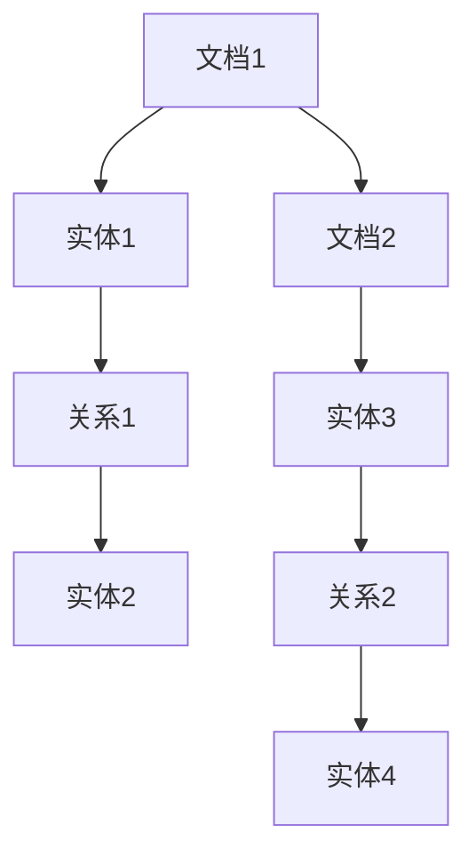
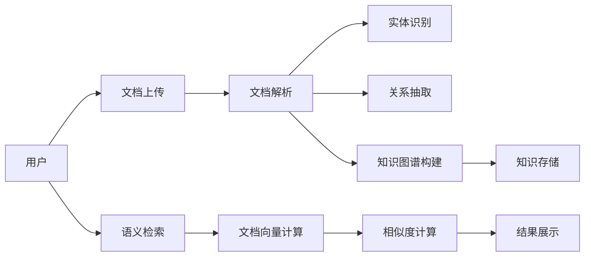
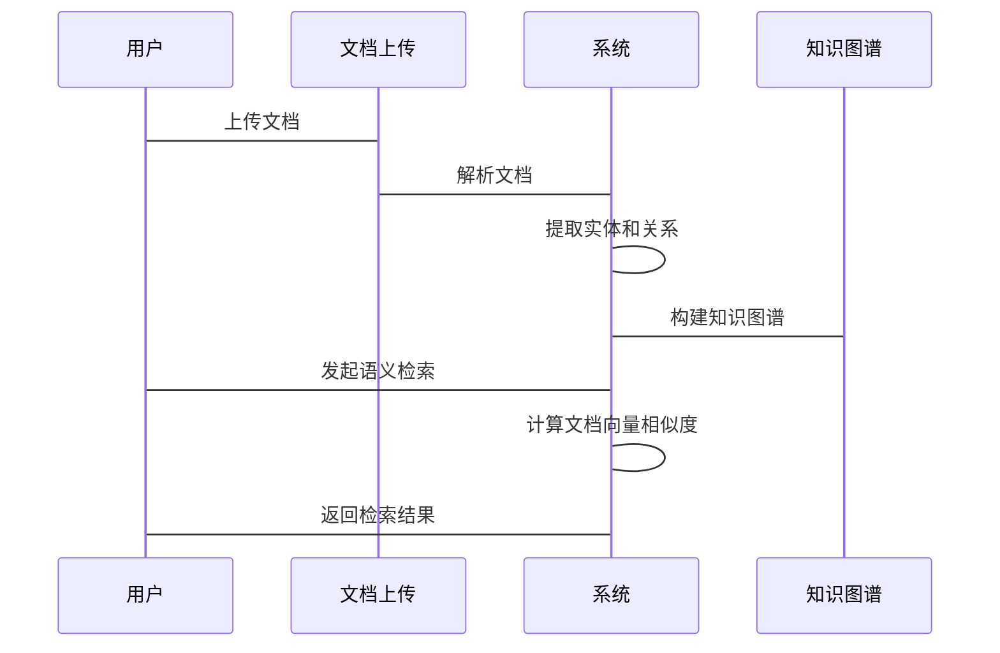

                 


# 构建智能企业文档管理系统：语义理解与知识链接

## 关键词：智能文档管理，语义理解，知识链接，知识图谱，自然语言处理

## 摘要：本文深入探讨了构建智能企业文档管理系统的关键技术和方法，重点介绍了语义理解与知识链接的核心原理、算法实现及系统架构设计。通过分析企业文档管理中的痛点，结合预训练语言模型和知识图谱构建技术，提出了高效的解决方案，并通过实际案例展示了系统的实现过程与应用价值。

---

# 第一部分: 智能企业文档管理系统的背景与核心概念

## 第1章: 问题背景与需求分析

### 1.1 问题背景

#### 1.1.1 传统文档管理系统的局限性
传统的文档管理系统通常依赖于简单的关键词匹配或基于规则的检索，难以理解文档的语义内容。例如，当用户搜索“项目计划”时，系统只能匹配包含该关键词的文档，而无法理解文档中具体涉及的项目阶段、相关任务或人员角色。

#### 1.1.2 企业文档管理中的痛点
- **信息孤岛**：企业中的文档分散在不同的系统中，缺乏统一的语义理解和知识关联，导致信息难以被有效利用。
- **检索效率低**：传统检索系统无法准确理解用户意图，导致检索结果的相关性较低。
- **知识碎片化**：文档中的知识片段缺乏结构化的关联，难以支持复杂的业务场景。

#### 1.1.3 语义理解与知识链接的必要性
语义理解技术能够提取文档中的实体、关系和意图，而知识链接技术则能够将分散的知识点连接起来，形成一个完整的知识网络，从而提升文档管理的智能化水平。

### 1.2 问题描述

#### 1.2.1 文档管理的智能化需求
企业需要一个能够理解文档语义、自动关联知识的智能文档管理系统，以提高文档检索、知识共享和业务决策的效率。

#### 1.2.2 知识关联与语义理解的挑战
- **语义理解的准确性**：如何准确提取文档中的实体、关系和意图。
- **知识链接的可靠性**：如何建立文档之间的语义关联。
- **大规模文档处理**：如何高效处理海量文档并构建知识图谱。

#### 1.2.3 企业文档管理的场景化需求
企业文档管理需要支持多种场景，例如：
- **项目管理**：通过文档中的项目阶段、任务和人员信息，辅助项目进度跟踪和决策。
- **知识共享**：通过语义理解与知识链接，帮助员工快速找到相关知识和经验。
- **合规性检查**：通过语义理解识别敏感信息，确保文档符合企业合规要求。

---

## 第2章: 核心概念与原理

### 2.1 语义理解的核心概念

#### 2.1.1 语义理解的定义与特点
语义理解（Semantic Understanding）是指计算机能够理解自然语言文本的语义含义，包括实体识别、关系抽取、意图识别等任务。

#### 2.1.2 语义理解的关键技术
- **实体识别**：识别文本中的命名实体（如人名、地名、组织名）。
- **关系抽取**：识别实体之间的关系（如“公司A与公司B合作”）。
- **意图识别**：理解文本的语义意图（如“用户希望查询项目计划书”）。

#### 2.1.3 语义理解的实现方式
- **基于规则的方法**：通过预定义的规则进行文本分析。
- **统计学习方法**：利用机器学习模型（如SVM、CRF）进行文本分析。
- **深度学习方法**：使用预训练语言模型（如BERT、GPT）进行语义理解。

### 2.2 知识链接的原理

#### 2.2.1 知识图谱的构建与应用
知识图谱是一种结构化的知识表示形式，由节点（实体）和边（关系）组成。通过构建知识图谱，可以实现文档之间的语义关联。

#### 2.2.2 文档间的关联关系
文档间的关联关系可以通过以下方式建立：
- **实体共现**：两个文档中都提到了同一个实体。
- **关系推理**：通过中间实体建立文档间的间接关联。
- **语义相似性**：通过语义相似度计算文档之间的关联。

#### 2.2.3 知识链接的算法与模型
- **基于向量的链接算法**：将文档表示为向量，通过向量相似度计算文档间的关联。
- **基于语义的链接算法**：利用语义理解技术提取文档中的实体和关系，建立知识图谱。
- **基于规则的链接算法**：通过预定义的规则建立文档间的关联。

### 2.3 核心概念对比表

| 对比维度         | 语义理解                  | 知识链接                  |
|------------------|--------------------------|--------------------------|
| 核心目标         | 理解文本的语义含义        | 建立文档间的语义关联      |
| 实现方式         | 统计学习、深度学习        | 知识图谱构建、语义相似度计算|
| 应用场景         | 文本分类、问答系统        | 文档检索、知识共享        |

### 2.4 实体关系图



---

## 第3章: 语义理解与知识链接的算法实现

### 3.1 语义理解的算法流程

#### 3.1.1 预训练语言模型的使用
预训练语言模型（如BERT、GPT）可以通过微调的方式进行语义理解任务的训练。

#### 3.1.2 实体识别与关系抽取
- **实体识别**：使用命名实体识别（NER）模型提取文本中的实体。
- **关系抽取**：使用关系抽取模型识别实体之间的关系。

#### 3.1.3 语义向量的计算
通过预训练语言模型，将文本转换为语义向量，用于后续的语义相似度计算。

### 3.2 知识链接的算法实现

#### 3.2.1 知识图谱的构建
- **文档解析**：将文档中的实体和关系提取出来。
- **知识存储**：将提取的实体和关系存储到知识图谱中。

#### 3.2.2 知识链接的实现
- **向量相似度计算**：通过计算文档向量的相似度，建立文档间的关联。
- **知识图谱查询**：通过查询知识图谱，找到与目标文档相关的其他文档。

---

## 第4章: 智能企业文档管理系统的架构设计

### 4.1 系统功能设计

#### 4.1.1 文档上传与解析
用户上传文档后，系统会对文档进行解析，提取实体和关系。

#### 4.1.2 语义检索
用户输入查询关键词后，系统通过语义理解技术进行检索，返回相关文档。

#### 4.1.3 知识关联
系统通过知识图谱构建技术，将文档之间的语义关联展示出来。

### 4.2 系统架构设计



### 4.3 接口设计

#### 4.3.1 文档解析接口
```python
# 接口定义
def parse_document(doc):
    # 返回解析后的实体和关系
    return entities, relations
```

#### 4.3.2 语义检索接口
```python
# 接口定义
def semantic_search(query):
    # 返回与查询相关的文档
    return documents
```

### 4.4 交互流程



---

## 第5章: 项目实战与案例分析

### 5.1 项目实战

#### 5.1.1 环境安装
```bash
pip install transformers
pip install networkx
```

#### 5.1.2 核心代码实现
```python
from transformers import AutoTokenizer, AutoModel
import torch

# 加载预训练语言模型
tokenizer = AutoTokenizer.from_pretrained('bert-base-uncased')
model = AutoModel.from_pretrained('bert-base-uncased')

# 文本编码
def encode_text(text):
    inputs = tokenizer(text, return_tensors='pt')
    outputs = model(**inputs)
    return outputs.last_hidden_state.squeeze().tolist()

# 文档解析
def parse_document(doc):
    entities = []  # 示例：提取实体
    relations = []  # 示例：提取关系
    return entities, relations
```

#### 5.1.3 案例分析
通过实际案例分析，展示了如何利用语义理解和知识链接技术构建智能企业文档管理系统。

---

## 第6章: 最佳实践与总结

### 6.1 最佳实践

#### 6.1.1 选择合适的预训练语言模型
根据具体任务需求选择适合的预训练语言模型，例如BERT适合文本分类和实体识别任务。

#### 6.1.2 知识图谱的维护与更新
定期更新知识图谱，确保知识的准确性和时效性。

### 6.2 总结

本文详细介绍了构建智能企业文档管理系统的关键技术和实现方法，重点讨论了语义理解和知识链接的核心原理和算法实现。通过实际案例分析和系统架构设计，展示了如何将这些技术应用于企业文档管理中，以提升文档管理的智能化水平。

### 6.3 注意事项

- **数据隐私**：在处理企业文档时，需要注意数据隐私和安全问题。
- **模型调优**：根据具体任务需求，对模型进行适当的调优和微调。

### 6.4 拓展阅读

- **预训练语言模型**：深入学习BERT、GPT等预训练语言模型的原理和应用。
- **知识图谱构建**：研究知识图谱的构建方法和应用技术。

---

通过本文的讲解，读者可以全面了解智能企业文档管理系统的构建过程，并能够将其应用于实际的企业文档管理中，以提升企业的知识管理和业务效率。

