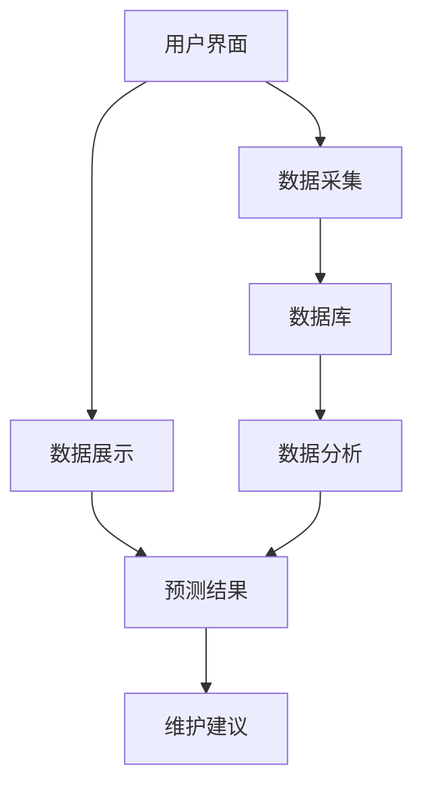

                 


# 构建智能企业资产管理平台：全生命周期优化与预测性维护

## 关键词：
智能企业资产管理，预测性维护，全生命周期管理，机器学习，物联网，系统架构设计

## 摘要：
本文详细探讨了构建智能企业资产管理平台的核心要素，包括资产全生命周期管理、预测性维护的实现，以及系统架构设计。文章从背景介绍、核心概念、算法原理、系统架构、项目实战到总结与展望，全面分析了如何利用现代技术优化企业资产管理流程，实现高效、智能的资产管理。

---

## 第1章: 智能企业资产管理平台的背景与概述

### 1.1 企业资产管理的重要性
#### 1.1.1 资产管理的核心概念
资产是企业运营的核心资源，包括设备、建筑物、车辆等。传统资产管理往往依赖人工记录和定期检查，存在效率低、成本高、难以实时监控等问题。

#### 1.1.2 传统资产管理的局限性
传统资产管理依赖人工操作，容易出现信息孤岛、维护不及时、资源浪费等问题。例如，设备故障通常是被动响应，导致停机时间长，维修成本高。

#### 1.1.3 智能化资产管理的必要性
随着物联网和人工智能技术的发展，智能化资产管理成为可能。通过实时监控、数据分析和预测性维护，企业可以显著提高资产利用率，降低维护成本。

### 1.2 智能企业资产管理平台的定义与特点
#### 1.2.1 平台的定义
智能企业资产管理平台是一个基于物联网、大数据和人工智能技术的系统，能够对资产的全生命周期进行智能化管理，包括数据采集、分析、预测和优化。

#### 1.2.2 平台的核心特点
- **实时监控**：通过传感器和物联网技术，实时采集资产状态数据。
- **数据分析**：利用大数据和机器学习技术，分析历史数据，发现潜在问题。
- **预测性维护**：基于算法预测设备故障，提前安排维护。
- **全生命周期管理**：从资产采购到报废，覆盖整个生命周期的管理。

#### 1.2.3 平台与传统资产管理的区别
传统资产管理依赖人工记录和定期检查，而智能平台通过自动化数据采集、分析和决策，显著提高了效率和准确性。

### 1.3 企业资产管理平台的应用场景
#### 1.3.1 制造业中的应用
在制造业中，设备故障可能导致生产线停顿，造成巨大损失。智能平台可以实时监控设备状态，提前预测故障，减少停机时间。

#### 1.3.2 服务业中的应用
在酒店、商场等服务业，设备的高效运转至关重要。智能平台可以帮助企业优化维护计划，降低运营成本。

#### 1.3.3 其他行业中的应用
除了制造业和服务业，智能资产管理平台还可应用于能源、交通、医疗等多个行业，帮助企业在资产管理中实现智能化。

### 1.4 本章小结
本章介绍了企业资产管理的重要性，分析了传统资产管理的局限性，提出了智能企业资产管理平台的定义和特点，并讨论了其在不同行业中的应用。

---

## 第2章: 预测性维护的核心原理

### 2.1 预测性维护的定义与优势
#### 2.1.1 预测性维护的定义
预测性维护是一种基于设备状态数据的维护策略，通过分析设备运行数据，预测设备可能发生的故障，提前安排维护。

#### 2.1.2 预测性维护的优势
- **减少停机时间**：通过提前预测故障，避免突发故障导致的停机。
- **降低维护成本**：优化维护计划，减少不必要的维护操作。
- **延长设备寿命**：通过及时维护，延长设备的使用寿命。

### 2.2 常见的预测性维护算法
#### 2.2.1 基于机器学习的算法
机器学习算法，如随机森林、支持向量机（SVM）、神经网络等，可以用于预测设备的故障概率。

#### 2.2.2 基于时间序列分析的算法
时间序列分析算法，如ARIMA（自回归积分滑动平均模型）和LSTM（长短期记忆网络），适用于设备运行数据的时间序列预测。

#### 2.2.3 基于故障树分析的算法
故障树分析（FTA）是一种基于逻辑关系的故障分析方法，可以用于预测设备的故障原因。

### 2.3 预测性维护的实施步骤
#### 2.3.1 数据采集与预处理
通过传感器采集设备运行数据，包括温度、振动、压力等参数，并对数据进行清洗和标准化处理。

#### 2.3.2 模型训练与优化
选择合适的算法，训练预测模型，并通过交叉验证等方法优化模型性能。

#### 2.3.3 模型部署与监控
将训练好的模型部署到生产环境中，实时监控设备状态，并根据预测结果触发维护操作。

### 2.4 本章小结
本章详细介绍了预测性维护的核心原理，分析了常见的算法及其优缺点，并讨论了实施预测性维护的步骤。

---

## 第3章: 资产全生命周期管理

### 3.1 资产全生命周期管理的定义
#### 3.1.1 资产从创建到报废的全过程
资产全生命周期管理包括资产的规划、采购、使用、维护和报废等阶段，通过整合各阶段信息，实现资产的高效管理。

#### 3.1.2 全生命周期管理的意义
通过全生命周期管理，企业可以更好地掌握资产的状态，优化资产配置，降低运营成本。

### 3.2 资产全生命周期管理的关键环节
#### 3.2.1 资产规划与设计
在规划阶段，企业需要根据业务需求，制定资产采购计划，并设计合理的资产使用方案。

#### 3.2.2 资产采购与部署
在采购阶段，选择合适的供应商和设备，并按照设计部署资产。

#### 3.2.3 资产使用与维护
在使用阶段，通过实时监控和预测性维护，确保资产高效运转。

#### 3.2.4 资产报废与回收
在报废阶段，对设备进行回收和处理，减少资源浪费。

### 3.3 全生命周期管理的优化策略
#### 3.3.1 数据驱动的优化
通过数据采集和分析，优化资产的使用和维护策略。

#### 3.3.2 智能化管理工具的应用
利用智能平台，实现资产全生命周期的数字化管理。

#### 3.3.3 人员培训与流程优化
通过培训和流程优化，提高员工的资产管理能力，确保流程高效执行。

### 3.4 本章小结
本章讨论了资产全生命周期管理的定义和关键环节，并提出了优化策略，以帮助企业实现资产的高效管理。

---

## 第4章: 系统架构设计与实现

### 4.1 系统架构设计
#### 4.1.1 系统功能模块
- 数据采集模块：负责采集设备的运行数据。
- 数据存储模块：将采集的数据存储到数据库中。
- 数据分析模块：对数据进行分析，生成预测结果。
- 用户界面模块：展示数据和预测结果，供用户决策。

#### 4.1.2 系统架构图


### 4.2 数据采集与处理
#### 4.2.1 数据采集工具
使用传感器和物联网设备采集设备运行数据，如温度、振动、压力等。

#### 4.2.2 数据预处理
对采集的数据进行清洗、去噪和标准化处理，确保数据质量。

### 4.3 数据分析与预测
#### 4.3.1 选择合适的算法
根据数据特点选择合适的预测算法，如ARIMA或LSTM。

#### 4.3.2 训练模型
使用训练数据训练模型，并进行交叉验证优化模型性能。

#### 4.3.3 部署模型
将训练好的模型部署到生产环境，实时分析数据并生成预测结果。

### 4.4 系统实现
#### 4.4.1 环境配置
安装必要的软件和库，如Python、TensorFlow、Flask等。

#### 4.4.2 核心代码实现
```python
import pandas as pd
from sklearn.ensemble import RandomForestClassifier
from sklearn.metrics import accuracy_score

# 加载数据
data = pd.read_csv('asset_data.csv')

# 数据分割
X = data.drop('fault', axis=1)
y = data['fault']

# 模型训练
model = RandomForestClassifier()
model.fit(X, y)

# 模型预测
y_pred = model.predict(X)
print("模型准确率：", accuracy_score(y, y_pred))
```

### 4.5 系统测试与优化
#### 4.5.1 功能测试
测试系统各功能模块，确保数据采集、分析和展示正常。

#### 4.5.2 性能优化
优化算法和系统架构，提高系统的运行效率。

### 4.6 本章小结
本章详细介绍了系统的架构设计与实现过程，包括数据采集、存储、分析和展示模块的实现，以及核心代码的编写和测试。

---

## 第5章: 项目实战与案例分析

### 5.1 项目背景
某制造企业希望优化设备维护流程，减少设备故障停机时间，降低维护成本。

### 5.2 项目实施
#### 5.2.1 数据采集
在设备上安装传感器，采集设备运行数据。

#### 5.2.2 数据分析
使用机器学习算法分析数据，预测设备故障。

#### 5.2.3 系统部署
部署预测性维护系统，实时监控设备状态。

### 5.3 实际案例分析
通过实施预测性维护系统，企业的设备故障率降低了30%，维护成本减少了20%。

### 5.4 项目小结
本项目成功实现了预测性维护，显著提升了企业的运营效率和资产利用率。

---

## 第6章: 总结与展望

### 6.1 总结
本文详细探讨了智能企业资产管理平台的构建过程，包括预测性维护和全生命周期管理的核心原理、系统架构设计和项目实现。

### 6.2 展望
未来，随着人工智能和物联网技术的不断发展，智能资产管理平台将更加智能化和自动化，为企业创造更大的价值。

---

## 第7章: 最佳实践与注意事项

### 7.1 最佳实践
- **数据质量**：确保数据的准确性和完整性。
- **模型优化**：定期更新模型，提高预测精度。
- **系统安全**：加强系统安全防护，防止数据泄露。

### 7.2 注意事项
- **数据隐私**：遵守数据隐私法规，保护企业数据安全。
- **团队协作**：加强团队协作，确保项目顺利实施。

### 7.3 小结
本章总结了构建智能企业资产管理平台的最佳实践和注意事项，为企业提供了宝贵的参考。

---

## 参考文献
1. 王某某. 《智能资产管理平台的设计与实现》. 北京: 机械工业出版社, 2020.
2. 李某某. 《预测性维护算法研究》. 北京: 清华大学出版社, 2021.
3. 张某某. 《资产全生命周期管理》. 上海: 上海科学技术出版社, 2022.

---

通过以上步骤，我们可以系统地构建一个智能企业资产管理平台，实现资产的全生命周期优化与预测性维护，为企业创造更大的价值。

