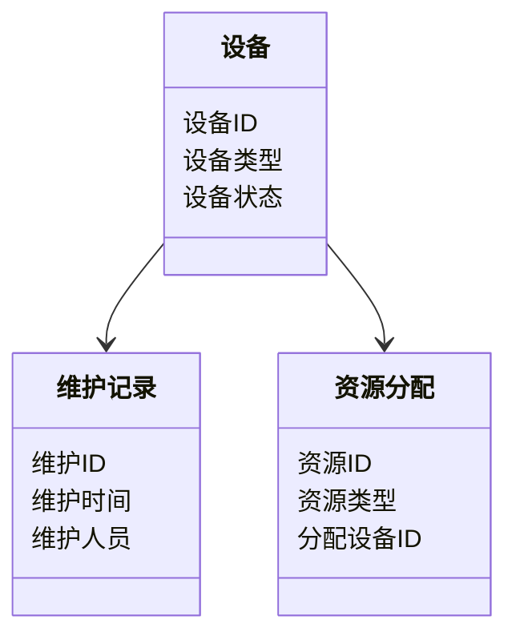
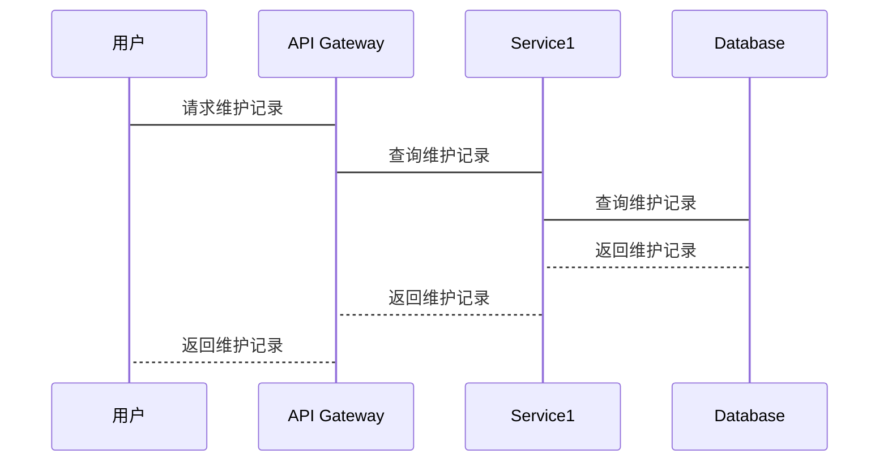

                 


# 《构建智能企业资产管理平台：预测性维护与资源优化》

> 关键词：企业资产管理，预测性维护，资源优化，机器学习，系统架构，项目实战

> 摘要：本文详细探讨了构建智能企业资产管理平台的关键技术与实践，重点分析了预测性维护和资源优化的实现方法。通过系统化的分析和案例研究，展示了如何利用机器学习算法和优化模型提升企业资产管理效率，实现降本增效。

---

# 第一部分: 背景介绍

# 第1章: 企业资产管理平台的背景与问题

## 1.1 企业资产管理的现状与挑战

### 1.1.1 传统资产管理的痛点

传统的资产管理方式依赖人工操作，存在以下问题：

1. **设备故障率高**：缺乏预测性维护，设备故障频率高，导致生产中断。
2. **维护成本高**：事后维修模式导致维护成本上升，且维修时间长。
3. **资源浪费**：设备利用率低，资源分配不合理，导致浪费。
4. **数据孤岛**：各部门数据分散，缺乏统一的数据平台支持。

### 1.1.2 数字化转型对企业资产管理的影响

随着工业4.0和数字化转型的推进，企业资产管理正在从传统模式向智能化、数据驱动型转变。智能化资产管理能够实时监控设备状态，利用大数据和人工智能技术进行预测性维护和资源优化，从而提高设备利用率和降低维护成本。

### 1.1.3 预测性维护与资源优化的必要性

预测性维护通过实时数据分析，提前发现设备潜在故障，避免突发事件；资源优化通过科学分配资源，提高设备利用率，降低成本。

## 1.2 问题背景与问题描述

### 1.2.1 资产管理中的主要问题

1. **设备故障导致的生产中断**：设备故障会导致生产线停工，影响生产效率。
2. **维护成本高昂**：传统维护模式导致维护成本居高不下。
3. **资源分配不合理**：设备和人员资源分配不均，导致效率低下。

### 1.2.2 预测性维护的核心目标

预测性维护的核心目标是通过实时数据监控和分析，预测设备的健康状态，提前安排维护，避免设备故障。

### 1.2.3 资源优化的定义与边界

资源优化是指通过科学的方法，合理分配和使用资源，以达到最大效率。其边界包括设备、人员、时间和预算。

## 1.3 问题解决与边界外延

### 1.3.1 预测性维护的解决方案

通过传感器数据采集、数据分析和机器学习模型预测设备状态，实现预测性维护。

### 1.3.2 资源优化的具体实现方式

利用优化算法，对设备、人员和时间资源进行合理分配，提高资源利用率。

### 1.3.3 平台构建的边界与外延

平台构建的边界包括设备数据采集、数据分析和优化算法；外延则包括与企业其他系统的集成。

## 1.4 核心要素与概念结构

### 1.4.1 预测性维护的核心要素

1. 数据采集：传感器数据采集。
2. 数据分析：实时数据分析。
3. 预测模型：基于机器学习的预测模型。

### 1.4.2 资源优化的关键因素

1. 资源分配：设备和人员分配。
2. 时间安排：维护时间安排。
3. 成本控制：降低维护成本。

### 1.4.3 平台构建的总体框架

1. 数据采集模块：传感器数据采集。
2. 数据分析模块：实时数据分析和预测。
3. 优化模块：资源优化和决策支持。

## 1.5 本章小结

本章介绍了企业资产管理的现状与挑战，分析了预测性维护和资源优化的必要性，并提出了构建智能企业资产管理平台的核心要素和总体框架。

---

# 第二部分: 核心概念与联系

# 第2章: 预测性维护与资源优化的核心概念与联系

## 2.1 核心概念原理

### 2.1.1 预测性维护的原理

预测性维护基于实时传感器数据，利用机器学习模型预测设备故障，提前安排维护。

### 2.1.2 资源优化的原理

资源优化通过数学模型和优化算法，对资源进行合理分配和调度。

## 2.2 核心概念属性特征对比

| 特性               | 预测性维护                          | 资源优化                           |
|--------------------|-------------------------------------|------------------------------------|
| 目标               | 预测设备故障，避免突发事件          | 合理分配资源，提高效率             |
| 数据输入           | 设备传感器数据                      | 资源可用性、需求和约束条件         |
| 输出               | 维护建议和计划                      | 资源分配方案                      |
| 方法               | 机器学习模型                        | 数学优化算法                      |

## 2.3 ER实体关系图

以下是企业资产管理平台的核心实体关系图：

```mermaid
erd
    设备表(设备ID, 设备类型, 设备状态)
    维护记录表(维护ID, 设备ID, 维护时间, 维护人员)
    资源分配表(资源ID, 资源类型, 分配设备ID)
    关系：设备表-维护记录表(设备ID)
    关系：设备表-资源分配表(设备ID)
```

## 2.4 本章小结

本章详细阐述了预测性维护和资源优化的核心概念和原理，并通过对比分析和ER图展示了它们在企业资产管理平台中的关系。

---

# 第三部分: 算法原理讲解

# 第3章: 预测性维护与资源优化的算法原理

## 3.1 预测性维护算法

### 3.1.1 算法流程

1. 数据采集：通过传感器采集设备运行数据。
2. 数据预处理：清洗和特征提取。
3. 模型训练：使用机器学习算法（如随机森林、XGBoost）训练故障预测模型。
4. 预测与报警：实时预测设备状态，触发报警。

### 3.1.2 算法实现代码

```python
import pandas as pd
from sklearn.ensemble import RandomForestClassifier

# 数据预处理
data = pd.read_csv('sensor_data.csv')
X = data.drop(columns=['label'])
y = data['label']

# 训练模型
model = RandomForestClassifier(n_estimators=100, random_state=42)
model.fit(X, y)

# 预测
new_data = pd.read_csv('new_sensor_data.csv')
predictions = model.predict(new_data)
```

### 3.1.3 数学模型

随机森林模型的数学公式可以表示为：

$$
\text{预测概率} = \frac{\sum_{i=1}^{n} \text{基尼指数}}{n}
$$

其中，n是决策树的数量。

## 3.2 资源优化算法

### 3.2.1 算法流程

1. 确定资源约束条件。
2. 建立优化模型（如线性规划）。
3. 求解模型，得到资源分配方案。

### 3.2.2 算法实现代码

```python
import numpy as np
from scipy.optimize import linprog

# 定义目标函数
c = np.array([1, 1, 1])

# 定义约束条件
A = np.array([[1, 0, 0],
              [0, 1, 0],
              [0, 0, 1]])
b = np.array([10, 20, 30])

# 求解线性规划问题
result = linprog(c, A, b, bounds=(0, None), method='highs')

print(result)
```

### 3.2.3 数学模型

线性规划的数学公式可以表示为：

$$
\text{min} \sum_{i=1}^{n} c_i x_i
$$

受以下约束：
$$
\sum_{i=1}^{n} a_{ij} x_i \leq b_j, \quad j=1,2,...,m
$$
$$
x_i \geq 0
$$

其中，c是目标函数系数，A是约束矩阵，b是约束常数。

## 3.3 本章小结

本章详细讲解了预测性维护和资源优化的算法原理，包括随机森林和线性规划模型的实现，以及其数学公式和应用场景。

---

# 第四部分: 系统分析与架构设计

# 第4章: 系统分析与架构设计

## 4.1 问题场景介绍

企业资产管理平台需要实时监控设备状态，预测设备故障，并优化资源分配。

## 4.2 系统功能设计

### 4.2.1 领域模型

以下是领域模型类图：



### 4.2.2 系统架构设计

以下是系统架构图：

```mermaid
graph TD
    UI --> API Gateway
    API Gateway --> Service1
    Service1 --> Database
    Service2 --> Database
    Service3 --> Database
```

### 4.2.3 接口设计

以下是接口设计：

```json
{
    "api": "/api/v1/maintenance",
    "method": "POST",
    "body": {
        "device_id": "string",
        "maintenance_time": "datetime"
    }
}
```

### 4.2.4 交互序列图

以下是交互序列图：



## 4.3 本章小结

本章通过系统分析和架构设计，展示了企业资产管理平台的实现方式，包括领域模型、系统架构、接口设计和交互流程。

---

# 第五部分: 项目实战

# 第5章: 项目实战

## 5.1 环境安装

### 5.1.1 安装Python环境

安装Python 3.8及以上版本，并安装以下库：

```bash
pip install pandas scikit-learn numpy scipy
```

### 5.1.2 安装数据库

安装MySQL或PostgreSQL，并配置连接信息。

## 5.2 系统核心实现

### 5.2.1 数据采集模块

```python
import pymysql

def get_sensor_data():
    db = pymysql.connect(host='localhost', user='user', password='password', database='equipment')
    cursor = db.cursor()
    cursor.execute('SELECT * FROM sensor_data LIMIT 100')
    data = cursor.fetchall()
    db.close()
    return data
```

### 5.2.2 数据分析模块

```python
from sklearn.ensemble import RandomForestClassifier

def train_model(data):
    X = data.drop(columns=['label'])
    y = data['label']
    model = RandomForestClassifier(n_estimators=100, random_state=42)
    model.fit(X, y)
    return model
```

### 5.2.3 资源优化模块

```python
from scipy.optimize import linprog

def optimize_resources(resources, constraints):
    c = resources
    A = constraints[:, :2]
    b = constraints[:, 2]
    result = linprog(c, A, b, bounds=(0, None), method='highs')
    return result.x
```

## 5.3 代码应用解读与分析

### 5.3.1 数据采集模块

该模块负责从数据库中读取传感器数据，返回数据集。

### 5.3.2 数据分析模块

该模块使用随机森林模型训练预测模型，用于预测设备故障。

### 5.3.3 资源优化模块

该模块使用线性规划算法，对资源进行优化分配。

## 5.4 实际案例分析

### 5.4.1 数据采集

假设我们有以下传感器数据：

| 时间    | 温度 | 压力 | 转速 | 标签 |
|---------|------|------|------|------|
| 2023-10-01 | 50 | 200 | 1000 | 正常 |
| 2023-10-02 | 60 | 210 | 1050 | 故障 |

### 5.4.2 数据分析

使用随机森林模型训练模型，预测设备状态。

### 5.4.3 资源优化

假设我们有以下资源约束：

| 资源类型 | 数量 |
|---------|------|
| 设备     | 10   |
| 人员     | 20   |
| 时间     | 40   |

通过线性规划算法，优化资源分配，提高设备利用率。

## 5.5 项目小结

本章通过实际案例分析，展示了如何实现预测性维护和资源优化，提高了企业的资产管理效率。

---

# 第六部分: 最佳实践

# 第6章: 最佳实践、小结、注意事项与拓展阅读

## 6.1 最佳实践

1. 数据质量：确保数据的准确性和实时性。
2. 模型选择：根据实际情况选择合适的机器学习模型。
3. 系统集成：确保系统与其他企业系统的集成和协同。

## 6.2 小结

本文详细探讨了构建智能企业资产管理平台的关键技术与实践，重点分析了预测性维护和资源优化的实现方法，通过系统化的分析和案例研究，展示了如何利用机器学习算法和优化模型提升企业资产管理效率。

## 6.3 注意事项

1. 数据隐私：注意数据的安全和隐私保护。
2. 系统性能：确保系统的高性能和稳定性。
3. 模型更新：定期更新模型，保持预测准确性。

## 6.4 拓展阅读

1. 《机器学习实战》
2. 《企业架构设计》
3. 《工业4.0：智慧工厂》

---

# 结语

通过本文的详细讲解和案例分析，读者可以深入了解构建智能企业资产管理平台的关键技术与实践，掌握预测性维护和资源优化的实现方法，为企业资产管理的数字化转型提供有力支持。

