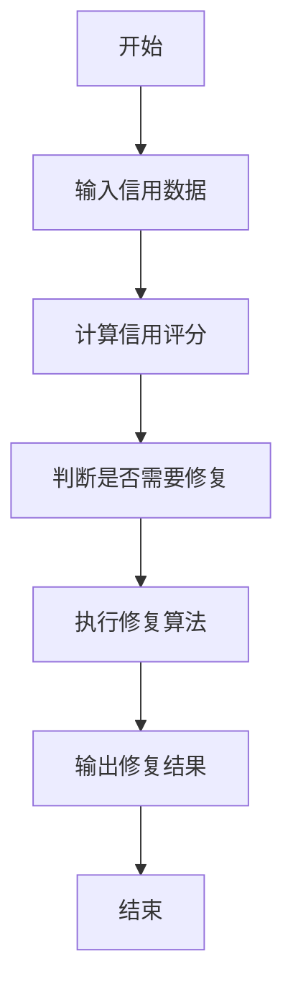

                 


# 构建智能化的个人信用修复助手系统

## 关键词：智能化、信用修复、个人信用、信用评分、算法优化

## 摘要：  
随着社会信用体系的不断完善，个人信用修复的需求日益增长。传统信用修复方式存在效率低、成本高等问题，智能化的信用修复助手系统能够通过先进的算法和大数据技术，快速、精准地帮助个人进行信用修复。本文将从背景分析、核心概念、算法原理、系统架构设计到项目实战，全面解析如何构建智能化的个人信用修复助手系统。

---

# 第1章: 个人信用修复的背景与需求

## 1.1 信用修复的概念与重要性

### 1.1.1 信用修复的定义  
信用修复是指通过合法手段纠正或改善个人信用记录，从而提升信用评分的过程。良好的信用记录是个人在金融活动中的重要资产，直接影响贷款、信用卡申请等金融服务的获取。

### 1.1.2 个人信用修复的重要性  
- 信用记录是个人信用评估的核心依据。  
- 信用评分直接影响个人的融资成本和机会。  
- 信用修复是维护个人信用权益的重要手段。  

### 1.1.3 信用修复的法律与政策背景  
- 国家出台相关政策，明确信用修复的合法性和操作流程。  
- 信用修复是社会信用体系建设的重要组成部分。  

## 1.2 传统信用修复方式的局限性

### 1.2.1 传统信用修复流程的痛点  
- 手工操作效率低，耗时长。  
- 修复方案缺乏个性化，效果有限。  
- 修复过程缺乏透明度，用户难以跟踪进度。  

### 1.2.2 人工信用修复的效率问题  
- 需要大量人工审核和沟通，成本高。  
- 修复方案可能不够精准，难以最大化提升信用评分。  

### 1.2.3 传统方式的局限性与改进方向  
- 传统方式难以满足海量用户的修复需求。  
- 需要引入智能化技术，提升修复效率和效果。  

## 1.3 智能化信用修复助手的需求分析

### 1.3.1 智能化信用修复的需求背景  
- 用户对快速、精准的信用修复服务需求日益增长。  
- 人工修复方式难以满足大规模需求。  

### 1.3.2 用户对信用修复助手的核心需求  
- 提供个性化的修复方案。  
- 实时跟踪修复进度。  
- 提供透明的修复流程。  

### 1.3.3 智能化信用修复助手的目标与价值  
- 目标：通过智能化算法，快速、精准地帮助用户修复信用。  
- 价值：降低修复成本，提高修复效率，保障用户权益。  

## 1.4 本章小结

### 1.4.1 信用修复的背景与重要性  
- 信用修复是维护个人信用权益的重要手段。  
- 好的信用记录是个人信用评估的核心依据。  

### 1.4.2 传统方式的局限性  
- 传统方式效率低、成本高，难以满足大规模需求。  
- 修复方案缺乏个性化，效果有限。  

### 1.4.3 智能化助手的需求与价值  
- 智能化信用修复助手能够快速、精准地帮助用户修复信用。  
- 提供个性化的修复方案，降低修复成本，提高效率。  

---

# 第2章: 智能化个人信用修复助手的核心概念

## 2.1 智能化信用修复助手的定义与特点

### 2.1.1 智能化信用修复助手的定义  
智能化信用修复助手是一种基于人工智能和大数据技术的系统，能够通过分析用户的信用数据，提供个性化的修复方案，并实时跟踪修复进度。

### 2.1.2 智能化助手的核心特点  
- **智能化**：基于机器学习算法，自动分析信用数据，提供个性化修复方案。  
- **高效性**：通过自动化流程，快速完成信用修复。  
- **透明性**：用户可以实时跟踪修复进度，了解每一步操作。  

### 2.1.3 与传统信用修复方式的对比  
| 特性       | 传统方式            | 智能化助手          |  
|------------|---------------------|--------------------|  
| 效率       | 低                  | 高                  |  
| 精准度     | 低                  | 高                  |  
| 成本       | 高                  | 低                  |  
| 个性化     | 有限                | 强                  |  

---

## 2.2 核心概念与联系

### 2.2.1 信用评分模型的原理  
信用评分模型是智能化信用修复助手的核心，通过分析用户的信用历史、还款能力、行为特征等因素，计算出用户的信用评分。  

### 2.2.2 信用修复算法的原理  
信用修复算法是通过优化用户的信用数据，提升信用评分的过程。算法基于信用评分模型，找出影响信用评分的关键因素，并制定修复方案。  

### 2.2.3 信用修复助手的系统架构  
- 数据采集模块：收集用户的信用数据。  
- 数据分析模块：分析信用数据，计算信用评分。  
- 修复方案生成模块：基于分析结果，生成修复方案。  
- 修复执行模块：执行修复方案，实时跟踪修复进度。  

### 2.2.4 核心概念的ER实体关系图  

```mermaid
er
actor: 用户
actor: 信用机构
actor: 数据源
```

---

## 2.3 本章小结

### 2.3.1 核心概念的定义与特点  
- 智能化信用修复助手的核心是基于人工智能的信用评分模型和修复算法。  
- 系统架构包括数据采集、分析、方案生成和执行模块。  

### 2.3.2 核心概念之间的关系  
- 数据采集模块为分析模块提供输入数据。  
- 分析模块计算信用评分，为修复方案生成模块提供依据。  
- 修复方案生成模块制定修复方案，交由执行模块执行。  

### 2.3.3 系统架构的初步理解  
- 数据采集是系统的基础。  
- 分析模块是系统的核心。  
- 方案生成和执行模块是系统的关键功能模块。  

---

# 第3章: 智能化信用修复助手的算法原理

## 3.1 信用评分模型的算法原理

### 3.1.1 信用评分模型的输入与输出  
- **输入**：用户的信用数据，包括信用历史、还款能力、行为特征等。  
- **输出**：用户的信用评分，通常是0到1000之间的分数。  

### 3.1.2 基于机器学习的信用评分算法  
常用的信用评分算法包括逻辑回归（Logistic Regression）、随机森林（Random Forest）和梯度提升树（Gradient Boosting Tree）。  

#### 3.1.2.1 逻辑回归（Logistic Regression）  
逻辑回归是一种常用的二分类算法，适用于将信用评分分为好坏两类。  

$$ P(y=1|x) = \frac{1}{1 + e^{-\beta x}} $$  

#### 3.1.2.2 随机森林（Random Forest）  
随机森林是一种基于决策树的集成算法，适用于高维数据的信用评分。  

#### 3.1.2.3 梯度提升树（Gradient Boosting Tree）  
梯度提升树是一种基于树模型的优化算法，适用于非线性关系的信用评分。  

### 3.1.3 常见信用评分模型的优缺点  

| 模型名称       | 优点                          | 缺点                          |  
|----------------|-------------------------------|-------------------------------|  
| 逻辑回归       | 简单，解释性强                | 非线性关系表现较差            |  
| 随机森林       | 高维数据表现好，抗过拟合       | 解释性较差                    |  
| 梯度提升树     | 高精度，适合复杂非线性关系     | 计算成本高                    |  

---

## 3.2 信用修复算法的实现原理

### 3.2.1 信用修复算法的输入与输出  
- **输入**：用户的信用评分和信用数据。  
- **输出**：修复后的信用评分和修复方案。  

### 3.2.2 基于优化的信用修复算法  
信用修复算法的核心是通过优化用户的信用数据，提升信用评分。常用优化算法包括贪心算法和模拟退火算法。  

#### 3.2.2.1 贪心算法  
贪心算法是一种简单有效的优化算法，适用于局部优化问题。  

### 3.2.2.2 模拟退火算法  
模拟退火算法是一种全局优化算法，适用于复杂优化问题。  

### 3.2.3 算法的数学模型与公式  

$$ \text{目标函数} = \min_{x} f(x) $$  
$$ \text{约束条件} = g(x) \leq 0 $$  

---

## 3.3 算法流程图  



---

## 3.4 算法实现的Python代码示例  

```python
def credit_score(credit_data):
    # 计算信用评分的数学模型
    return score

def credit_repair(score):
    # 修复信用评分的优化算法
    return repaired_score
```

---

## 3.5 本章小结

### 3.5.1 核心概念的定义与特点  
- 信用评分模型是智能化信用修复助手的核心。  
- 基于机器学习的信用评分模型有多种选择，各有优缺点。  

### 3.5.2 核心概念之间的关系  
- 信用评分模型为修复算法提供输入数据。  
- 修复算法基于评分模型生成修复方案。  

### 3.5.3 算法流程图的理解  
- 算法流程从输入数据开始，计算信用评分，判断是否需要修复，执行修复算法，输出修复结果。  

---

## 3.6 本章小结

### 3.6.1 算法原理的总结  
- 信用评分模型是智能化信用修复助手的核心。  
- 基于机器学习的信用评分模型有多种选择，各有优缺点。  

### 3.6.2 算法实现的步骤  
- 输入信用数据，计算信用评分。  
- 判断是否需要修复，执行修复算法，输出修复结果。  

### 3.6.3 算法流程图的理解  
- 算法流程从输入数据开始，计算信用评分，判断是否需要修复，执行修复算法，输出修复结果。  

---

接下来，我将继续完成后续章节的内容，包括系统分析与架构设计、项目实战和最佳实践等部分。

