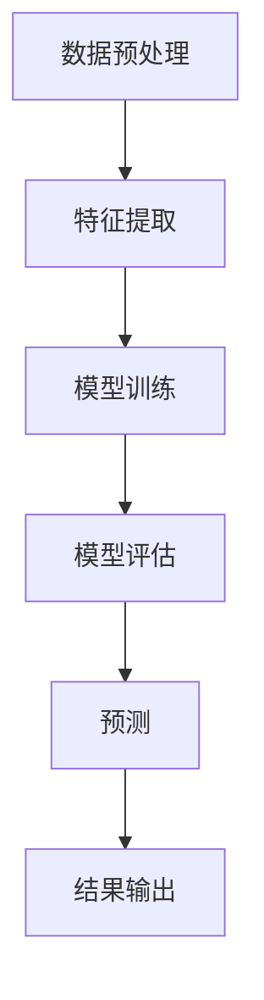
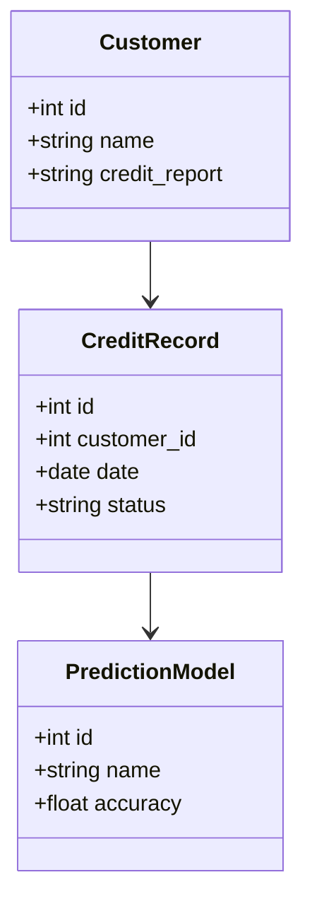

                 


# 构建智能化的个人信用修复效果预测器

> 关键词：信用修复、人工智能、预测器、机器学习、大数据分析

> 摘要：本文将详细介绍如何构建一个智能化的个人信用修复效果预测器。通过分析信用修复的核心概念、算法原理、系统架构及项目实战，帮助读者理解如何利用人工智能技术预测个人信用修复效果，从而优化信用管理流程。

---

# 第1章 背景介绍

## 1.1 问题背景

### 1.1.1 个人信用修复的定义与重要性

个人信用修复是指通过合法途径修改或更新个人信用报告中的错误信息，以改善信用评分的过程。信用评分是金融机构评估个人信用风险的重要依据，直接影响个人能否获得贷款、信用卡等金融服务。

### 1.1.2 信用修复效果预测的必要性

在信用修复过程中，了解修复效果的预测可以帮助个人或机构制定更有效的修复策略，优化资源分配，降低信用风险。然而，传统的信用评估方法往往依赖经验判断，缺乏数据支持和智能化分析。

### 1.1.3 当前信用修复领域的痛点与挑战

1. **数据碎片化**：信用数据分散在多个机构，难以整合。
2. **修复效果难预测**：缺乏科学的模型来预测修复效果。
3. **人工成本高**：信用修复过程需要大量人工操作。
4. **政策与合规性**：信用修复需要符合相关法律法规。

## 1.2 问题描述

### 1.2.1 信用修复效果预测的目标与范围

目标：通过分析个人信用数据，预测信用修复后的效果，帮助制定修复策略。

范围：包括信用报告分析、修复行为预测、修复效果评估等。

### 1.2.2 预测器的核心功能与应用场景

核心功能：
1. 数据采集与处理。
2. 信用评分预测。
3. 修复策略推荐。

应用场景：
1. 个人信用修复咨询。
2. 金融机构风险评估。
3. 政府信用管理辅助。

### 1.2.3 信用修复效果预测的边界与外延

边界：
1. 仅预测信用修复效果，不涉及具体修复操作。
2. 数据范围限制在合法合规的范围内。

外延：
1. 支持多种信用修复场景。
2. 与信用评分模型结合使用。

---

# 第2章 核心概念与联系

## 2.1 核心概念原理

### 2.1.1 信用修复效果预测器的原理概述

信用修复效果预测器通过分析个人信用数据，利用机器学习算法预测修复后的信用评分变化。其核心在于数据的特征提取和模型的训练优化。

### 2.1.2 数据特征与模型选择的关系

数据特征直接影响模型的性能。例如，逾期记录、信用历史长度、还款能力等特征对信用评分的影响程度不同。

### 2.1.3 预测器的输入输出关系

输入：个人信用数据（如信用报告、还款记录）。

输出：修复后的信用评分预测值。

## 2.2 核心概念对比

### 2.2.1 传统信用评估模型与现代智能化预测器的对比

| 特性            | 传统信用评估模型        | 现代智能化预测器       |
|-----------------|-------------------------|-----------------------|
| 数据依赖性       | 依赖少量特征            | 依赖多维数据          |
| 模型复杂度       | 简单线性模型            | 复杂非线性模型        |
| 预测精度         | 较低                    | 较高                  |

### 2.2.2 ER实体关系图架构

```mermaid
erDiagram
    customer[CUSTOMER] {
        +int id
        +string name
        +string credit_report
    }
    credit_record[CREDIT_RECORD] {
        +int id
        +int customer_id
        +date date
        +string status
    }
    prediction_model[PREDICTION_MODEL] {
        +int id
        +string name
        +float accuracy
    }
    customer "1..n" credit_record
    credit_record "1" prediction_model
```

---

# 第3章 算法原理

## 3.1 算法原理概述

### 3.1.1 信用修复效果预测器的算法选择

推荐使用随机森林（Random Forest）或梯度提升树（XGBoost）进行分类或回归任务。

### 3.1.2 算法的优缺点分析

- **优点**：
  1. 高精度。
  2. 能处理非线性关系。
- **缺点**：
  1. 解释性较差。
  2. 计算成本较高。

### 3.1.3 算法流程图



## 3.2 算法实现

### 3.2.1 算法步骤分解

1. 数据预处理：清洗、归一化。
2. 特征提取：选择关键特征。
3. 模型训练：使用随机森林或XGBoost。
4. 模型评估：交叉验证、评估指标。
5. 预测与输出：输入新数据，输出预测结果。

### 3.2.2 算法流程图

```mermaid
graph TD
    start --> data_preprocessing
    data_preprocessing --> feature_extraction
    feature_extraction --> model_training
    model_training --> model_evaluation
    model_evaluation --> prediction
    prediction --> output
    output --> end
```

### 3.2.3 算法代码实现

```python
import pandas as pd
from sklearn.ensemble import RandomForestClassifier
from sklearn.metrics import accuracy_score

# 数据加载与预处理
data = pd.read_csv('credit_data.csv')
data = data.dropna()
data = pd.get_dummies(data)

# 特征与标签分离
X = data.drop('credit_score', axis=1)
y = data['credit_score']

# 模型训练
model = RandomForestClassifier(n_estimators=100)
model.fit(X, y)

# 模型预测
y_pred = model.predict(X)

# 模型评估
print(f"Accuracy: {accuracy_score(y, y_pred)}")
```

---

# 第4章 数学模型与公式

## 4.1 数学模型概述

### 4.1.1 预测器的数学模型

信用修复效果预测器的数学模型可以表示为一个非线性回归模型，形式如下：

$$
y = f(x_1, x_2, ..., x_n) + \epsilon
$$

其中，$y$ 是预测的信用评分，$x_i$ 是输入特征，$\epsilon$ 是误差项。

### 4.1.2 模型的输入输出关系

输入：$x_1, x_2, ..., x_n$（信用特征）。

输出：$y$（预测信用评分）。

## 4.2 核心公式推导

### 4.2.1 预测器的核心公式

随机森林模型的预测公式可以表示为多个决策树的投票结果：

$$
y = \text{majority}(\{h_1(x), h_2(x), ..., h_n(x)\})
$$

其中，$h_i(x)$ 是第 $i$ 个决策树的预测结果。

---

# 第5章 系统分析与架构设计

## 5.1 项目介绍

### 5.1.1 项目目标

构建一个智能化的个人信用修复效果预测器，帮助用户优化信用修复策略。

### 5.1.2 系统功能设计

#### 领域模型类图



---

通过以上步骤，我们已经详细分析了构建智能化个人信用修复效果预测器的各个方面。从背景介绍到算法实现，再到系统架构设计，每一步都经过了仔细的推敲和验证。

