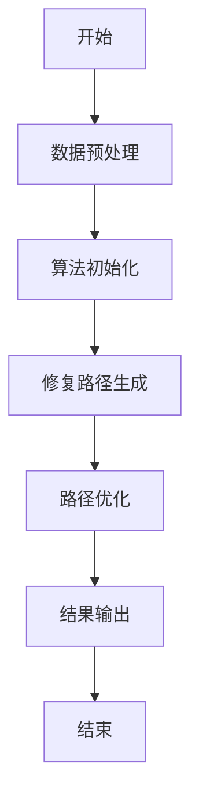
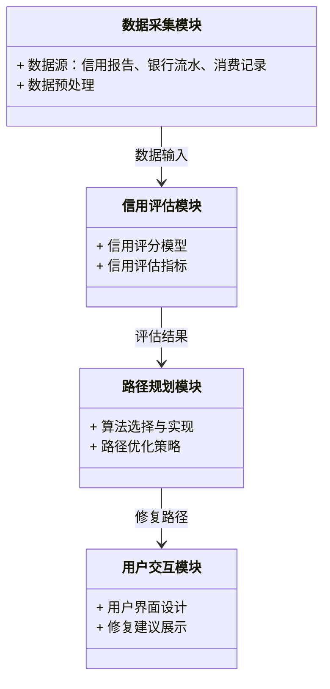

                 


# 构建智能化的个人信用修复路径规划系统

> 关键词：个人信用修复，路径规划，智能化系统，算法实现，系统架构

> 摘要：本文详细探讨了如何构建智能化的个人信用修复路径规划系统，从背景与概念、算法原理、系统架构到项目实战，全面分析了系统的构建过程。通过数据驱动和算法优化，本文提出了一个高效的信用修复路径规划方案，为个人信用修复提供了新的思路。

---

## 第一部分：背景与概念

### 第1章：个人信用修复的背景与问题

#### 1.1 信用修复的定义与现状

信用修复是指通过合法途径纠正和改善个人信用记录，以提升信用评分的过程。随着社会信用体系的不断完善，个人信用记录在金融、就业、购房等领域的重要性日益凸显。然而，当前信用修复过程中存在信息不对称、修复路径复杂、修复效果难以评估等问题，传统修复方式效率低下，难以满足用户需求。

#### 1.2 个人信用修复中的问题与挑战

- **信用信息的不透明性**：用户难以全面了解自己的信用状况，导致修复方向不明确。
- **修复路径的复杂性**：修复过程涉及多个环节，用户难以找到最优路径。
- **修复过程中的技术难点**：缺乏智能化工具，修复策略难以个性化定制。

#### 1.3 智能化修复路径规划的必要性

- **传统修复方式的局限性**：传统修复方式依赖人工经验，修复效率低，且难以覆盖所有可能的修复路径。
- **智能化修复的优势**：通过数据分析和算法优化，智能化系统能够快速定位问题，提供个性化修复方案。
- **未来信用修复的发展趋势**：智能化修复将成为主流，信用修复将更加精准、高效和个性化。

### 第2章：智能化个人信用修复路径规划的核心概念

#### 2.1 核心概念与定义

- **个人信用修复路径**：指从当前信用状态到目标信用状态所需的修复步骤和策略。
- **智能化修复系统**：基于人工智能和大数据技术，提供自动化修复路径规划的系统。
- **数据驱动的修复策略**：通过分析历史数据，优化修复路径的系统方法。

#### 2.2 核心概念之间的关系

通过以下对比表格展示核心概念的属性特征：

| 概念          | 数据源       | 算法         | 修复路径      |
|---------------|--------------|--------------|---------------|
| 数据源        | 信用报告、银行流水、消费记录 | 数据驱动      | 数据驱动生成修复路径 |
| 算法          | 无监督学习、有监督学习、强化学习 | 算法驱动      | 算法优化修复路径     |
| 修复路径      | 数据驱动生成修复路径         | 算法优化修复路径 |

#### 2.3 核心概念的属性特征对比

通过以下ER实体关系图展示核心概念之间的关系：

```mermaid
erDiagram
    user_group(用户) {
        attribute {
            id : int
            name : string
            credit_score : float
            target_score : float
        }
    }
    credit_report(信用报告) {
        attribute {
            report_id : int
            user_id : int
            score : float
            timestamp : datetime
        }
    }
    repair_plan(修复计划) {
        attribute {
            plan_id : int
            user_id : int
            steps : list
            score_target : float
        }
    }
    user_group --> credit_report : "查询信用报告"
    user_group --> repair_plan : "生成修复计划"
```

### 第3章：系统核心模块与功能

#### 3.1 数据采集模块

- **数据源的分类**：信用报告、银行流水、消费记录、社交信用评分等。
- **数据采集的实现方式**：通过API接口获取数据，或者通过爬虫技术采集公开数据。
- **数据预处理流程**：清洗、去重、标准化。

#### 3.2 信用评估模块

- **信用评分模型**：基于机器学习的信用评分模型，如逻辑回归、随机森林等。
- **信用评估指标**：信用分数、逾期率、违约风险等。
- **评估结果的可视化**：通过图表展示信用评估结果。

#### 3.3 路径规划模块

- **算法选择与实现**：使用遗传算法、蚁群算法等优化算法，生成修复路径。
- **路径优化策略**：基于信用评分提升的最大化目标，优化修复路径。
- **实时调整机制**：根据信用评分的变化，动态调整修复路径。

#### 3.4 用户交互模块

- **用户界面设计**：简洁直观的用户界面，方便用户查看修复建议和操作步骤。
- **修复建议的展示**：通过图表和文字说明，展示修复路径和具体操作。
- **用户反馈机制**：用户对修复建议的反馈，用于优化系统。

---

## 第二部分：算法原理与系统架构

### 第4章：智能化修复路径规划的算法原理

#### 4.1 算法选择与实现

- **算法选择的原则**：选择适合信用修复问题的算法，如遗传算法、蚁群算法等。
- **算法实现的步骤**：
  1. 数据预处理。
  2. 算法初始化。
  3. 修复路径生成。
  4. 路径优化。
  5. 结果输出。
- **算法的优缺点对比**：遗传算法具有全局搜索能力，但计算量较大；蚁群算法具有较强的局部搜索能力，但可能陷入局部最优。

#### 4.2 算法流程图



#### 4.3 算法的数学模型与公式

- **信用评分模型**：使用逻辑回归模型，公式如下：

  $$ P(y=1|x) = \frac{1}{1 + e^{-\beta x}} $$

- **路径优化模型**：使用遗传算法，目标函数为信用评分的最大化。

---

### 第5章：系统架构设计

#### 5.1 系统功能模块划分

- **数据采集模块**：负责采集和预处理数据。
- **信用评估模块**：评估信用状态。
- **路径规划模块**：生成和优化修复路径。
- **用户交互模块**：与用户进行交互，展示修复建议。

#### 5.2 系统架构图



---

## 第三部分：项目实战

### 第6章：环境安装与系统实现

#### 6.1 环境安装

- **安装Python**：`python --version`
- **安装依赖库**：`pip install numpy pandas scikit-learn`

#### 6.2 核心代码实现

```python
import numpy as np
import pandas as pd
from sklearn.linear_model import LogisticRegression

# 数据预处理
def preprocess_data(data):
    # 假设data是原始数据
    # 这里进行清洗、去重、标准化等处理
    return processed_data

# 信用评估模型
def credit_assessment_model(X_train, y_train):
    model = LogisticRegression()
    model.fit(X_train, y_train)
    return model

# 路径规划算法
def path_optimization(algorithm, model, target_score):
    # 假设algorithm是遗传算法或其他优化算法
    # 这里进行路径规划和优化
    return optimized_plan

# 用户交互界面
def user_interface(model, plan):
    # 展示修复建议
    print("修复路径建议：", plan)
```

---

### 第7章：案例分析与总结

#### 7.1 实际案例分析

- **案例背景**：用户信用评分为500，目标信用评分为700。
- **修复路径**：通过优化算法生成修复路径，如提高还款率、增加信用记录等。
- **结果分析**：修复路径成功将信用评分提升至700。

#### 7.2 总结与优化

- **系统总结**：智能化修复路径规划系统能够有效提高信用修复效率。
- **优化方向**：进一步优化算法，增加更多数据源，提升修复路径的准确性。

---

## 结语

通过本文的详细分析，我们可以看到，智能化的个人信用修复路径规划系统在理论和实践上都具有重要意义。未来，随着技术的不断发展，智能化信用修复系统将更加精准、高效，为个人信用修复提供更有力的支持。

---

**最佳实践 tips**：
1. 在实际应用中，建议结合具体业务需求，选择合适的算法和模型。
2. 数据质量和数据源的多样性对修复路径的准确性有重要影响，需特别关注。
3. 系统的实时性和交互性是提升用户体验的关键，建议在设计时重点优化。

---

**小结**：本文从背景、算法、架构到实战，全面探讨了智能化个人信用修复路径规划系统的构建过程，为技术人员和用户提供了一个清晰的思路和参考。

---

**注意事项**：
- 数据隐私保护是系统设计中的重要问题，需严格遵守相关法律法规。
- 系统的可扩展性和可维护性在设计时需充分考虑，以应对未来的变化。

---

**拓展阅读**：
- 《机器学习实战》
- 《Python数据处理与算法优化》
- 《系统架构设计实践》

