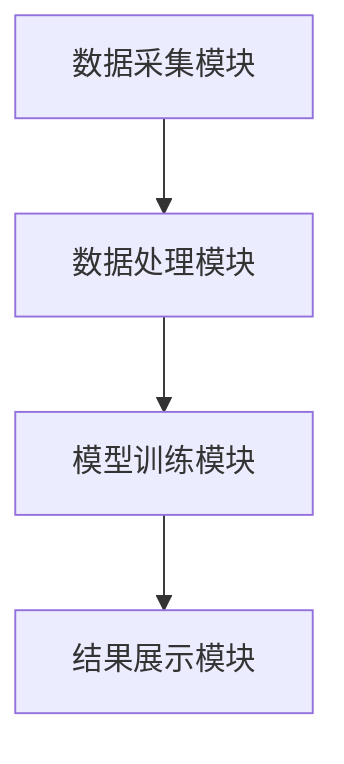
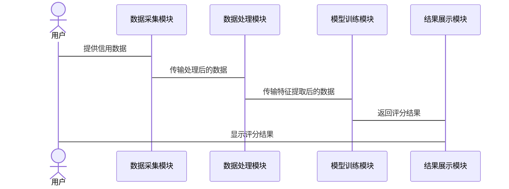

                 


# 《构建智能化的个人信用分数影响因子分析器》

## 关键词：个人信用评分、影响因子分析、机器学习、系统架构、Python代码

## 摘要：本文详细探讨构建智能化个人信用评分影响因子分析器的方法，涵盖背景、核心概念、算法原理、系统架构设计、实战项目实现等，提供详细的数学模型和Python代码示例，分析实际案例，总结最佳实践。

---

## 第1章: 个人信用分数影响因子分析器概述

### 1.1 个人信用评分的背景与意义

#### 1.1.1 个人信用评分的定义与作用

- 定义：个人信用评分是根据个人的信用历史、财务状况等因素，通过特定的算法计算出的一个分数，用于评估个人的信用风险。

- 作用：帮助金融机构评估贷款申请人的信用风险，决定是否批准贷款以及贷款的利率。

#### 1.1.2 信用评分在金融领域的应用

- 贷款审批：银行在审批个人贷款时，通常会参考个人信用评分。
- 信用卡审批：信用卡发卡机构也会参考个人信用评分。
- 风险定价：根据信用评分，金融机构可以制定不同的利率策略。

#### 1.1.3 智能化信用评分分析器的需求与价值

- 需求：传统信用评分模型可能不够精准，难以应对复杂的信用风险。智能化分析器可以通过机器学习等技术，提高评分的准确性。
- 价值：帮助金融机构更精准地评估信用风险，降低违约率，提高业务效率。

### 1.2 个人信用评分的核心问题

#### 1.2.1 信用评分的计算模型

- 传统模型：如FICO评分模型，主要基于信用历史、债务情况、信用可用额度等因素。
- 智能化模型：引入机器学习，考虑更多因素，如消费行为、社交网络等。

#### 1.2.2 影响因子的识别与权重分配

- 影响因子：包括还款历史、信用额度使用情况、信用历史长度、债务情况等。
- 权重分配：不同的因子对信用评分的影响程度不同，需要根据数据和模型进行权重分配。

#### 1.2.3 智能化分析的挑战与目标

- 挑战：数据多样性、噪声、模型解释性等。
- 目标：构建一个能够自动识别和优化影响因子的智能化分析器，提高评分的准确性和效率。

### 1.3 系统边界与外延

#### 1.3.1 系统功能边界

- 数据输入：收集个人信用数据，如还款记录、债务情况等。
- 数据处理：清洗、预处理数据，提取特征。
- 模型训练：基于机器学习算法训练模型，计算信用评分。
- 结果输出：输出评分结果，并提供影响因子分析报告。

#### 1.3.2 系统的输入与输出

- 输入：个人信用数据、历史交易记录、社交网络数据等。
- 输出：个人信用评分、影响因子分析报告、评分解释等。

#### 1.3.3 系统的适用场景与限制

- 适用场景：银行贷款审批、信用卡额度调整、信用风险评估等。
- 限制：数据质量、模型泛化能力、隐私保护等。

### 1.4 核心概念与组成要素

#### 1.4.1 数据来源与处理

- 数据来源：银行系统、征信机构、社交网络等。
- 数据处理：数据清洗、特征提取、标准化等。

#### 1.4.2 模型构建与优化

- 模型选择：选择合适的机器学习算法，如随机森林、梯度提升树等。
- 模型优化：调整超参数，进行交叉验证，提升模型性能。

#### 1.4.3 结果展示与反馈

- 结果展示：通过可视化工具展示评分结果和影响因子分析。
- 反馈机制：根据用户反馈，优化模型和系统。

### 1.5 本章小结

- 本章介绍了个人信用评分的背景和意义，分析了智能化信用评分分析器的需求和价值，明确了系统的边界和核心概念。

---

## 第2章: 个人信用评分影响因子分析的原理与方法

### 2.1 核心概念的原理分析

#### 2.1.1 数据采集与预处理

- 数据采集：通过API接口获取个人信用数据，包括还款记录、债务情况、信用历史等。
- 数据预处理：清洗数据，处理缺失值，标准化数据格式。

#### 2.1.2 特征提取与选择

- 特征提取：从原始数据中提取有用的特征，如还款准时率、信用额度使用率等。
- 特征选择：通过统计分析或机器学习方法选择对信用评分影响最大的特征。

#### 2.1.3 模型训练与评估

- 模型训练：使用训练数据训练机器学习模型。
- 模型评估：通过测试数据评估模型的准确率、召回率等性能指标。

### 2.2 影响因子的特征对比

#### 2.2.1 各因子的属性特征

- 还款历史：历史还款记录，包括是否有逾期还款。
- 信用额度：信用卡额度的使用情况。
- 信用历史：信用历史的长短。
- 债务情况：当前债务负担。

#### 2.2.2 因子之间的关系分析

- 正相关：如信用历史长可能意味着更稳定的还款能力。
- 负相关：如高债务负担可能意味着更高的违约风险。

#### 2.2.3 因子对信用评分的影响程度

- 通过系数分析，确定每个因子对评分的影响程度。

### 2.3 ER实体关系图架构

```mermaid
er
actor: 用户
model: 影响因子分析器
data_source: 数据源
action: 数据处理与分析
```

### 2.4 本章小结

- 本章详细分析了影响因子的原理和方法，通过ER图展示了系统的架构，为后续的算法实现奠定了基础。

---

## 第3章: 个人信用评分影响因子分析器的算法原理

### 3.1 线性回归模型

#### 3.1.1 线性回归的数学模型

$$ y = \beta_0 + \beta_1 x_1 + \beta_2 x_2 + ... + \beta_n x_n + \epsilon $$

其中，$y$ 是信用评分，$x_i$ 是各影响因子，$\beta_i$ 是回归系数，$\epsilon$ 是误差项。

#### 3.1.2 模型的优缺点

- 优点：简单易懂，计算效率高。
- 缺点：只能处理线性关系，对非线性关系表现不佳。

#### 3.1.3 实例分析与代码实现

```python
import numpy as np
from sklearn.linear_model import LinearRegression

# 示例数据
X = np.array([[1], [2], [3], [4]])
y = np.array([2, 4, 6, 8])

model = LinearRegression()
model.fit(X, y)
print("回归系数：", model.coef_)
print("截距：", model.intercept_)
```

### 3.2 支持向量机（SVM）模型

#### 3.2.1 SVM的数学模型

$$ \text{最大化} \quad 1/\lambda \sum_{i=1}^n \xi_i $$

$$ \text{约束} \quad y_i (\omega \cdot x_i + b) \geq 1 - \xi_i $$

其中，$\xi_i$ 是松弛变量，$\lambda$ 是正则化参数，$y_i$ 是标签，$\omega$ 是权重向量，$b$ 是截距。

#### 3.2.2 核函数的选择与应用

- 线性核：适用于线性可分的数据。
- RBF核：适用于非线性数据。

#### 3.2.3 实例分析与代码实现

```python
from sklearn import svm

# 示例数据
X = [[0, 0], [1, 1], [1, 2], [2, 2], [2, 3], [3, 3]]
y = [0, 1, 1, 1, 1, 1]

model = svm.SVC(kernel='linear')
model.fit(X, y)
print("支持向量个数：", len(model.support_))
```

### 3.3 随机森林模型

#### 3.3.1 随机森林的数学模型

随机森林是一种基于决策树的集成学习方法，通过构建多棵决策树并进行投票或平均来提高模型的准确性和稳定性。

#### 3.3.2 模型的优缺点

- 优点：能够处理高维数据，对噪声数据有较好的鲁棒性。
- 缺点：计算复杂度较高，模型解释性较弱。

#### 3.3.3 实例分析与代码实现

```python
from sklearn.ensemble import RandomForestClassifier

# 示例数据
X = [[0, 0], [1, 1], [1, 2], [2, 2], [2, 3], [3, 3]]
y = [0, 1, 1, 1, 1, 1]

model = RandomForestClassifier(n_estimators=10)
model.fit(X, y)
print("特征重要性：", model.feature_importances_)
```

### 3.4 深度学习模型

#### 3.4.1 神经网络的数学模型

$$ y = \sigma(w \cdot x + b) $$

其中，$\sigma$ 是激活函数，$w$ 是权重，$x$ 是输入，$b$ 是截距。

#### 3.4.2 模型的优缺点

- 优点：能够处理复杂的非线性关系，适合高维数据。
- 缺点：计算资源消耗大，模型解释性较差。

#### 3.4.3 实例分析与代码实现

```python
import numpy as np
import tensorflow as tf

# 示例数据
X = np.array([[0, 0], [1, 1], [1, 2], [2, 2], [2, 3], [3, 3]], dtype=np.float32)
y = np.array([0, 1, 1, 1, 1, 1], dtype=np.float32)

model = tf.keras.Sequential([
    tf.keras.layers.Dense(64, activation='relu', input_shape=(2,)),
    tf.keras.layers.Dense(1, activation='sigmoid')
])

model.compile(optimizer='adam', loss='binary_crossentropy', metrics=['accuracy'])
model.fit(X, y, epochs=10, batch_size=2)
```

### 3.5 本章小结

- 本章详细介绍了几种常用的机器学习算法，包括线性回归、SVM、随机森林和神经网络，并通过代码示例展示了它们的应用。

---

## 第4章: 个人信用评分影响因子分析器的系统架构设计

### 4.1 系统功能设计

- 数据采集模块：负责收集个人信用数据。
- 数据处理模块：清洗、预处理数据，提取特征。
- 模型训练模块：基于机器学习算法训练模型，计算信用评分。
- 结果展示模块：输出评分结果和影响因子分析报告。

### 4.2 系统架构图



### 4.3 系统接口设计

- 数据输入接口：接收个人信用数据。
- 模型调用接口：供上层应用调用模型进行评分。
- 结果输出接口：返回评分结果和影响因子分析报告。

### 4.4 系统交互流程



### 4.5 本章小结

- 本章详细描述了系统的架构设计，包括功能模块、接口设计和交互流程，为系统的实现提供了指导。

---

## 第5章: 个人信用评分影响因子分析器的实战项目实现

### 5.1 项目环境安装

- 安装Python和相关库：
  ```bash
  pip install numpy pandas scikit-learn matplotlib
  ```

### 5.2 系统核心实现源代码

#### 5.2.1 数据处理模块

```python
import pandas as pd
import numpy as np

# 读取数据
data = pd.read_csv('credit_data.csv')
# 数据清洗
data.dropna(inplace=True)
# 标准化处理
from sklearn.preprocessing import StandardScaler
scaler = StandardScaler()
scaled_data = scaler.fit_transform(data)
```

#### 5.2.2 模型训练模块

```python
from sklearn.ensemble import RandomForestClassifier
from sklearn.metrics import accuracy_score

model = RandomForest

