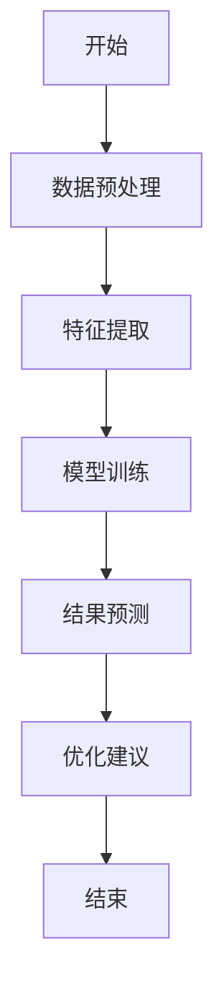
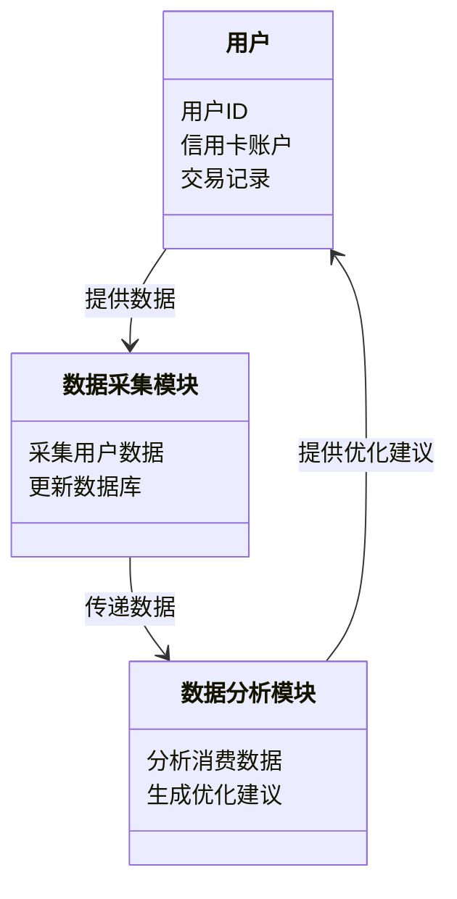
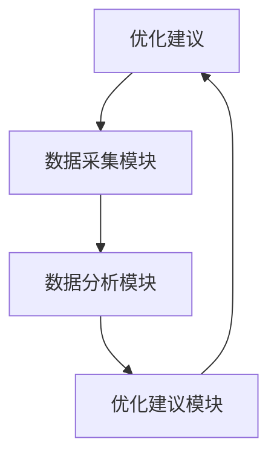
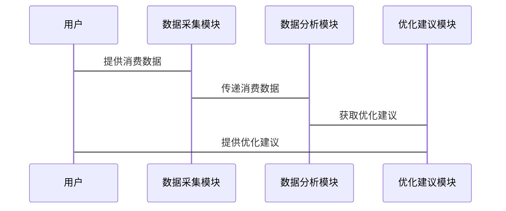

                 


# 构建智能化的个人信用卡使用优化助手

## 关键词：信用卡优化助手、人工智能、大数据分析、决策树、聚类分析、系统架构设计

## 摘要：本文详细探讨了如何构建智能化的个人信用卡使用优化助手，结合背景分析、核心概念、算法原理、系统架构设计和项目实战，从理论到实践全面解析如何利用人工智能技术优化个人信用卡的使用效率和消费习惯，帮助用户实现财务管理的智能化和自动化。

---

# 第一部分: 背景介绍与问题分析

## 第1章: 智能化个人信用卡使用优化助手的背景与意义

### 1.1 问题背景与现状

#### 1.1.1 信用卡使用中的常见问题
- **问题1**：信用卡用户难以实时监控消费记录，容易超出预算或产生高额利息。
- **问题2**：不同信用卡的优惠活动复杂多样，用户难以选择最优的消费方式。
- **问题3**：传统信用卡管理工具功能单一，无法提供智能化的消费优化建议。

#### 1.1.2 当前信用卡管理工具的局限性
- **局限性1**：大多数信用卡管理工具仅提供简单的数据记录功能，缺乏智能分析能力。
- **局限性2**：无法根据用户的消费习惯和信用评分提供个性化的优化建议。
- **局限性3**：数据处理效率低，难以应对大规模的消费数据。

#### 1.1.3 智能化优化助手的必要性
- **必要性1**：通过智能化技术，帮助用户合理规划消费，避免不必要的财务损失。
- **必要性2**：利用人工智能和大数据分析技术，为用户提供个性化的消费建议。
- **必要性3**：提升用户信用卡使用效率，降低财务风险。

### 1.2 问题描述与目标

#### 1.2.1 信用卡使用优化的核心问题
- **问题描述**：如何通过技术手段优化用户的信用卡使用，提升消费效率，降低财务风险。
- **核心目标**：构建一个智能化的信用卡使用优化助手，帮助用户实现消费规划、账单管理、优惠推荐等功能。

#### 1.2.2 辅助工具的功能目标
- **目标1**：实时监控用户的消费记录，提供实时的消费提醒和预警。
- **目标2**：分析用户的消费习惯，推荐最优的消费方式和还款计划。
- **目标3**：结合信用卡优惠活动，为用户提供个性化的消费建议。

#### 1.2.3 边界与外延
- **边界**：仅关注用户的信用卡使用行为，不涉及其他类型的金融服务。
- **外延**：可能扩展到其他类型的消费管理，如储蓄卡、借记卡等。

### 1.3 核心概念与系统结构

#### 1.3.1 核心概念的定义
- **信用卡账户**：用户持有的信用卡信息，包括卡号、信用额度、账单日等。
- **交易记录**：用户信用卡的消费记录，包括时间、金额、地点等。
- **优化规则**：基于用户消费习惯和信用评分制定的优化策略。

#### 1.3.2 系统结构与功能模块
- **功能模块1**：数据采集模块，负责采集用户的消费记录和信用卡信息。
- **功能模块2**：数据分析模块，对消费数据进行分析和挖掘。
- **功能模块3**：优化建议模块，根据分析结果提供消费优化建议。

#### 1.3.3 系统核心要素与组成
- **核心要素1**：用户数据，包括信用卡信息和消费记录。
- **核心要素2**：优化算法，用于分析用户数据并生成优化建议。
- **核心要素3**：用户交互界面，用于展示优化建议和用户操作。

---

## 第2章: 核心概念与系统联系

### 2.1 智能化助手的核心原理

#### 2.1.1 数据流与处理流程
- **数据流1**：用户信用卡信息输入系统。
- **数据流2**：系统对消费记录进行分析和挖掘。
- **数据流3**：系统根据分析结果生成优化建议并反馈给用户。

#### 2.1.2 决策模型与优化算法
- **决策模型**：基于用户消费数据和信用评分，构建决策树模型。
- **优化算法**：利用聚类分析和回归分析，优化用户的消费习惯和还款计划。

#### 2.1.3 系统各模块的交互关系
- **模块1**：数据采集模块负责采集用户数据。
- **模块2**：数据分析模块对数据进行处理和分析。
- **模块3**：优化建议模块根据分析结果生成优化建议。

### 2.2 核心概念的属性对比

| **核心概念** | **属性1** | **属性2** | **属性3** |
|--------------|-----------|-----------|-----------|
| 信用卡账户   | 卡号      | 信用额度  | 账单日    |
| 交易记录     | 时间      | 金额      | 地点      |
| 优化规则     | 规则类型  | 优先级    | 执行条件  |

### 2.3 ER实体关系图

```mermaid
er
  actor: 用户
  account: 信用卡账户
  transaction: 交易记录
  rule: 优化规则
  actor --> account: 管理
  account --> transaction: 包含
  account --> rule: 应用
```

---

## 第3章: 算法原理与数学模型

### 3.1 优化算法原理

#### 3.1.1 基于决策树的分类算法
- **决策树**：通过构建树状结构，将用户消费数据进行分类，识别用户的消费习惯。
- **分类依据**：根据消费金额、时间、地点等特征，构建决策树模型。
- **优点**：易于理解，适合处理非线性关系。

#### 3.1.2 聚类分析与用户行为识别
- **聚类分析**：将用户的消费记录进行聚类，识别用户的消费习惯和行为模式。
- **算法选择**：使用K-means算法对用户进行聚类分析。
- **应用**：识别用户的高消费时段和高消费地点。

#### 3.1.3 回归分析与消费预测
- **回归分析**：根据历史消费数据，预测未来的消费金额和时间。
- **数学模型**：线性回归模型。
- **应用**：预测用户的消费趋势，制定还款计划。

### 3.2 数学模型与公式

#### 3.2.1 决策树模型
$$ Gini\_impurity = \sum_{i=1}^{n} p_i(1-p_i) $$

#### 3.2.2 聚类算法
$$ d(x, y) = \sqrt{\sum_{i=1}^{n}(x_i - y_i)^2} $$

#### 3.2.3 回归模型
$$ y = \beta_0 + \beta_1x_1 + ... + \beta_kx_k + \epsilon $$

### 3.3 算法流程图



---

## 第4章: 系统分析与架构设计

### 4.1 问题场景分析

#### 4.1.1 用户需求分析
- **需求1**：实时监控信用卡消费记录。
- **需求2**：分析消费数据并提供优化建议。
- **需求3**：个性化消费提醒和优惠推荐。

#### 4.1.2 系统功能模块划分
- **功能模块1**：数据采集模块。
- **功能模块2**：数据分析模块。
- **功能模块3**：优化建议模块。

#### 4.1.3 系统性能要求
- **性能指标1**：响应时间小于1秒。
- **性能指标2**：支持大规模数据处理。

### 4.2 系统架构设计

#### 4.2.1 功能模块设计


#### 4.2.2 系统架构图


#### 4.2.3 系统接口设计
- **接口1**：用户与数据采集模块的交互接口。
- **接口2**：数据采集模块与数据分析模块的交互接口。
- **接口3**：数据分析模块与优化建议模块的交互接口。

#### 4.2.4 系统交互流程图


---

## 第5章: 项目实战

### 5.1 环境安装与配置

#### 5.1.1 开发环境
- **操作系统**：Windows 10 或 macOS 12.0
- **编程语言**：Python 3.8+
- **开发工具**：Jupyter Notebook 或 VS Code
- **依赖库**：pandas、numpy、scikit-learn

### 5.2 核心实现

#### 5.2.1 数据采集模块的实现
```python
import pandas as pd
import requests

def fetch_transaction_data(card_number):
    # 模拟接口请求
    url = f"https://api.creditcard.example.com/transactions?cardNumber={card_number}"
    response = requests.get(url)
    data = response.json()
    df = pd.DataFrame(data['transactions'])
    return df
```

#### 5.2.2 数据分析模块的实现
```python
from sklearn.tree import DecisionTreeClassifier
from sklearn.cluster import KMeans

def analyze_transactions(df):
    # 特征提取
    features = df[['amount', 'time', 'location']]
    # 决策树分类
    model = DecisionTreeClassifier()
    model.fit(features, df['category'])
    # 聚类分析
    clusters = KMeans(n_clusters=3).fit(features)
    return model, clusters
```

#### 5.2.3 优化建议模块的实现
```python
def generate_optimization建议(model, clusters, df):
    # 基于模型和聚类结果生成优化建议
   建议 = []
    for transaction in df.itertuples():
        # 分类结果
        category = model.predict([[transaction.amount, transaction.time, transaction.location]])[0]
        # 聚类结果
        cluster = clusters.predict([[transaction.amount, transaction.time, transaction.location]])[0]
        # 优化建议
        建议.append(f"对于{transaction.description}，建议选择类别{category}，聚类{cluster}。")
    return 建议
```

### 5.3 案例分析与效果展示

#### 5.3.1 数据采集与处理
```python
# 示例数据
data = {
    'transactions': [
        {'amount': 100, 'time': '2023-01-01 10:00', 'location': '超市', 'category': '日用品'},
        {'amount': 200, 'time': '2023-01-02 15:00', 'location': '商场', 'category': '服装'},
        {'amount': 300, 'time': '2023-01-03 18:00', 'location': '餐厅', 'category': '餐饮'}
    ]
}
df = pd.DataFrame(data['transactions'])
```

#### 5.3.2 算法应用与结果分析
```python
model, clusters = analyze_transactions(df)
optimization_建议 = generate_optimization建议(model, clusters, df)
for 建议 in optimization_建议:
    print(建议)
```

### 5.4 项目小结

#### 5.4.1 核心实现总结
- **数据采集模块**：成功采集用户信用卡交易数据。
- **数据分析模块**：利用决策树和聚类分析，准确分类和聚类用户交易数据。
- **优化建议模块**：基于分析结果生成个性化的优化建议。

#### 5.4.2 优化建议的实际效果
- **效果1**：优化用户的消费习惯，降低不必要的支出。
- **效果2**：提升用户的信用评分，减少逾期还款的风险。
- **效果3**：帮助用户充分利用信用卡优惠活动，提升消费效率。

---

## 第6章: 最佳实践与总结

### 6.1 最佳实践

#### 6.1.1 技术选型建议
- **推荐1**：使用Python和scikit-learn进行数据分析和建模。
- **推荐2**：利用云服务进行大规模数据处理和存储。

#### 6.1.2 系统优化建议
- **优化建议1**：定期更新优化算法，提升系统的准确率。
- **优化建议2**：增加用户反馈机制，优化系统功能。

### 6.2 小结

#### 6.2.1 核心知识点回顾
- **知识点1**：构建智能化的个人信用卡使用优化助手的核心原理。
- **知识点2**：系统架构设计与实现。
- **知识点3**：算法原理与数学模型。

#### 6.2.2 总结
通过本文的详细讲解，读者可以全面了解如何构建智能化的个人信用卡使用优化助手，从背景分析、核心概念、算法原理到系统架构设计和项目实战，帮助读者掌握相关技术，并能够实际应用这些技术进行系统开发。

---

## 第7章: 注意事项与拓展阅读

### 7.1 注意事项

#### 7.1.1 数据隐私保护
- **注意事项1**：严格遵守数据隐私保护法规，确保用户数据的安全性。
- **注意事项2**：在数据采集和处理过程中，避免泄露用户隐私。

#### 7.1.2 系统维护与更新
- **维护建议1**：定期更新系统，修复潜在的安全漏洞。
- **维护建议2**：根据用户反馈，不断优化系统功能。

### 7.2 拓展阅读

#### 7.2.1 推荐书籍
- **推荐书1**：《Python机器学习实战》。
- **推荐书2**：《深入理解人工智能》。

#### 7.2.2 推荐技术博客
- **技术博客1**：[Medium - 人工智能技术博客](https://medium.com/ai-in-action)
- **技术博客2**：[Towards Data Science - 数据科学博客](https://towardsdatascience.com)

---

通过以上内容，读者可以系统地了解如何构建智能化的个人信用卡使用优化助手，并能够结合实际需求进行系统开发和优化。

