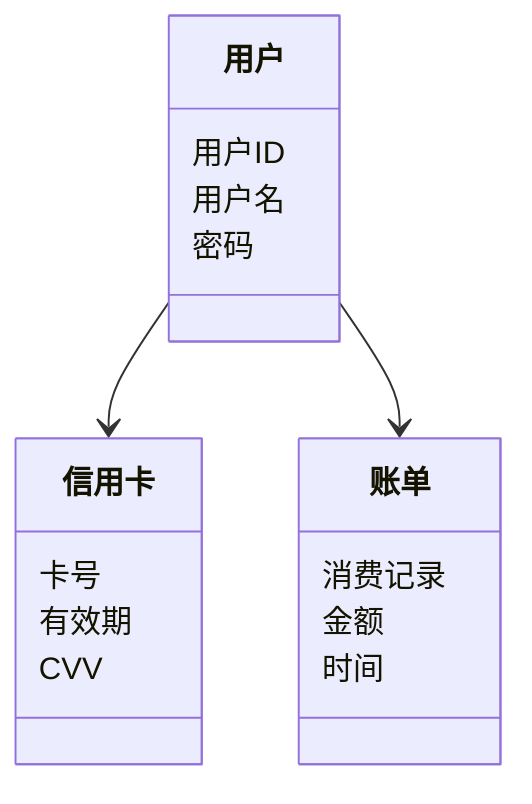
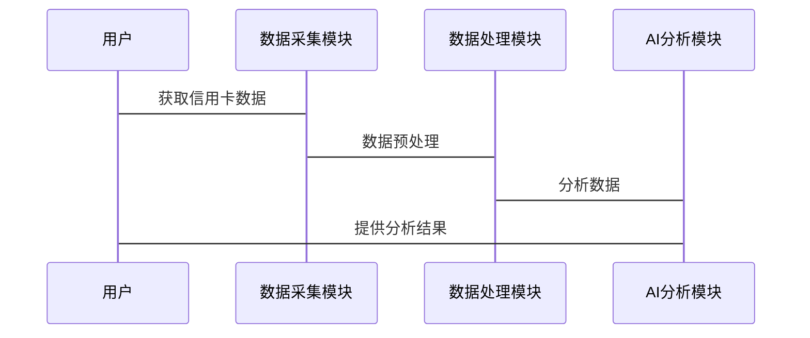

                 


# 构建智能化的个人信用卡管理助手

## 关键词：信用卡管理、人工智能、机器学习、自然语言处理、系统架构

## 摘要：本文探讨了如何利用人工智能技术构建智能化的个人信用卡管理助手，从背景、核心概念、算法实现到系统架构和项目实战，详细阐述了每个环节的设计与实现，旨在帮助读者理解和构建高效的信用卡管理助手。

---

## 第一章: 个人信用卡管理的智能化需求

### 1.1 信用卡管理的现状与挑战

#### 1.1.1 信用卡管理的主要问题
- **信息分散**：用户往往在多个平台管理信用卡信息，难以统一查看。
- **数据复杂**：账单信息繁杂，难以快速提取关键数据。
- **决策滞后**：传统管理方式依赖人工分析，难以实时提供决策支持。

#### 1.1.2 智能化管理的必要性
- 提高管理效率，减少人工操作。
- 实现实时监控和预警，帮助用户及时调整消费行为。
- 提供个性化建议，优化财务管理。

#### 1.1.3 信用卡管理智能化的目标与边界
- **目标**：实现自动化数据处理、智能分析和个性化服务。
- **边界**：仅限于个人信用卡管理，不涉及企业级应用。

### 1.2 个人信用卡管理助手的核心概念

#### 1.2.1 助手的功能定位
- 数据采集与处理：从多个来源收集信用卡数据。
- 智能分析：利用AI技术分析消费行为。
- 用户交互：提供友好的人机交互界面。

#### 1.2.2 助手的核心要素
| 核心要素 | 描述 |
|----------|------|
| 数据源   | 包括银行API、网页爬取等 |
| AI算法   | 如决策树、随机森林等 |
| 用户界面 | 包括Web和移动应用 |

#### 1.2.3 助手与传统管理工具的对比
- **传统工具**：依赖人工输入，功能单一。
- **智能助手**：自动化处理，功能丰富。

### 1.3 人工智能在信用卡管理中的应用前景

#### 1.3.1 AI技术在信用卡管理中的潜力
- 提高数据分析效率。
- 实现精准的消费预测。

#### 1.3.2 智能助手的典型应用场景
- 账单分析、消费预测、信用评估。

#### 1.3.3 应用中的挑战与解决方案
- 数据隐私保护：采用加密技术。
- 模型准确性：通过数据清洗和优化算法提升准确率。

## 第二章: 信用卡数据的特征分析与建模

### 2.1 数据特征提取

#### 2.1.1 信用卡数据的特征分类
- 时间特征：消费时间、周期性。
- 消费特征：金额、类别。
- 用户特征：信用评分、消费习惯。

#### 2.1.2 特征选择与降维方法
- 使用主成分分析（PCA）进行降维。

#### 2.1.3 数据预处理与清洗
- 去除异常值，填充缺失值。

### 2.2 基于机器学习的信用卡行为建模

#### 2.2.1 信用卡行为的分类与预测
- 分类任务：逾期预测、消费行为预测。

#### 2.2.2 常见机器学习算法的选择
- 决策树、随机森林适合分类任务。

#### 2.2.3 模型训练与评估
- 使用交叉验证评估模型性能。

### 2.3 自然语言处理在信用卡管理中的应用

#### 2.3.1 NLP技术在信用卡信息提取中的应用
- 使用分词技术提取账单信息。

#### 2.3.2 基于NLP的信用卡账单分析
- 实体识别技术提取消费地点。

#### 2.3.3 NLP在信用评估中的作用
- 分析用户评论判断信用风险。

## 第三章: 基于决策树的信用卡消费预测算法

### 3.1 决策树算法原理

#### 3.1.1 决策树的基本概念
- 树结构：内部节点表示特征，叶子节点表示结果。

#### 3.1.2 ID3算法的原理与实现
- 使用信息增益选择特征。

#### 3.1.3 信息增益的计算公式
$$信息增益 = \frac{H(parent)}{H(child)}$$

### 3.2 基于决策树的消费预测实现

#### 3.2.1 数据集的准备与特征选择
- 使用信用卡消费数据集。

#### 3.2.2 决策树模型的训练与优化
- 使用scikit-learn库实现模型训练。

#### 3.2.3 模型的评估与优化
- 通过混淆矩阵评估模型性能。

## 第四章: 智能化信用卡管理助手的系统架构设计

### 4.1 系统功能设计

#### 4.1.1 领域模型设计


#### 4.1.2 系统架构设计


#### 4.1.3 接口设计
- 数据采集接口：与银行API对接。
- 用户交互接口：提供Web和移动应用。

### 4.2 系统交互设计

#### 4.2.1 交互流程


## 第五章: 项目实战

### 5.1 环境搭建与安装

#### 5.1.1 安装Python和相关库
- 安装scikit-learn、pandas、mermaid等库。

### 5.2 核心代码实现

#### 5.2.1 数据处理代码
```python
import pandas as pd

# 加载数据
data = pd.read_csv('credit_card_data.csv')

# 数据清洗
data.dropna(inplace=True)
```

#### 5.2.2 模型训练代码
```python
from sklearn.tree import DecisionTreeClassifier
from sklearn.model_selection import train_test_split

# 划分训练集和测试集
X_train, X_test, y_train, y_test = train_test_split(data.drop('target', axis=1), data['target'], test_size=0.2)

# 训练模型
model = DecisionTreeClassifier()
model.fit(X_train, y_train)

# 预测
y_pred = model.predict(X_test)
```

## 第六章: 总结与展望

### 6.1 本章小结
智能化的信用卡管理助手通过AI技术显著提升了管理效率和决策能力。

### 6.2 未来展望
- 技术优化：引入深度学习提升准确性。
- 功能扩展：加入预算管理、财务规划等功能。

---

通过以上详细分析，本文全面探讨了构建智能化个人信用卡管理助手的各个方面，从理论到实践，为读者提供了系统化的知识和实践指导。

