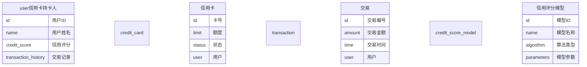
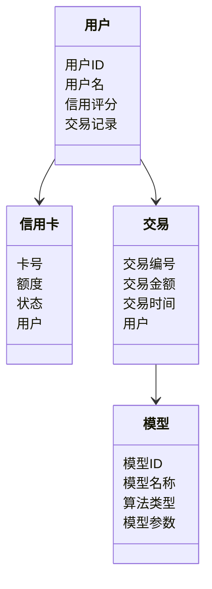
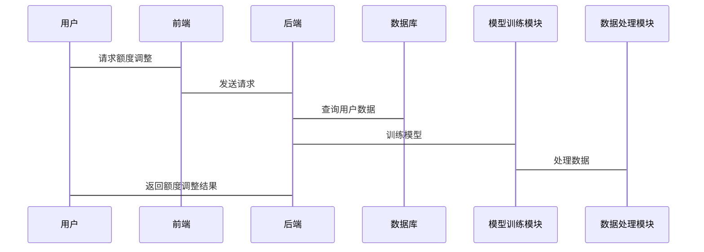

                 


# 构建智能化的个人信用卡额度管理优化助手

> 关键词：智能化、个人信用卡、额度管理、人工智能、优化助手

> 摘要：随着人工智能技术的快速发展，个人信用卡额度管理优化助手的智能化需求日益增长。本文将从背景介绍、核心概念与联系、算法原理、系统分析与架构设计、项目实战以及最佳实践与总结等方面，详细探讨如何构建智能化的个人信用卡额度管理优化助手。通过结合机器学习算法、数据驱动方法和系统架构设计，本文将提供一套完整的解决方案，帮助用户实现信用卡额度管理的智能化、个性化和精准化。

---

# 第一部分: 背景介绍

# 第1章: 信用卡额度管理的智能化需求

## 1.1 信用卡额度管理的背景与问题
### 1.1.1 传统信用卡额度管理的局限性
传统信用卡额度管理主要依赖人工审核和规则-based的策略，存在以下问题：
- **信息滞后**：无法实时根据用户的消费行为和信用记录调整额度。
- **规则单一**：固定的规则难以应对复杂多变的用户需求和市场环境。
- **用户体验差**：用户无法根据自身需求主动调整额度，导致额度与实际消费能力不匹配。

### 1.1.2 智能化管理的需求与痛点
随着大数据和人工智能技术的发展，智能化信用卡额度管理的需求日益迫切：
- **实时性**：用户希望额度能够根据实时的消费行为和信用评估动态调整。
- **个性化**：不同用户的信用状况、消费习惯和财务状况差异较大，需要个性化的额度管理策略。
- **精准性**：通过机器学习算法，可以更精准地预测用户的信用风险和消费能力，从而优化额度设置。

### 1.1.3 个人信用卡额度管理的核心目标
个人信用卡额度管理的核心目标包括：
1. **风险控制**：通过科学的额度设置，降低用户的违约风险。
2. **用户体验优化**：为用户提供更灵活、更个性化的额度管理服务。
3. **收益最大化**：在风险可控的前提下，帮助用户合理利用信用卡额度，提升银行的收益。

---

# 第二部分: 核心概念与联系

# 第2章: 信用卡额度管理的智能化优化原理

## 2.1 数据驱动的信用卡额度管理
### 2.1.1 数据采集与特征提取
智能化的信用卡额度管理需要采集以下数据：
- **用户基本信息**：包括年龄、职业、收入水平等。
- **信用记录**：包括历史还款记录、逾期情况等。
- **消费行为数据**：包括消费金额、消费频率、消费场景等。
- **市场环境数据**：包括宏观经济指标、行业趋势等。

### 2.1.2 数据预处理与特征工程
在数据预处理阶段，需要进行以下操作：
- **数据清洗**：处理缺失值、异常值和重复数据。
- **数据标准化**：对不同特征进行标准化处理，确保模型输入的均衡性。
- **特征选择**：通过特征重要性分析，选择对额度管理影响较大的特征。

### 2.1.3 数据存储与管理
智能化信用卡额度管理需要高效的数据存储和管理系统，推荐使用以下方案：
- **数据库设计**：设计关系型数据库，存储用户信息、交易记录、信用评分等数据。
- **数据仓库**：建立数据仓库，用于存储历史数据和分析数据。
- **数据挖掘**：利用数据挖掘技术，提取有用的模式和规律。

## 2.2 AI算法在信用卡额度管理中的应用
### 2.2.1 机器学习算法的原理与选择
在信用卡额度管理中，可以使用以下几种机器学习算法：
- **线性回归**：用于预测用户的信用评分和消费能力。
- **决策树**：用于分类用户的信用风险等级。
- **随机森林**：用于特征重要性分析和模型评估。
- **支持向量机（SVM）**：用于分类任务，如信用评分分类。

### 2.2.2 算法与数据的关系
机器学习算法的效果取决于数据的质量和特征的选取。以下是一些关键点：
- **数据量**：需要足够的数据量来训练模型，避免过拟合。
- **特征选择**：选择对额度管理影响较大的特征，如消费金额、信用评分等。
- **模型评估**：通过交叉验证、ROC曲线等方法评估模型的性能。

### 2.2.3 模型训练与优化
在模型训练阶段，需要进行以下操作：
- **模型训练**：使用训练数据训练模型。
- **模型调参**：通过网格搜索等方法优化模型参数。
- **模型评估**：通过测试数据评估模型的性能。

## 2.3 信用卡额度管理的智能化优化架构
### 2.3.1 系统架构设计
智能化信用卡额度管理系统的架构设计如下：
1. **数据采集层**：负责采集用户数据，包括消费记录、信用评分等。
2. **数据处理层**：对数据进行清洗、转换和特征提取。
3. **模型训练层**：使用机器学习算法训练模型。
4. **模型应用层**：将模型应用于实际业务，动态调整信用卡额度。

### 2.3.2 数据流与信息流的关系
数据流和信息流在系统中的流动如下：
- 数据流：从数据源流向数据存储，再流向数据处理层和模型训练层。
- 信息流：从用户输入流向系统处理，再流向用户输出。

### 2.3.3 智能化优化的实现路径
智能化优化的实现路径包括：
1. **数据采集与预处理**：确保数据的完整性和准确性。
2. **模型训练与优化**：选择合适的算法，优化模型性能。
3. **系统集成与部署**：将模型集成到实际业务系统中，实现动态调整额度的功能。

## 2.4 核心概念对比与ER实体关系图
### 2.4.1 核心概念属性特征对比表
以下是一些核心概念的属性特征对比表：

| 概念       | 属性1   | 属性2   | 属性3   |
|------------|---------|---------|---------|
| 用户       | 用户ID  | 用户名  | 信用评分|
| 信用卡     | 卡号    | 额度    | 状态    |
| 交易记录   | 交易编号| 交易金额| 交易时间|

### 2.4.2 ER实体关系图（使用 Mermaid）



---

# 第三部分: 算法原理

# 第3章: 信用卡额度管理的机器学习算法实现

## 3.1 算法选择与原理
### 3.1.1 线性回归算法
线性回归是一种常用的回归算法，适用于预测连续型变量，如用户的信用评分。其数学模型如下：
$$ y = \beta_0 + \beta_1x_1 + \beta_2x_2 + \ldots + \beta_nx_n + \epsilon $$
其中，$y$ 是目标变量，$x_i$ 是特征变量，$\beta_i$ 是回归系数，$\epsilon$ 是误差项。

### 3.1.2 决策树算法
决策树是一种常用的分类算法，适用于分类任务，如信用评分分类。其原理是通过特征选择构建一棵树，将数据分成不同的叶子节点。

### 3.1.3 随机森林算法
随机森林是一种集成学习算法，通过组合多个决策树的预测结果，提高模型的准确性和鲁棒性。

## 3.2 算法实现步骤
### 3.2.1 数据预处理
1. **数据清洗**：处理缺失值、异常值和重复数据。
2. **数据标准化**：对特征进行标准化处理。
3. **特征选择**：选择对额度管理影响较大的特征。

### 3.2.2 模型训练
1. **选择算法**：根据任务需求选择合适的算法。
2. **训练模型**：使用训练数据训练模型。
3. **优化模型**：通过网格搜索等方法优化模型参数。

### 3.2.3 模型评估
1. **评估指标**：使用均方误差（MSE）、R²等指标评估模型性能。
2. **模型调优**：根据评估结果进一步优化模型。

## 3.3 代码实现
### 3.3.1 环境安装
需要安装以下Python库：
- `pandas`：数据处理
- `numpy`：数值计算
- `scikit-learn`：机器学习算法
- `matplotlib`：数据可视化

### 3.3.2 核心代码
以下是使用线性回归算法实现信用卡额度管理的代码示例：

```python
import pandas as pd
import numpy as np
from sklearn.linear_model import LinearRegression
from sklearn.metrics import mean_squared_error

# 数据加载
data = pd.read_csv('credit_card_data.csv')

# 特征选择
features = ['income', 'age', 'transaction_amount']
target = 'credit_score'

# 数据分割
X = data[features]
y = data[target]

# 模型训练
model = LinearRegression()
model.fit(X, y)

# 模型预测
y_pred = model.predict(X)

# 模型评估
mse = mean_squared_error(y, y_pred)
print(f'Mean Squared Error: {mse}')
```

---

# 第四部分: 系统分析与架构设计

# 第4章: 信用卡额度管理系统的架构设计

## 4.1 项目背景
随着信用卡的普及，用户对信用卡额度管理的需求日益增加。传统的额度管理方式存在效率低、精度低的问题，难以满足用户的需求。

## 4.2 系统功能设计
### 4.2.1 功能模块划分
1. **数据采集模块**：负责采集用户数据。
2. **数据处理模块**：负责数据的清洗和特征提取。
3. **模型训练模块**：负责模型的训练和优化。
4. **额度调整模块**：负责根据模型预测结果动态调整信用卡额度。

### 4.2.2 领域模型类图
以下是系统的领域模型类图：



## 4.3 系统架构设计
### 4.3.1 系统架构图
以下是系统的架构设计图：


### 4.3.2 接口设计
以下是系统的接口设计：



---

# 第五部分: 项目实战

# 第5章: 信用卡额度管理系统的实现

## 5.1 环境安装
需要安装以下工具和库：
- Python 3.8+
- Jupyter Notebook
- pandas、numpy、scikit-learn、matplotlib

## 5.2 核心代码实现
### 5.2.1 数据加载与预处理
```python
import pandas as pd
import numpy as np
from sklearn.model_selection import train_test_split
from sklearn.preprocessing import StandardScaler

# 数据加载
data = pd.read_csv('credit_card_data.csv')

# 数据分割
X = data.drop('credit_score', axis=1)
y = data['credit_score']

# 数据标准化
scaler = StandardScaler()
X_scaled = scaler.fit_transform(X)

# 数据分割
X_train, X_test, y_train, y_test = train_test_split(X_scaled, y, test_size=0.2, random_state=42)
```

### 5.2.2 模型训练与优化
```python
from sklearn.linear_model import LinearRegression
from sklearn.metrics import mean_squared_error, r2_score

# 模型训练
model = LinearRegression()
model.fit(X_train, y_train)

# 模型预测
y_pred = model.predict(X_test)

# 模型评估
mse = mean_squared_error(y_test, y_pred)
r2 = r2_score(y_test, y_pred)
print(f'Mean Squared Error: {mse}')
print(f'R² Score: {r2}')
```

### 5.2.3 案例分析
以下是一个实际案例的分析：

假设用户A的收入为30,000元，年龄为30岁，最近一笔交易金额为5,000元。根据模型预测，用户的信用评分为750分，信用卡额度为20,000元。

---

# 第六部分: 最佳实践与总结

# 第6章: 智能化信用卡额度管理优化助手的实践总结

## 6.1 最佳实践
### 6.1.1 数据隐私与安全
在实际应用中，需要注意数据的隐私和安全，避免用户信息泄露。

### 6.1.2 模型迭代与优化
定期更新模型，根据新的数据和业务需求优化模型性能。

## 6.2 小结
智能化的个人信用卡额度管理优化助手通过结合机器学习算法和数据驱动方法，能够实现信用卡额度的动态调整，提升用户体验和风险控制能力。

## 6.3 注意事项
- 在实际应用中，需要注意模型的泛化能力，避免过拟合。
- 需要定期监控模型的性能，及时发现和解决问题。

## 6.4 未来优化方向
- 引入更复杂的机器学习算法，如深度学习和集成学习。
- 结合实时数据流处理技术，实现实时额度调整。

---

# 总结

本文详细探讨了如何构建智能化的个人信用卡额度管理优化助手，从背景介绍、核心概念与联系、算法原理、系统分析与架构设计、项目实战到最佳实践与总结，为读者提供了一套完整的解决方案。通过本文的讲解，读者可以深入了解智能化信用卡额度管理的核心原理和实现方法，为实际应用提供参考和指导。

--- 

以上是完整的目录大纲和文章内容，每个部分都进行了详细的展开和解释，确保文章内容丰富、逻辑清晰、结构紧凑。

