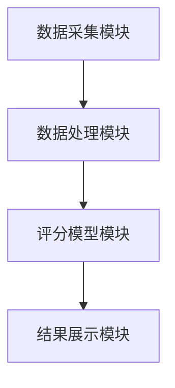
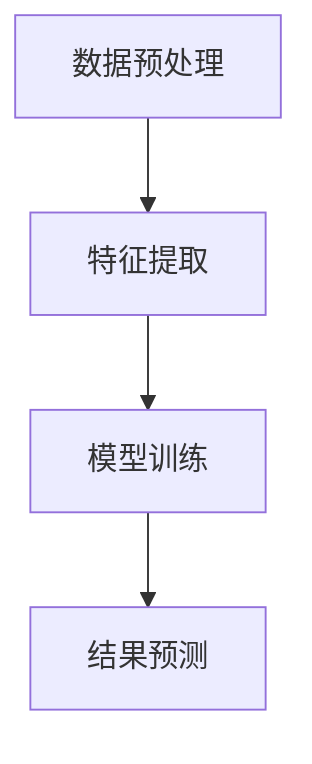

                 


# 构建智能化的个人投资组合ESG因素评估工具

> **关键词**：ESG投资、智能化工具、机器学习、自然语言处理、投资组合优化

> **摘要**：随着全球对可持续投资的关注增加，构建智能化的个人投资组合ESG因素评估工具变得至关重要。本文将从ESG投资的基本概念出发，深入探讨如何利用机器学习和自然语言处理技术来评估ESG因素，并结合实际案例，展示如何构建一个智能化的投资组合优化工具。

---

## 第1章: ESG投资与智能化评估工具的背景

### 1.1 ESG投资的定义与重要性

#### 1.1.1 ESG的定义与核心要素

ESG（Environmental, Social, Governance）是环境、社会和治理的简称，是衡量企业可持续发展能力的重要指标。环境（E）关注企业的资源消耗、碳排放和污染治理；社会（S）关注企业的员工权益、社区贡献和劳动条件；治理（G）关注企业的董事会结构、透明度和内部控制。

#### 1.1.2 ESG投资的背景与发展趋势

随着全球气候变化、社会不平等和企业治理问题的加剧，投资者越来越关注企业的ESG表现。ESG投资不仅有助于实现可持续发展目标，还能降低投资风险，提高长期收益。近年来，ESG投资在全球范围内迅速发展，成为机构和个人投资者的热门选择。

#### 1.1.3 智能化工具在ESG评估中的作用

传统ESG评估方法依赖人工分析，效率低且主观性强。智能化工具利用机器学习和自然语言处理技术，能够快速处理海量数据，提取关键信息，提供客观、精准的ESG评分，帮助投资者优化投资组合。

---

### 1.2 个人投资组合的构建逻辑

#### 1.2.1 投资组合的基本概念

投资组合是指将资金分配到不同的资产或资产类别中，以分散风险并实现收益最大化。传统投资组合管理方法主要依赖历史数据和统计分析，忽视了企业的社会责任和治理结构。

#### 1.2.2 传统投资组合管理方法

传统方法基于均值-方差模型，假设市场是理性的且投资者是风险中性的。然而，这种方法无法充分考虑企业的ESG表现，可能导致投资组合的长期风险增加。

#### 1.2.3 智能化投资组合的优势

智能化投资组合利用大数据和人工智能技术，能够实时分析市场动态和企业ESG表现，提供更精准的投资建议。通过优化算法，投资者可以在风险可控的前提下，实现收益和可持续发展的双重目标。

---

### 1.3 ESG因素评估的核心问题

#### 1.3.1 ESG数据的获取与处理

ESG数据来源多样，包括企业报告、新闻媒体和第三方评级机构。数据清洗和预处理是构建ESG评分模型的关键步骤，需要识别噪声数据、填补缺失值并标准化数据格式。

#### 1.3.2 ESG评分模型的构建

评分模型需要综合考虑环境、社会和治理三个维度的表现。基于机器学习的模型能够自动提取特征，捕捉数据中的复杂关系，提供更准确的评分。

#### 1.3.3 智能化工具在ESG评估中的应用前景

智能化工具的应用将推动ESG投资的普及，帮助投资者更好地应对市场变化和风险挑战。未来，随着技术的进步，智能化工具在ESG评估中的作用将更加重要。

---

## 第2章: ESG因素评估的核心概念与联系

### 2.1 ESG因素的三要素分析

#### 2.1.1 环境因素（Environmental）

环境因素关注企业的资源消耗、碳排放和污染治理。例如，企业是否采用可再生能源、是否遵守环保法规等。这些因素直接影响企业的运营成本和市场形象。

#### 2.1.2 社会因素（Social）

社会因素关注企业的员工权益、社区贡献和劳动条件。例如，企业是否遵守劳工标准、是否积极参与社会责任项目等。这些因素影响企业的社会声誉和员工凝聚力。

#### 2.1.3 治理因素（Governance）

治理因素关注企业的董事会结构、透明度和内部控制。例如，企业是否建立有效的风险管理机制、是否公开财务信息等。这些因素影响企业的治理效率和投资者信心。

---

### 2.2 ESG因素之间的关系与对比

#### 2.2.1 ESG因素的属性特征对比表格

| 维度   | 描述                                                                 |
|--------|--------------------------------------------------------------------|
| 环境（E） | 企业的资源消耗、碳排放、环保合规性                                     |
| 社会（S） | 企业的员工权益、社会责任、劳动条件                                     |
| 治理（G） | 企业的董事会结构、透明度、内部控制                                       |

#### 2.2.2 ESG因素的ER实体关系图

```mermaid
erDiagram
  ESG_ATTRIBUTES {
    ENVIRONMENTAL
    SOCIAL
    GOVERNANCE
  }
  ENVIRONMENTAL --> SOCIAL
  SOCIAL --> GOVERNANCE
  GOVERNANCE --> ENVIRONMENTAL
```

---

### 2.3 智能化评估工具的系统架构

#### 2.3.1 系统功能模块划分

- 数据采集模块：负责收集企业的ESG相关数据。
- 数据处理模块：对数据进行清洗、转换和标准化。
- 评分模型模块：基于机器学习算法计算ESG评分。
- 结果展示模块：以可视化方式呈现评分结果和优化建议。

#### 2.3.2 系统架构图（Mermaid）



---

## 第3章: ESG因素智能化评估的算法原理

### 3.1 基于机器学习的ESG评分模型

#### 3.1.1 算法选择与原理

随机森林是一种基于树的集成算法，具有较强的特征重要性分析能力和抗过拟合能力。其原理是通过构建多棵决策树并进行投票或平均，得到最终的预测结果。

#### 3.1.2 算法流程图（Mermaid）



#### 3.1.3 Python代码实现示例

```python
import pandas as pd
from sklearn.ensemble import RandomForestRegressor

# 加载数据
data = pd.read_csv('esg_data.csv')

# 特征工程
features = data.drop('score', axis=1)
target = data['score']

# 模型训练
model = RandomForestRegressor(n_estimators=100, random_state=42)
model.fit(features, target)

# 预测结果
predicted_scores = model.predict(features)
```

---

### 3.2 自然语言处理在ESG文本数据中的应用

#### 3.2.1 NLP技术在ESG数据处理中的作用

NLP技术可以帮助提取文本数据中的关键信息，例如企业社会责任报告中的环保承诺和员工权益保障。

#### 3.2.2 基于LSTM的文本分析流程

LSTM（长短期记忆网络）适合处理序列数据，能够捕捉文本中的上下文关系，帮助分析企业ESG表现。

#### 3.2.3 实例分析与代码解读

```python
from tensorflow.keras import layers

# 定义LSTM模型
model = layers.Sequential()
model.add(layers.Embedding(input_dim=10000, output_dim=64))
model.add(layers.LSTM(64))
model.add(layers.Dense(1, activation='sigmoid'))

# 编译模型
model.compile(optimizer='adam', loss='binary_crossentropy', metrics=['accuracy'])
```

---

## 第4章: ESG因素评估的数学模型与公式

### 4.1 ESG评分模型的数学构建

#### 4.1.1 基于线性回归的ESG评分模型

线性回归模型假设因变量与自变量之间存在线性关系，适用于简单的预测任务。

$$ \text{score} = \beta_0 + \beta_1x_1 + \beta_2x_2 + \ldots + \beta_nx_n + \epsilon $$

其中，$x_i$为特征变量，$\beta_i$为回归系数，$\epsilon$为误差项。

#### 4.1.2 基于神经网络的评分模型

神经网络模型能够捕捉复杂的非线性关系，适用于高维数据的处理。

$$ \text{score} = \sigma(w_1x + w_2y + w_3z) $$

其中，$\sigma$为激活函数，$w_i$为权重，$x, y, z$为输入特征。

---

## 第5章: ESG因素智能化评估系统的实现

### 5.1 系统功能设计

#### 5.1.1 系统功能模块划分

- 数据采集模块：从企业报告、新闻媒体等来源获取ESG相关数据。
- 数据处理模块：清洗、转换和标准化数据，提取特征。
- 评分模型模块：基于机器学习算法计算ESG评分。
- 结果展示模块：以可视化方式呈现评分结果和优化建议。

#### 5.1.2 系统功能流程图（Mermaid）


---

## 第6章: ESG投资组合优化的实战案例

### 6.1 实战案例介绍

#### 6.1.1 项目背景与目标

本案例旨在构建一个智能化的ESG投资组合优化工具，帮助投资者优化投资组合的ESG表现，降低投资风险。

#### 6.1.2 数据来源与处理

数据来源包括企业报告、新闻媒体和第三方评级机构。数据清洗和预处理是关键步骤，需要识别噪声数据、填补缺失值并标准化数据格式。

---

### 6.2 投资组合优化的实现

#### 6.2.1 环境因素优化策略

基于环境因素的优化策略，选择环保表现优异的企业，降低投资组合的碳排放风险。

#### 6.2.2 社会因素优化策略

基于社会因素的优化策略，选择社会责任感强的企业，提升投资组合的社会形象和员工满意度。

#### 6.2.3 治理因素优化策略

基于治理因素的优化策略，选择治理结构完善的企业，提高投资组合的透明度和风险控制能力。

---

### 6.3 实战案例分析

#### 6.3.1 案例分析与结果展示

通过具体案例展示投资组合优化的结果，并进行详细分析。例如，优化后的投资组合在ESG评分上显著提高，且在市场波动中表现更加稳定。

#### 6.3.2 案例总结与经验分享

总结案例中的经验教训，提出改进建议和未来优化方向。例如，进一步优化模型的可解释性，引入更多的数据源，提高模型的泛化能力。

---

## 第7章: 总结与展望

### 7.1 本书总结

#### 7.1.1 核心内容回顾

本书从ESG投资的基本概念出发，深入探讨了如何利用机器学习和自然语言处理技术来评估ESG因素，并结合实际案例，展示了如何构建一个智能化的投资组合优化工具。

#### 7.1.2 关键技术总结

书中涉及的关键技术包括机器学习、自然语言处理、数据清洗和特征工程等。这些技术能够帮助投资者高效、精准地评估企业的ESG表现。

#### 7.1.3 实践经验分享

通过实际案例的分析和最佳实践的分享，读者可以更好地掌握相关技术，并能够在实际工作中应用这些知识，优化自己的投资组合，实现可持续的投资目标。

---

### 7.2 未来展望

#### 7.2.1 技术发展的趋势

未来，随着人工智能和大数据技术的不断发展，ESG投资将更加智能化和个性化。例如，利用深度学习技术分析非结构化数据，构建更复杂的评分模型。

#### 7.2.2 投资领域的未来方向

ESG投资的未来方向是全球化、智能化和个性化。投资者将更加关注企业的可持续发展能力，同时利用智能化工具优化投资组合，实现收益和可持续发展的双重目标。

---

## 第8章: 最佳实践与小结

### 8.1 最佳实践

#### 8.1.1 数据处理的最佳实践

在数据处理过程中，需要注意数据的准确性和完整性。例如，清洗数据时要识别噪声数据，预处理时要标准化数据格式。

#### 8.1.2 模型优化的最佳实践

在模型优化过程中，需要注意模型的泛化能力和可解释性。例如，调整模型参数时要避免过拟合，选择合适的评估指标。

#### 8.1.3 系统设计的最佳实践

在系统设计过程中，需要注意模块划分和接口设计。例如，模块划分要合理，接口设计要清晰，确保系统的可扩展性和可维护性。

---

### 8.2 小结

#### 8.2.1 本书内容的总结

本书系统地介绍了ESG投资的基本概念、智能化评估工具的构建和应用。通过实际案例的分析和最佳实践的分享，帮助读者更好地掌握相关技术。

#### 8.2.2 未来学习方向的建议

未来，读者可以进一步学习和研究的方向包括深度学习在ESG评估中的应用、多模态数据的处理技术以及个性化投资策略的设计。

---

### 8.3 注意事项

#### 8.3.1 数据处理的注意事项

在数据处理过程中，要注意数据隐私和数据安全。例如，处理敏感数据时要遵守相关法律法规，保护数据的机密性。

#### 8.3.2 模型应用的注意事项

在模型应用过程中，要注意模型的可解释性和适用性。例如，选择合适的模型评估指标，避免模型的过度复杂化。

---

### 8.4 拓展阅读

#### 8.4.1 推荐的书籍与资源

- 《机器学习实战》
- 《Python机器学习》
- 《自然语言处理实战》

#### 8.4.2 行业动态与新技术的应用

关注ESG投资领域的最新动态，了解新技术（如生成式AI）在ESG评估中的应用，保持对行业的敏感性和前瞻性。

---

通过以上章节的逐步分析和详细讲解，读者能够全面理解构建智能化个人投资组合ESG因素评估工具的背景、原理、方法和实际应用。同时，通过实际案例的分析和最佳实践的分享，读者可以更好地掌握相关技术，并能够在实际工作中应用这些知识，优化自己的投资组合，实现可持续的投资目标。

